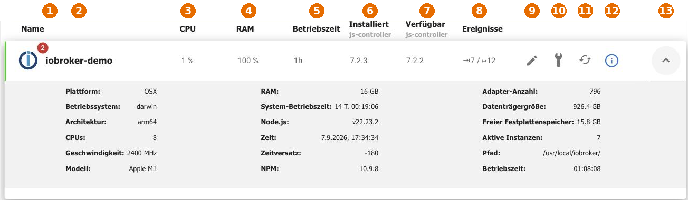

# вкладка «Хосты»

Это компьютеры, на которых запущен ioBroker. В стандартной установке это ровно один компьютер; в [многохостовой системе](/docs/config/multihost.md) это главный компьютер и все остальные.

| Нет. | Значение                                                                                                                         |
| ---- | -------------------------------------------------------------------------------------------------------------------------------- |
| 1    | **Уведомления** хоста. Число указывает количество непрочитанных сообщений. Они могут содержать предупреждения о нехватке памяти. |
| 2    | **Имя** хоста.                                                                                                                   |
| 3    | Текущая загрузка **ЦП** .                                                                                                        |
| 4    | Использование **оперативной памяти** .                                                                                           |
| 5    | **Время работы** js-контроллера.                                                                                                 |
| 6    | **Установленная** версия js-контроллера.                                                                                         |
| 7    | **Доступная** версия. Если она выше установленной версии, требуется обновление.                                                  |
| 8    | **События** : входящие и исходящие сообщения в секунду.                                                                          |
| 9    | **Измените название** .                                                                                                          |
| 10   | **Основные настройки хоста.**                                                                                                    |
| 11   | **Перезапустите хост.**                                                                                                          |
| 12   | **Уровень логирования** хоста.                                                                                                   |
| 13   | Разворачивает **строку с подробными сведениями** .                                                                               |

В строке с подробной информацией указаны платформа, операционная система, архитектура, количество и скорость процессоров, модель, объем оперативной памяти, время работы системы, версия Node.js и NPM, время на хосте и смещение времени, а также количество известных адаптеров, размер диска, свободное дисковое пространство, количество активных экземпляров и каталог установки.

**Время и смещение времени** заслуживают внимания: если часы хоста работают неправильно, все метки времени точек данных будут неверными, и процессы, управляемые по времени, начнутся в неподходящее время.

## Обновить js-контроллер

js-контроллер — это ядро ioBroker. Обновления будут предлагаться здесь, как только в репозитории появится новая версия. Инструкции по обновлению и необходимые действия можно найти в разделе [«Обновление ioBroker»](/docs/install/updateself.md) .

!> Перед обновлением js-контроллера необходимо создать [резервную копию](/docs/config/backup.md) .