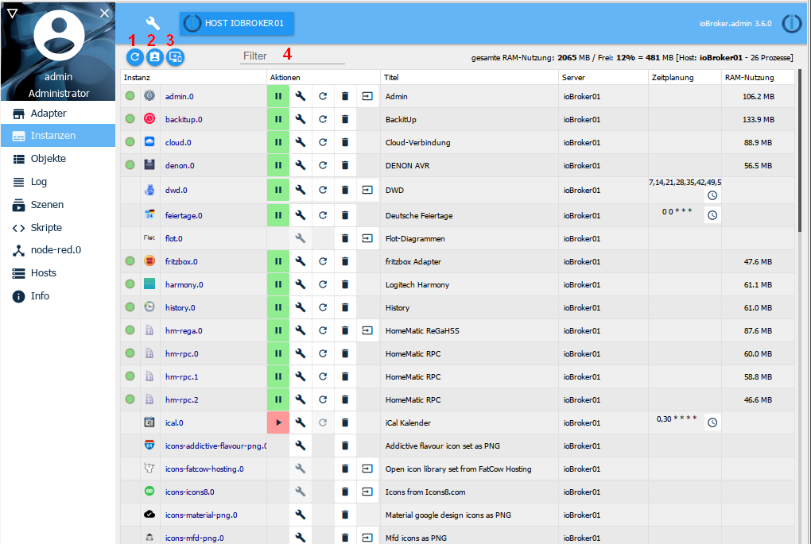
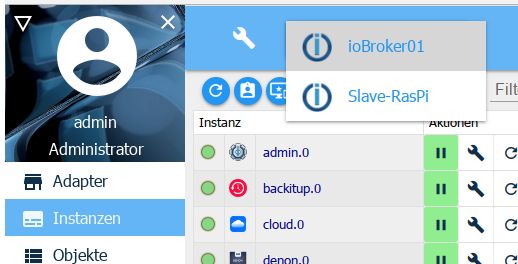
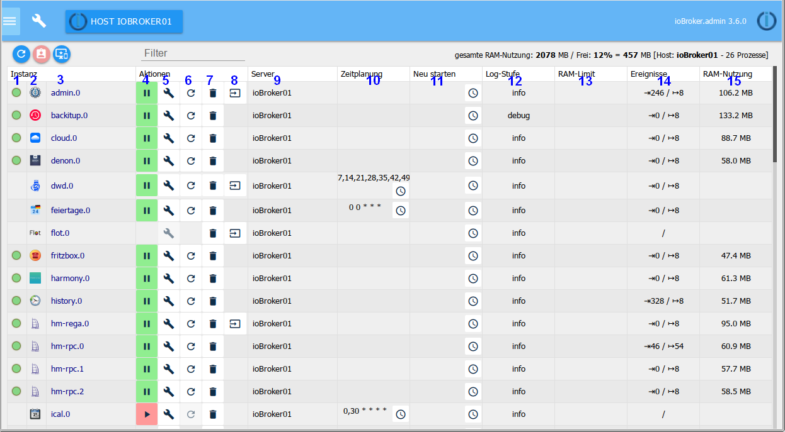

Здесь перечислены экземпляры, уже установленные на вкладке «Адаптер», и их можно настроить соответствующим образом.

## Строка заголовка
в строке заголовка есть значки наиболее важных процессов. Для каждого значка есть контекстная справка. Для этого просто удерживайте некоторое время мышкой на значке. Также есть информация о нагрузке на сервер.

Иконы подробно:

### 1 - Обновить вид
Если только что созданные экземпляры не видны, щелчок по этому значку помогает обновить статус страницы.

### 2 - Включить режим администратора
При выборе этого значка отображаются дополнительные столбцы для настройки экземпляров (функция переключения). Информация об этом в разделе по содержанию страницы.

### 3 - Показать только экземпляры выбранного хоста

В системах с несколькими хостами экземплярами всех хостов управляет главный администратор. Информация о том, на каком хосте расположен этот экземпляр, находится в столбце ***Сервер*** .

Если в заголовке выбран хост, эту кнопку можно использовать только для отображения установленных на нем экземпляров.

### 4 - фильтр
В это поле можно ввести термин для фильтрации или поиска экземпляров.

## Дополнительная информация в окне "Экземпляры"
Первые числа указывают объем памяти, использованный экземплярами на данный момент, и оставшуюся свободную память в МБ. За ним свободная память в%. В квадратных скобках указано имя сервера ioBroker и количество запущенных процессов.

## Содержание страницы

Установленные экземпляры адаптеров показаны в таблице на странице.

Таблица состоит из следующих столбцов:

### 1 - состояние
Статус экземпляра отображается здесь светофором. Дополнительную информацию можно получить, удерживая мышь на сигнале.

Не во всех экземплярах есть этот светофор. Но не паникуйте. Это либо управляемые по времени экземпляры, которые только ненадолго подключаются к контроллеру и затем сразу же выключаются снова, либо, например, продолжают работать в фоновом режиме.

### 2 - Значок
Здесь отображается значок, который используется в ioBroker для этого адаптера.

### 3 - экземпляр
Имя экземпляра находится в этом столбце. он состоит из имени адаптера и номера, который последовательно пронумерован в порядке установки экземпляров. Первый экземпляр получает

0. Это обозначение является основой для обозначения точек данных в ioBroker.

### 4 - активировано
Здесь запускается или останавливается экземпляр. Зеленый символ паузы показывает, что адаптер работает, и его можно приостановить, щелкнув по нему, красный символ воспроизведения показывает остановленный экземпляр, который можно запустить одним щелчком.

### 5 - конфигурация
Щелчок по этому значку открывает меню конфигурации адаптера. Соответствующие меню описаны для соответствующих адаптеров.

### 6 - перезапуск
При нажатии на этот значок соответствующий экземпляр перезапускается.

### 7 - мусорный бак
Соответствующий экземпляр удаляется с этим значком. Остальные экземпляры того же адаптера сохраняются. Сам переходник тоже остается.

### 8 - веб-ссылка
За этим значком находится ссылка на сайт этого экземпляра. Либо потому, что у этого адаптера есть собственный веб-интерфейс (с другим портом), либо просто другой путь. В некоторых случаях эта ссылка также ведет на справочные страницы.

### 9 - заголовок
Здесь указывается имя экземпляра. Вы можете изменить это имя в соответствии с вашими собственными желаниями или потребностями. Это особенно полезно, если существует несколько экземпляров адаптера (в противном случае с одним и тем же именем). Так будет, например, с hm-rpc, если есть по одному экземпляру для RF, Wired и CuxD.

### 10.) Время
Для адаптеров, запускаемых по времени, здесь вводится время, когда этот адаптер должен запускаться. Это расписание имеет формат задания cron. Чтобы изменить, нажмите на кнопку с тремя точками. Откроется окно ввода с большим количеством дополнительной информации и справки.

### 11 - перезапуск
Значок часов также можно использовать для создания расписания, когда этот экземпляр должен быть перезапущен.

Этот столбец виден только в экспертном режиме!

### 12 - Уровень журнала
В этом столбце можно настроить соответствующий уровень журнала для экземпляра. Доступны отладка, информация, предупреждение и ошибка. По умолчанию это значение установлено на info. Если у вас сложилось впечатление, что что-то не работает плавно, вы можете настроить его на отладку. тогда отладочная информация выводится для этого экземпляра на вкладке журнала, что может помочь найти ошибку. И наоборот, вы можете установить это значение выше, чтобы журнал не был таким обширным.
Этот столбец виден только в экспертном режиме!

### 13 - ограничение ОЗУ
Здесь вы можете указать, какой объем оперативной памяти экземпляра должен быть доступен в качестве меры предосторожности. Этот объем памяти больше не доступен для других задач, и его не следует выбирать слишком большим, особенно в системах с небольшим объемом памяти. Если экземпляру временно требуется больше памяти, она, конечно, будет выделена ему системой, но затем будет немедленно освобождена для системы. В то время, когда экземпляру требуется больше памяти, чем было зарезервировано, необходимая память отображается красным цветом.

Этот столбец виден только в экспертном режиме!

### 14 - Использование ОЗУ
Здесь отображается фактическая память, используемая экземпляром. Эти значения регулярно обновляются. После обновления эти значения на короткое время отображаются зеленым цветом.