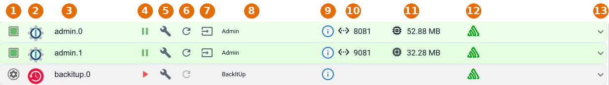
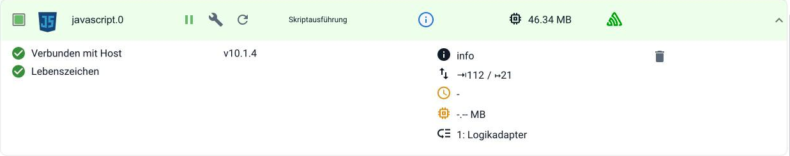

# вкладка «Экземпляры»

В этом разделе перечислены все экземпляры, созданные через вкладку [«Адаптер»](/docs/admin/adapter.md) . Здесь их можно запускать, останавливать, настраивать и удалять.

Имя экземпляра состоит из имени адаптера и порядкового номера; первому присваивается...`0` Из`javascript.0` Это пространство имен, в котором находятся все объекты данного экземпляра. Поэтому номера экземпляров не изменяются задним числом.

## Панель инструментов

| Нет. | функция                                                                                                                                                                                                   |
| ---- | --------------------------------------------------------------------------------------------------------------------------------------------------------------------------------------------------------- |
| 1    | **Показать/скрыть список** : переключает между компактным списком и представлением с описаниями.                                                                                                          |
| 2    | **Категория** : группирует экземпляры в соответствии с областью применения адаптера.                                                                                                                      |
| 3    | **Перезагрузка.**                                                                                                                                                                                         |
| 4    | **Показать запущенные или остановленные экземпляры.**                                                                                                                                                     |
| 5    | **Фильтрация экземпляров** : по хосту, состоянию и другим характеристикам.                                                                                                                                |
| 6    | **Фильтр** по имени.                                                                                                                                                                                      |
| 7    | В строке состояния отображается: свободное место на жестком диске, общий объем используемой оперативной памяти, свободная память, а в квадратных скобках — имя сервера и количество запущенных процессов. |

## Прочитайте одну строку

| Нет. | Значение                                                                                                                                                                                       |
| ---- | ---------------------------------------------------------------------------------------------------------------------------------------------------------------------------------------------- |
| 1    | **Статус.** Зеленый квадрат означает: работает. Серая шестерня означает: остановлено. Часы представляют собой устройство с таймером, которое работает лишь короткое время.                     |
| 2    | Символ адаптера.                                                                                                                                                                               |
| 3    | **Название экземпляра** .                                                                                                                                                                      |
| 4    | **Старт/Стоп.** Две полоски означают «работает, остановитесь здесь», красный треугольник означает «остановилось, начните здесь».                                                               |
| 5    | **Настройки** : открывает конфигурацию адаптера. Отображаемая там информация описана в документации к соответствующему адаптеру.                                                               |
| 6    | **Начать заново.**                                                                                                                                                                             |
| 7    | **Ссылка на экземпляр** : ведет к веб-интерфейсу данного экземпляра, если таковой имеется.                                                                                                     |
| 8    | **Заголовок** . Его можно свободно менять, что полезно, например, при использовании нескольких экземпляров одного и того же адаптера.`hm-rpc.0` для радиочастот и`hm-rpc.1` Для журнала Wired. |
| 9    | **Уровень логирования** для данного экземпляра.                                                                                                                                                |
| 10   | **Порт** , на котором экземпляр прослушивает запросы.                                                                                                                                          |
| 11   | Текущее **использование оперативной памяти** .                                                                                                                                                 |
| 12   | Отслеживается, сообщает ли адаптер о сбоях своему разработчику через **Sentry** .                                                                                                              |
| 13   | Разворачивает **строку с подробными сведениями** .                                                                                                                                             |

## Детальная линия

В развернутом виде левая строка показывает, подключен ли экземпляр к хосту и отправляет ли сигнал, а также установленную версию. Правая строка отображает:

- **уровень логирования** : от`debug` выше`info` и`warn` до`error` Если что-то идёт не так, это помогает.`debug` ; затем снова сбросьте его, иначе журнал будет быстро расти.
- **Входящие и исходящие события** : сколько значений экземпляр получил и отправил с момента запуска.
- **Автоматический перезапуск** : расписание, согласно которому экземпляр будет перезапускаться.
- **Ограничение по оперативной памяти** . Это верхний предел, а не резервирование. Не устанавливайте его слишком высоким на системах с ограниченным объемом памяти.
- **Порядок старта (уровень)** . Меньшие номера стартуют первыми:`1` За логическими адаптерами следуют адаптеры данных и поверхностные адаптеры.
- **Корзина** удаляет экземпляр вместе с его объектами. Другие экземпляры того же адаптера и сам адаптер остаются.

Две зеленые галочки слева не означают автоматически, что все в порядке: они лишь указывают на то, что экземпляр запущен и взаимодействует с хостом. Установлено ли соединение с устройством, показывает соответствующий объект.`info.connection` данный случай.