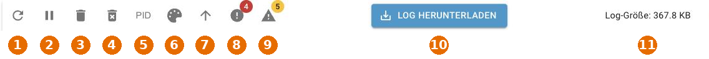

# Протоколы вкладок

Здесь отображаются системные сообщения. Самое новое находится вверху. Если что-то не работает, это первое место, куда следует обратиться.

Если пункт меню **«Журналы»** отображается красным цветом, значит, произошла ошибка. Число рядом с ним указывает количество записей в журнале.

## Панель инструментов

| Нет. | функция                                                                                                                                                                            |
| ---- | ---------------------------------------------------------------------------------------------------------------------------------------------------------------------------------- |
| 1    | **Журнал обновлений.**                                                                                                                                                             |
| 2    | **Приостановка вывода.** Вместо символа отобразится количество новых, неотображаемых сообщений. Это полезно, если вы хотите прочитать определенную строку в удобное для вас время. |
| 3    | **Очистить журнал** : очищает только экран в браузере.                                                                                                                             |
| 4    | **Окончательно удалить с диска** : удаляет файл журнала на хосте.                                                                                                                  |
| 5    | **Показать/скрыть идентификатор процесса.**                                                                                                                                        |
| 6    | **Показать/скрыть цвета** : ошибки выделяются красным, а предупреждения — желтым.                                                                                                  |
| 7    | **Обратное направление вывода** : самое новое сообщение будет вверху или внизу.                                                                                                    |
| 8    | **Показывать только ошибки.** Число рядом с ними указывает количество обнаруженных ошибок.                                                                                         |
| 9    | **Отображение ошибок и предупреждений.**                                                                                                                                           |
| 10   | **Журнал загрузки** : загружает полный ежедневный файл.`/opt/iobroker/log` .                                                                                                       |
| 11   | **Размер** текущего файла журнала.                                                                                                                                                 |

Справа от этого находится хост. В [многохостовой системе](/docs/config/multihost.md) здесь осуществляется переключение между хостами. Отображаются только сообщения от выбранного хоста.

## Список

Столбцы содержат **информацию об источнике** (экземпляре или хосте), **времени** , **уровне логирования** и **сообщении** . Поля в заголовке позволяют фильтровать данные: по источнику, по минимальному уровню логирования и по тексту в сообщении.

Уровни ведения журнала от наиболее подробного до наиболее краткого:

| Уровень                        | За что                                                              |
| ------------------------------ | ------------------------------------------------------------------- |
| `silly` (в диалоге **«Всё»** ) | Абсолютно каждый отчет. Только если`debug` этого недостаточно.      |
| `debug`                        | Внутренние процессы тоже. Для устранения неполадок выполните сброс. |
| `info`                         | Стандартная процедура: Запуск, Остановка, Подключения.              |
| `warn`                         | Что-то не так, но это продолжается.                                 |
| `error`                        | Что-то пошло не так.                                                |

Уровень устанавливается для каждого экземпляра на вкладке [«Экземпляры»](/docs/admin/instances.md) , а значение по умолчанию для новых экземпляров задается в [системных настройках](/docs/admin/settings.md) .

Длинные строки в списке обрезаются. Чтобы разобраться в сути сообщения, следует загрузить файл журнала и посмотреть там. Часто истинная причина кроется в строках, предшествующих сообщению.

## Если в журнале обнаружена ошибка

Почти всегда помогают две вещи:

1. **Ищите первое сообщение об ошибке, а не последнее.** Одна ошибка часто приводит к последующим; интерес представляет начало цепочки.
2. **Уровень детализации логов затронутого экземпляра находится на`debug` Попробуйте** перезапустить экземпляр и снова просмотреть сообщения.

Если это не поможет, [форум](https://forum.iobroker.net/) может помочь. Соответствующее сообщение должно представлять собой выдержку из загруженного файла журнала, а не скриншот списка.