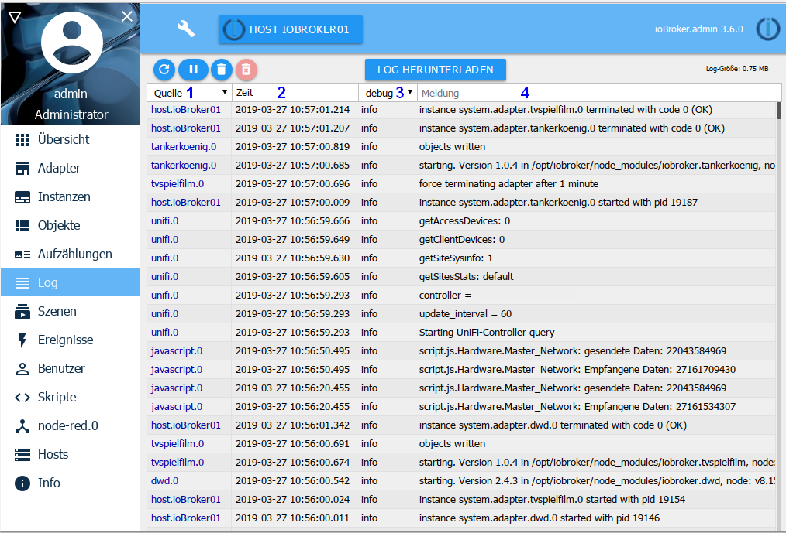

Сюда постоянно выводятся сообщения системы. Последнее сообщение выше.

## Строка заголовка
В строке заголовка расположены значки наиболее важных процессов. Для каждой иконки есть контекстная помощь. Для этого просто задержите на некоторое время мышку на иконке.

###1 - Журнал обновлений
Эта кнопка обновляет список.

### 2 - Остановить обновление
Если нажать на эту кнопку, постоянное обновление списка будет остановлено.
Вместо значка паузы теперь отображается количество новых, не отображаемых сообщений.

### 3 - Очистить список
Нажатие на этот значок удаляет только список на экране.

### 4 — Очистить журнал на хосте
При нажатии на этот значок весь журнал на хосте будет безвозвратно удален.

###5 - Загрузка журнала
С помощью этой кнопки вы можете загрузить полный ежедневный журнал за последние несколько дней из каталога /opt/iobroker/logs:

Это даст вам следующий экран: .

Поскольку строки в списке в окне журнала часто обрезаются, важно проверить здесь, нет ли дополнительной информации.

### 6 — Список хостов
В журнале отображаются только сообщения, поступающие с указанного здесь хоста. В средах с несколькими хостами вы можете указать здесь хост для регистрации.

## Содержимое страницы

Существующие объекты отображаются в таблице на странице.

Заголовки столбцов 1 и 3 содержат раскрывающиеся меню, которые служат критериями фильтрации; критерий фильтрации можно свободно ввести в столбец 4.

### 1 - Источник
Это раскрывающееся меню можно использовать для фильтрации сообщений в соответствии с экземпляром журнала. В меню отображаются только те экземпляры, для которых есть записи на странице.

### 2 - Время
Здесь указана временная метка сообщения. Этот столбец невозможно отфильтровать.

###3 - отображаемый уровень журнала
Это меню можно использовать для установки уровня серьезности сообщения, которое должно отображаться. Однако это лишь фильтр существующего списка.
Чтобы настроить ведение журнала на определенном уровне для экземпляра, это необходимо установить на странице экземпляров.

Ошибки показаны красным шрифтом:

Если на каком-либо хосте возникла ошибка, в строке меню также появится надпись ***Журнал*** красного цвета.

### 4 - Отчет
Соответствующее сообщение отображается в этом столбце, пока оно умещается в этом столбце.
Остальное отрезано. Вы по-прежнему можете увидеть все сообщение, наведя указатель мыши.
Чтобы разместить сообщение на форуме, скачайте журнал и скопируйте туда сообщение.