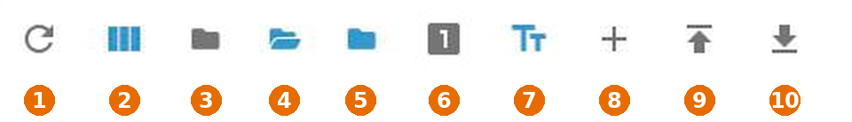
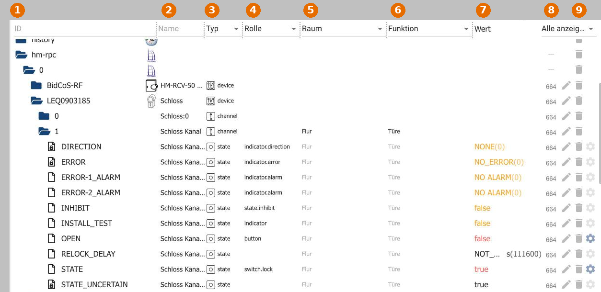
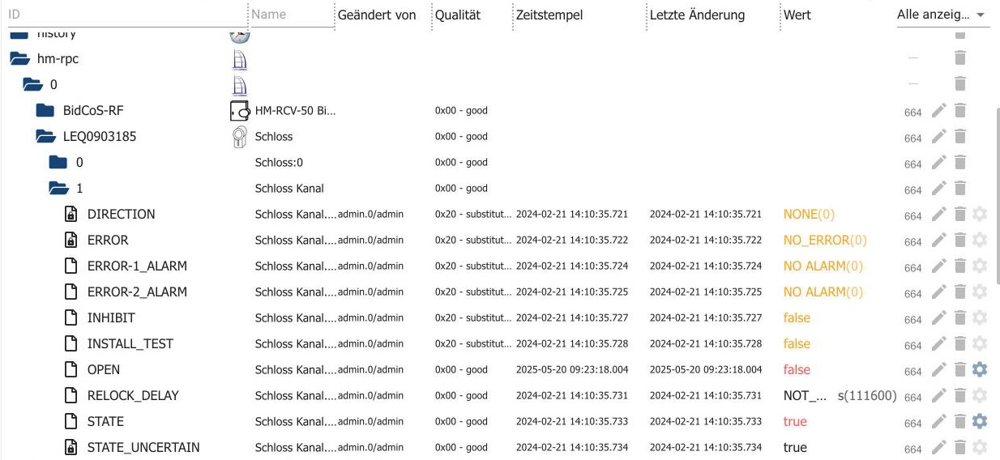
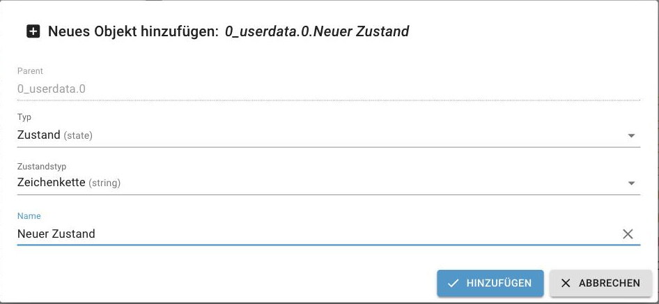

# вкладка «Объекты»

На этой вкладке представлены все объекты, управляемые ioBroker. Каждый экземпляр создает здесь собственное пространство имен, содержащее свои устройства, каналы и точки данных. Объекты также можно создавать, редактировать и удалять вручную, а целые поддеревья можно сохранять в виде файлов JSON и восстанавливать.

Что представляют собой объекты и состояния, можно узнать в разделе [«Объекты](/docs/basics/objects.md) и [состояния»](/docs/basics/states.md) .

## Панель инструментов

Наиболее важные команды расположены вверху. У каждой иконки есть всплывающая подсказка; просто наведите на неё курсор мыши на мгновение.

| Нет. | функция                                                                                                      |
| ---- | ------------------------------------------------------------------------------------------------------------ |
| 1    | **Обновить дерево.** Если вновь созданные объекты еще не отображаются, нажмите здесь.                        |
| 2    | **Настройка.** Определяет, какие столбцы будут отображаться в таблице и какой будет их ширина.               |
| 3    | **Откройте или закройте все узлы.**                                                                          |
| 4    | **Расширить на один уровень.**                                                                               |
| 5    | **Сложите один уровень вниз.**                                                                               |
| 6    | **Отображение состояния переключателя** (см. ниже).                                                          |
| 7    | **Показать/скрыть описание объекта.** Отображает текст описания объекта в дополнение к его названию.         |
| 8    | **Добавьте новый объект** (см. ниже).                                                                        |
| 9    | **Добавить дерево объектов из JSON-файла.**                                                                  |
| 10   | **Сохраните дерево объектов в виде JSON-файла.** Будет сохранено только выбранное в данный момент поддерево. |

В правой части панели инструментов отображается количество объектов и состояний, а также значок гаечного ключа **для редактирования пользовательских настроек** . Это позволяет задать параметры записи для **всех** точек данных, которые в данный момент соответствуют критериям фильтра.

Перед тем как нажать на значок гаечного ключа, обязательно проверьте, какие фильтры установлены. В противном случае настройки будут применены к гораздо большему количеству точек данных, чем предполагалось.

## Содержимое страницы

Объекты перечислены в таблице. Поля ввода и меню выбора под заголовками столбцов фильтруют отображаемый список.

| Нет. | Расколоть         | Значение                                                                                                                                                                                           |
| ---- | ----------------- | -------------------------------------------------------------------------------------------------------------------------------------------------------------------------------------------------- |
| 1    | **ИДЕНТИФИКАТОР** | Иерархия объектов. Наверху находятся пространства имен, ниже — устройства, каналы и точки данных. Поле фильтра может содержать...`*` Они используются в качестве заполнителей.                     |
| 2    | **имя**           | Название объекта, перед которым стоит символ, указывающий на его уровень иерархии. Название можно редактировать напрямую.                                                                          |
| 3    | **тип**           | Устройство, канал, состояние или каталог. Меню выбора можно использовать, например, для ограничения поиска определенными состояниями.                                                              |
| 4    | **роль**          | Сообщает таким поверхностям, как vis, что представляет собой точка данных (`switch.lock` ,`indicator.alarm` ,`button` …). Редактируемый, со списком подсказок; допускается ввод свободного текста. |
| 5    | **Космос**        | Назначенная комната. Нажатие на поле открывает список созданных комнат.                                                                                                                            |
| 6    | **функция**       | Назначенная профессия, например, освещение или отопление.                                                                                                                                          |
| 7    | **Ценить**        | Для точек данных отображается текущее значение. **Красный** цвет означает: еще не подтверждено устройством.`ack = false` ).                                                                        |
| 8    | **верно**         | Права доступа к объекту выражаются в восьмеричном формате, аналогично правам доступа к файлам в Linux.                                                                                             |
| 9    |                   | Кнопки в ряду (см. ниже).                                                                                                                                                                          |

Помещения и услуги создаются на вкладке [«Категории»](/docs/admin/enums.md) .

## Отображение состояния

В таблице Symbol **6** для каждого состояния отображаются дополнительные столбцы: кто последний раз его установил, его качество, временная метка и время последнего изменения.

?>`0x00 - good` Это означает, что значение корректно. Другие значения указывают на проблему, например...`0x20 - substitute` для определения стоимости замены.

## Создать новый объект

Символ **8** создает объект под выбранным в данный момент элементом.

Доступные типы: **State** , **Channel** , **Device** и **Directory** . Для состояний тип состояния также может быть указан как: логическое значение, число, строка, список значений, поле, объект или их комбинация. Допускаются следующие структуры: Directory → State, Directory → Channel → State, Directory → Device → Channel → State, Device → Channel → State и Channel → State.

Без экспертного режима пользовательские объекты можно использовать только в следующих условиях:`0_userdata.0` и`alias.0` Они будут созданы. Это не ограничение, а скорее правильное место: объекты в пространствах имен адаптеров будут перезаписаны при следующем их запуске.

## Кнопки в ряд

1. **Права** объекта.
2. **Значок карандаша** открывает редактор объектов со всеми свойствами. Изменения вступают в силу немедленно. Используйте этот способ только в том случае, если понимаете последствия.
3. **Корзина** удаляет объект и все, что находится ниже него в иерархии. Перед этим появляется запрос на подтверждение.
4. **Значок шестеренки** открывает _пользовательские настройки_ . Здесь вы определяете, будет ли и как записываться точка данных. Он отображается только в том случае, если установлен хотя бы один экземпляр history, InfluxDB или SQL.