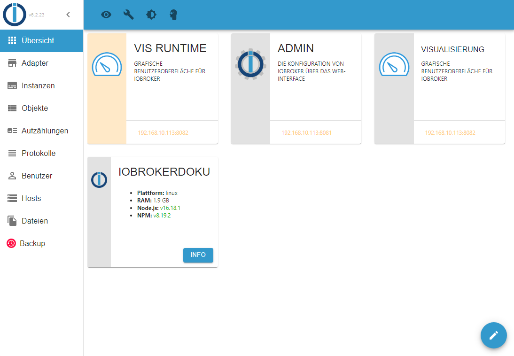
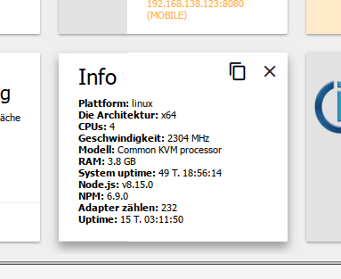
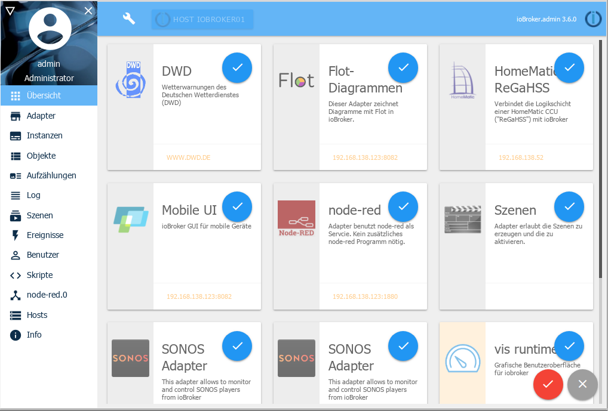

# Вкладка обзора
Здесь отображается информация обо всех адаптерах с собственным веб-интерфейсом и о хостах.

Если вы нажмете на плитку, вы будете перенаправлены на соответствующий веб-сайт, адрес которого находится внизу плитки.

В самом конце все еще есть плитка для каждого хоста в системе. В автономных инсталляциях это **сервер** ioBroker, в мультихостовых инсталляциях это главный и подчиненный сервер.

Если вы нажмете кнопку информации на такой плитке, появится дополнительная информация о соответствующем хосте:

Содержимое этой вкладки можно изменить в соответствии с вашими требованиями. Для этого нажмите на значок карандаша справа внизу:

Затем ненужные плитки можно снять галочкой. Затем подтвердите выбор, нажав значок галочки, или отмените выбор, нажав X.