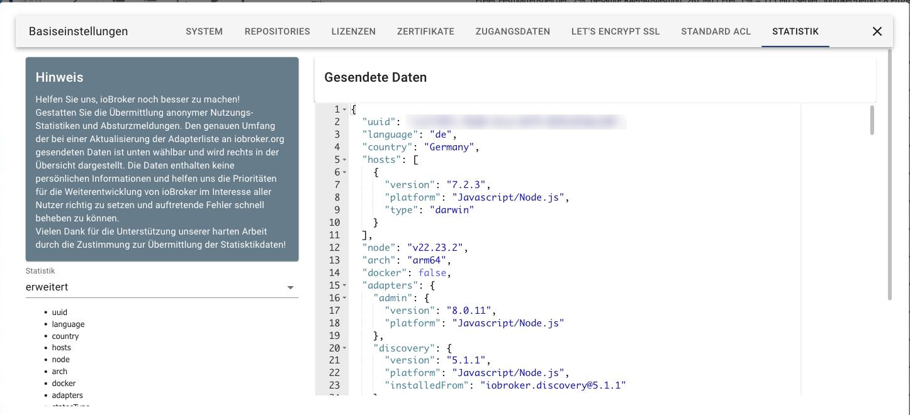

# Системные настройки

Системные настройки применяются ко всей установке. Доступ к ним можно получить по следующему адресу: **система** Они открываются в самом низу строки меню и разделены на несколько вкладок.

## система

Вот основные настройки, на которые также ссылаются адаптеры.


| Отношение                           | Значение                                                                                                                                                                                                  |
| ----------------------------------- | --------------------------------------------------------------------------------------------------------------------------------------------------------------------------------------------------------- |
| **Название растения**               | Отображается в шапке административной панели. Полезно при управлении несколькими установками ioBroker.                                                                                                    |
| **Системный язык**                  | Язык интерфейса. Не все адаптеры полностью переведены.                                                                                                                                                    |
| **единица измерения температуры**   | °C или °F. Некоторые адаптеры используют оба варианта.                                                                                                                                                    |
| **Символ валюты**                   | Например `€`.                                                                                                                                                                                             |
| **Формат даты**                     | Применяется к администраторам и посетителям.                                                                                                                                                              |
| **Символы плавающего делителя**     | Запятая или точка для десятичных чисел.                                                                                                                                                                   |
| **Стандартная история**             | Какой экземпляр записывает значения при установке нескольких экземпляров history, SQL или InfluxDB?                                                                                                       |
| **Экспертный режим**                | Включен ли уже экспертный режим при открытии административного интерфейса. Переключатель в левом нижнем углу строки меню применяется только к текущей сессии браузера; эта настройка является постоянной. |
| **Стандартный уровень протокола**   | Уровень логарифма, который **новый** Будут созданы новые экземпляры. Существующие останутся без изменений.                                                                                                |
| **Воскресенье**                     | Для отображения календаря и расписания.                                                                                                                                                                   |
| **Страна, город, широта и долгота** | Местоположение системы. В комплект входят адаптеры для определения времени восхода и захода солнца, погодных условий или астрономических расписаний. Карта рядом с ней приведена только для справки.      |

Тем, кто использует расписания, например, «через полчаса после захода солнца», следует сначала указать правильное местоположение, иначе ioBroker будет использовать предустановленное местоположение.

## Репозитории

ioBroker получает список адаптеров из репозитория. По умолчанию включены два адаптера:


- **стабильный**Протестированные версии. Это правильный выбор для системы, которой необходимо работать.
- **бета** (также _Последний_): последние версии, еще не прошедшие полное тестирование.

Галочка в столбце **Активный** Определяет, какой репозиторий используется. _бета_ При активации на вкладке «Адаптер» появляется соответствующее предупреждение.

Если имеются дополнительные записи из старой установки, их следует удалить. Они больше не поддерживаются.

Над **Разрешите автоматическое выполнение только следующих обновлений.** Это определяет, разрешено ли адаптеру ioBroker обновляться и до какого уровня версии.

## Сертификаты

Сертификаты для HTTPS находятся здесь. Они используются в admin, web, simple-api и socketio.


Ex-works `defaultPrivate` и `defaultPublic` зарегистрированы. Эти стандартные сертификаты одинаковы для всех установок, поэтому **не уверен**Они разрешают только зашифрованное соединение без возможности проверки подлинности. Для внешнего доступа требуются отдельные сертификаты, которые можно сгенерировать самостоятельно, приобрести или получить через Let's Encrypt.

Сертификат можно сохранить в виде файла или указать в виде абсолютного пути, например. `/opt/certs/cert.pem`.

!> Новые сертификаты сначала получаются с помощью **веб**Попробуйте использовать адаптер, но не под учетной записью администратора. В противном случае вы можете заблокировать себе доступ.

### Права доступа к файлам сертификатов

Если указан путь, пользователь должен `iobroker` получить разрешение на чтение файла:
`644` для файла, `755` для родительских каталогов. Если необходимые разрешения отсутствуют, в журнале будет указано что-то вроде:

```
web.0 (24704) Cannot create webserver: Error: error:0909006C:PEM routines:get_name:no start line
```

Это может проверить пользователь. `iobroker`:

```bash
su iobroker
ls -l /pfad/zum/zertifikat
```

В начале линии, `-rw-r--r--` стой. В противном случае как `root`:

```bash
chmod 644 /pfad/zum/zertifikat
chmod 755 /pfad/zum
```

Если запись указывает на символическую ссылку, применяются права целевой компании.

## Let's Encrypt SSL

[Let's Encrypt](https://letsencrypt.org/) Выдает бесплатные сертификаты. ioBroker может запрашивать и автоматически продлевать их; эта опция доступна практически в каждом адаптере, запускающем веб-сервер с HTTPS.

Процесс: ioBroker создает учетную запись с указанным здесь адресом электронной почты и запускает небольшой веб-сервер при первом обращении к этому адресу. **Порт 80**Let's Encrypt хранит там строку проверки и считывает её из \[местоположение].
`http://<adresse>/.well-known/acme-challenge/` Затем система отправляет сертификат. Он действителен приблизительно 90 дней, после чего автоматически продлевается.

Порт 80 должен быть свободен и доступен извне. Если его использует другая служба, проверка завершится неудачей.

Если это не сработает или вы не хотите открывать порт: для удалённого доступа используйте...
[адаптер для Интернета вещей](/adapters/iot)
Более простой способ, поскольку он не требует открытых портов.

## Стандартная передняя крестообразная связка

Определяет, какие права **недавно созданный** Объекты, состояния и файлы разделены по владельцам, группам и всем остальным.


Эта страница не изменяет права доступа существующих объектов. Сами пользователи и группы управляются на вкладке
[пользователь](/docs/admin/users.md) удалось.

## статистика

ioBroker может отправлять анонимную статистику использования в проект.



Слева вы выбираете объем передаваемых данных; справа вы найдете четкое описание того, что фактически будет передано: от идентификатора установки и версии узла до платформы и списка установленных адаптеров. Персональные данные не включаются. Этот анализ помогает проекту определить, какие адаптеры и платформы фактически используются.

## Другие мотоциклисты

- **Лицензии**Здесь хранятся лицензионные ключи для платных адаптеров. Информацию о том, для каких адаптеров требуется лицензия и к чему она привязана, можно найти по адресу \[ссылка/название раздела]. [Лицензии адаптера](/docs/licenses/adapter.md).
- **Доступ к данным**: централизованные учетные данные для входа, к которым могут получить доступ несколько адаптеров, вместо того, чтобы хранить их по отдельности.