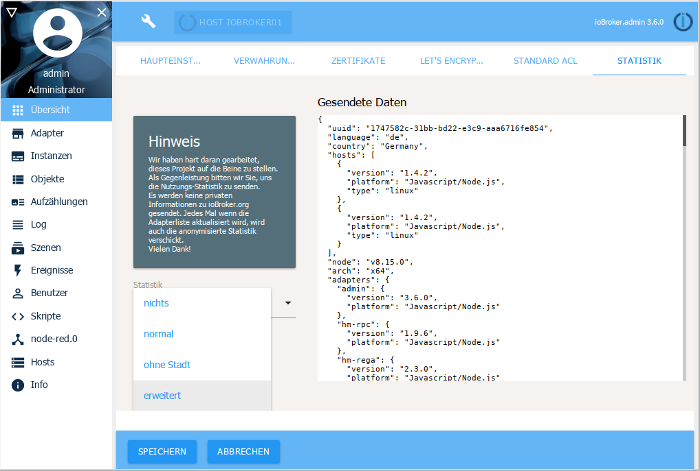

# Системные настройки
Доступ к системным настройкам можно получить из любого пункта меню администратора с помощью значка гаечного ключа в строке заголовка экрана.

Системные настройки распределены по нескольким подстраницам:

## Основные настройки
В основных настройках задаются основные параметры для ioBroker, которые также используются адаптерами в ioBroker.

Некоторые параметры уже взяты из настроек хоста.

** Системный язык **

так что вы можете выбирать между разными языками системы. Возможно, еще не все языки полностью поддерживаются.

** единица измерения температуры **

это значение используется некоторыми адаптерами. Это может быть °C или °F.

**Валюта**

На данный момент не использует адаптер

** Формат даты **

выберите способ отображения даты в админке и вис.

** десятичный разделитель **

Запятая или точка для значений с плавающей запятой

** Стандартный экземпляр истории **

В этом случае данные по умолчанию регистрируются и используются в графиках флота и рикши.

Если установлен только один адаптер истории (SQL / History / InfluxDB), он используется; если их несколько, можно выбрать один.

** Действующий депозитарий **

Желаемый репозиторий, из которого должна быть установлена версия адаптера, выбирается в раскрывающемся меню. Репозитории, перечисленные на подстранице «Места хранения», доступны в раскрывающемся меню.

## Места хранения

ioBroker может получить список адаптеров из разных источников. При установке вводятся следующие источники:

* по умолчанию (= стабильный): http://download.iobroker.net/sources-dist.json
* последняя (= бета): http://download.iobroker.net/sources-dist-latest.json

Если сюда вводятся другие репозитории из более старой установки, их следует удалить, так как они больше не обслуживаются.

## Сертификаты

Это центральная точка для сертификатов, которые используются для связи SSL / HTTPS. Сертификаты используются admin, web, simple-api, socketio. Стандартные сертификаты устанавливаются по умолчанию. С ним ничего не сверишь. Они используются только для связи SSL. Поскольку сертификаты открыты, вы должны использовать свои собственные (самоподписанные) сертификаты, покупать настоящие сертификаты или переключиться на Let's Encrypt. Связь с сертификатами по умолчанию небезопасна, и если кто-то захочет прочитать трафик, это можно сделать. Обязательно устанавливайте собственные сертификаты.
Например. под linux.

Сертификаты можно указать как путь или полностью загрузить с помощью перетаскивания.

--- title: Системные настройки Последнее изменение: 27.03.2019 ---

# Системные настройки
Доступ к системным настройкам можно получить из любого пункта меню администратора с помощью значка гаечного ключа в строке заголовка экрана.

Системные настройки распределены по нескольким подстраницам:

## Основные настройки
В основных настройках задаются основные параметры для ioBroker, которые также используются адаптерами в ioBroker.

Некоторые параметры уже взяты из настроек хоста.

** Системный язык **

так что вы можете выбирать между разными языками системы. Возможно, еще не все языки полностью поддерживаются.

** единица измерения температуры **

это значение используется некоторыми адаптерами. Это может быть °C или °F.

**Валюта**

На данный момент не использует адаптер

** Формат даты **

выберите способ отображения даты в админке и вис.

** десятичный разделитель **

Запятая или точка для значений с плавающей запятой

** Стандартный экземпляр истории **

В этом случае данные по умолчанию регистрируются и используются в графиках флота и рикши.

Если установлен только один адаптер истории (SQL / History / InfluxDB), он используется; если их несколько, можно выбрать один.

** Действующий депозитарий **

Желаемый репозиторий, из которого должна быть установлена версия адаптера, выбирается в раскрывающемся меню. Репозитории, перечисленные на подстранице «Места хранения», доступны в раскрывающемся меню.

## Места хранения

ioBroker может получить список адаптеров из разных источников. При установке вводятся следующие источники:

* по умолчанию (= стабильный): http://download.iobroker.net/sources-dist.json
* последняя (= бета): http://download.iobroker.net/sources-dist-latest.json

Если сюда вводятся другие репозитории из более старой установки, их следует удалить, так как они больше не обслуживаются.

## Сертификаты

Это центральная точка для сертификатов, которые используются для связи SSL / HTTPS. Сертификаты используются admin, web, simple-api, socketio. Стандартные сертификаты устанавливаются по умолчанию. С ним ничего не сверишь. Они используются только для связи SSL. Поскольку сертификаты открыты, вы должны использовать свои собственные (самоподписанные) сертификаты, покупать настоящие сертификаты или переключиться на Let's Encrypt. Связь с сертификатами по умолчанию небезопасна, и если кто-то захочет прочитать трафик, это можно сделать. Обязательно устанавливайте собственные сертификаты.
Например. под linux.

Сертификаты можно указать как путь или полностью загрузить с помощью перетаскивания.

Как правило, рекомендуется тестировать новые сертификаты с помощью веб-адаптера, а не напрямую с помощью адаптера администратора, чтобы не заблокировать себя из системы.

При указании пути должны быть доступны правильные разрешения для пользователя iobroker.

Для самого файла 644, для каталогов более высокого уровня 755.

Если права неверны, появляется сообщение об ошибке вида:

``web.0 (24704) Cannot create webserver: Error: error:0909006C:PEM routines:get_name:no start line``

Вы можете проверить доступ, войдя на сервер как пользователь root, затем переключившись на пользователя iobroker и перечислив файл сертификата:

``su iobroker``

``ls -l /Pfad/zum/Zertifikat``

В начале строки должно отображаться **- rw-r - r -**

Если фактический сертификат связан, необходимо проверить права цели ссылки.

Вот сообщение вроде

``ls: Zugriff auf '/Pfad/zum/Zertifikat' nicht möglich: Keine Berechtigung``

Права надо настроить.

Как пользователь root для файла:

``chmod 644 /Pfad/zum/Zertifikat``

Для каталогов более высокого уровня:

``chmod 755 /Pfad/zum``

## Let's Encrypt

Let's Encrypt - это бесплатный автоматизированный центр сертификации с открытым исходным кодом независимой исследовательской группы Internet Security Research Group (ISRG).

Дополнительные сведения о Let's Encrypt см. В [здесь](https://letsencrypt.org/).

Некоторые установки используют динамический DNS или аналогичный для доступа к собственному домену через назначенный там адрес. ioBroker поддерживает автоматический запрос и обновление сертификатов в организации Let's Encrypt.

Возможность использовать бесплатные сертификаты от Let's Encrypt существует почти в каждом адаптере, который может запускать веб-сервер и поддерживает HTTPS.

Если вы активируете опцию использования сертификатов, но не автоматическое обновление, соответствующий экземпляр попытается работать с сохраненными сертификатами.

Если автоматические обновления активированы, экземпляр пытается запросить сертификаты у Let's Encrypt и обновляет их автоматически.

Сертификаты запрашиваются впервые при первом вызове соответствующего адреса. То есть, если вы настраиваете, например, «sub.domain.com» в качестве адреса, а затем вызываете https://sub.domain.com, сертификаты запрашиваются в первый раз, что может занять некоторое время, прежде чем придет ответ.

Выдача сертификатов - сложная процедура, но если вы будете следовать приведенным ниже объяснениям, получить бесплатные сертификаты будет легко.

** Метод: **

Необходимо создать новую учетную запись с введенным адресом электронной почты (настройка в настройках системы)

Случайный ключ генерируется как пароль для учетной записи.

После создания учетной записи система открывает небольшой веб-сайт на 80-м порту для подтверждения адреса.

Let's encrypt всегда использует порт 80 для проверки адреса.

Если порт 80 уже используется другой службой, применяется пункт 4, т. Е. Назначьте другой порт другой службе!

При запуске небольшого веб-сервера запрос сертификатов для адресов, указанных в настройках системы, отправляется на сервер Let's encrypt.

Сервер Let's Encrypt отправляет контрольную фразу в ответ на запрос и через некоторое время пытается прочитать эту контрольную фразу по адресу «http:// yourdomain: 80 / .well-known / acme-challenge /».

Когда сервер получает от нас эту контрольную фразу, сервер Let's Encrypt отправляет сертификаты. Они сохраняются в каталоге, указанном в системных настройках.

Это звучит сложно, но все, что вам нужно сделать, это установить несколько флажков и ввести адрес электронной почты и веб-адрес в настройках системы.

Полученные сертификаты действительны около 90 дней. После того, как эти сертификаты были выпущены в первый раз, запускается другая задача, которая автоматически продлевает срок действия.

Это довольно сложная тема, и тысячи вещей могут пойти не так. Если это не сработает, рекомендуется использовать адаптер IoT для доступа во время движения.

Let's Encrypt работает только с версией node.js> = 4.5

## Права доступа

На этой подстранице можно определить права доступа к различным областям для всех пользователей / групп.

## Статистика

Чтобы у нас был небольшой обзор установок (используемых адаптеров) и географического распределения, мы были бы очень рады, если бы получили эту информацию.

Вы можете отправлять разное количество информации. Этот прицел можно выбрать слева.

Точная форма, в которой отправляются эти данные, затем отображается справа.
Эти данные оцениваются абсолютно анонимно.

## Let's Encrypt

Let's Encrypt - это бесплатный автоматизированный центр сертификации с открытым исходным кодом независимой исследовательской группы Internet Security Research Group (ISRG).

Дополнительные сведения о Let's Encrypt см. В [здесь](https://letsencrypt.org/).

Некоторые установки используют динамический DNS или аналогичный для доступа к собственному домену через назначенный там адрес. ioBroker поддерживает автоматический запрос и обновление сертификатов в организации Let's Encrypt.

Возможность использовать бесплатные сертификаты от Let's Encrypt существует почти в каждом адаптере, который может запускать веб-сервер и поддерживает HTTPS.

Если вы активируете опцию использования сертификатов, но не автоматическое обновление, соответствующий экземпляр попытается работать с сохраненными сертификатами.

Если автоматические обновления активированы, экземпляр пытается запросить сертификаты у Let's Encrypt и обновляет их автоматически.

Сертификаты запрашиваются впервые при первом вызове соответствующего адреса. То есть, если вы настраиваете, например, «sub.domain.com» в качестве адреса, а затем вызываете https://sub.domain.com, сертификаты запрашиваются в первый раз, что может занять некоторое время, прежде чем придет ответ.

Выдача сертификатов - сложная процедура, но если вы будете следовать приведенным ниже объяснениям, получить бесплатные сертификаты будет легко.

** Метод: **

Необходимо создать новую учетную запись с введенным адресом электронной почты (настройка в настройках системы)

Случайный ключ генерируется как пароль для учетной записи.

После создания учетной записи система открывает небольшой веб-сайт на 80-м порту для подтверждения адреса.

Let's encrypt всегда использует порт 80 для проверки адреса.

Если порт 80 уже используется другой службой, применяется пункт 4, т. Е. Назначьте другой порт другой службе!

При запуске небольшого веб-сервера запрос сертификатов для адресов, указанных в настройках системы, отправляется на сервер Let's encrypt.

Сервер Let's Encrypt отправляет контрольную фразу в ответ на запрос и через некоторое время пытается прочитать эту контрольную фразу по адресу «http:// yourdomain: 80 / .well-known / acme-challenge /».

Когда сервер получает от нас эту контрольную фразу, сервер Let's Encrypt отправляет сертификаты. Они сохраняются в каталоге, указанном в системных настройках.

Это звучит сложно, но все, что вам нужно сделать, это установить несколько флажков и ввести адрес электронной почты и веб-адрес в настройках системы.

Полученные сертификаты действительны около 90 дней. После того, как эти сертификаты были выпущены в первый раз, запускается другая задача, которая автоматически продлевает срок действия.

Это довольно сложная тема, и тысячи вещей могут пойти не так. Если это не сработает, рекомендуется использовать адаптер IoT для доступа во время движения.

Let's Encrypt работает только с версией node.js> = 4.5

## Права доступа

На этой подстранице можно определить права доступа к различным областям для всех пользователей / групп.

## Статистика

Чтобы у нас был небольшой обзор установок (используемых адаптеров) и географического распределения, мы были бы очень рады, если бы получили эту информацию.

Вы можете отправлять разное количество информации. Этот прицел можно выбрать слева.

Точная форма, в которой отправляются эти данные, затем отображается справа.
Эти данные оцениваются абсолютно анонимно.