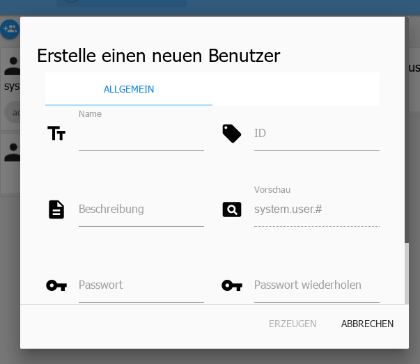

# Страница пользователей
На этой странице можно создавать пользователей и группы, а также назначать права для групп.

Существующие группы находятся слева, а пользователи — справа.

Пользователей можно перетаскивать в группы простым перетаскиванием.

## 1.) новая группа
После нажатия на этот значок открывается другое окно:

Это окно состоит из двух подблоков.

### Общий
Здесь вводятся основные вещи:

**Фамилия**

Обозначение группы. Это имя можно выбрать произвольно, но оно должно быть уникальным.

**ID** Идентификатор будет заполнен автоматически

**Описание**

В это поле можно ввести пояснение задач этой группы.

**Предварительный просмотр**

Отображается автоматически и содержит полный идентификатор system.group.groupname.

Значок можно добавить с помощью кнопки [+], но его также можно перетащить в окно.

**Цвет**

Плитка группы подсвечивается установленным там цветом.

### Права доступа
Права назначаются группам. Чтобы у пользователей были определенные права, их необходимо отнести к соответствующей группе.

Здесь назначаются права доступа для различных задач.

## 2.) новый пользователь
После нажатия на этот значок открывается другое окно:

**Фамилия**

Имя пользователя. Это имя можно выбрать произвольно, но оно должно быть уникальным.

**Я БЫ**

Идентификатор будет заполнен автоматически

**Описание**

В это поле можно ввести пояснение о пользователе.

**Предварительный просмотр**

Отображается автоматически и содержит полный идентификатор system.group.Username.

**Пароль**

Пароль пользователя

**Повторить пароль**

Для защиты от ошибок при вводе пароль необходимо ввести здесь второй раз