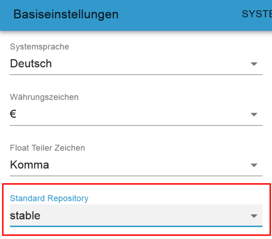
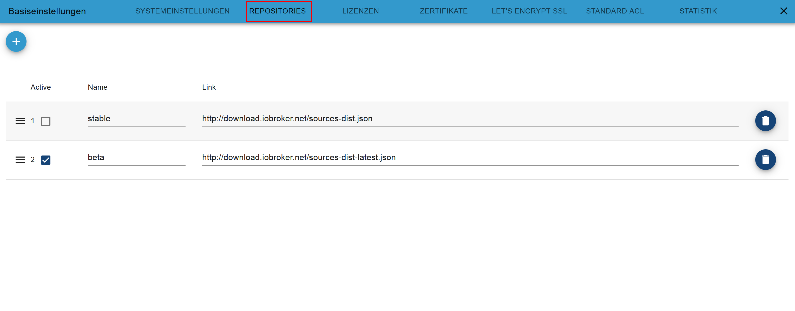

# Что такое репозиторий?
Репозиторий — это центральный репозиторий программ.

Адаптеры, которые можно просматривать и устанавливать/обновлять через административный интерфейс ioBroker, управляются через центральный репозиторий (репозиторий). По умолчанию ioBroker настраивается после установки таким образом, что осуществляется доступ к «стабильному» репозиторию и предлагаются для установки хранящиеся там адаптеры.

По умолчанию в ioBroker доступны два репозитория:

- **стабильный**: в этом репозитории адаптеры доступны в версии, которая уже была протестирована и поэтому может использоваться в производственной системе.
- **бета**: в этом репозитории доступны версии адаптера, которые в настоящее время находятся на стадии тестирования (!) и могут содержать несколько ошибок. Раньше бета-репозиторий назывался последним, так как назначение названия было не совсем понятно, его переименовали из последнего в бета.

  

# Выбор репозитория В базовых настройках ioBroker нужный репозиторий можно задать следующим образом.
Открываем основные настройки ioBroker:

Выбор репозитория по умолчанию:

Если был выбран бета-репозиторий, в обзоре адаптера появится соответствующее предупреждение.

  

# Пути к репозиториям по умолчанию Пути к репозиториям стабильной версии и бета-версии по умолчанию показаны ниже: 
- стабильная версия - ссылка на репозиторий http://download.iobroker.net/sources-dist.json
- бета - Ссылка на репозиторий http://download.iobroker.net/sources-dist-latest.json

  

# Стабильный и бета-репозиторий
По сути, стабильный репозиторий ВСЕГДА должен использоваться для продуктивной установки ioBroker. Репозиторий бета-версии содержит версии, которые все еще содержат ошибки и могут повлиять на всю систему.

 

## Что делать, если мне когда-нибудь понадобится адаптер из бета-репозитория?
Раньше это означало переключение репозитория со стабильного на бета-версию в ioBroker, установку одного адаптера, а затем обратное переключение. Последние обычно отходили на второй план.

Начиная с Admin 5 это гораздо удобнее БЕЗ смены репозитория!

- Активировать экспертный режим
- В меню «Адаптер» перейдите к кнопке «Выборочная установка» (GitHub) и перейдите на первую вкладку «Из NPM».
- В поле "Выбор адаптера" теперь можно ввести/выбрать нужный адаптер, который необходимо установить

Таким образом, можно установить последнюю бета-версию, не переключая репозиторий.

 

## Как адаптер попадает в бета-версию или стабильный репозиторий?
Задолго до того, как адаптер будет готов к установке в ioBroker через интерфейс администратора, разработчик подает заявку на включение в репозиторий. Когда это происходит, опытные разработчики просматривают исходный код нового адаптера и сообщают запрашивающему разработчику, какие элементы необходимо обработать, прежде чем новый адаптер можно будет включить в репозиторий.

Новый адаптер сначала доступен в бета-репозитории, а затем может быть тщательно протестирован (бета-тестерами).
Когда фаза тестирования будет завершена и обнаруженные ошибки будут исправлены, версия адаптера будет доступна в стабильном репозитории.

После изменения функции адаптера он обычно снова становится доступным только в бета-репозитории для тестирования, пока версия не будет выпущена для стабильного репозитория после завершения фазы тестирования.

--- lastChanged: "25.01.2022" ---