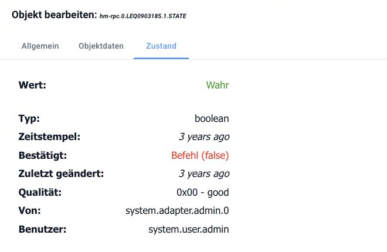

# Штаты и точки данных

А **Точка данных** Это позиция, где находится значение: температура в комнате, состояние включения лампы, название воспроизводимого в данный момент трека.

Оно состоит из двух частей:

- дем **объект** типа `state` - описание, которое редко меняется (см. [объекты](/docs/basics/objects.md)),
- дем **Состояние** - само значение, которое постоянно меняется.

В повседневной речи термин «точка данных» обычно означает оба показателя вместе.

Только объекты типа `state` У них есть состояние. И направление ясно: если объект удален, состояние исчезает вместе с ним — и наоборот, объект остается, если удалено только значение.

## Состояние

Государство — это не просто цифра. Оно также отражает свое происхождение и время возникновения:

| Поле     | Значение                                                                    |
| -------- | --------------------------------------------------------------------------- |
| `val`    | значение                                                                    |
| `ack`    | является ли это **команда** или **Ответить на сообщение** это - см. ниже    |
| `ts`     | когда значение было записано в последний раз                                |
| `lc`     | когда он в последний раз действительно изменился                            |
| `from`   | какой экземпляр адаптера это написал                                        |
| `q`      | Значение качества, отличное от 0, означает: с этим значением что-то не так. |
| `user`   | кто это написал, при условии, что они зарегистрировались                    |
| `expire` | Через сколько секунд значение изменится? `null` водопады                    |

В редакторе объектов все это находится на вкладке _Состояни&#x435;_&#x424;лаг «ack» означает «подтверждено» — на изображении он выделен красным цветом, поскольку его значение является... **команда** Ответа пока нет.

Разница между `ts` и `lc` Это полезнее, чем кажется: датчик, который сообщает одно и то же значение каждые 30 секунд, обновляет его. `ts` каждый раз,
`lc` Но только если произошли реальные изменения. Любой, кто хочет узнать, как долго дверь была открыта, должен посмотреть на... `lc`.

## Флаг ack

Это термин, на котором большинство людей зацикливаются, — и это самый важный термин на этой странице.

- **`ack: false` это команда.** «Лампа, включи». Именно это пишет автоматизация, переключатель в визуализации, скрипт.
- **`ack: true` Это обратная связь.** «Лампа горит». Именно это выводит адаптер после подтверждения устройством.

Процесс выглядит следующим образом: скрипт устанавливает значение с помощью `ack: false`Адаптер видит это, отправляет команду устройству, и когда устройство отвечает, оно снова записывает ту же точку данных — на этот раз с `ack: true`.

Если вы не различаете эти два момента при запуске автоматизации, вы создаёте замкнутый круг: скрипт переключается, устройство подтверждает действие, подтверждение снова запускает скрипт. Общее правило: **Прислушивайтесь к отзывам, отправляйте команды.** Более подробная информация по адресу
[Логика и автоматизация](/docs/logic/README.md).

Это можно увидеть в панели администратора: в списке объектов значение неподтвержденного состояния выделено. Точка данных, которая остается постоянно неподтвержденной, указывает на то, что команда не достигла устройства.

## Описание этого

Объект, связанный с точкой данных, определяет способ обработки значения. Поля, имеющие отношение к повседневной жизни, перечислены в `common`:

| Поле                 | За что                                                                                                                                                     |
| -------------------- | ---------------------------------------------------------------------------------------------------------------------------------------------------------- |
| `type`               | `number`, `string`, `boolean`, `array`, `object`, `json`, `mixed`, `file`                                                                                  |
| `name`               | отображаемое имя на одном или нескольких языках                                                                                                            |
| `unit`               | единица, например `°C` или `%`                                                                                                                             |
| `min`, `max`, `step` | Допустимый диапазон и шаг изменения, например, для контроллера.                                                                                            |
| `read`, `write`      | Разрешены ли чтение и письмо – оба навыка обязательны.                                                                                                     |
| `role`               | что представляет собой эта точка данных; затем пользовательский интерфейс выбирает соответствующие элементы управления, см. [Рулон](/docs/basics/roles.md) |
| `states`             | список возможных значений в текстовом формате, например `{0: "AUS", 1: "EIN"}`                                                                             |
| `def`                | целевое значение                                                                                                                                           |
| `custom`             | Настройки других адаптеров для этой точки данных — например, запись вводится здесь.                                                                        |

`read` и `write` Это не права, а утверждение об устройстве: датчик температуры — это `read: true, write: false`Тот, кто всё же введёт это значение, не получит ошибку — оно просто будет отображаться и ничего не будет значить.

?> `common.custom` Здесь включается запись значения. В панели администратора это делается с помощью значка шестеренки рядом с точкой данных; за ним находится запись примерно такого вида: `{"influxdb.0": {"enabled": true}}`.

## Установите значения вручную

В административной панели в _объекты_ Значение записываемой точки данных можно изменить с помощью стилуса. При записи есть выбор между командной операцией и обратной связью — то же различие, что и выше. В целях тестирования правильным вариантом является командная операция; ручная установка обратной связи обманывает систему, заставляя ее поверить в состояние устройства, которого не существует.

## Читать далее

- [объекты](/docs/basics/objects.md) - Структура, идентификаторы и пространства имен
- [Рулон](/docs/basics/roles.md) - полный список `common.role`
- [Псевдоним](/docs/basics/alias.md) - пользовательские, стабильные имена для внешних точек данных
- [Структура объекта](/docs/dev/objectsschema.md) - все области, для разработчиков