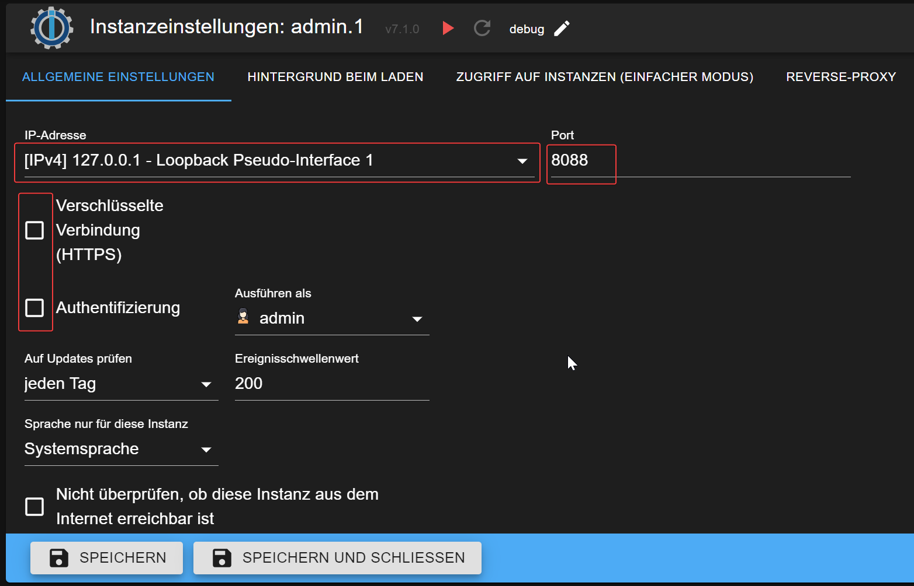

# Администратор и редакторы
С облаком ioBroker.pro вы получаете больше возможностей по сравнению с бесплатным облаком ioBroker.net.

Дополнительные возможности включают в себя:

- Доступ к интерфейсу администратора
- Возможность редактировать проекты vis-2 и vis, а не только просматривать их
- Доступ в Лавлейс
- Больше ресурсов и меньше пользователей, что обеспечивает более быструю и надежную работу

## Администратор
Чтобы включить доступ администратора, его необходимо активировать в настройках облака на вкладке «Расширенные параметры».

Выбранный экземпляр администратора не должен иметь включенную опцию HTTPS и не должен быть защищен паролем. Это необходимо для доступа облака к интерфейсу администратора.

Если вам необходимо защитить интерфейс администратора, вы можете создать отдельный экземпляр для облака без защиты паролем и без HTTPS и привязать этот экземпляр к localhost на другом порту.

В этой конфигурации доступ к интерфейсу администратора возможен только с локальной машины, но облако по-прежнему может получить к нему доступ.

Важно: выберите порт, отличный от 8081, так как 8081 используется вашим основным экземпляром администратора.

После этого обязательно выберите вновь созданный экземпляр в настройках облака.

## Вис и Вис-2
Для включения редактирования vis и vis-2 не требуется специальной настройки. Просто откройте проект vis или vis-2 в режиме редактирования.

## Лавлейс
Облако Lovelace работает на порту 4463.
Убедитесь, что настройки вашего брандмауэра разрешают доступ вашего мобильного телефона или планшета к облаку через порт 4463.
