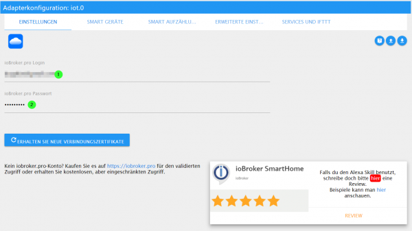
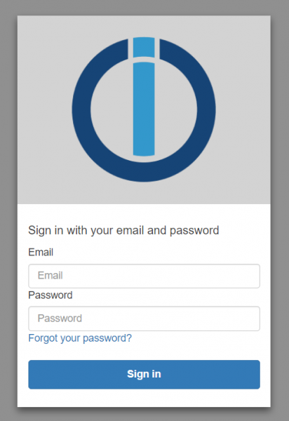
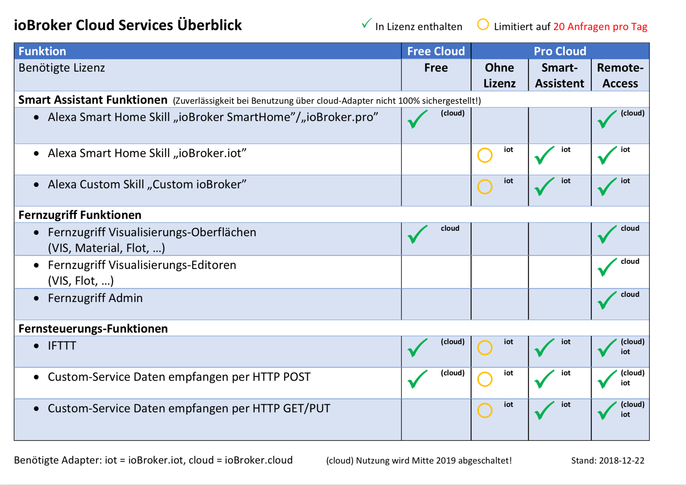
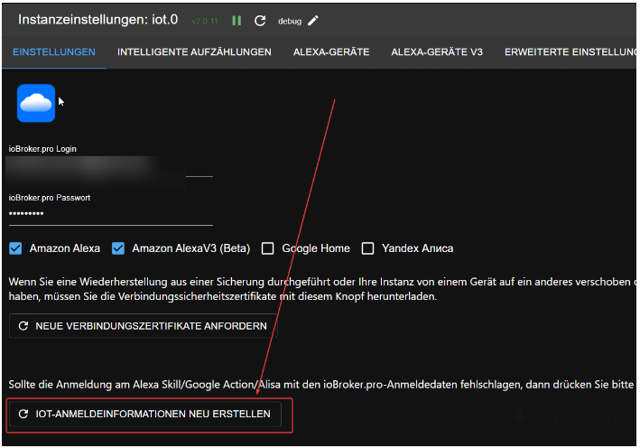

# Облако Интернета вещей
Происхождение: https://forum.iobroker.net/topic/17834/ank%C3%BCndigung-weihnachtsaktion-assisten-service-iobroker-iot-reloaded-alexa-und-services.

Управлять вашими устройствами через Alexa станет проще, чем когда-либо.
Узнайте, как использовать облачный адаптер для беспрепятственного подключения к Alexa и сделать ваш дом умнее. К сожалению, стало ясно, что существующие решения не всегда могут справиться с растущим числом пользователей.
Вот почему мы представляем вам сервис IoT — перспективное решение, специально разработанное для плавной интеграции с Alexa и другими помощниками.

Чтобы гарантировать, что настройка экземпляра IoT и подключение к нему работают, новый пакет лицензий помощника можно приобрести только после успешного создания соединения, успешной связи и работы управления хотя бы одним устройством. .
Так что не удивляйтесь, что в учетной записи Pro Cloud ничего не доступно.

Поэтому сначала следуйте обновленным инструкциям:

1. Если учетной записи Pro еще нет, зарегистрируйте учетную запись на https://iobroker.pro/intro.

В противном случае просто используйте существующую учетную запись Pro.

Вновь созданные учетные записи имеют 7-дневную «пробную версию» лицензии помощника с лимитом 20 000 запросов в месяц.
Однако приобретенная лицензия помощника начинает действовать сразу же, поэтому оставшиеся дни не учитываются! По истечении 7 дней без покупки лицензии помощника до 20 запросов в день будут передаваться бесплатно.
Затем он закрывается на весь день.

Существующие учетные записи Pro без лицензии также могут протестировать пакет помощника в течение 7 дней при запуске кампании — эти 7 дней начинаются, когда пользователь службы IoT создается путем ввода данных для входа в адаптер IoT.

Учетные записи Pro с существующей лицензией Assistant или Remote Access также имеют 20 000 запросов в месяц.

2. Затем установите адаптер ioBroker.IoT (подключение Cloud-IoT) из обычного репозитория — просто отфильтруйте «IoT».

При настройке адаптера введите данные для входа с https://iobroker.pro (адрес электронной почты строчными буквами и пароль! Никакого ключа приложения и прочего!).
Кнопки «Получить новые сертификаты подключения» или «Восстановить учетные данные IoT» нужны только в случае ошибок.

Если адаптер Интернета вещей уже установлен, проверьте, доступны ли обновления, и обновите его до версии 0.2.2.

Продолжайте выполнять здесь все необходимые настройки и проверять смарт-устройства.
Обычно в адаптере Интернета вещей должны быть указаны те же устройства, что и в предыдущем облачном адаптере.
Если это не так, возможно, вы определили устройства только для предыдущего экземпляра облачного адаптера, используя опцию «Собственные настройки (только pro)».
Затем устройства необходимо повторно сохранить в IoT! Также рекомендуется создавать группы в IoT-адаптере ioBroker, а не на Amazon, так как группы на Amazon вызывают ненужный трафик, поскольку Amazon отправляет собственную команду управления для каждого устройства!

3. Теперь адаптер должен подключиться к службе Интернета вещей и загорится зеленым.

Если это не сработало и адаптер, например, желтый, проверьте файл журнала и ознакомьтесь с часто задаваемыми вопросами ниже.
Перезапуск экземпляра также может помочь.
В большинстве случаев это простые вещи, такие как неправильные данные для входа (примечание: также обратите внимание на прописные и строчные буквы!)! Сообщения об ошибках в журнале были улучшены и теперь должны лучше объяснять, в чем проблема.

Если вы ранее использовали облачный адаптер и вам необходим только контроль Alexa, лучше всего деактивировать облачный адаптер, так как он больше не нужен!

4. После первого подключения автоматически будет создана учетная запись Alexa с тем же паролем, что и ioBroker.pro.

Экземпляр iobroker.iot должен быть «зеленым».

5. Может случиться так, что пароли, содержащие символ `#`, еще не работают.

Проблема изучается, поэтому не используйте `#` в пароле.

5. Затем установите новый «ioBroker.iot» [Skill](https://www.amazon.de/ioBroker-ioBroker-iot/dp/B07L66BFF9) и нажмите «Активировать».

После этого должна появиться маска входа в службу IoT.
Используйте адрес электронной почты и пароль учетной записи Pro Cloud здесь.

**Укажите логин строчными буквами: `MyEmail@gmx.de` неверен; `myemail@gmx.de` верно!**

Любой, кто уже использует службы IoT (ранее или с настраиваемым навыком), просто входит в систему напрямую, используя свои данные доступа к IoT, когда навык активируется.

После успешного входа в систему появится сообщение об успехе и навык активируется.
Если нет, проверьте свои данные для входа и повторите попытку.

6. Теперь Amazon должен предложить вам поиск устройств.

После этого все устройства, хранящиеся в адаптере Интернета вещей, также должны быть найдены в Amazon.

7. Проверьте, можно ли переключать ваши устройства с помощью голоса или приложения Alexa.

Этот шаг важен, и, по крайней мере, одно действие по переключению должно быть успешным, прежде чем вы сможете перейти к следующему шагу!

8. Теперь лучше всего зайти на Амазон и поставить навыку 5 звёзд (потому что всё заработало) :)

Хорошие отзывы (конечно, настоящие, это не призыв к фейковым отзывам!) и, следовательно, размещение навыков также оказывают определенное влияние на стоимость сервисов Amazon, используемых IoT-сервисом!

9. Итак, если вы успешно подключили IoT-адаптер, активировали навык и можете успешно управлять своими устройствами,

Теперь вам нужно решить, хотите ли вы купить пакет помощника в рамках рождественской кампании или вам может быть достаточно 20 запросов в день.
Если вы хотите купить пакет, перейдите на https://iobroker.pro в своем браузере и войдите туда, используя свои данные для доступа к Pro Cloud.
Если вы не видите меню, нажмите значок аватара в правом верхнем углу, а затем выберите в меню «Удаленный доступ».

Удаленный доступ к админке и редакторам с этой лицензией не работает!

Также невозможно обновить удаленно позже. Тогда это будет новая покупка удаленной лицензии.

Если вам нужен полный удаленный доступ (включая редакторы) к ioBroker, вы также можете купить удаленную лицензию (по цене 5,49 евро в месяц или, например, 44,99 евро в год (= 3,75 евро в месяц)), поддержку Smart Assistant (Alexa, Google Home) автоматически включается туда.

Обзор лицензий и функций вы можете найти на следующем изображении:

Лицензия Smart Assistant стоит 15,99 евро на 6 месяцев (2,67 евро в месяц) и 23,99 евро (1,99 евро в месяц) на один год.

Возможно, цены изменятся (в обе стороны), в зависимости от того, как будут развиваться точные эксплуатационные расходы на необходимую инфраструктуру!

## Поиск проблемы
Если пароль от ioBroker.pro не подходит для навыков Alexa, проверьте:

- адаптер ioBroker.iot установлен и экземпляр «зеленый»,
- Логин вводится строчными буквами,
- в пароле нет символа `#`,
- Если ничего из этого не помогло, нажмите кнопку:

 После этого ioBroker.iot должен перезапуститься, а затем снова попытаться активировать навык ioBroker.iot.