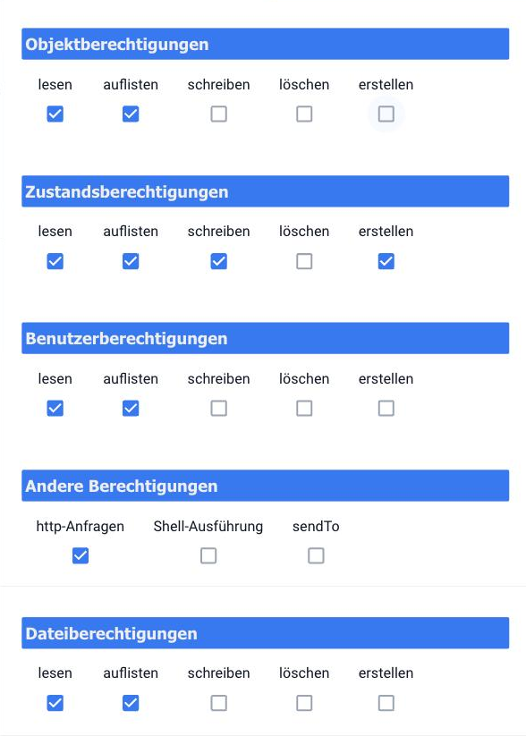
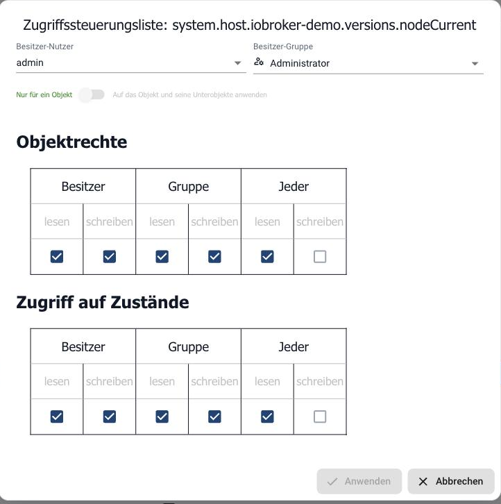

# Списки контроля доступа (ACL) в подробном описании

На этой странице объясняется, **как** ioBroker определяет, разрешено ли пользователю читать, просматривать, записывать, создавать или удалять объекты, состояния и файлы. Для тех, кто хочет создать только пользователя с ограниченными правами, пошаговые инструкции можно найти в разделе [«Управление доступом с помощью пользователей и групп»](/docs/config/userrights.md) . На этой странице объясняется базовая модель.

## Кратко изложите основные моменты.

- Каждая попытка доступа должна пройти через **два барьера** : **права группы** пользователя и **список контроля доступа (ACL)** для отдельной записи. Если какой-либо из этих барьеров блокирует доступ, ничего не происходит.
- Списки контроля доступа (ACL) работают аналогично правам доступа к файлам в Linux: **Владелец** , **Группа владельцев** , **Все** , каждый с правами **на чтение** и **запись** .
- Число представлено **в шестнадцатеричной системе** счисления, а не в восьмеричной, как в Linux: `0x664`, нет `0664`.
- Применима **только одна** из трех ролей, а именно первая, которая подходит.
- Объект, состояние и файл имеют **отдельные** права доступа, даже если объект и состояние имеют один и тот же идентификатор.
- **Администратор** пользователя и члены **группы администраторов** освобождены от действия ACL на объекты, файлы и состояния и могут делать все, что угодно.

## Два барьера

Групповые права и Закон о защите прав потребителей отвечают на два разных вопроса:

| барьер              | Просить                                                                                  | Где установлен                                                |
| ------------------- | ---------------------------------------------------------------------------------------- | ------------------------------------------------------------- |
| **групповые права** | Разрешен ли этому пользователю вообще такой **тип** доступа? Например: запись состояний. | в группе, на вкладке [«Пользователи»](/docs/admin/users.md) . |
| **ACL**             | Относится ли это к **данной** записи? Например: для `alias.0.Licht`.                     | на объекте, на состоянии, на файле                            |

Пользователь, группа которого имеет права на запись, всё равно столкнётся с точкой данных, список контроля доступа (ACL) которой разрешает только чтение. И наоборот, открытый ACL бесполезен, если группа вообще не разрешает запись в состояния.

```
Anfrage: Benutzer "fred" will alias.0.Licht schalten
   │
   ├─ 1. Gruppenrechte: darf fred Zustände schreiben?      nein → abgelehnt
   │                                                          ja ↓
   └─ 2. ACL von alias.0.Licht: welche Rolle hat fred,
         und erlaubt die Ziffer dieser Rolle das Schreiben?  nein → abgelehnt
                                                               ja → erlaubt
```

## Что защищено

| вход                      | Что это такое                                                                                         | Поле «Права» в ACL                                                  |
| ------------------------- | ----------------------------------------------------------------------------------------------------- | ------------------------------------------------------------------- |
| **объект**                | Описание записи: Имя, роль, подразделение, настройки (`common`, `native`).                           | `acl.object`                                                        |
| **Состояние**             | Само значение: `val`, `ack` Временная метка. Переключение — это доступ на запись в состояние.          | `acl.state`                                                         |
| **файл**                  | Файловое хранилище ioBroker: визуализированные проекты, веб-файлы адаптеров, загруженные изображения. | `acl.permissions`                                                   |
| **Пользователи и группы** | Объекты `system.user.*` и `system.group.*`.                                                            | как объекты, плюс их собственные групповые права                    |
| **Другой**                | Это не вступительная запись, но навыки: HTTP-запросы, команды командной оболочки. `sendTo`.           | Никакого Закона о защите прав потребителей, только групповые права. |

Таким образом, точка данных имеет **два** номера ACL: один для объекта и один для состояния. Пользователям, которым нужно только переключать **состояние,** требуются права на запись. Права на запись для объекта, с другой стороны, позволяют изменять точку данных.

## Кто задает вопросы: Пользователи, группы и особые случаи

### Пользователи и группы

Пользователи — это объекты с идентификатором. `system.user.<name>` Группы имеют идентификатор. `system.group.<name>` Эти пользователи существуют только внутри ioBroker; они не имеют никакого отношения к пользователям операционной системы.

Те, кто находятся в группе, стоят **внутри группы** . `common.members` не по местоположению пользователя:

```json
{
  "_id": "system.group.user",
  "type": "group",
  "common": {
    "name": "User",
    "members": ["system.user.fred"],
    "acl": { "...": "..." }
  }
}
```

### Несколько групп

Пользователь может принадлежать к любому количеству групп. В этом случае права доступа, предоставленные каждой группой, являются **суммой** прав доступа всех остальных групп: каждое разрешение предоставляется, как только **одна** из групп его разрешает. Следовательно, одна группа не может отнять у пользователя то, что ему предоставила другая группа.

Пользователь, **не** входящий ни в одну группу, не имеет никаких прав.

### Особые случаи: администратор и группа администраторов.

| ВОЗ                               | групповые права | ACL для объектов | состояние передней крестообразной связки | ACL для файлов |
| --------------------------------- | --------------- | ---------------- | ---------------------------------------- | -------------- |
| пользователь `system.user.admin`   | все             | кроме            | кроме                                    | кроме          |
| члены `system.group.administrator` | все             | кроме            | кроме                                    | кроме          |
| все остальные                     | объект          | применяется      | применяется                              | применяется    |

Таким образом, группа администраторов всегда имеет право делать все, что угодно, наравне с обычным пользователем. `admin` Их права нельзя изменить в настройках администратора. Поэтому ограничить доступ можно только для пользователя, **не** входящего в эту группу.

Добавление пользователя в группу администраторов предоставляет ему доступ ко всему, независимо от наличия списков контроля доступа (ACL). Для ограниченного доступа создайте отдельную группу.

### Кто является «пользователем» во время попытки доступа?

- **Вошедший в панель администратора или визуализацию:** авторизованный пользователь.
- **Вход в систему отключен:** пользователь, который установлен в качестве пользователя по умолчанию в данном экземпляре. Это настройка по умолчанию для _администратора_ и _веб-интерфейса._ `admin` без каких-либо ограничений.
- **Внутренние адаптеры и скрипты:** Доступ без аутентификации пользователя считается допустимым. `admin`.

Списки контроля доступа (ACL) в первую очередь защищают действия, выполняемые **авторизованными пользователями через веб-интерфейс** . Пока авторизация отключена, ни одно из описанных здесь ограничений не применяется.

## Препятствие 1: Групповые права

### Операции

Права доступа группы разделены на блоки: объекты, состояния, пользователи, файлы и другие. Первые четыре блока выполняют одинаковые операции:

| Верно                     | Значение                                                                      |
| ------------------------- | ----------------------------------------------------------------------------- |
| **список** (`list`)      | Выполнить запрос к списку, например, к дереву объектов или содержимому папки. |
| **читать** (`read`)      | Получить или подписаться на отдельную запись.                                 |
| **писать** (`write`)     | Отредактируйте запись. Для объектов также: создайте новую.                    |
| **создавать** (`create`) | Создайте новую запись, где этот параметр будет проверяться отдельно.          |
| **удалить** (`delete`)   | Удалить запись.                                                               |

**Другой** блок имеет три отдельных права:

| Верно                            | Значение                                                             |
| -------------------------------- | -------------------------------------------------------------------- |
| **HTTP-запросы** (`http`)       | Сервер получает сетевой адрес от имени пользовательского интерфейса. |
| **Версия оболочки** (`execute`) | Выполняйте команды в операционной системе, читайте журнал хоста.     |
| **sendTo** (`sendto`)           | Отправляйте сообщения экземплярам адаптера и хостам.                 |

**Выполнение командной оболочки** означает доступ к операционной системе с правами пользователя, под которым работает ioBroker. А **команда \`sendTo\` ** позволяет отправлять сообщения любому экземпляру и любому хосту, обеспечивая удаленное управление множеством адаптеров. Оба эти права зарезервированы для лиц, которым также будет доверен сервер.

### Какое действие требует какого права?

Веб-интерфейсы (административный, веб, socketio и другие) проверяют следующее:

| действие                                                                                   | Верно                   |
| ------------------------------------------------------------------------------------------ | ----------------------- |
| Читать объекты, подписываться на объекты                                                   | Объекты: читать         |
| Запрос дерева объектов, списка объектов                                                    | Список объектов         |
| Изменить или создать объект                                                                | Объекты: запись         |
| Удалить объект                                                                             | Удалить объекты         |
| Читайте статус, подписывайтесь, проверяйте историю.                                        | Условия: читать         |
| Запрос нескольких состояний одновременно.                                                  | Список штатов           |
| Установить состояние (переключатель)                                                       | Штаты: писать           |
| Создать состояние                                                                          | Штаты: создать          |
| Удалить состояние                                                                          | Штаты: удалить          |
| Создать пользователя или группу                                                            | Пользователь: создать   |
| Удалить пользователя или группу                                                            | Пользователь: удалить   |
| Изменить пароль                                                                            | Пользователь: написать  |
| Показать содержимое папки                                                                  | Список файлов           |
| Прочитайте файл и проверьте, существует ли он.                                             | Файлы: прочитано        |
| Создать файл                                                                               | Файлы: создать          |
| Запись в файл, переименование файла, создание папки, изменение прав доступа или владельца. | Файлы: запись           |
| Удалить файл                                                                               | Файлы: удалить          |
| получить адрес из сети                                                                     | Другое: HTTP-запросы    |
| Команда оболочки: чтение журнала хоста                                                     | Другое: Версия оболочки |
| Сообщение экземпляру или хосту                                                             | Другое: sendTo          |

### Настройки по умолчанию для обеих групп

| блокировать  | Администратор | пользователь                      |
| ------------ | ------------- | --------------------------------- |
| объекты      | все           | список, читать                    |
| Условия      | все           | список, читать, писать, создавать |
| пользователь | все           | список, читать                    |
| файлы        | все           | список, читать                    |
| Другой       | все           | только HTTP-запросы               |

Член _пользовательской_ группы может видеть и контролировать всё, но не может ничего изменять, редактировать файлы или отправлять команды адаптерам.

## Препятствие 2: передняя крестообразная связка при индивидуальном входе.

### Вот как она выглядит.

Об объекте, который также является состоянием:

```json
{
  "_id": "alias.0.Licht",
  "type": "state",
  "common": { "...": "..." },
  "acl": {
    "owner": "system.user.admin",
    "ownerGroup": "system.group.administrator",
    "object": 1636,
    "state": 1636
  }
}
```

В файл в файловом хранилище:

```json
{
  "acl": {
    "owner": "system.user.admin",
    "ownerGroup": "system.group.administrator",
    "permissions": 1636
  }
}
```

`1636` это десятичное обозначение `0x664` В базе данных число хранится в десятичном формате, администратор отображает его в шестнадцатеричном формате... `664`.

### Чтение чисел: как в Linux, но в шестнадцатеричном формате.

Номер ACL состоит из трех цифр, по одной для каждой роли, в следующем порядке:

| позиция | роль                                  | читать  | писать  | выполнять |
| ------- | ------------------------------------- | ------- | ------- | --------- |
| первый  | **Владелец** (`owner`)               | `0x400` | `0x200` | `0x100`   |
| второй  | **Группа владельцев** (`ownerGroup`) | `0x40`  | `0x20`  | `0x10`    |
| третий  | **Все** (все остальные пользователи)  | `0x4`   | `0x2`   | `0x1`     |

Каждая позиция представляет собой сумму соответствующих ей прав, как и в Linux:

| Число | Значение        | обозначения Linux |
| ----- | --------------- | ----------------- |
| `0`   | ничего          | `---`             |
| `4`   | читать          | `r--`             |
| `2`   | писать          | `-w-`             |
| `6`   | чтение и письмо | `rw-`             |

Бит выполнения (`1` Оно существует, но ioBroker его не оценивает. `7` Это означает то же самое, что и `6`.

Типичные значения:

| Шестиугольник | десятичная дробь | Владелец       | группа         | Каждый         | Типичное использование                               |
| ------------- | ---------------- | -------------- | -------------- | -------------- | ---------------------------------------------------- |
| `0x664`       | 1636             | читать, писать | читать, писать | читать         | Настройки по умолчанию                               |
| `0x644`       | 1604             | читать, писать | читать         | читать         | Меняется только владелец.                            |
| `0x666`       | 1638             | читать, писать | читать, писать | читать, писать | Каждый зарегистрированный пользователь может писать. |
| `0x660`       | 1632             | читать, писать | читать, писать | –              | невидимый для посторонних                            |
| `0x640`       | 1600             | читать, писать | читать         | –              | Группа читает, посторонние ничего не видят.          |
| `0x600`       | 1536             | читать, писать | –              | –              | только владелец                                      |
| `0x444`       | 1092             | читать         | читать         | читать         | Защита от записи для всех пользователей              |

**Никогда не** используется в скриптах или JSON. `664` Напишите. В десятичной системе это 664, так что `0x298` Владельцу будет разрешено только писать, но не читать; группа и все остальные получат биты, которые ничего не значат. Правильный способ: `0x664` или десятичная дробь `1636` Даже привычка пользоваться Linux здесь не помогает: восьмеричная система счисления. `0o664` 436 в десятичной системе счисления, поэтому `0x1b4`.

### Какая позиция применима: всегда ровно одна роль

ioBroker ищет роль пользователя в указанном порядке и выбирает **первую соответствующую роль** :

1. Является ли пользователь **владельцем** ? Тогда учитывается только **первая** позиция.
2. В противном случае: входит ли он в **группу владельцев** , независимо от того, является ли это его первая группа или другая? Тогда учитывается только **вторая** позиция.
3. В противном случае применяется **третья** позиция.

Позиции не суммируются. Как и в Linux, владелец может иметь меньше прав, чем его группа: В случае `0x464` Владелец может только читать, хотя группа владельцев может записывать. Вторая позиция к нему не относится, поскольку первая уже совпадает.

### Если ничего не введено

| случай                                | Что применимо                                                                                                                                                                           |
| ------------------------------------- | --------------------------------------------------------------------------------------------------------------------------------------------------------------------------------------- |
| Объект без `acl`                       | Проверка прав доступа не требуется, учитываются только права группы.                                                                                                                    |
| состояние без собственного `acl.state` | Число из `acl.object` Это также относится и к данному состоянию.                                                                                                                         |
| Файл без ACL                          | Его рассматривают так, как если бы оно принадлежало кому-то другому. `admin` и группу _администраторов_ с номером файла по умолчанию из системных настроек, в противном случае. `0x644`. |

## Как рассматривается запрос

Приведенные ниже таблицы относятся ко всем пользователям, за исключением особых случаев, упомянутых выше. "ACL" обозначает бит, указывающий роль пользователя для данной записи.

### объекты

| операция      | групповое право | ACL (`acl.object`)                              |
| ------------- | --------------- | ------------------------------------------------ |
| читать        | Объекты: читать | читать                                           |
| список        | Список объектов | прочтите для каждого отдельного объекта в списке |
| писать        | Объекты: запись | писать                                           |
| Создать новый | Объекты: запись | – (АКЛ пока не существует)                       |
| удалить       | Удалить объекты | **писать**                                       |

Список содержит только те объекты, которые пользователь имеет право читать. Все, что не разрешено для чтения его ACL, вообще не отображается в дереве объектов. Удаление не имеет собственного бита ACL: любой пользователь с правами на запись для объекта может также удалить его с соответствующими правами группы.

### Условия

| операция                   | групповое право | ACL (`acl.state`) |
| -------------------------- | --------------- | ------------------ |
| Читайте, подписывайтесь    | Условия: читать | читать             |
| установить (переключатель) | Штаты: писать   | писать             |
| удалить                    | Штаты: удалить  | **писать**         |

Если доступ запрещен, экземпляр записывает в журнал предупреждение, которое включает в себя следующее: `Permission error for user` Начинает процесс и задает имя пользователя, его идентификатор и команду.

### файлы

| операция                                     | групповое право  | ACL (`acl.permissions`) |
| -------------------------------------------- | ---------------- | ------------------------ |
| читать                                       | Файлы: прочитано | читать                   |
| Показать содержимое папки                    | Список файлов    | читать                   |
| записывать, переименовывать, создавать папки | Файлы: запись    | писать                   |
| Изменение прав или собственности             | Файлы: запись    | писать                   |
| удалить                                      | Файлы: удалить   | См. примечание           |

**Новый** файл принадлежит пользователю, который его создал. Права доступа к нему определяются стандартным списком контроля доступа (ACL).

В текущей конфигурации контроллера JavaScript **удаление** файлов не удается для всех пользователей, не входящих в группу администраторов, даже если это разрешено правами группы и списками контроля доступа к файлам. В настоящее время любой, кому необходимо удалять файлы, должен быть членом группы администраторов.

### Пользователи и группы

Объекты `system.user.*` и `system.group.*` Это обычные предметы с дополнительным барьером. Для них необходимо учесть **три** момента:

1. Права доступа группы в блоке **«Пользователи»** , а именно: чтение, просмотр списка, запись, создание или удаление,
2. соответствующая группа находится прямо в блоке **«Объекты»** .
3. Список контроля доступа (ACL) объекта пользователя или группы.

Две включенные группы созданы на основе `0x644` и принадлежать `admin` Без прав администратора никто не сможет это изменить, даже если в блоке _«Пользователи»_ отмечены все необходимые поля.

## Настройки по умолчанию для новых записей

Назначение новым объектам, состояниям и файлам определяется в [системных настройках](/docs/admin/settings.md) в **разделе «ACL по умолчанию»** . Это хранится в... `system.config` в поле `common.defaultNewAcl`:

```json
"defaultNewAcl": {
  "owner": "system.user.admin",
  "ownerGroup": "system.group.administrator",
  "object": 1636,
  "state": 1636,
  "file": 1636
}
```

Если там ничего не указано, то справедливо следующее: Владелец `admin` группа _администраторов_ `0x664` для объектов, состояний и файлов.

Если изменить значение ACL по умолчанию, новые значения получат и **существующие** объекты, но только те, у которых ещё нет ACL. Объекты, имеющие собственный ACL, останутся без изменений.

Объекты, созданные самим адаптером, принадлежат ему. Если он создает их заново во время обновления, разрешения восстанавливаются в соответствии с замыслом адаптера. В случаях, когда ограничение должно быть постоянным, более надежным подходом является использование [псевдонима](/docs/basics/alias.md) : он принадлежит вам, и адаптер его не затрагивает.

## Установка прав

### В административной панели

**Права доступа к группе:** вкладка **«Пользователи»** , значок карандаша рядом с группой, вкладка **«Разрешения»** .



**Список контроля доступа (ACL) объекта:** на вкладке [«Объекты»](/docs/admin/objects.md) активируйте **экспертный режим** . После этого появится столбец с номером ACL; щелчок по нему откроет диалоговое окно:



Вверху находятся **владелец, пользователь** и **группа владельцев** ; ниже — разрешения, разделенные по объектам и состоянию, для **владельца** , **группы** и **всех** . Переключатель **«Применить к объекту и его подобъектам»** применяет настройку ко всему поддереву.

### В командной строке

Все числа читаются **в шестнадцатеричном формате** . `644` Это означает `0x644` Пользователей и группы можно указывать без префикса. `fred` будет `system.user.fred`.

```bash
# Objekt- und Zustandsrechte: erst die Objektzahl, dann optional die Zustandszahl
iobroker object chmod 644 664 alias.0.*

# nur die Objektrechte
iobroker object chmod 644 system.adapter.*

# Besitzer und Besitzergruppe von Objekten
iobroker object chown fred user alias.0.*

# Dateirechte: erstes Pfadstück ist der Namensraum, etwa vis-2.0
iobroker chmod 644 /vis-2.0/main/*
iobroker chown fred user /vis-2.0/main/*

# Benutzer und Gruppen
iobroker user add fred --ingroup user
iobroker user passwd fred
iobroker group adduser user fred
iobroker group deluser user fred
iobroker user get fred
iobroker group get user
```

Дополнительные команды доступны в [командной строке](/docs/config/cli.md) .

### В сценарии

В адаптере JavaScript с `extendObject` Запишите числа в виде шестнадцатеричных литералов:

```javascript
extendObject('0_userdata.0.Gast.Licht', {
    acl: {
        owner: 'system.user.admin',
        ownerGroup: 'system.group.gast',
        object: 0x644,
        state: 0x664,
    },
});
```

## Сравнение Linux и ioBroker

|                                   | Linux                         | ioBroker                                                                         |
| --------------------------------- | ----------------------------- | -------------------------------------------------------------------------------- |
| пользователь                      | `uid`                         | `system.user.<name>`                                                             |
| Группы                            | `gid` и другие группы         | `system.group.<name>` Участники входят в группу.                                 |
| Рулон                             | Владелец, группа, другие      | Владелец, группа владельцев, все.                                                |
| Количество прав                   | **восьмеричный** , `0664`      | **шестнадцатеричный** , `0x664`                                                   |
| какая роль применима              | ровно один, первый подходящий | ровно один, первый подходящий                                                    |
| Выполнить бит                     | выполнить, перейти в папку    | присутствует, но не имеет значения.                                              |
| Суперпользователь                 | `root` обходит всё            | `admin` и вся группа администраторов обходит все ограничения.                    |
| дополнительный барьер             | –                             | Права доступа для каждой операции в группе, например, права на запись состояний. |
| Отдельные права для каждой записи | один номер на файл            | Объект и условие имеют свои собственные номера.                                  |

## Пример: гость, который включает только свои собственные устройства.

Цель: _Гостевой_ пользователь видит все данные, но активирует только те точки данных, которые находятся ниже. `0_userdata.0.Gast`.

**1. Создайте группу и пользователя.**

```bash
iobroker group add gast
iobroker user add gast --ingroup gast
```

В панели администратора установите права доступа для _гостевой_ группы:

| блокировать  | верно                  |
| ------------ | ---------------------- |
| объекты      | список, читать         |
| Условия      | список, читать, писать |
| файлы        | список, читать         |
| пользователь | –                      |
| Другой       | –                      |

**2. Собственные данные группы предоставляют**

```bash
iobroker object chown admin gast 0_userdata.0.Gast.*
iobroker object chmod 644 664 0_userdata.0.Gast.*
```

**3. Что произойдет дальше?**

| Точка данных                       | ACL                                      | Роль _гостя_                | Результат               |
| ---------------------------------- | ---------------------------------------- | --------------------------- | ----------------------- |
| `0_userdata.0.Gast.Licht`          | групповой _гость_ , условие `0x664`       | Группа владельцев, номер `6` | увидеть и переключиться |
| `alias.0.Heizung`                  | группа _администраторов_ , статус `0x664` | Каждая цифра `4`             | просто посмотри         |
| `0_userdata.0.Gast.Licht`, объект | объект `0x644`                            | Группа владельцев, номер `4` | не перестраивать        |

Если _гость_ не должен видеть остальные точки данных, им отводится третье место. `0`, примерно `0x660` Тогда они отсутствуют в его дереве объектов.

**4. Вход в систему** — включите вход в систему в [настройках аутентификации](/docs/config/login.md) веб-адаптера; в противном случае все будут работать как IP-адреса. `admin` Затем войдите в систему как _гость_ и проверьте, работает ли на самом деле только то, что должно быть возможно.

## Пример: обеспечение совместимости группы с vis-2.

Цель: Члены отдельной группы входят в веб-адаптер, открывают [vis-2](/docs/viz/vis-2.md) и видят только то, что предназначено для них, — не являясь при этом членами группы администраторов.

### Почему при создании новой группы возникает ошибка «404 – index.html»

**Вновь созданная группа в настройках администратора не имеет никаких прав доступа** . Все пять блоков, включая _«Чтение файлов»_ , сняты. Любой, кто является членом этой группы, не имеет никаких прав.

vis-2 полностью хранится в файловом хранилище ioBroker. Если браузер запрашивает его, `/vis-2/index.html` Когда веб-адаптер пытается прочитать этот файл **от имени авторизованного пользователя** , он не различает «запрещено» и «файл не найден», а вместо этого возвращает страницу 404. Таким образом, сообщение будет выглядеть так: _«index.html не найден_ », даже если файл присутствует.

Очевидное решение — **добавление** пользователя в группу администраторов — работает, но снимает все ограничения, поскольку члены этой группы освобождаются от действия всех списков контроля доступа (ACL). Тот факт, что видимость, зависящая от группы, в vis-2 продолжает работать после этого, вводит в заблуждение: проверяется только членство, а не права доступа. Предоставление пользователю необходимых прав доступа к собственной группе — более быстрый **и** безопасный подход.

### Права, необходимые группе лиц

Для простого просмотра изображения:

| блокировать      | Верно          | Для чего нужен vis-2?                                                                                                           |
| ---------------- | -------------- | ------------------------------------------------------------------------------------------------------------------------------- |
| **файлы**        | читать         | всё в пространстве имён `vis-2`, так `index.html` библиотеки и наборы виджетов, а также проект `vis-2.0/<Projekt>/vis-views.json` |
| **файлы**        | список         | Список проектов на случай, если VIS-2 потребуется запросить информацию о проекте.                                               |
| **объекты**      | читать         | `system.user.<name>`, `system.adapter.vis-2.0` и объекты всех точек данных в представлениях.                                    |
| **объекты**      | список         | список групп, который vis-2 получает при запуске                                                                                |
| **пользователь** | читать         | Ваш собственный объект пользователя — Для объектов пользователей и групп это право требуется дополнительно.                     |
| **Условия**      | читать, список | значения в представлениях и `vis-2.0.info.uploaded`                                                                              |
| **Условия**      | писать         | только если переключение также должно выполняться в представлении.                                                              |

Это конфигурация включенной группы _пользователей_ , расширенная _пользователем: read_ . Все остальное остается пустым: нет прав на запись в файлы, нет _выполнения командной оболочки_ , нет _функции sendTo_ .

Без _объектов: vis-2 не получает_ список групп. Без _пользователей: чтение_ даже собственного объекта пользователя завершается неудачей. Обе ошибки отображаются в браузере одинаково: представление не загружается до конца, хотя сам вход в систему работает.

### Сами файлы

Как правило, изменять списки контроля доступа (ACL) для файлов **не** требуется.`iobroker upload
vis-2 ` и создание редактора vis-2 принадлежит` admin ` и группа _администраторов_ , с` 4` В-третьих: читать разрешено _всем_ . Проблема в группе, а не в файле.

Файл ACL следует использовать только тем, кто хочет назначать разные проекты разным группам. Первая часть пути — это пространство имен: `vis-2` содержит программный код для всех, `vis-2.0` проекты.

```bash
# Projekt "haupt" nur noch für die Gruppe "haupt" lesbar
iobroker chown admin haupt /vis-2.0/haupt/*
iobroker chmod 640 /vis-2.0/haupt/*
```

### Контрольные точки данных

Команды навигации и `sendCommand` В vis-2 используются три отдельных состояния:

| Точка данных               | За что                    |
| -------------------------- | ------------------------- |
| `vis-2.0.control.instance` | Целевой экземпляр команды |
| `vis-2.0.control.data`     | Данные об использовании   |
| `vis-2.0.control.command`  | сама команда              |

Они поступают с завода в `0x664` _Всем_ пользователям разрешено только читать. Пока пользователь не входит в группу-владельца, такие команды не возымеют эффекта — в окне не появится никакого сообщения, только ошибка в консоли браузера. Те, кому это необходимо, могут предоставить данные группы:

```bash
iobroker object chown admin haupt vis-2.0.control.*
```

При наличии нескольких групп остается только третья позиция:`iobroker object chmod 664 666
vis-2.0.control.* `. The` 666` Это номер штата; после этого _любой_ может написать.

### Просмотреть или отредактировать

| Задача                        | Дополнительно необходимо                                        |
| ----------------------------- | --------------------------------------------------------------- |
| Открытый вид, `index.html`     | и ничего больше                                                 |
| Открытый редактор, `edit.html` | Файлы: запись и создание, Объекты: запись                       |
| Удалите проекты или файлы.    | В настоящее время это возможно только в группе администраторов. |

Таким образом, **редактор** vis-2 практически зарезервирован для администраторов. Удаление файлов не удается вне группы администраторов (см. примечание о файлах), и любой, кому разрешено сохранять проект, изменяет его для всех остальных. Пользовательские группы получают только необходимые разрешения для выполнения.

### Видимость по группам в vis-2

В редакторе как отображение, так и отдельные виджеты могут быть ограничены по группам:

| Где                                         | поля                                                                                         |
| ------------------------------------------- | -------------------------------------------------------------------------------------------- |
| **Представление** , атрибуты, _CSS в целом_ | **Только для групп** ; **если пользователь не состоит в группе** ( _скрыть_ / _отключить_ ). |
| **Виджет** , Атрибуты, _Видимость_          | **Только для групп** . **Если пользователи не состоят в группе** ( _Скрыть_ / _Отключить_ ). |

vis-2 сравнивает вошедшего в систему пользователя с `common.members` из вышеупомянутых групп. Система должна уметь считывать группы; см. _объекты: список_ выше: без списка групп никто не считается членом, и все остается скрытым.

Эта видимость носит **чисто косметический характер, а не является мерой безопасности** . Весь файл проекта отправляется в браузер; фильтрация происходит только там. Любой, кто откроет инструменты разработчика, увидит скрытые виджеты вместе с их идентификаторами точек данных. Доступ блокируется только списком контроля доступа (ACL) штата.

По той же причине каждый авторизованный пользователь vis видит названия всех групп и их участников: vis-2 получает полный список групп при запуске.

### Шаги

```bash
iobroker group add haupt
iobroker user add max --ingroup haupt
```

1. В панели администратора, на вкладке **«Пользователи»** , установите права доступа для _основной_ группы, как показано в таблице выше. Новая группа создается без каких-либо прав доступа.
2. Включите авторизацию в [настройках аутентификации](/docs/config/login.md) экземпляра _web.0_ . Без неё все будут работать как... `admin`.
3. Перезапустите экземпляр _web.0_ , чтобы он заново считал разрешения для групп.
4. В редакторе vis-2 установите для представлений и виджетов **параметр "Только группы"** .
5. Войдите в систему под именем _пользователя max_ , желательно в приватном окне, и проверьте: загружается ли представление, отсутствуют ли сторонние виджеты, можете ли вы переключать то, что хотите переключить?
6. Проблема зафиксирована в логе экземпляра _web.0_ в строках, начинающихся с `Permission error for user` начинать.

## Поиск неисправностей

| наблюдение                                                   | Вероятная причина                                                                                             | средство                                                                                  |
| ------------------------------------------------------------ | ------------------------------------------------------------------------------------------------------------- | ----------------------------------------------------------------------------------------- |
| Всё разрешено, несмотря на установленные права.              | Регистрация закрыта, заявка будет рассмотрена. `admin` работал                                                 | Разрешить вход в систему экземпляра                                                       |
| Пользователь не видит точку данных в дереве объектов.        | Отсутствует _список_ прав группы, или же список ACL не позволяет прочитать роль этой группы.                  | Проверьте групповой закон, затем номер его роли.                                          |
| Он видит точку данных, но не может её изменить.              | Отсутствует доступ на запись к **состоянию** ; часто изменяется только список контроля доступа (ACL) объекта. | `acl.state` проверить, а не `acl.object`                                                   |
| Владельцу разрешено иметь меньше, чем его группе.            | Учитывается только первая цифра, вторая — нет.                                                                | Отрегулируйте первое положение                                                            |
| Если в скрипте заданы права доступа, то ничего не работает.  | Число, записанное в десятичной форме. `664` вместо `0x664`                                                      | Использование шестнадцатеричного литерала                                                 |
| После обновления адаптера права доступа сбрасываются.        | Адаптер воссоздал свои объекты.                                                                               | Используйте псевдоним                                                                     |
| Изменение пользователя или группы не имеет никакого эффекта. | В кэше экземпляра сохранены права доступа.                                                                    | Перезапустите затронутый экземпляр, например, _веб-сервер_ или _административную панель._ |
| Пользователь не может удалить файл.                          | В настоящее время удаление файлов возможно только для группы администраторов.                                 | См. примечание о файлах.                                                                  |
| vis-2 выдает ошибку "404 - index.html не найден".            | В группе отсутствуют _файлы: read_ ; веб-адаптер не может прочитать файл.                                     | см. _обеспечение совместимости группы с vis-2_                                            |
| vis-2 загружается бесконечно или остается пустым             | _Объекты: список_ или _Пользователи: отсутствует функция чтения._                                             | оба права принадлежат группе                                                              |
| vis-2 запрашивает проект, хотя один уже существует.          | `vis-2.0/<Projekt>/vis-views.json` нечитаемо для пользователя                                                 | ACL файлов и _сами файлы: проверка на чтение_                                             |
| Навигация и команды не работают в vis-2                      | `vis-2.0.control.*` читается только пользователем.                                                            | Данные группы предоставляют                                                               |

!> Перед внесением существенных изменений создайте [резервную копию](/docs/config/backup.md) . Если вы заблокируете себе доступ, наложив слишком строгие ограничения, вы сможете восстановить его только через [командную строку](/docs/config/cli.md) . `iobroker object chmod` и `iobroker object chown` Всегда работайте с правами администратора.