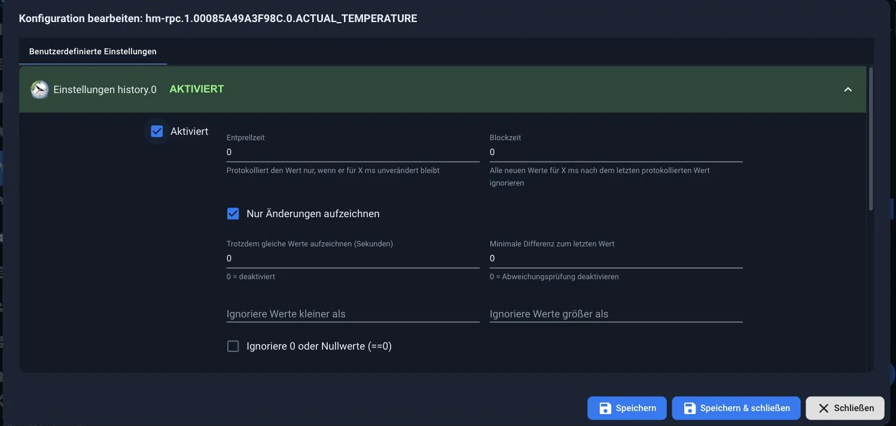
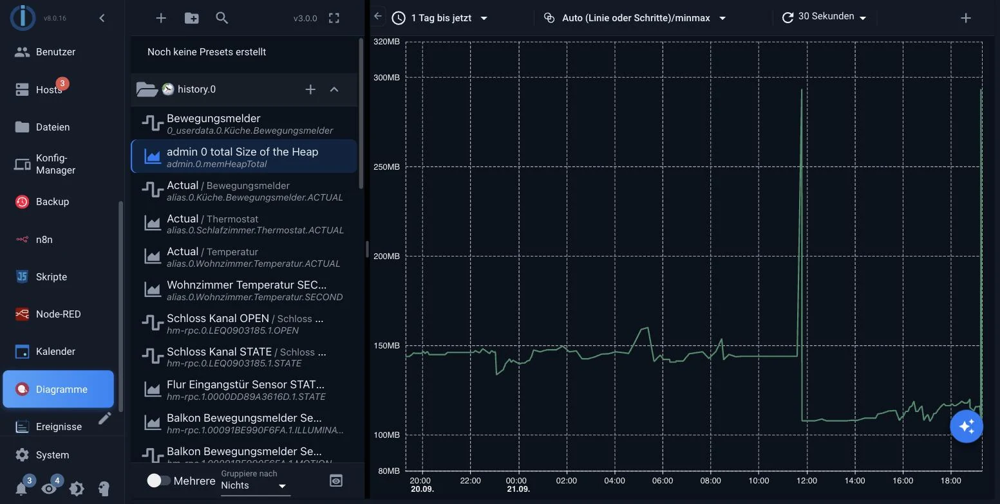

# Запись данных

Точка данных знает только свое текущее значение. Любой, кто хочет узнать, насколько тепло было прошлой ночью или сколько электроэнергии было потреблено за прошлую неделю, нуждается в адаптере, который записывает данные. Существует три таких адаптера, и решение следует принимать заранее, поскольку последующая замена потребует дополнительных усилий.

Не следует путать с двумя **внутренними** базами данных для объектов и состояний. Они поддерживают текущее состояние системы и обрабатываются с помощью [Redis](/docs/config/redis.md) . Это касается истории.


_Точка данных знает только свое текущее значение. Любой, кому нужны исторические данные, может активировать запись и выбрать, где именно они должны быть записаны._

## Что представляет собой этот курс и чего он не представляет собой.

Состояние имеет ровно одно значение: текущее. При появлении нового значения старое исчезает. База данных состояний — это лист бумаги, который всегда содержит актуальное состояние, а не брошюра, страницы которой остаются неизменными.

К устройству подключается записывающий адаптер: он отслеживает указанные вами точки данных и записывает каждое новое значение вместе с меткой времени. Только после этого выявляется тенденция, которую можно отобразить на графике.

Это приводит к четырём вещам, которые регулярно вызывают удивление:

- **Запись начинается с момента включения устройства.** Ретроспективная запись отсутствует, даже за вчерашний день.
- **Данные записываются в каждой отдельной точке.** Сама система не включается; вместо этого записывается каждое отдельное значение, которое вы хотите просмотреть позже.
- **История не хранится во внутренних базах данных.** Объекты и состояния представляют текущее состояние; история хранится в другом месте, см. [Redis](/docs/config/redis.md) .
- **Резервная копия ioBroker не включает это автоматически.** Она создает резервные копии объектов, состояний и конфигураций. Записанные значения являются отдельным элементом в [BackItUp](/docs/config/backup.md) .

В [системных настройках,](/docs/admin/settings.md) в разделе _«История по умолчанию»_ , можно увидеть, какой экземпляр предлагается в диалоговом окне или на диаграмме при запросе источника. Это настройка по умолчанию, а не записанная история: источник по-прежнему будет выбираться для каждой точки данных.

## Какой адаптер?

| адаптер      | Отложи это                              | Подходит, если                                                                                   |
| ------------ | --------------------------------------- | ------------------------------------------------------------------------------------------------ |
| **история**  | Файлы в каталоге данных ioBroker        | Небольшое количество данных, приемлемые временные рамки, дополнительные услуги не требуются.     |
| **инфлюксб** | InfluxDB — база данных временных рядов. | Многочисленные данные, собранные за годы. Обычный подход для устоявшихся систем.                 |
| **sql**      | MySQL, PostgreSQL, MS-SQL или SQLite    | Подобная база данных уже существует, или же данные предназначены для чтения другими программами. |

**Функция истории** сохраняет данные в два этапа: сначала значения сохраняются в оперативной памяти, а в файлы записываются только при достижении заданного порогового значения. Это защищает карту, но также означает, что самые последние собранные значения будут потеряны в случае отключения электроэнергии.

Файлы находятся в папке в `/opt/iobroker/iobroker-data`, не предоставляя при этом свою собственную информацию в `history`, а внутри этой папки — по одной подпапке на каждый день. Абсолютный путь, например: `/mnt/history` Это также возможно, например, на подключенном запоминающем устройстве. Местоположение данных важно для целей резервного копирования; см. ниже.

Для начала, **история** . Для этого не требуется второй сервис, а переход на InfluxDB возможен позже, см. ниже.

Запись означает перемещение данных на SD-карту, а запись расходует ресурсы SD-карты. Тем, кто регулярно записывает большие объемы данных, следует делать это не на SD-карте, а на SSD-накопителе или в базе данных на другом компьютере.

## Включать

Адаптер устанавливается, создаётся экземпляр, а затем **для каждой точки данных** принимается решение о том, следует ли её записывать. Это делается на вкладке [«Объекты»](/docs/admin/objects.md) с помощью значка шестеренки в конце строки.



_Значок шестеренки открывает это диалоговое окно. Для каждого установленного экземпляра записи здесь создается отдельный раздел; установка флажка **«Включено»** активирует точку данных и отображает приведенные ниже настройки._

Конфигурация экземпляра содержит настройки по умолчанию, применяемые к каждой вновь активированной точке данных. Эти настройки можно переопределить непосредственно в точке данных.

Запись начинается **с момента включения устройства** . Ретроспективная запись не предусмотрена.

Пошаговый процесс описан в разделе [«Запись значений»](/docs/tutorial/history.md) .

## Важные настройки

| Отношение                   | Эффект                                                                                                             |
| --------------------------- | ------------------------------------------------------------------------------------------------------------------ |
| **Запись только изменений** | Практически всегда верно. В противном случае данные генерировались бы даже тогда, когда ничего не происходит.      |
| **Минимальное отклонение**  | Запись данных начинается только при достижении этой разницы. Это позволяет исключить шум от датчика.               |
| **Время задержки**          | Блокировка происходит вскоре после операции записи. Это помогает при значениях, которые колеблются каждую секунду. |
| **хранилище**               | Как долго будут сохраняться значения? Объем памяти неограниченно увеличивается.                                    |

Полное описание всех полей можно найти в документации соответствующего адаптера: [history](/adapters/history) , [influxdb](/adapters/influxdb) , [sql](/adapters/sql) .

## Что следует записывать, а что нет.

Наиболее распространенная причина замедления работы системы через год — не недостаток вычислительной мощности, а то, что кто-то записал все данные, потому что они могут когда-нибудь понадобиться.

- **Полезно** : температура, расход, уровень заполнения, переключение состояний, возможность считывать информацию о произошедшем позже.
- **Бесполезны** : внутренние данные адаптеров, счетчики, которые уже содержат историю, и все, на что вы никогда не будете смотреть.

## Переход от адаптера истории к базе данных.

Адаптер истории включает в себя скрипты для этой цели, которые находятся в каталоге. `/opt/iobroker/node_modules/iobroker.history/converter` лежать и с `node` быть вызванным. Рекомендуемая процедура:

**1. Настройте и запустите новый целевой объект.** Сконфигурируйте новый адаптер и включите на нем те же точки данных. Убедитесь, что значения принимаются. В это время данные будут записаны дважды: один раз в историю и один раз на новый целевой объект. Это сделано намеренно, чтобы ничего не было потеряно во время миграции.

**2. Анализ существующих данных.** Скрипт анализа определяет, какие данные уже существуют в целевой системе, и сохраняет результаты в JSON-файлы. Он вызывается в каталоге конвертера:

```bash
cd /opt/iobroker/node_modules/iobroker.history/converter
node analyzeinflux.js influxdb.0 info --deepAnalyze
```

Соответственно, для базы данных SQL:

```bash
node analyzesql.js sql.0 info
```

Первый параметр — это целевой экземпляр, второй — уровень протокола. `--deepAnalyze` Кроме того, система фиксирует, какие значения уже существуют для каждого дня. Без этой информации определяется только самое раннее значение. Разница существенна, если в целевых данных уже есть пробелы, которые необходимо заполнить.

**3. Остановите и преобразуйте адаптер истории.**

```bash
node history2db.js
```

Скрипт считывает JSON-файлы из шага 2 и переносит только то, чего еще нет. Затем он продолжает запись файлов, поэтому второй запуск обычно не создает дубликатов. Его также можно вызвать без предварительного анализа; в этом случае необходимо указать начальную дату в качестве параметра, и все данные до этой даты будут преобразованы. Этот процесс может занять много времени.

**4. Только после этого следует выполнить очистку.** Как только значения в целевом объекте будут заполнены и это подтвердят журналы: удалите данные истории и деактивируйте адаптер.

Перед миграцией создайте [резервную копию](/docs/config/backup.md) . Удаляйте старые данные только после того, как новые данные будут достоверно полными, и для проверки этого сверьтесь с графиком, охватывающим длительный период времени.

Полный список параметров для трех скриптов можно найти в [документации к адаптеру истории](/adapters/history) .

## Что происходит во время срабатывания предохранителя?

Здесь распространено ошибочное мнение, которое может дорого обойтись: **резервная копия ioBroker не содержит записанных значений.** Она сохраняет объекты, состояния и файловое хранилище — то есть текущее состояние системы. История хранится в другом месте, и это относится ко всем трем адаптерам.

- В **разделе истории** файлы действительно находятся ниже... `iobroker-data` Однако эти файлы не входят в резервную копию ioBroker. При использовании абсолютного пути они в любом случае находятся вне резервной копии.
- В случае с **InfluxDB** и **SQL** данные хранятся в отдельной базе данных, зачастую даже на другом компьютере.

Поэтому [BackItUp](/docs/config/backup.md) перечисляет их как **отдельные типы резервных копий** , создаваемые в дополнение к резервной копии ioBroker: _History Data_ , _InfluxDB_ , _MySQL_ , _PostgreSQL_ и _SQLite3_ . Эти параметры **не** установлены по умолчанию.

Любой, кто записывает данные, должен также активировать соответствующий переключатель на резервном адаптере. В противном случае после восстановления будет присутствовать полностью настроенная система, в которой все схемы будут пустыми.

## Где вы используете историю

Запись — это одно, а её извлечение — совсем другое. Существует несколько способов сделать это, и все они задают один и тот же вопрос: **из какого источника** ? Любой, кто использует более одного записывающего адаптера, должен каждый раз указывать, откуда берутся значения. `history`, `influxdb` или `sql` Предлагаемый вариант можно найти в [системных настройках](/docs/admin/settings.md) в разделе _«История по умолчанию»_ .

### В виде диаграммы в административной панели.

Обычным способом. Адаптер `echarts` Это добавляет отдельную вкладку в панель администратора. Там вы создаете диаграмму, назначаете каждой линии записанную точку данных и сохраняете результат как **предустановку** . Эта предустановка затем используется для всех последующих шагов.



_Слева отображаются все точки данных, для которых ведется запись, сгруппированные по экземпляру, который их записывает. Щелчок по одной из них записывает историю. В правом верхнем углу можно установить период времени, агрегацию и частоту обновления._

Пока ничего не записывается, список слева пуст. Это самая распространенная причина, по которой невозможно построить диаграмму.

Пошаговая инструкция приведена в [разделе «Схемы»](/docs/tutorial/flot.md) .

### На отдельной странице

Сохранённый пресет можно получить доступ напрямую, без визуализации, через `web` -Адаптер:

```
http://IP:8082/echarts/index.html?preset=echarts.0.MEINE-VOREINSTELLUNG
```

Этого достаточно для настенного планшета, которому нужно лишь отобразить диаграмму, или для закладки на компьютере.

### В визуализации

Для [Vis и Vis-2 есть виджет,](/docs/viz/vis-2.md) который отображает предустановленный набор настроек. Вы выбираете его из списка; вот и все.

Кроме того, существуют виджеты, отображающие тренд вместе с данными без отдельного графика. Например, в [виджетах «Материалы»](/docs/viz/widgets-material.md) _текущее значение отображается с помощью графика_ : отображаются два измеренных значения, а тренд представлен в виде области под ними. Такие виджеты остаются пустыми до тех пор, пока точка данных не регистрируется.

### В сценарии

[JavaScript-адаптер](/docs/logic/javascript.md) считывает историю с помощью `getHistory`:

```javascript
const ende = Date.now();

getHistory(
    'history.0',
    {
        id: 'hm-rpc.0.ABC123.1.TEMPERATURE',
        start: ende - 24 * 3600000,
        end: ende,
        aggregate: 'average',
        step: 3600000,
    },
    (fehler, werte) => {
        if (fehler) {
            console.error(fehler);
            return;
        }
        werte.forEach(w => log(`${new Date(w.ts).toLocaleString()}: ${w.val}`));
    },
);
```

Если вы не укажете экземпляр, будет использоваться история по умолчанию из системных настроек. Это позволит вам получить доступ к значениям, которые не должны отображаться на графике: потребление за предыдущий месяц для отчета, суточный максимум для сравнения и показания счетчика в полночь.

### В Блокли

То же самое можно сделать и без кода. В [Blockly](/docs/logic/blockly.md) вы используете блок **\`sendTo\` ** и вводите команду как команду. `getHistory` В команде в качестве целевого объекта указывается экземпляр, а также передаются те же параметры, что и выше. Результат возвращается в виде списка.

### Отправить как изображение

`echarts` Она может отображать заданный шаблон **на сервере** и возвращать его в виде изображения без использования браузера. Это позволяет включать диаграмму в сообщения Telegram или электронные письма.

```javascript
sendTo(
    'echarts.0',
    {
        preset: 'echarts.0.MEINE-VOREINSTELLUNG',
        renderer: 'png',
        width: 1024,
        height: 300,
        theme: 'dark',
    },
    ergebnis => {
        if (ergebnis.error) {
            console.error(ergebnis.error);
            return;
        }
        // ergebnis.data ist das Bild als Base64-Adresse
    },
);
```

Формат `svg`, `png`, `jpg` и `pdf` к выборам. С `fileName` Вместо этого адаптер сохраняет изображение в файловом хранилище, используя `fileOnDisk` на жестком диске.

### С другими программами

ВОЗ `influxdb` или `sql` Значения хранятся в стандартной базе данных. **Grafana** считывает их напрямую оттуда, без участия ioBroker, и это выгодно при работе с большими объемами данных.

Для тех, кто предпочитает создавать диаграммы самостоятельно, существует адаптер [flexcharts](/adapters/flexcharts) . Он предоставляет Apache ECharts без пользовательского интерфейса: описание диаграммы создается в скрипте или в формате JSON в виде точки данных.

### Агрегация

Каждый из этих методов запрашивает эту информацию и определяет, является ли диаграмма читаемой или приводит к сбою браузера. Идея заключается в том, что временной период делится на равные сегменты, и для каждого сегмента возвращается только **одно** значение, а не все сразу.

| Агрегация    | Результаты по разделам                                                                                        |
| ------------ | ------------------------------------------------------------------------------------------------------------- |
| `average`    | Среднее значение. Обычный выбор температуры.                                                                  |
| `min`, `max` | наименьшее или наибольшее значение                                                                            |
| `minmax`     | Начальное, конечное, минимальное и максимальное значения. Также отображает выбросы, не извлекая все значения. |
| `total`      | Итого. На потребление.                                                                                        |
| `count`      | количество значений                                                                                           |
| `none`       | Без сводки, только исходные значения.                                                                         |

Размер секций указывается с помощью `step` за миллисекунды или с `count` в качестве желаемого числа. Без обоих вариантов количество разделов составит 500.

?>`none` Это заманчиво, потому что предоставляет реальные значения. За год, затраченный на поминутные измерения температуры, это более полумиллиона точек, и с таким объемом данных с трудом справляется любой браузер. Для более длительных периодов сводка просто необходима.

!> Во всех агрегациях, кроме `none` Первая и последняя точки рассчитаны на основе значений, **выходящих за рамки** рассматриваемого периода. Любой, кто будет проводить дальнейшие расчеты с использованием этих данных, например, для расчета месячной суммы, должен опустить эти две точки.