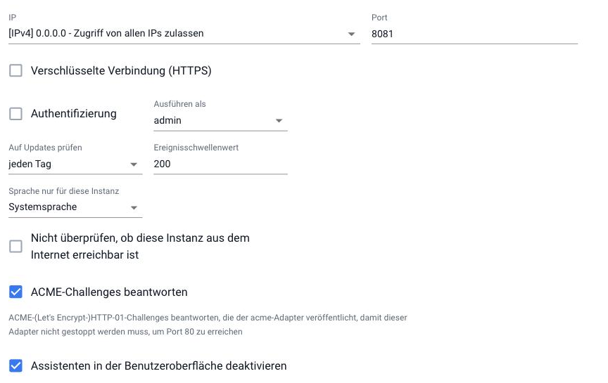
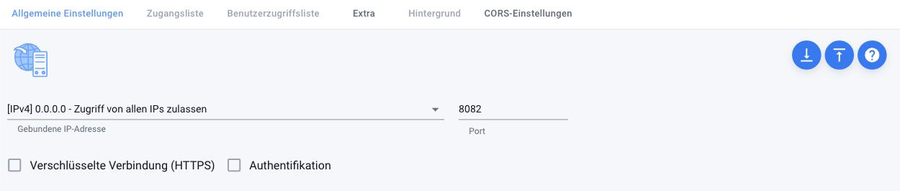

# Аутентификация
При чистой установке функция **авторизации** отключена. Любой, кто знает адрес сервера, может открыть панель администратора и всё изменить. Это удобно в защищённой домашней сети, но как только ioBroker становится доступен за пределами этой сети, это первое, что необходимо включить.

Вход в систему разрешен **для каждого экземпляра**, а не для всей системы в целом. Каждый интерфейс имеет свой собственный веб-сервер и, следовательно, свой собственный коммутатор: административный, каждый экземпляр `web`, `vis` через связанный экземпляр `web` и так далее. Пользователи и группы везде одинаковы, см. [Управление доступом](/docs/config/userrights.md).

Администратор
На вкладке **Экземпляры** значок гаечного ключа в поле `admin.0` открывает конфигурацию:

Важны две области:

| Поле | Значение |
| --- | --- |
| **Аутентификация** | Включает экран входа в систему. Если флажок не установлен, любой может войти в систему без пароля. |
| **Запуск от имени** | Определяет, чьи права используются, когда нет активного входа в систему. По умолчанию используется `admin`, т.е. полный доступ. |

Продолжить:

1. На вкладке [Пользователи] (/docs/admin/users.md)

Присвойте пользователю `admin` пароль. **Не включайте аутентификацию заранее**, иначе войти в систему будет невозможно.

2. Запишите пароль, прежде чем продолжить.
3. В настройках `admin.0` установите флажок **Аутентификация**.

Установите и сохраните. Экземпляр перезапустится.

4. Перезагрузите страницу. Теперь появится форма регистрации.

Если вы заблокировали себе доступ, может помочь командная строка. Команда `iobroker set admin.0 --auth false` снова отключает вход в систему. Эта же команда также имеет ``--secure`` для HTTPS и ``--ttl`` для периода действия авторизации в секундах. Все команды перечислены в разделе `[CLI](/docs/config/cli.md)`.

Остальные поля на этой странице не имеют отношения к авторизации: **IP-адрес** и **порт** определяют, на каком сервере администратор прослушивает соединение, **зашифрованное соединение (HTTPS)** относится к [Шифрование](/docs/config/encryption.md), а **ответ на запросы ACME** необходим адаптеру `acme` для получения сертификата Let's Encrypt без остановки администратора.

На вкладке **Доступ к экземплярам (простой режим)** вы можете дополнительно ограничить доступ к страницам конфигурации экземпляров и разрешить их открытие определенным пользователям.

## Веб-адаптер
В разделе `web.0` переключатель называется **Аутентификация** и расположен непосредственно рядом с модулем шифрования:

Пока функция авторизации отключена, вкладки **Список доступа** и **Список доступа пользователей** неактивны (заблокированы). При включенной авторизации они становятся доступными и позволяют дополнительно ограничить доступ к отдельным страницам и пользователям.

Тем, кому нужен доступ только к vis, следует разрешить вход в систему через экземпляр `web`, под которым работает vis. У самого vis нет собственного веб-сервера.

## Что нужно проверить дальше
Теперь адаптеры, самостоятельно обращающиеся к одному из этих интерфейсов, требуют учетных данных для входа. Это в первую очередь затрагивает внешние подключения и скрипты, обращающиеся к `web` по протоколу HTTP. Поэтому после перехода проверьте [протокол](/docs/admin/log.md) и следите за сообщениями об отклоненных запросах.

Простого входа в систему недостаточно, если ioBroker доступен из интернета.

В противном случае пароль передается в незашифрованном виде. В этом случае необходимо использовать [Шифрование](/docs/config/encryption.md), или, что еще лучше, метод через [адаптер для Интернета вещей](/docs/cloud/iot.md), который не требует открытия каких-либо портов.