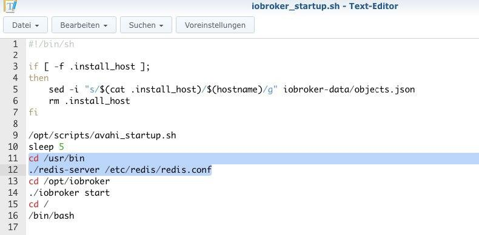

# Подключение базы данных Redis в ioBroker

@@@ Где взять Redis, как его установить, как его активировать, как его проверить? @@@

**Redis** - это высокопроизводительная база данных, которая хранит все данные в памяти. 
Может использоваться как сервер баз данных, кэш, сервер очередей и хранилище сообщений.
Программа написана на языке программирования Си и имеет библиотеки для использования в разных языках программирования.

## Установка Redis в Linux ОС.
Команды выполняются от суперпользователя **root** , 
если команды выполняются от пользователя то выполнить все команды через **sudo**.

```
apt-get update
apt-get install redis-server
```

После завершения установки и запуска проверим работу установленного сервиса:

```
redis-cli ping
```

В случае успешной установки в ответ придет текст - PONG, если сервис не установился или не запустился,
на экран будет выведена ошибка, о невозможности подключится к сервису или отсутствии команды redis-cli.

Если Redis сервер установлен и запустился, то он будет ожидать подключение на локальном интерфейсе 127.0.0.1 (localhost),
порт стандартный - 6379.

Для автозапуска  **redis-server** после перезагрузки необходимо внести правки в файл **iobroker-startup.sh**.
Файл находится по пути `opt/scripts/`



```
cd /usr/bin
./redis-server /etc/redis/redis.conf
```

Можно сделать автозагрузку ioBroker при помощи скрипта.

```
wget -O /etc/init.d/redis-server https://gist.github.com/lsbardel/257298/raw/d48b84d89289df39eaddc53f1e9a918f776b3074/redis-server-for-init.d-startup
chmod 755 /etc/init.d/redis-server
update-rc.d redis-server defaults
```

## Подключаем Redis в ioBroker.

После успешной настройки **redis-server** останавливаем ioBroker.
И запускаем настройку:

```
iobroker stop
iobroker setup custom
```

Будет построчно выводится предложение изменить настройки,
соглашаемся со всеми настройками по-умолчанию нажав  ↩️ **Enter**,
кроме 4-ой строки `Type of states DB [file, redis], default [file]:`
здесь необходимо ввести **redis**

```
Type of objects DB [file, couch, redis], default [file]:
Host of objects DB(file), default[127.0.0.1]:
Port of objects DB(file), default[9001]:
Type of states DB [file, redis], default [file]: redis
Host of states DB (redis), default[127.0.0.1]:
Port of states DB (redis), default[6379]:
Data directory (file), default[../../../iobroker-data/]:
Host name of this machine [FastPC]:
creating conf/iobroker.json
```

Если необходимо вернуть настройки по-умолчанию, после команды 

```
iobroker setup custom
```

соглашаемся со всеми настройками по-умолчанию нажав  ↩️ **Enter**

## Запускаем ioBroker.

```
iobroker start
```
