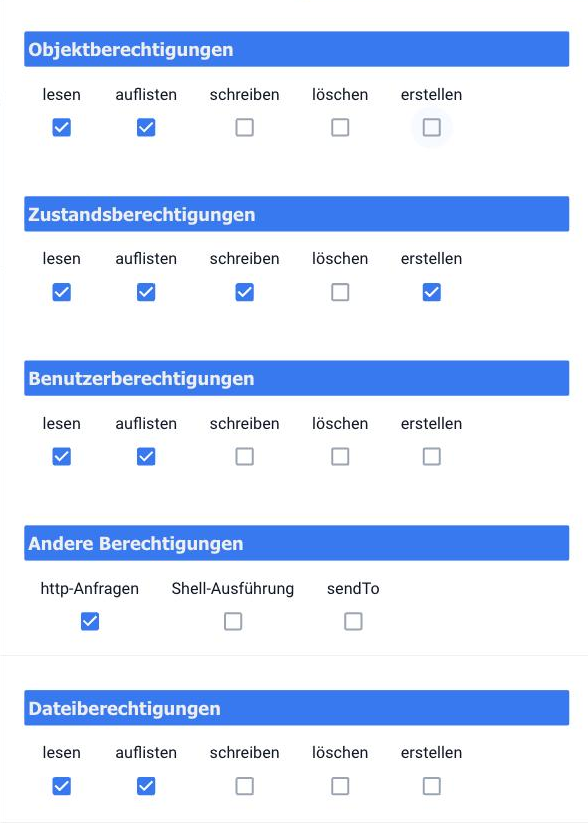

# Управление доступом пользователей и групп.

Те, кто регистрируется в ioBroker, делают это следующим образом: **пользователь**Действия, разрешенные этому пользователю, определяются двумя факторами одновременно: **права его групп** и
**Права доступа к отдельному объекту**Оба должны разрешить то, что он намеревается сделать. Если один из них запретит это, ничего не произойдет.

Эти пользователи не являются пользователями операционной системы. Они применяются только внутри ioBroker: для входа в административный интерфейс, vis и веб-адаптеры. Они создаются на соответствующей вкладке.
[пользователь](/docs/admin/users.md).

## Две существующие группы

| группа                                           | Предназначено для                                                         |
| ------------------------------------------------ | ------------------------------------------------------------------------- |
| **Администратор** (`system.group.administrator`) | Полный доступ. Здесь находится пользователь. `admin`.                     |
| **пользователь** (`system.group.user`)           | Ежедневная эксплуатация: переключение и чтение, без каких-либо изменений. |

Пользователь может принадлежать к нескольким группам. В этом случае его права представляют собой сумму прав всех групп.

## Что разрешено делать группе

В всаднике **пользователь** Карандаш открывает окно редактирования группы, всадника. **Разрешения** показывает права:

Пять блоков, каждый с одинаковыми пятью правами:

| блокировать                    | Что это относится к                                              |
| ------------------------------ | ---------------------------------------------------------------- |
| **Права доступа к объектам**   | Описание элемента данных: имя, роль, подразделение, назначения.  |
| **Статус авторизации**         | Само значение. Переключение — это доступ на запись в состояние.  |
| **Права доступа пользователя** | Управление пользователями и группами.                            |
| **Другие разрешения**          | `http-Anfragen`, `Shell-Ausführung` и `sendTo`.                  |
| **Права доступа к файлам**     | Хранилище файлов, то есть все, что находится на вкладке «Файлы». |

Пять прав означают: **читать** получить по отдельности **список** Даже просто увидеть, что что-то существует, **писать** изменять, **удалить** удалять,
**создавать** Создайте новый.

Группа _пользователь_ Заводские настройки рассчитаны на повседневное использование:

| блокировать  | Допустимый                                   |
| ------------ | -------------------------------------------- |
| объекты      | читать, список                               |
| Условия      | читать, составлять списки, писать, создавать |
| пользователь | читать, список                               |
| Другой       | только `http-Anfragen`                       |
| файлы        | читать, список                               |

Это позволяет такому пользователю видеть всё и управлять устройствами, но не изменять объекты и не запускать скрипты. `sendTo` Не запускайте процесс и не вводите никаких команд оболочки.

!> `Shell-Ausführung` Это означает, что скрипты, созданные этим пользователем, имеют право выполнять команды в операционной системе. Это право принадлежит только группе администраторов.

## Права на индивидуальный объект

Каждый объект имеет собственные права доступа, аналогичные правам доступа к файлу в Linux. Эти права отображаются в файле. **Экспертный режим**: всадник
[объекты](/docs/admin/objects.md) Затем в него добавляется столбец, содержащий, например, трехзначное число. `664`. При нажатии на него открывается список контроля доступа:

Вверху находятся **Владелец-Пользователь** и **Группа владельцев**включая права, разделенные по объектам и государствам, и для каждой из трех ролей:

- **Владелец**: зарегистрированный пользователь.
- **группа**: кто входит в зарегистрированную группу.
- **Каждый**: все остальные зарегистрированные пользователи.

Эти три числа точно отражают эти три роли. Чтение имеет значение. `4`, Писать `2`, следовательно, вместе `6`. `664` Это означает, что владелец и группа имеют право читать и писать, все остальные могут только читать.

Стол **Применить к объекту и его подобъектам.** Это применяет настройку ко всему поддереву. Это удобный способ, например, установить для всего пространства имен адаптера режим «только для чтения».

Какие права? **недавно созданный** Получение объектов указано в
[Системные настройки](/docs/admin/settings.md)
под _Стандартная передняя крестообразная связк&#x430;_&#x414;анная настройка не изменяет существующие объекты.

## Создать пользователя с ограниченными правами.

Обычно ситуация следующая: пользователь должен иметь возможность работать с визуализацией, но не иметь возможности ничего изменять в системе.

1. В всаднике **пользователь** Создайте пользователя и назначьте ему пароль.
2. Включите его в группу. **пользователь** тянуть, а не в **Администратор**.
3. В [аутентификация](/docs/config/login.md)
   Включите авторизацию для соответствующего веб-адаптера.
4. Войдите в систему под этим пользователем и проверьте, действительно ли работает только то, что должно работать.

Группа достаточна. _пользователь_ Если группа не выбрана, создается отдельная группа, которой назначаются только необходимые разрешения. Если требуется дополнительно ограничить доступ к определенной области, это делается через права доступа объекта.

!> Перед переключением,
[Резервная копия](/docs/config/backup.md) Творите. Любой, кто сам себя лишает правами, сможет выбраться только через...
[командная строка](/docs/config/cli.md) обратно внутрь.