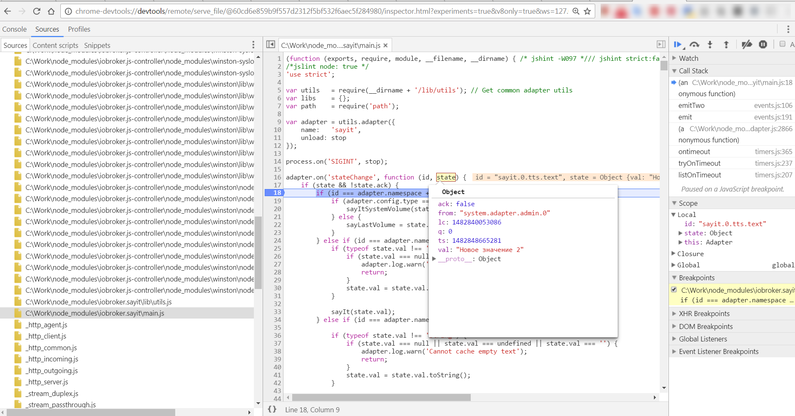

# Адаптеры отладки
## Отладка адаптеров с помощью Chrome
Node.JS поддерживает отладку с помощью Chrome.

Если вы остановите адаптер в ioBroker, а затем запустите его из консоли (CLI) следующим образом:

```
cd /opt/iobroker
iobroker stop sayit
node --inspect node_modules/iobroker.sayit/main.js --debug
```

Важно `-–inspect`

Затем выводится что-то вроде этого:

```
Debugger listening on port 9229.
Warning: This is an experimental feature and could change at any time.
To start debugging, open the following URL in Chrome:
    chrome-devtools://devtools/remote/serve_file/@60cd6e859b9f557d2312f5bf532f6aec5f284980/inspector.html?experiments=true&v8only=true&ws=127.0.0.1:9229/9415dda6-0825-40ed-855c-83c6142e56e9
2016-12-27 15:23:02.637  - error: sayit.0 adapter disabled
starting. Version 1.3.1 in /opt/iobroker/node_modules/iobroker.sayit, node: v6.9.2
2016-12-27 15:23:02.647  - info: sayit.0 starting. Version 1.3.1 in /opt/iobroker/node_modules/iobroker.sayit, node: v6.9.2
Debugger attached.
```

После этого вы можете отлаживать Chrome, введя ссылку в Chrome:



*Протестировано: Windows, Chrome 55, node.js 6.9.2*

### Удаленная отладка с помощью Chrome
Если iobroker не работает на той же машине, что и браузер Chrome, то команда основана на приведенном выше примере:

```
node --inspect-brk=0.0.0.0:9229 node_modules/iobroker.sayit/main.js --debug
```

параметр `--inspect-brk` обеспечивает, по сравнению с приведенным выше,

что точка останова установлена в первой строке вашего адаптера прямо при запуске отладчика.

Если вы не всегда хотите копировать ссылку для запуска отладки по отдельности, вы также можете вызвать следующую страницу в хроме:

```
chrome://inspect
```

затем введите IP-адрес и порт вашего **компьютера ioBroker** один раз через Конфигурацию точно так же, как с командой Inspect.

Затем сеанс отладки отображается там после запуска команды и может быть запущен одним щелчком мыши.

Возможности отладки Chrome просто фантастические.
У вас есть все возможности, которые вы знаете из **веб-отладки**: точки останова, а также с условиями, `watch`, `call stack`, `scope inspection`, вывод на консоль и т. д.

Изображения и описание на английском языке можно найти в [здесь](https://software.intel.com/en-us/xdk/articles/using-chrome-devtools-to-debug-your-remote-iot-nodejs-application).

Если он еще не установлен, на компьютере ioBroker требуется инспектор узлов:

```
npm install -g node-inspector
```

Обычно инспектор узлов автоматически устанавливается вместе с ioBroker.

## Отладка с помощью WebStorm
## Отладка с помощью `Visual Studio Code`
Если вы открываете каталог с помощью `VS Code`, то после открытия каталога адаптера (меню `File=>Open folder...`) вы можете отлаживать адаптер.

Конфигурация в файле `.vscode/launch.js` должна выглядеть так:

```
{
    "version": "0.2.0",
    "configurations": [
        {
            "type": "node",
            "request": "launch",
            "name": "Launch Program",
            "program": "${workspaceFolder}\\main.js",
            "args": ["--debug"]
        },
        {
            "name": "Attach to Process",
            "type": "node",
            "request": "attach",
            "address": "IO_BROKER_IP_ADDRESS",
            "port": 9229
          }
    ]
}
```

### Локальная отладка
После остановки адаптера (`iobroker stop ADAPTER_NAME`) вы можете запустить адаптер в VS Code: 

После выбора `Launch Program` и нажатия кнопки `Play` адаптер запускается, и вы можете выполнять отладку локально.

### Удаленная отладка
Для этого нужно запустить адаптер именно на сервере ioBroker.

```
d /opt/iobroker
obroker stop ADAPTERNAME
ode --inspect-brk=0.0.0.0:9229 node_modules/iobroker.ADAPTERNAME/main.js --debug
```

После этого можно подключить `VS Code` к процессу (`attach`).


