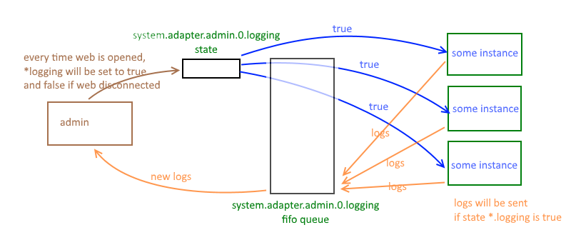

## Транспортер бревен
Если вы хотите подписаться на определенные или все журналы адаптеров ioBroker, вы можете использовать **logTransporter** Для активации в вашем адаптере добавьте `"logTransporter": true` к общей структуре вашего `io-package.json`.<br><br> Затем в коде вашего адаптера (например, в файле `main.js`) вам нужно будет вызвать `requireLog(true)` для активации. Как только для requireLog () установлено значение true, вы можете использовать `on('log', callback)` для подписки на все новые журналы, поступающие от адаптеров. Функция обратного вызова возвращает все журналы со следующим объектом (пример):

```
{from:'testlog.0', message: 'testlog.0 (12504) adapter disabled', severity: 'error', ts:1585413238439}
```

Полный пример из `main.js`:

```
    adapter.requireLog(true);
    adapter.on('log', function(logObject) {
        // Here we have the log in "logObject" and can handle it accordingly.
        const severity = logObject.severity; // the log level (severity): info, warn, error, etc.
        // ....
});
```

## Исходная информация
Есть специальный тип адаптеров, потребляющих логи. Обычно все адаптеры записывают свои сообщения в файл журнала с помощью регистратора.
Но некоторые адаптеры должны отображать журналы или хранить их в другом месте.

Для создания такого типа адаптера он должен иметь флаг **logTransporter** в общей структуре.

Если такой флаг присутствует, adapter.js автоматически создает для него особое состояние - «system.adapter.adapterName.X.logging».
Для этой переменной адаптер logTransport должен установить значение true, если этот адаптер хочет получать журналы.

"system.adapter.adapterName.X.logging" - это очередь fifo списка типов redis.

Другие адаптеры отслеживают все переменные "* .logging" и записывают в соответствующие списки сообщения журнала.
Список ограничен 1000 сообщениями (по умолчанию).

Экземпляр logTransport получает событие «журнал» с сообщением.

Для управления состоянием «system.adapter.adapterName.X.logging» адаптер должен использовать функцию *requireLog* Например. ```adapter.requireLog(true);```, чтобы разрешить получение журналов.



Функциональность реализована в *adapter.js* и разработчик должен просто установить общий флаг *logTransporter* и вызвать *requireLog ()*

Функциональность для адаптеров, отличных от logTransport, реализована в *adapter.js* и разработчику это не нужно.