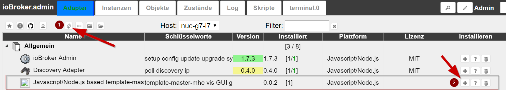
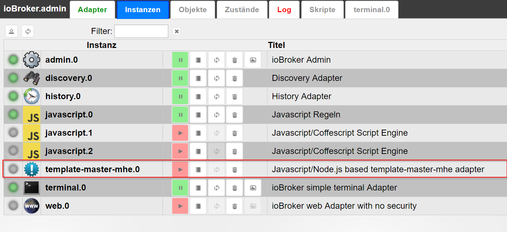
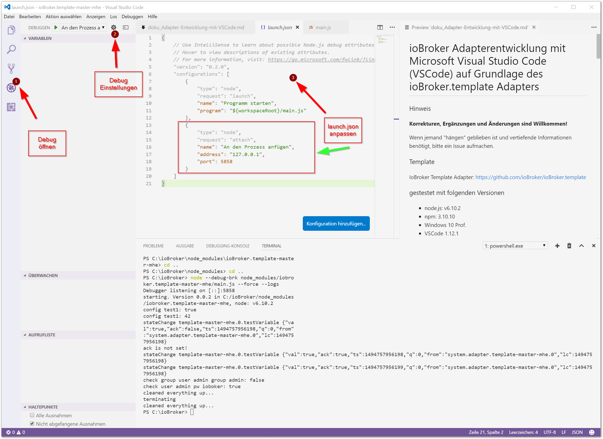
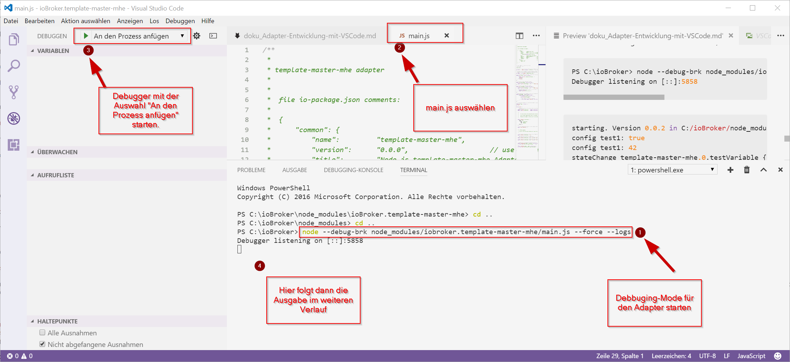

# VS Code

Разработка адаптера ioBroker с использованием Microsoft Visual Studio Code (VSCode) на основе адаптера ioBroker.template.

Исправления, дополнения и изменения приветствуются!

Данная документация создана без предварительного опыта использования VS Code в сочетании с node.js/ioBroker. Если подход нуждается в улучшении, буду благодарен за любые предложения.

Возможные проблемы: Если у кого-то возникнут трудности и потребуется более подробная информация, пожалуйста, создайте заявку, чтобы документацию можно было дополнить и уточнить.

В примерах имя адаптера следующее: **iobroker.template-master-mhe**.

## Шаблон

Адаптер шаблонов ioBroker: <https://github.com/ioBroker/ioBroker.template>

## протестировано в следующей среде

- ioBroker, установлен локально
- ioBroker.js-controller: 1.0.0
- node.js: v6.10.2
- npm: 3.10.10
- Windows 10 Pro.
- VSCode 1.12.1

## Сопутствующая информация о разработке адаптеров в целом и с использованием VSCode.

- [Форум ioBroker: Отладка адаптеров с помощью VS Code](http://forum.iobroker.net/viewtopic.php?f=20\&t=4564\&p=61310\&hilit=visual+studio+code#p44156)
- [Шаблон адаптера ioBroker на GitHub](https://github.com/ioBroker/ioBroker.template#iobrokertemplate)
- Общая информация о разработке адаптеров на немецком языке: [ioBroker AdapterDev User Meeting 2017.pdf](http://forum.iobroker.net/download/file.php?id=11259)  от [Аполлон77](http://forum.iobroker.net/memberlist.php?mode=viewprofile\&u=378).
- [Документация по разработке адаптера ioBroker](https://github.com/ioBroker/ioBroker/wiki/Adapter-Development-Documentation)
- [Первые шаги в разработке адаптера на примере IDE Webstrom.](https://github.com/ioBroker/ioBroker/wiki/Installation,-setup-and-first-steps-with-an-ioBroker-Development-Environment)

## Общая процедура — используйте шаблон для адаптера.

### 1. Скачать шаблон

- <https://github.com/ioBroker/ioBroker.template#iobrokertemplate>
  - Выполните там шаг 1, например: извлеките и сохраните шаблон в папке.

### 2. Запустите команду "npm install" в папке

- Устанавливает необходимые модули npm в копию шаблона.
- Папка node-modules будет создана заново в папке template.
- <https://github.com/ioBroker/ioBroker.template#iobrokertemplate>
  - Выполните пункт 2 там.)

### 3. Выполняется Grunt // изменяет настройки шаблона в существующем проекте

- <https://github.com/ioBroker/ioBroker.template#iobrokertemplate>
  - Выполните пункт 3 там.)
- Установите Grunt глобально, если он еще не установлен.
- Выполните в терминале:

```
grunt rename --name=template-master-mhe --email=iobroker@digheim.de --author="Michael Herwig"
```

- Имя адаптера, автор и адрес электронной почты изменяются в необходимых местах кода с помощью Grunt.

### 4. Загрузите папку адаптера в VS Code.

- Измените название папки. В этом примере замените ioBroker.template-master на iobroker.template-master-mhe.
- VS Code: Открыть файл/папку // или **CTRL+K, CTRL+O**

### 5. В VSCode версия шаблона была изменена (с 0.5.0 на 0.0.2).

- Изменено в файле io-package.json с 0.5.0 на 0.0.2 // используется ioBroker
- Изменено в файле package.json с 0.5.0 на 0.0.2 // используется npm

### 6. Скопировано в ioBroker, путь/имя скорректированы.

- **Путь:** .../iobroker/node\_modules
- **Имя:** ioBroker.template-master-mhe
- <https://github.com/ioBroker/ioBroker.template#iobrokertemplate>
- (См. пункт 5.)

### 7. Закройте папку в VS Code.

- VS Code: Закрыть файл/папку // или **CTRL+KF**

### 8. ioBroker/Admin -> Выполнить обновление

- В административном интерфейсе ioBroker нажмите кнопку «Обновить».

### 9. Адаптер выбран и экземпляр добавлен.

- В административном интерфейсе ioBroker нажмите на знак плюса рядом с адаптером.
  

- Экземпляр адаптера установлен и отображается.
  

- Остановите установленный адаптер для отладки.

### 10. Откройте установленную папку ioBroker в VS Code.

- VS Code: Открыть файл/папку // или **CTRL+K, CTRL+O**
- **../node\_modules/iobroker.template-master-mhe** выбирать
- Теперь можно приступать к разработке и отладке адаптера.

---

## Отлаживать

### 1.) Отредактируйте файл launch.json в VSCode.

Настройки необходимо задать один раз для всех адаптеров.

- **Shift+CTRL+P**а затем введите следующее: >debug launch.json
- или через поверхность: щелкните значок жука на боковой панели, а затем значок шестеренки вверху.



Настройки launch.json для отладки адаптеров ioBroker:

```javascript
{
    // Use IntelliSense to learn about possible Node.js debug attributes.
    // Hover to view descriptions of existing attributes.
    // For more information, visit: https://go.microsoft.com/fwlink/?linkid=830387
    "version": "0.2.0",
    "configurations": [
        {
            "type": "node",
            "request": "launch",
            "name": "Programm starten",             // Name, der im VSCode Auswahlmenü neben dem grünen Play angezeigt wird
            "program": "${workspaceRoot}/main.js"
        },
        {
            "type": "node",
            "request": "attach",
            "name": "An den Prozess anfügen",       // Name, der im VSCode Auswahlmenü neben dem grünen Play angezeigt wird
            "address": "127.0.0.1",                 // Adresse, an dem der node.js Prozess läuft (bei Remote Debug, der Remote-Rechner)
            "port": 5858                            // Port, auf dem der node.js Debugger lauscht, der mit node --debug-brk ... gestartet wird
        }
    ]
}
```

- **Удалённая отладка** Также можно использовать удалённый ioBroker. В этом случае IP-адрес необходимо изменить с 127.0.0.1.

### 2.) Откройте терминал и запустите отладчик.

- **CTRL+ö** // Открывает встроенный терминал (сочетание клавиш зависит от операционной системы и версии VS Code)

- Остановите только что установленный адаптер в терминале.

  ```
    cd /opt/iobroker
    iobroker stop template-master-mhe
  ```

- Запустите отладчик в терминале (для удаленной отладки необходимо предварительно установить соединение по SSH в терминале):

  ```
    node --debug-brk node_modules/iobroker.template-master-mhe/main.js --force --logs
  ```

  Где **iobroker.template-master-mhe** Название адаптера...

Отображение на встроенном терминале (Примечание: также можно использовать внешнюю терминальную программу):

```cmd
PS C:\ioBroker> node --debug-brk node_modules/iobroker.template-master-mhe/main.js --force --logs
Debugger listening on [::]:5858
```



Вывод в терминале после запуска отладчика:

```cmd
starting. Version 0.0.2 in C:/ioBroker/node_modules/iobroker.template-master-mhe, node: v6.10.2
config test1: true
config test1: 42
stateChange template-master-mhe.0.testVariable {"val":true,"ack":false,"ts":1494753342714,"q":0,"from":"system.adapter.template-master-mhe.0","lc":1494753342714}
ack is not set!
stateChange template-master-mhe.0.testVariable {"val":true,"ack":true,"ts":1494753342715,"q":0,"from":"system.adapter.template-master-mhe.0","lc":1494753342714}
stateChange template-master-mhe.0.testVariable {"val":true,"ack":true,"ts":1494753342715,"q":0,"from":"system.adapter.template-master-mhe.0","lc":1494753342714}
check group user admin group admin: false
check user admin pw ioboker: true
stateChange template-master-mhe.0.testVariable {"val":null,"ack":true,"ts":1494753367809,"q":0,"from":"system.adapter.template-master-mhe.0","lc":1494753367809}
```

- с **CTGF+C** Отмена в терминале

Вывод в терминале после остановки отладчика:

```cmd
cleaned everything up...
terminating
cleaned everything up...
PS C:\ioBroker>
```

- В VS Code перейдите в раздел «Отладка», в меню «Отладка» выберите «Подключиться к процессу» и запустите процесс.
- Вывод осуществляется во вкладке «Терминал» встроенного терминала.
- Отменить в терминале с помощью CTGF+C

---

## Опыт

- Значок адаптера шаблона был адаптирован (переименован) в соответствии с рекомендациями Grunt, но не отображается в ioBroker/Admin.
- Правильная иконка отобразится только после освобождения адаптера.

---

### сделать

- Использование VSCode с GitHub
- Пример использования пользовательского адаптера
- Уточните: отладка возможна только с Node.js > 6.x или также возможна отладка для версии 4.x?

---

### Документация в интернете

#### в Visual Studio Code

- [Базовая статья о VS Code](https://www.microsoft.com/germany/techwiese/know-how/visual-studio-code-01-die-grundlagen.aspx)

#### в Node.js

#### в Git и Github

- [Git Book — бесплатное вводное пособие по Git.](https://git-scm.com/book/de/v1)
- [Git для Windows — страница загрузки](https://git-scm.com/download/win)

---

## Общие советы и рекомендации

### SSH с Windows

- [Git для Windows — страница загрузки](https://git-scm.com/download/win) Устанавливает bash, что позволяет использовать ssh с помощью openSSH.

---

## Разнообразный

- Мои настройки в файле settings.json для VS Code:

```
// Platzieren Sie Ihre Einstellungen in dieser Datei, um die Standardeinstellungen zu überschreiben.
{
    "window.zoomLevel": 0,
    "editor.minimap.enabled": true,                 // zeigt die kleine Codeübersichtskarte rechts neben dem Code an
    "editor.dragAndDrop": true,                     // ermöglicht markierte Codeteile per Drag und Drop zu verschieben0
    "workbench.editor.closeOnFileDelete": false,
    "files.autoSave": "afterDelay",                 // Auotmatisches Speichern der Dateien einstellen
    "files.autoSaveDelay": 1000,                    // Autosave nach 1000 ms
    "[javascript]": {},                             // Einstellungen für die SPrache "Javascript"
    "telemetry.enableCrashReporter": false,         //
    "workbench.colorTheme": "Quiet Light",          // Farbschema des Editors
    "telemetry.enableTelemetry": false,
    "workbench.iconTheme": "vs-seti",               // Icons für bekannte Dateieendungen. Wenn ja, welches Icon-Set soll verwendet werden
    "javascript.implicitProjectConfig.checkJs": true
}
```