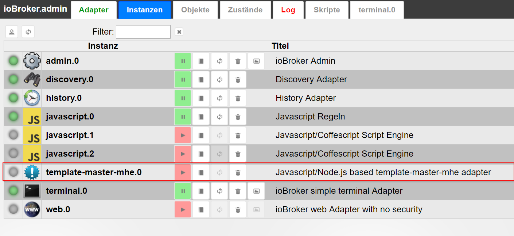
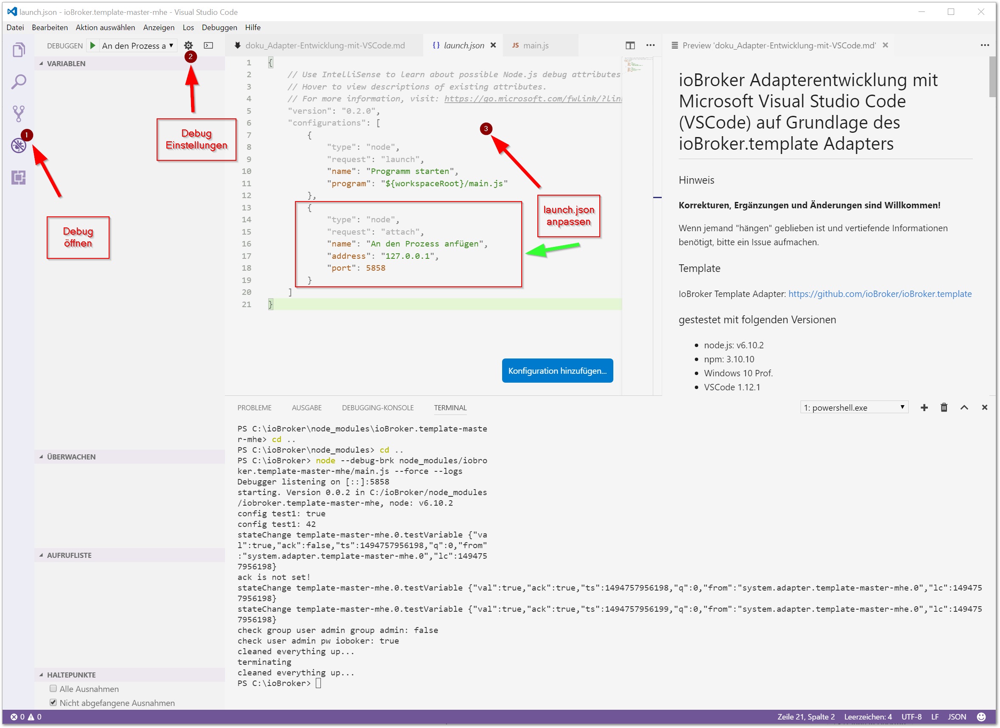
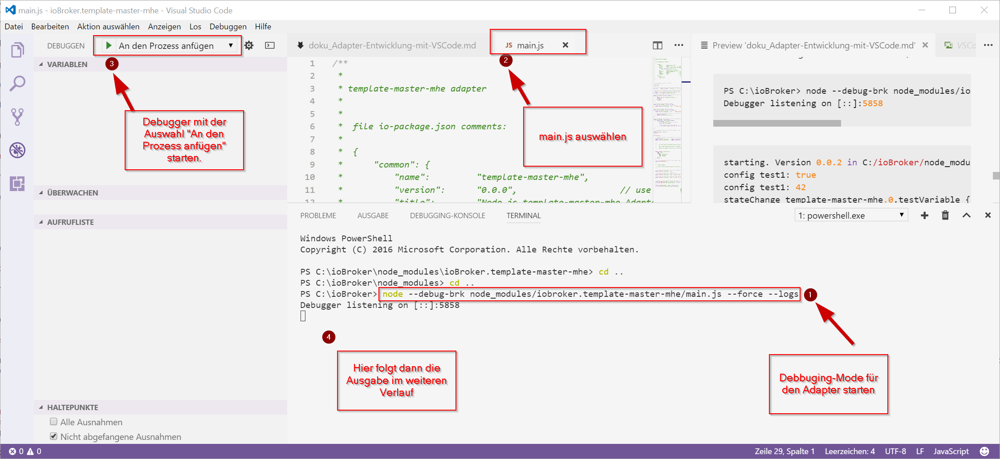

# Код ВС
Разработка адаптера ioBroker с помощью Microsoft Visual Studio Code (VSCode) на основе адаптера ioBroker.template

!> Исправления, дополнения и изменения приветствуются!

Документация создана без опыта работы с VSCode в связи с node.js/ioBroker. Если процедура нуждается в улучшении, я был бы признателен за любую подсказку.

Камни преткновения: Если кто-то "застрял" и нуждается в более подробной информации, пожалуйста, откройте вопрос, чтобы документацию можно было дополнить и уточнить.

Имя адаптера в примерах — **iobroker.template-master-mhe**.

## Шаблон
Адаптер шаблона ioBroker: [https://github.com/ioBroker/ioBroker.template](https://github.com/ioBroker/ioBroker.template)

## Проверено в следующей среде
- ioBroker, установлен локально
- Контроллер ioBroker.js: 1.0.0
- узел.js: v6.10.2
- нпм: 3.10.10
- Виндовс 10 проф.
- VSCode 1.12.1

## Сопроводительная информация для разработки адаптера в целом и с VSCode
- [Форум ioBroker: Отладка адаптеров с помощью VSCode](http://forum.iobroker.net/viewtopic.php?f=20&t=4564&p=61310&hilit=visual+studio+code#p44156)
- [Шаблон адаптера ioBroker на Github](https://github.com/ioBroker/ioBroker.template#iobrokertemplate)
- Общая информация о разработке адаптера на немецком языке: [ioBroker AdapterDev Usertreffen 2017.pdf](http://forum.iobroker.net/download/file.php?id=11259) из [Apollon77](http://forum.iobroker .net/memberlist.php?mode=viewprofile&u=378).
- [Документация по разработке адаптеров ioBroker] (https://github.com/ioBroker/ioBroker/wiki/Adapter-Development-Documentation)
- [Первые шаги разработки адаптера на примере Webstrom IDE](https://github.com/ioBroker/ioBroker/wiki/Installation,-setup-and-first-steps-with-an-ioBroker-Development-Environment )

## Общая процедура - использование шаблона для адаптера
### 1. Скачать шаблон
- [https://github.com/ioBroker/ioBroker.template#iobrokertemplate](https://github.com/ioBroker/ioBroker.template#iobrokertemplate)
    - выполнить пункт 1.) там, например: распаковать и сохранить шаблон в папку

### 2. Запустите «npm install» в папке
- устанавливает необходимые модули npm в копию шаблона
- Папка node-modules создается в папке шаблона
- [https://github.com/ioBroker/ioBroker.template#iobrokertemplate](https://github.com/ioBroker/ioBroker.template#iobrokertemplate)
    - выполнить пункт 2.) там

### 3. выполненный grunt // меняет настройки в шаблоне в существующем проекте
- [https://github.com/ioBroker/ioBroker.template#iobrokertemplate](https://github.com/ioBroker/ioBroker.template#iobrokertemplate)
    - выполнить пункт 3.) там
- Установите grunt глобально, если он еще не установлен
- запустить в терминале:

```
grunt rename --name=template-master-mhe --email=iobroker@digheim.de --author="Michael Herwig"
```

- Имя адаптера, автор и адрес электронной почты изменены через grunt в нужных местах кода

### 4. Загрузите папку адаптера в VSCode
- Настроить имя папки. Вот на примере ioBroker.template-master в iobroker.template-master-mhe
- VSCode: открыть файл/папку // или **CTRL+K, CTRL+O**

### 5. Скорректирована версия шаблона в VSCode (с 0.5.0 на 0.0.2)
- изменен в io-package.json с 0.5.0 на 0.0.2 // используется ioBroker
- изменен в package.json с 0.5.0 на 0.0.2 // используется npm

### 6. скопировано в ioBroker и скорректировано путь/имя
- **Путь:** .../iobroker/node_modules
- **Имя:** ioBroker.template-master-mhe
- [https://github.com/ioBroker/ioBroker.template#iobrokertemplate](https://github.com/ioBroker/ioBroker.template#iobrokertemplate)
- там пункт 5.)

### 7. Закрыть папку в VSCode
- VSCode: закрыть файл/папку // или **CTRL+K F**

### 8. ioBroker/Admin -> обновить
- нажмите «Обновить» в графическом интерфейсе администратора ioBroker.

### 9. Выбрал адаптер и добавил экземпляр
- в графическом интерфейсе администратора ioBroker нажмите плюс на адаптере


- Экземпляр адаптера установлен и отображается



- Остановить установленный адаптер для отладки

### 10. Откройте папку с установленным ioBroker в VSCode
- VSCode: открыть файл/папку // или **CTRL+K, CTRL+O**
- Выберите **../node_modules/iobroker.template-master-mhe**
- адаптер теперь можно разрабатывать и отлаживать здесь

---

## Отладка
### 1.) Адаптировать VSCode launch.json
Уникальными для всех адаптеров должны быть настройки

- **SHIFT+CTRL+P**: и затем введите: >debug launch.json
- или через графический интерфейс редактора: на жуке, а затем на шестеренке вверху



Настройки launch.json для отладки адаптеров ioBroker:

```javascript
{
    // Use IntelliSense to learn about possible Node.js debug attributes.
    // Hover to view descriptions of existing attributes.
    // For more information, visit: https://go.microsoft.com/fwlink/?linkid=830387
    "version": "0.2.0",
    "configurations": [
        {
            "type": "node",
            "request": "launch",
            "name": "Programm starten",             // Name, der im VSCode Auswahlmenü neben dem grünen Play angezeigt wird
            "program": "${workspaceRoot}/main.js"
        },
        {
            "type": "node",
            "request": "attach",
            "name": "An den Prozess anfügen",       // Name, der im VSCode Auswahlmenü neben dem grünen Play angezeigt wird
            "address": "127.0.0.1",                 // Adresse, an dem der node.js Prozess läuft (bei Remote Debug, der Remote-Rechner)
            "port": 5858                            // Port, auf dem der node.js Debugger lauscht, der mit node --debug-brk ... gestartet wird
        }
    ]
}
```

- Также возможна **удаленная отладка** на удаленном ioBroker. Затем IP-адрес должен быть изменен с 127.0.0.1.

### 2.) Откройте терминал и запустите отладчик
- **CTRL+ö** // открывает встроенный терминал (комбинация клавиш зависит от операционной системы и версии VSCode)

- остановить только что установленный адаптер в терминале

cd /opt/iobroker iobroker остановить шаблон-мастер-mhe

- Запустите отладчик в терминале (для удаленной отладки в терминале предварительно должно быть установлено соединение по SSH):

        node --debug-brk node_modules/iobroker.template-master-mhe/main.js --force --logs

    Где **iobroker.template-master-mhe** — имя адаптера.

Отображение во встроенном терминале (примечание: также можно использовать внешнюю терминальную программу):

``` cmd
PS C:\ioBroker> node --debug-brk node_modules/iobroker.template-master-mhe/main.js --force --logs
Debugger listening on [::]:5858
```



Вывод в терминал после запуска отладчика:

``` cmd
starting. Version 0.0.2 in C:/ioBroker/node_modules/iobroker.template-master-mhe, node: v6.10.2
config test1: true
config test1: 42
stateChange template-master-mhe.0.testVariable {"val":true,"ack":false,"ts":1494753342714,"q":0,"from":"system.adapter.template-master-mhe.0","lc":1494753342714}
ack is not set!
stateChange template-master-mhe.0.testVariable {"val":true,"ack":true,"ts":1494753342715,"q":0,"from":"system.adapter.template-master-mhe.0","lc":1494753342714}
stateChange template-master-mhe.0.testVariable {"val":true,"ack":true,"ts":1494753342715,"q":0,"from":"system.adapter.template-master-mhe.0","lc":1494753342714}
check group user admin group admin: false
check user admin pw ioboker: true
stateChange template-master-mhe.0.testVariable {"val":null,"ack":true,"ts":1494753367809,"q":0,"from":"system.adapter.template-master-mhe.0","lc":1494753367809}
```

- Отменить с помощью **CTRL+C** в терминале

Вывод в терминал после остановки отладчика:

``` cmd
cleaned everything up...
terminating
cleaned everything up...
PS C:\ioBroker>
```

- Перейдите в раздел «Отладка» в VSCode и выберите «Присоединить к процессу» в разделе «Отладка» и запустите
- вывод осуществляется во вкладке Терминал встроенного терминала
- Отмена с помощью CTRL+C в терминале

---

## Впечатления
- Иконка адаптера шаблона адаптирована (переименована) для Grunt, но не отображается в ioBroker/Admin
- правильная иконка будет отображаться только после публикации адаптера

---

### Делать
- Используйте VSCode с Github
- Пример собственного адаптера
- уточнить: отладка только с node.js > 6.x или возможна и 4.x?

---

### Документация онлайн
#### В код Visual Studio
- [Статья об основах VSCode] (https://www.microsoft.com/germany/techwiese/know-how/visual-studio-code-01-die-Basics.aspx)

#### В node.js
#### На Git и Github
- [Git Book — бесплатная базовая книга по Git] (https://git-scm.com/book/de/v1)
- [Git для Windwos - страница загрузки](https://git-scm.com/download/win)

---

## Общие советы и рекомендации
### SSH с Windows
- [Git for Windwos - Downloadseite](https://git-scm.com/download/win) устанавливает bash, с которым также можно использовать ssh с помощью openSSH.

---

## Разнообразный
- мои настройки в settings.json для VSCode:

```
// Platzieren Sie Ihre Einstellungen in dieser Datei, um die Standardeinstellungen zu überschreiben.
{
    "window.zoomLevel": 0,
    "editor.minimap.enabled": true,                 // zeigt die kleine Codeübersichtskarte rechts neben dem Code an
    "editor.dragAndDrop": true,                     // ermöglicht markierte Codeteile per Drag und Drop zu verschieben0
    "workbench.editor.closeOnFileDelete": false,
    "files.autoSave": "afterDelay",                 // Auotmatisches Speichern der Dateien einstellen
    "files.autoSaveDelay": 1000,                    // Autosave nach 1000 ms
    "[javascript]": {},                             // Einstellungen für die SPrache "Javascript"
    "telemetry.enableCrashReporter": false,         //
    "workbench.colorTheme": "Quiet Light",          // Farbschema des Editors
    "telemetry.enableTelemetry": false,
    "workbench.iconTheme": "vs-seti",               // Icons für bekannte Dateieendungen. Wenn ja, welches Icon-Set soll verwendet werden
    "javascript.implicitProjectConfig.checkJs": true
}
```