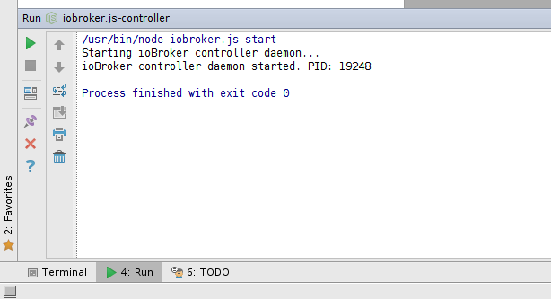
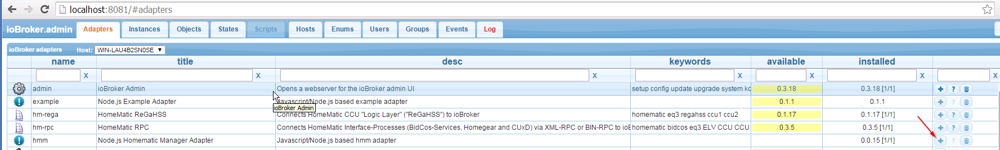
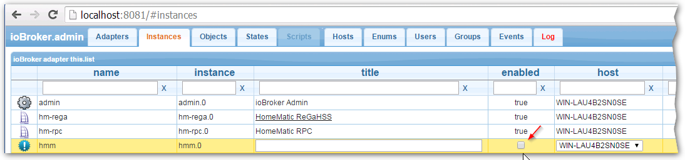

# ВебШторм
На этой странице мы покажем, как установить и настроить среду разработки ioBroker.
WebStorm используется для основной разработки, возможно, Nodeclipse является альтернативной IDE.
Эта документация похожа на «кулинарную книгу», но без объяснений о Javascript, NodeJS, HTML5 и т. д.

Не стесняйтесь расширять следующую информацию.

## Загрузите и установите WebStorm на Ubuntu 14.04
Перейдите на веб-страницу из [jetBrains](https://www.jetbrains.com/webstorm/download/) и загрузите WebStorm для вашей ОС. Мы сосредоточимся на Ubuntu 14.04.
Перейдите в каталог загрузки и переместите файл в каталог /opt с "mv WebStorm-9.0.3.tar.gz /opt/". Распакуйте/распакуйте его "tar xvzf WebStorm-9.0.3.tar.gz". Откройте "WebStorm-139.1112/bin" и введите "./webstorm.sh". Возможно, вам нужно установить Java JDK...

### Установка Java JDK
**Этот шаг не требуется в Windows**

```
sudo apt-add-repository ppa:webupd8team/java
sudo apt-get update
sudo apt-get install oracle-java8-installer
```

### Установка NodeJS
1. `sudo apt-get install nodejs` (не делайте ```sudo apt-get install node```, потому что node — это не nodejs)
2. Создайте псевдоним «node» с помощью ```sudo ln -s /usr/bin/nodejs /usr/bin/node```

## Загрузка новейших исходников ioBroker и импорт в проект WebStorm
1. Откройте терминал и перейдите в каталог /opt.
2. Создайте новый каталог с помощью «mkdir iobroker», а затем выполните «cd iobroker»
3. Установите iobroker с помощью «npm install iobroker»
4. Проверьте его с помощью «cd node_modules/iobroker.js-controller/» и введите «chmod +x iobroker», а затем «node controller.js»
5. Откройте браузер по адресу «http://localhost:8081». Вы должны увидеть экран приветствия ioBroker.

  

6. Перейдите в окно терминала и нажмите `ctrl + c`, чтобы прервать работу ioBroker.

## Настройте WebStorm для запуска и отладки ioBroker
1. Откройте WebStorm с помощью `./webstorm.sh`
2. Нажмите «Файл» -> «Новый проект из существующих файлов...».
3. Выберите следующее...

  

4. Выберите каталог ioBroker... (щелкните правой кнопкой мыши по каталогу, чтобы задать корень проекта)

   

5. Ваш новый проект WebStorm должен выглядеть так...

  

### Создайте «Конфигурацию запуска» ioBroker
1. Перейдите в меню «Выполнить»->«Изменить конфигурацию...»


2. Выберите «+» и добавьте конфигурацию NodeJS, как на рисунке ниже...


## Как запустить ioBroker из WebStorm
1. Запустите ioBroker, выбрав...

    

2. Вы можете спросить себя, как остановить ioBroker? Откройте терминал внутри WebStorm и введите ...

    

## Как отладить адаптер ioBroker
В этой главе мы увидим, как отлаживать адаптер ioBroker, например "iobroker.hmm".
Сначала запустите ioBroker, как упоминалось ранее, пожалуйста, не используйте "режим отладки". Используйте для ioBroker только "режим выполнения".
Установите адаптер, например ioBroker.hmm, из командной строки, например, 

Настройте «Параметры отладки» WebStorm...


Перейдите на веб-страницу ioBroker http://localhost:8081 и установите адаптер iobroker.hmm: 

После установки адаптера нам необходимо отключить экземпляр адаптера...


...следующий 

...в конце вы должны увидеть такой результат: 

Теперь вернемся к WebStorm, откроем файл hmm.js и установим точку останова, например, такую: 

Начать глючить адаптер iobroker.hmm: 

Когда вы остановитесь на первой точке останова, вы можете контролировать следующие шаги с помощью 1) возобновления программы 2) перехода через нее: 