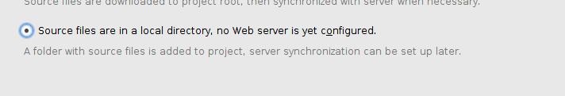
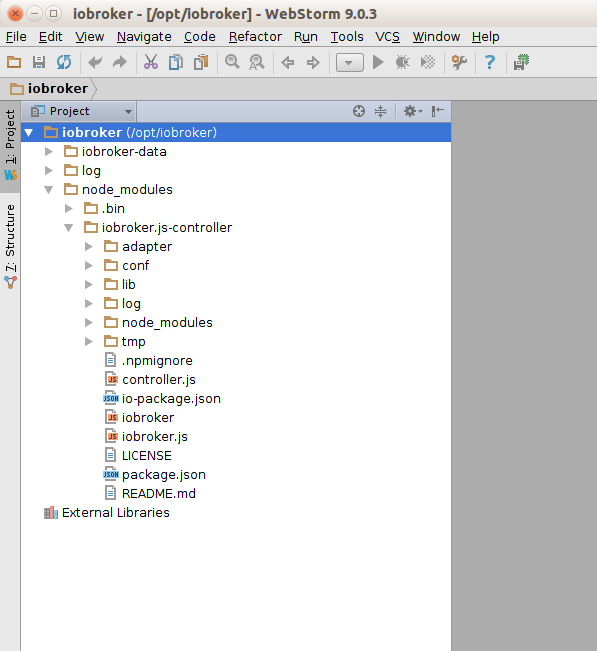
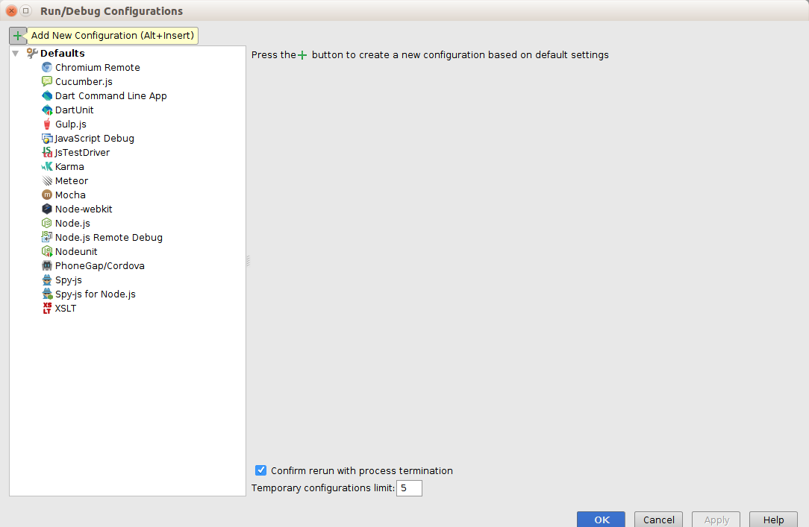
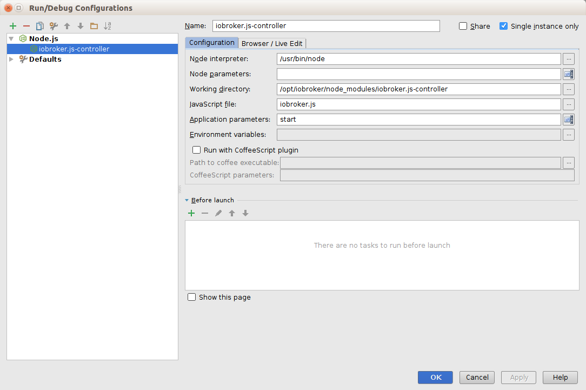
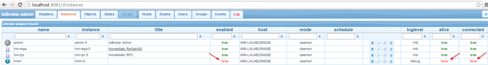
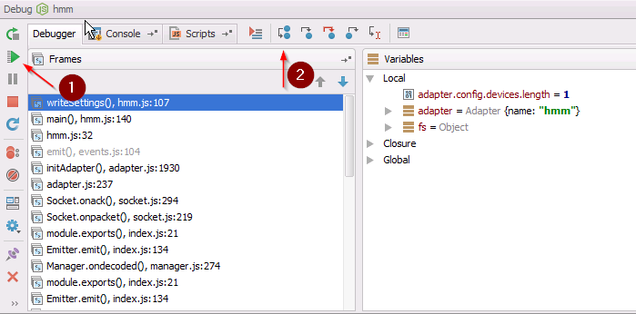

# Вебсторм
На этой странице мы покажем, как установить и настроить среду разработки ioBroker.
Для основной разработки используется WebStorm, возможно Nodeclipse является альтернативой IDE.
Эта документация похожа на «поваренную книгу», но без пояснений по Javascript, NodeJS, HTML5 и т. д.

Не стесняйтесь расширять следующую информацию.

## Загрузите и установите WebStorm на Ubuntu 14.04
Перейдите на веб-страницу из [JetBrains](https://www.jetbrains.com/webstorm/download/) и загрузите WebStorm для своей ОС. Мы сосредоточимся на Ubuntu 14.04.
Перейдите в каталог загрузки и переместите файл в каталог /opt с помощью «mv WebStorm-9.0.3.tar.gz /opt/». Разархивируйте/разархивируйте "tar xvzf WebStorm-9.0.3.tar.gz". Откройте "WebStorm-139.1112/bin" и введите "./webstorm.sh". Возможно, вам нужно установить Java JDK...

### Установить Java JDK
**Этот шаг не требуется в Windows**

```
sudo apt-add-repository ppa:webupd8team/java
sudo apt-get update
sudo apt-get install oracle-java8-installer
```

### Установите NodeJS
1. `sudo apt-get install nodejs` (не делайте ```sudo apt-get install node```, потому что узел не является nodejs)
2. Создайте псевдоним «узел» с помощью sudo ln -s /usr/bin/nodejs /usr/bin/node```

## Загрузите новейшие исходники ioBroker и импортируйте их в проект WebStorm.
1. Откройте терминал и перейдите в каталог /opt.
2. Создайте новый каталог с помощью «mkdir iobroker», а затем запустите «cd iobroker».
3. Установите iobroker с помощью «npm install iobroker».
4. Протестируйте его с помощью «cd node_modules/iobroker.js-controller/» и введите «chmod +x iobroker», а затем «node controller.js».
5. Откройте браузер с помощью «http://localhost:8081». Вы должны увидеть экран приветствия ioBroker.

  

6. Перейдите в окно терминала и нажмите ctrl + c, чтобы прервать работу ioBroker.

## Настройте WebStorm для запуска и отладки ioBroker
1. Откройте WebStorm с помощью `./webstorm.sh`
2. Нажмите «Файл->«Новый проект из существующих файлов…».
3. Выберите следующее...

  

4. Выберите каталог ioBroker... (щелкните правой кнопкой мыши каталог, чтобы установить корень проекта)

   

5. Ваш новый WebStorm-проект должен выглядеть так...

  

### Создайте «Конфигурацию запуска» ioBroker
1. Перейдите в меню «Выполнить» -> «Редактировать конфигурацию...».



2. Выберите «+» и добавьте конфигурацию NodeJS, как показано на рисунке ниже...



## Как запустить ioBroker из WebStorm
1. Запустите ioBroker, выбрав...

    

2. Вы можете спросить себя, как остановить ioBroker? Откройте терминал внутри WebStorm и введите ...

    

## Как отлаживать адаптер ioBroker
В этой главе мы увидим, как отлаживать адаптер ioBroker, такой как «iobroker.hmm».
Сначала запустите ioBroker, как упоминалось ранее, пожалуйста, не используйте «режим отладки». Используйте для ioBroker только «режим запуска».
Установите адаптер, например ioBroker.hmm, из командной строки, как это 

Настройте WebStorm "Параметры отладки"...


Перейдите на веб-страницу ioBroker http://localhost:8081 и установите адаптер iobroker.hmm: 

После установки адаптера мы должны отключить экземпляр адаптера...


...далее 

...в конце вы должны увидеть такой результат: 

Теперь вернемся к WebStorm, давайте откроем файл hmm.js и установим точку останова, как эта: 

Начать отладку адаптера iobroker.hmm: 

Когда вы останавливаетесь на первой точке останова, вы можете управлять следующими шагами с помощью 1) возобновления программы 2) перехода через: 
