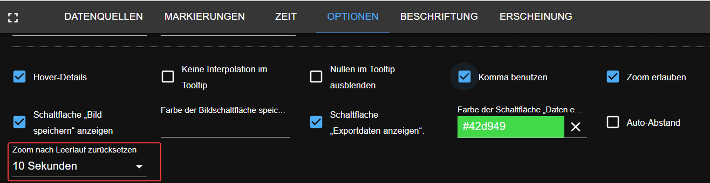

# Новости от ioBroker (август-сентябрь 2023 г.)
В этой записи блога мы рассмотрим некоторые новые адаптеры и новые функции, которые были выпущены для ioBroker в августе и сентябре 2023 года.

## Фрегат (20 августа 2023 г.)

[Фрегат](https://github.com/Bettman66/ioBroker.frigate) — это сетевой видеорегистратор с открытым исходным кодом, созданный на основе обнаружения объектов искусственного интеллекта в реальном времени. Этот адаптер анализирует сообщения MQTT Frigate и создает из них объекты данных.

## Менеджер уведомлений (21 августа 2023 г.)

[Менеджер уведомлений](https://github.com/foxriver76/ioBroker.notification-manager) позволяет управлять уведомлениями ioBroker, например отправлять их в виде сообщений.

##ПроКон.IP (24 августа 2023 г.)

[ПроКон.ИП](https://github.com/ylabonte/ioBroker.procon-ip) — это адаптер ioBroker, обеспечивающий базовую поддержку блока управления бассейном `ProCon.IP`.

## DeyeIDC (29 августа 2023 г.)

[ДейеIDC](https://github.com/raschy/ioBroker.deyeidc) — это сборщик данных для инверторов, совместимых с `Deye`.

## ACME (1 сентября 2023 г.)

[АКМЕ](https://github.com/iobroker-community-adapters/ioBroker.acme) — это адаптер, генерирующий сертификаты с использованием вызовов ACME.

## Администратор (1 сентября 2023 г.)

Адаптер [Админ](https://github.com/ioBroker/ioBroker.admin) получил обновления, включая упрощенное создание псевдонимов.

## JavaScript (1 сентября 2023 г.)

Адаптер [JavaScript](https://github.com/ioBroker/ioBroker.javascript) теперь включает в себя площадку для тестирования кода JavaScript с использованием ChatGPT.

## CEC2 (6 сентября 2023 г.)

[ЦИК2](https://github.com/iobroker-community-adapters/ioBroker.cec2) — адаптер HDMI CEC, позволяющий отслеживать и управлять устройствами, использующими HDMI CEC.

##Alexa2 (9 сентября 2023 г.)
- (Apollon77) Обновите адаптер Alexa2, чтобы приспособиться к измененной системе push-уведомлений от Amazon, обеспечивающей доступ к истории и информации о взаимодействии.

## Vis-2-widgets-material (10 сентября 2023 г.)
- (bluefox) Добавлен виджет дверного замка.

 

## Pushbullet (10 сентября 2023 г.)

- API (bluefox) обновлен до версии 3.
- (bluefox) добавлена конфигурация JSON.

  

### Документация по конфигурации JSON
- (bluefox) Документация JSON-Config добавлена на веб-сайт ioBroker [здесь](https://www.iobroker.net/#en/documentation/dev/adapterjsonconfig.md).

## Меню Telegram (11 сентября 2023 г.)

Легко создавайте меню Telegram с помощью адаптера [Меню Телеграмм](https://github.com/MiRo1310/ioBroker.telegram-menu).

##вис-2 (12 сентября 2023 г.)
- (bluefox) Горизонтальное меню.

  

## Эчартс (12 сентября 2023 г.)
- (bluefox) Добавлена возможность экспорта данных в файл JSON.

  

- (bluefox) Добавлена возможность восстанавливать масштабирование и панорамирование после X секунд бездействия.

  

- (bluefox) Показывать легенду в виде диалога.

  

## Js-контроллер (14 сентября 2023 г.)
- (foxriver76) js-контроллер 5 выпущен в стабильную версию.
- (foxriver76) Обновлен установщик, позволяющий использовать только Node.js 16.x+.

## Информация о ПНГ (16 сентября 2023 г.)

Адаптер [Информация о ПНГ](https://github.com/HGlab01/ioBroker.apg-info) обеспечивает часы пик для австрийской электросети и цены PHELIX-AT на сутки вперед для Австрии.

## TinyMQTTBroker (16 сентября 2023 г.)

[TinyMQTTБрокер](https://github.com/HGlab01/ioBroker.tinymqttbroker) — это небольшой брокер MQTT для ioBroker, который предлагает центральный экземпляр брокера MQTT для публикации и подписки на темы в качестве клиента MQTT.
