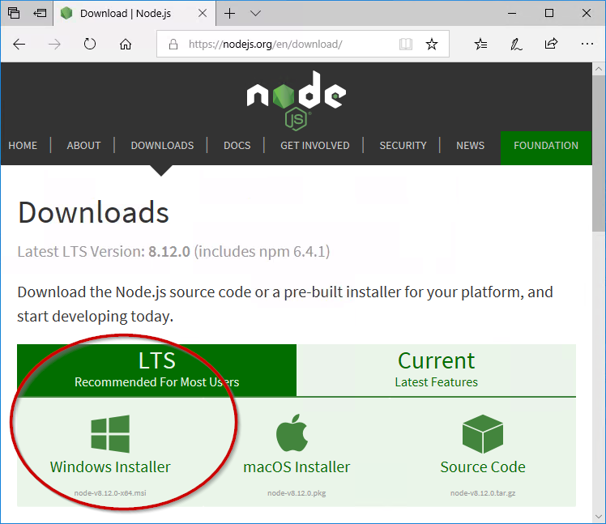

# Установите Node.js и npm
?> ***Это заполнитель***.<br><br> Помогите ioBroker и дополните эту статью. Пожалуйста, обратите внимание на [Руководство по стилю ioBroker](community/styleguidedoc), чтобы упростить принятие изменений.

ioBroker и адаптеры в основном написаны на языке программирования JavaScript. Поскольку компьютер не может выполнять Javascript напрямую, для этого ему нужна среда выполнения Node.js.

Следующая информация является неофициальным переводом инструкций по установке [Фонд Node.js](https://nodejs.org/en/download/package-manager/).

## Содержимое
* [Арх Линукс](#арх)
* [Дистрибутивы Linux на базе Debian и Ubuntu](#)
* [Корпоративный Linux и Fedora](#debian)
* [FreeBSD](#)
* [Генту](#)
* [NetBSD] (#)
* [нвм](#)
* [OpenBSD] (#)
* [openSUSE и SLE](#)
* [macOS] (#)
* [SmartOS и illumos](#)
* [Пустота Linux](#)
* [Солус] (#)
* [Окна](#окна)

<h2 id="arch">АрхЛинукс</h2>

Готовые пакеты Node.js и npm доступны в репозитории сообщества.

```
pacman -S nodejs npm
```

<h2 id="debian">Дистрибутивы Linux на базе Debian и Ubuntu</h2>

Сюда также входят **Linux Mint, Linux Mint Debian Edition (LMDE), elementaryOS, bash для Windows** и многое другое.

Node.js предоставляется через двоичный репозиторий NodeSource Debian и Ubuntu (ранее известный как Launchpad PPA Криса Ли).
Справку и сценарии для репозитория можно найти на GitHub в разделе [nodesource/дистрибутивы](https://github.com/nodesource/distributions).

**Примечание.** Если вы хотите установить Node.js на Ubuntu Precise или Debian Wheezy, рекомендуется прочитать статью об использовании [Node.js >= 6.x в старых дистрибутивах](https://github.com/nodesource/distributions/blob/master/OLDER_DISTROS.md).

```
curl -sL https://deb.nodesource.com/setup_8.x | sudo -E bash -
sudo apt-get install -y nodejs
```

Для Node.js 10 используйте следующую команду:

```
curl -sL https://deb.nodesource.com/setup_10.x | sudo -E bash -
sudo apt-get install -y nodejs
```

***Необязательно:*** Установка инструментов сборки

Чтобы скомпилировать и установить нативные расширения с помощью npm, также должны быть установлены инструменты сборки.

```
sudo apt-get install -y build-essential
```

**Доступные архитектуры:**

* **i386** (32-разрядная версия)
* **amd64** (64-разрядная версия)
* **armhf** (32-разрядная версия ARM с плавающей запятой, ARMv7 и новее: arm-linux-gnueabihf)

Поддерживаемые версии Ubuntu:

* **Ubuntu 14.04 LTS** (Надежный Тар)
* **Ubuntu 16.04 LTS** (Xenial Xerus)

Поддерживаемые версии Debian:

* **Debian 8** (Джесси, старая стабильная версия)
* **Debian 9 / стабильная версия** (растянутая)
* **Тестирование Debian 9** (бастер будет выпущен как следующая стабильная версия)
* **Нестабильный Debian** (sid, который никогда не будет выпущен, он же Rolling)

Пакет Node.js также доступен в официальном репозитории для Debian Sid (нестабильный), Jessie (тестирование) и Wheezy (wheezy-backports) как «nodejs». Он устанавливает только двоичный файл nodejs.

Пакет nodejs-legacy устанавливает символическую ссылку узла, которая необходима многим модулям для правильной сборки и запуска. Модули Node.js, доступные в официальных репозиториях дистрибутива, в этом не нуждаются.

Поддерживаемые версии Linux Mint:

* **Linux Mint 17 "Qiana"** (через Ubuntu 14.04 LTS)
* **Linux Mint 17.1 «Ребекка»** (через Ubuntu 14.04 LTS)
* **Linux Mint 17.2 "Rafaela"** (через Ubuntu 14.04 LTS)
* **Linux Mint Debian Edition (LMDE) 2 «Бетси»** (через Debian 8)

Поддерживаемые элементарные версии ОС:

* **элементарная ОС Luna** (через Ubuntu 12.04 LTS)
* **элементарная ОС Freya** (через Ubuntu 14.04 LTS)
* **элементарная ОС Loki** (через Ubuntu 16.04 LTS)
* **элементарная ОС Juno** (через Ubuntu 18.04 LTS)

Поддерживаемые версии Трискеля:

* **Trisquel 7 "Беленос"** (через Ubuntu 14.04 LTS)

Поддерживаемые версии BOSS:

* **БОСС 5.0 "Аноха"** (через Debian 7)

Корпоративный Linux и Fedora

Включая Red Hat® Enterprise Linux®/RHEL, CentOS и Fedora.

Node.js доступен в репозитории бинарных дистрибутивов NodeSource Enterprise Linux и Fedora. Поддержку этого репозитория вместе с его скриптами можно найти на GitHub по адресу nodesource/distributions.

Обратите внимание, что пакеты Node.js для EL 5 (RHEL5 и CentOS 5) зависят от доступности репозитория EPEL. Сценарий установки проверит и предоставит инструкции, если он не установлен.

В RHEL, CentOS или Fedora для Node.js v8 LTS:

```
curl --silent --location https://rpm.nodesource.com/setup_8.x | sudo bash -
```

В качестве альтернативы для Node.js 10:

```
curl --silent --location https://rpm.nodesource.com/setup_10.x | sudo bash -
```

Затем установите:

```
sudo yum -y install nodejs
```

Необязательно: установите инструменты сборки

Чтобы скомпилировать и установить нативные дополнения из npm, вам также может понадобиться установить инструменты сборки:

```
sudo yum install gcc-c++ make
# or: sudo yum groupinstall 'Development Tools'
```

Доступные архитектуры:

* **i386** (32-разрядная версия, недоступна для EL7)
* **x86_64** (64-разрядная версия)

Поддерживаемые версии Red Hat® Enterprise Linux®:

* **RHEL 5** (32-разрядная и 64-разрядная версии)
* **RHEL 6** (32-разрядная и 64-разрядная версии)
* **RHEL 7** (64-разрядная версия)

Поддерживаемые версии CentOS:

* **CentOS 5** (32-разрядная и 64-разрядная версии)
* **CentOS 6** (32-разрядная и 64-разрядная версии)
* **CentOS 7** (64-разрядная версия)

Поддерживаемые версии CloudLinux:

* **CloudLinux 6** (32-разрядная и 64-разрядная версии)

Поддерживаемые версии Fedora:

* **Fedora 21** (Twenty One) (32-разрядная и 64-разрядная версии)
* **Fedora 20** (Heisenbug) (32-разрядная и 64-разрядная версии)
* **Fedora 19** (Кот Шредингера) (32-разрядная и 64-разрядная версия)

Другие дистрибутивы, о которых известно, что они поддерживаются:

* **Oracle Linux** (очень точно отражает RHEL)
* **Amazon Linux** (проверено 2016.03)

альтернативы

Официальные пакеты Fedora Node.js и npm доступны в Fedora 18 и более поздних версиях. Установить с помощью:

```
sudo dnf install nodejs
```

Торопитесь за последними обновлениями? Возьмите их из тестирования обновлений.

Пользователи Enterprise Linux (RHEL и CentOS) могут использовать пакеты Node.js и npm из репозитория EPEL.

Установите соответствующий RPM epel-release для вашей версии (находится на домашней странице репозитория EPEL), затем запустите:

```
sudo yum install nodejs npm --enablerepo=epel
```

Торопитесь за последними обновлениями? Возьмите их из epel-testing.

Доступные архитектуры:

* **i686** (32-разрядная версия, недоступна для EL7)
* **x86_64** (64-разрядная версия)
* **armv6hl** (только Raspberry Pi, Pidora)
* **armv7hl** (32-разрядная версия ARM с плавающей запятой, ARMv7 и выше, только Fedora)

Поддерживаемые версии Red Hat® Enterprise Linux®:

* **RHEL 6** (i686/x86_64)
* **RHEL 7** (aarch64/x86_64)

RHEL 6 больше не поддерживается через EPEL, однако вы можете использовать Red Hat Software Collections.

Кроме того, версии CentOS и Scientific Linux, соответствующие указанным выше версиям RHEL, также официально поддерживаются всеми пакетами EPEL, включая nodejs. Amazon Linux официально не поддерживается EPEL из-за значительных несовместимостей, о которых ранее сообщалось в списке рассылки epel-devel, однако вы можете обнаружить, что, по крайней мере, nodejs все еще работает.

Поддерживаемые версии Fedora:

* **Fedora Rawhide** (i686/x86_64/armv7hl/aarch64/ppc64/ppc64le/s390x)
* **Fedora 27** (i686/x86_64/armv7hl/aarch64/ppc64/ppc64le/s390x)
* **Fedora 26** (i686/x86_64/armv7hl/aarch64/ppc64/ppc64le)

FreeBSD

Самый последний выпуск Node.js доступен через порт www/node.

Установите бинарный пакет через pkg:

```
pkg install node
```

Или скомпилируйте его самостоятельно, используя порты:

```
cd /usr/ports/www/node && make install
```

Gentoo

Node.js доступен в дереве портежей.

```
emerge nodejs
```

NetBSD

Node.js доступен в дереве pkgsrc:

```
cd /usr/pkgsrc/lang/nodejs && make install
```

Или установите бинарный пакет (если он доступен для вашей платформы) с помощью pkgin:

```
pkgin -y install nodejs
```

НВМ

Node Version Manager — это сценарий bash, используемый для управления несколькими выпущенными версиями Node.js. Он позволяет выполнять такие операции, как установка, удаление, переключение версии и т. д. Чтобы установить nvm, используйте этот сценарий установки.

В системах Unix / OS X Node.js, созданный из исходного кода, можно установить с помощью nvm, установив его в место, которое ожидает nvm:

```
$ env VERSION=`python tools/getnodeversion.py` make install DESTDIR=`nvm_version_path v$VERSION` PREFIX=""
```

После этого вы можете использовать nvm для переключения между выпущенными версиями и версиями, собранными из исходников. Например, если версия Node.js v8.0.0-pre:

```
$ nvm use 8
```

После выхода официального релиза вы захотите удалить версию, собранную из исходников:

```
$ nvm uninstall 8
```

OpenBSD

Node.js доступен через систему портов.

```
/usr/ports/lang/node
```

Использование pkg_add в OpenBSD:

```
pkg_add node
```

openSUSE и SLE

Node.js доступен в основных репозиториях в следующих пакетах:

* **openSUSE Leap 42.2:** nodejs4
* **openSUSE Leap 42.3:** nodejs4, nodejs6
* **openSUSE Tumbleweed:** nodejs4, nodejs6, nodejs8
* **SUSE Linux Enterprise Server (SLES) 12:** nodejs4, nodejs6

    (Перед установкой необходимо добавить модуль «Web and Scripting Module».)

Например, чтобы установить Node.js 4.x на openSUSE Leap 42.2, выполните от имени пользователя root следующее:

```
zypper install nodejs4
```

macOS

Просто загрузите установщик macOS прямо с веб-сайта nodejs.org.

Если вы хотите скачать пакет с bash:

```
curl "https://nodejs.org/dist/latest/node-${VERSION:-$(wget -qO- https://nodejs.org/dist/latest/ | sed -nE 's|.*>node-(.*)\.pkg</a>.*|\1|p')}.pkg" > "$HOME/Downloads/node-latest.pkg" && sudo installer -store -pkg "$HOME/Downloads/node-latest.pkg" -target "/"
```

альтернативы

Использование доморощенного:

варить узел установки

Использование MacPorts:

```
port install nodejs<major version>
```

#Пример
порт установки nodejs7

Использование pkgsrc:

Установите бинарный пакет:

```
pkgin -y install nodejs
```

Или соберите вручную из pkgsrc:

```
cd pkgsrc/lang/nodejs && bmake install
```

SmartOS и иллюминос

Образы SmartOS поставляются с предустановленным пакетом pkgsrc. В других дистрибутивах illumos сначала установите pkgsrc, затем вы можете установить бинарный пакет как обычно:

```
pkgin -y install nodejs
```

Или соберите вручную из pkgsrc:

```
cd pkgsrc/lang/nodejs && bmake install
```

VoidLinux

Void Linux поставляет стабильный node.js в основной репозиторий.

```
xbps-install -Sy nodejs
```

раствор

Solus предоставляет node.js в своем основном репозитории.

```
sudo eopkg install nodejs
```

<h2 id="windows">Окна</h2>

?> Рекомендуется загружать Node.js с машины, на которой он будет установлен. Веб-сайт загрузки Node.js автоматически учитывает, доступна ли Windows в виде 32- или 64-разрядной версии.

1. С веб-сайта

[https://nodejs.org/en/скачать](https://nodejs.org/en/download/) Загрузите текущую версию Node.js 8.x LTS.

 *Загрузить с Node.js*

1. Запустите скачанный установщик Node.js двойным щелчком.

?> Программа обычно находится в папке `Downloads` и соответствует схеме именования `node-<Version>.msi`.

1. Если появится сообщение о том, что приложение не является проверенным приложением из Microsoft Store,

   Выберите `Trotzdem installieren`.

1. Установите Node.js с настройками по умолчанию. Не меняйте путь установки.

   Подтвердите все появившиеся подсказки безопасности.

 *Установка Node.js*