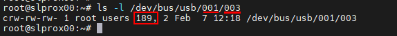
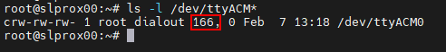

# Проксмокс

## Установка проксмокса
Proxmox Virtual Environment (сокращенно Proxmox VE) — это платформа виртуализации на базе Debian. Технология виртуализации в Proxmox основана на QEMU/KVM.

Proxmox «упаковывает» QEMU/KVM в собственный веб-интерфейс и, таким образом, упрощает администрирование (а также поддерживает контейнеры Linux — LXC). Это делает Proxmox, с одной стороны, удобным для начинающих, а с другой стороны, настолько мощным, что его можно использовать и в профессиональной среде.

В этом разделе показан пример установки и базовой настройки Proxmox в бесплатной версии (без подписки).

Для ясности описания изображений и дополнительную информацию можно открыть.

### Требования

требования

- 64-битный процессор
- ЦП и материнская плата должны поддерживать Intel VT/AMD-V для виртуализации и быть активированы в BIOS.
- 1 ГБ оперативной памяти (только для Proxmox) - в зависимости от количества виртуальных машин, которые будут работать, здесь, конечно, требуется больше оперативной памяти. Поэтому рекомендуется минимум 8 ГБ, а еще лучше 16 ГБ оперативной памяти.

</детали>

### Создать ISO-образ/загрузочную флешку
Сначала вам понадобится образ ISO, который можно загрузить с [Страница загрузки Proxmox](https://www.proxmox.com/de/downloads/category/iso-images-pve).

Проксмокс Изо

</детали>

Для установки необходимо создать загрузочную флешку с этим ISO-образом. Это должно иметь по крайней мере 2 ГБ памяти. Существует несколько способов создания загрузочной флешки, см. [Подготовьте установочный носитель](https://pve.proxmox.com/wiki/Prepare_Installation_Media#_instructions_for_windows)

### Монтаж
Система должна быть настроена в UEFI/BIOS, чтобы ее можно было запустить с USB-устройства. После вставки USB-накопителя через короткое время появится меню установки Proxmox (если нет, вы также можете указать USB-накопитель в качестве загрузочного носителя вручную (на большинстве материнских плат это можно сделать с помощью F8 или F11).

**Установить Proxmox VE** теперь можно просто выбрать в меню установки.

Меню установки

</детали>

Следующим шагом является согласие с условиями использования (EULA).

сова

</детали>

Следующим шагом является выбор жесткого диска, на который будет установлен Proxmox. Если на сервере установлено несколько жестких дисков, убедитесь, что выбрали правильный жесткий диск!

Выбор жесткого диска

</детали>

С помощью **Опций кнопки** вы также можете указать другие параметры для установочного жесткого диска:

Дополнительные параметры жесткого диска

</детали>

Proxmox использует [Диспетчер логических томов](https://de.wikipedia.org/wiki/Logical_Volume_Manager) (LVM). Благодаря расширенным параметрам на этом этапе LVM можно, среди прочего, детально настроить.
Инсталлятор создает группу томов (VG) с именем pve и дополнительные логические тома (LV) с именами root (здесь установлен сам Proxmox), data (хранилище, где хранятся виртуальные диски виртуальных машин) и swap (здесь хранится файл подкачки ).

В расширенных настройках здесь можно указать определенные параметры:

- Файловая система: Здесь вы можете выбрать файловую систему. По умолчанию здесь используется ext4, и в большинстве случаев это хороший выбор. Если в хост-системе доступно несколько жестких дисков (и много оперативной памяти), здесь имеет смысл вариант zfs с соответствующим уровнем RAID. В этом случае, однако, вы должны были принципиально иметь дело с ZFS.
- hdsize: Определяет общий размер жесткого диска, который должен использоваться для Proxmox. Здесь вы обычно выбираете полный размер жесткого диска, если только вы не хотите добавить больше разделов позже.
- swapsize: определяет размер тома подкачки. Стандартный здесь тот же объем, что и у встроенной памяти, но минимум 4 Гб и максимум 8 Гб.
- maxroot: Задает максимальный размер корневого тома (сам Proxmox). **Следует отметить, что при базовой установке здесь также хранятся требуемые позже шаблоны и ISO-образы.**
- minfree: свободное место в группе томов LVM pve. Если диск больше 128 Гб, по умолчанию здесь остается свободным 16 Гб (LVM всегда нужно немного свободного места для создания снапшотов).
- maxvz: указывает максимальный размер тома данных.

</детали>

Обычно вы можете оставить все параметры по умолчанию (т.е. здесь ничего не указано). Они уже оптимально настроены для большинства установок.

После выбора жесткого диска для Proxmox запрашиваются параметры локализации (страна, время и соответствующая раскладка клавиатуры):

локализация

</детали>

Затем вводится пароль пользователя root. Здесь также запрашивается адрес электронной почты. Это используется для отправки электронной почты на указанный здесь адрес в случае важных системных сообщений. Однако это не обязательно должен быть реальный адрес электронной почты (тогда, как администратор, вы больше не будете получать уведомления о важных системных событиях по электронной почте).

пароль и электронная почта

</детали>

Следующий шаг установщика связан с сетевыми настройками. Здесь необходимо ввести статический IP-адрес (без DHCP). Это включает в себя сам IP-адрес (в нотации CIDR), IP-адрес шлюза (обычно IP-адрес маршрутизатора) и DNS-сервер, который будет использоваться (в частной среде обычно также IP-адрес маршрутизатора). Proxmox обычно определяет сеть автоматически.

сеть

</детали>

В конце отобразится сводка по установке:

Краткое содержание

</детали>

Чтобы установить систему, проверьте настройки и нажмите «Установить».

монтаж

</детали>

После небольшого ожидания установка завершена, и систему необходимо перезагрузить (предварительно извлеките флешку с ISO-образом).

Затем вы видите терминал. Здесь уже отображаются инструкции о том, как теперь можно получить доступ к системе:

консоль

</детали>

Теперь он продолжается в браузере (пример https://10.1.1.89:8006). Однако сначала отображается предупреждение. Это связано с тем, что при установке был сгенерирован самоподписанный сертификат, о котором, конечно же, не знает браузер. Вы можете смело игнорировать это сообщение в этот момент — соединение в любом случае шифруется через HTTPS. Само сообщение зависит от браузера. В этом примере нажмите **Дополнительно**, а затем нажмите **Продолжить до 10.1.1.89 (небезопасно)**.

ошибка конфиденциальности

</детали>

Затем выполняется вход в систему с пользователем root и паролем, выбранным во время установки. Вы можете переключить язык на немецкий **сначала**, в противном случае интерфейс Proxmox будет отображаться на английском языке, и вам не придется вводить имя пользователя и пароль второй раз.

Постановка на учет

</детали>

Сразу после этого входа вас встретит сообщение о том, что у вас нет действующей подписки на этот сервер. Это сообщение сначала подтверждается нажатием на OK.

подписка

</детали>

Теперь исходники пакетов Proxmox должны быть скорректированы, чтобы можно было получать обновления.

исходники пакетов

</детали>

Для этого к источникам пакетов добавляется **репозиторий без подписки**. Это можно сделать в меню экземпляра Proxmox в разделе `Updates > Repositories`. Репозиторий без подписки можно добавить с помощью кнопки «Добавить»:

Без подписки

</детали>

Теперь **Корпоративный репозиторий** должен быть деактивирован. Для этого просто выберите репозиторий pve-enterprise в представлении репозитория и нажмите кнопку **Деактивировать**.

Тогда конфигурация репозиториев выглядит так:

Корпоративный репозиторий

</детали>

### Обновления
После изменения источников пакета необходимо выполнить первое обновление системы. Лучше всего это сделать через веб-интерфейс:

обновления

</детали>

Просто выберите нужный узел Proxmox (например, «pve»), а затем нажмите **Обновить** в разделе «Обновления». Здесь открывается так называемое средство просмотра задач, которое всегда отображается, когда в системе выполняются какие-либо действия. Теперь средство просмотра задач можно снова закрыть. Кстати, когда отображается средство просмотра задач, вам не нужно ждать, пока задача будет завершена («ЗАДАЧА ОК»), но этот диалог всегда можно снова закрыть напрямую — сама задача продолжает работать в фоновом режиме.
Если обновления уже доступны, их можно импортировать, нажав **Обновить**.

Здесь открывается веб-консоль, и вы можете следить за ходом выполнения.

веб-консоль

</детали>

Конечно, также возможно обновить сервер Proxmox через командную строку (например, через SSH):

~~~ apt update && apt dist-upgrade ~~~

Здесь важно только то, что вы используете **apt dist-upgrade** (на «обычных» машинах с Debian/Ubuntu вы, как правило, используете apt upgrade). Тем не менее, «обновление дистрибутива» важно для Proxmox, поскольку зависимости, необходимые для работы Proxmox, здесь разрешаются лучше.

В этом отношении базовая конфигурация Proxmox теперь завершена. Если вы хотите более подробно разобраться с Proxmox, стоит взглянуть на [Proxmox Wiki](https://pve.proxmox.com/wiki/Main_Page) или на [официальный форум](https://forum.proxmox.com/).

---

## Proxmox - Создание виртуальной Qemu/KVM машины (ВМ) + последующая установка ioBroker
В этом примере руководства показано, как создать [ВМ](https://pve.proxmox.com/wiki/Qemu/KVM_Virtual_Machines) (debian11), а затем установить в него ioBroker.

Конечно, можно использовать Ubuntu вместо Debian, но обязательно используйте сервер Ubuntu **LTS Version**.

Для ясности описания изображений и дополнительную информацию можно открыть.

### 1 - Скачать образ ISO
Во-первых, требуется [ISO-образ](https://www.debian.org/distrib/)(64-разрядный ПК Netinst-ISO), который необходимо загрузить в корневой каталог (локальный) при базовой установке (если не были созданы другие диски).

Для этого перейдите в локальные > ISO-образы. Там есть два варианта.

- ISO, ранее хранившийся на компьютере, можно загрузить на хост Proxmox с помощью кнопки **Загрузить**.
- **Загрузить с URL** можно загрузить ISO напрямую на хост через URL. Для этого скопируйте адрес ссылки 64-битного ПК Netinst-ISO (правая кнопка мыши), вставьте URL-адрес и нажмите **Query URL**, чтобы получить его. После последнего нажатия на **Загрузить** ISO-образ загружается напрямую.

Скачать ISO

</детали>

### 2 - Создать виртуальную машину
При нажатии на синюю кнопку **Создать ВМ** открывается окно, в котором необходимо выполнить следующие настройки.

- Общее: присвоение имени хоста и пароля, указан ID (начинается со 100), можно изменить, но не позже.
- ОС: выбор хранилища (локальное) и образ ISO (debian-11-netinst.iso)
- Система: все остается в настройках по умолчанию, **проверьте Qemu Agent**
- Диски: Хранилище local-lvm, размер диска 10 ГБ (10-20 ГБ должно быть достаточно, позже возможна замена, но здесь это не описано).
- ЦП: Зависит от мощности компьютера (также можно настроить в любой момент, для этого необходимо перезапустить ВМ)
- Память: размер оперативной памяти в МиБ (также можно изменить в любое время, для этого необходимо перезапустить виртуальную машину)
- Сеть: vmbr0, все остальное остается по умолчанию
- Подтвердить: здесь вы снова можете увидеть сводку (отметьте **Начать после создания**), а затем нажмите **Готово**, чтобы создать виртуальную машину.

Серия изображений Создать виртуальную машину

</детали>

### 3 - Установка Debian
После запуска ВМ перейдите в консоль ВМ и запустите **Установить**.

консоль

</детали>

Вам будут предоставлены инструкции по установке, и во время этого процесса вам нужно будет выполнить некоторые настройки. Чтобы использовать его, вам нужны клавиши Tab, пробел и клавиши со стрелками. Из-за масштаба можно найти различные кадры серии изображений.

**ОПАСНОСТЬ! - Нельзя назначать пароль root.**

Уведомление:

Не выбирайте **iobroker** в качестве имени пользователя, поскольку оно уже используется внутри компании.

Серия изображений Установка Debian

</детали>

### 4 - Настройка виртуальной машины
Перезапустите виртуальную машину, затем войдите в систему с «Именем пользователя» и «Паролем», назначенными при установке. Затем с помощью команды

~~~ IP-адрес ~~~

нашел IP-адрес. Это необходимо для удаленного подключения к ВМ по ssh, как на следующем шаге.

IP-адрес

</детали>

Теперь к виртуальной машине можно получить доступ через ssh (например, Putty). Здесь вы снова входите в систему с «именем пользователя» и «паролем».
Затем сетевой адрес можно изменить с **dhcp** на **static**. (что рекомендуется для работы сервера)

~~~ sudo nano /etc/network/interfaces ~~~

сеть/интерфейсы

</детали>

Изменения в редакторе сохраняются комбинацией клавиш CTRL+o, далее ENTER, CTRL+x выход из редактора.

Изменения IP-адреса вступают в силу только после перезапуска виртуальной машины. Однако перед этим проверяется, активен ли гостевой агент Qemu с помощью

~~~ статус sudo systemctl qemu-guest-agent ~~~

Гостевой агент

</детали>

**ОПАСНОСТЬ! - Для установки Ubuntu необходимо установить и запустить гостевой агент Qemu..**

Команды для этого:

~~~ sudo apt-get install qemu-guest-agent sudo systemctl start qemu-guest-agent ~~~

Кроме того, чтобы иметь возможность установить iobroker, после этого необходимо установить **curl**.
~~~ sudo apt установить curl ~~~

переустановить завиток

</детали>

Чтобы передать устройства (USB) в виртуальной машине, выберите ВМ > Оборудование > Добавить > USB-устройства > Идентификатор поставщика/устройства. Здесь перечислены все подключенные устройства.

USB-устройства

</детали>

Чтобы ВМ запускалась автоматически после перезагрузки компьютера (Proxmox), это нужно активировать в опциях ВМ.

вариант загрузки

</детали>

На этом установка и настройка виртуальной машины завершена. Теперь виртуальную машину можно перезапустить, а затем установить ioBroker.

---

## Proxmox - Создание контейнера Linux (LXC) + последующая установка ioBroker
В этом примере руководства показано, как создать [Контейнеры LXC](https://pve.proxmox.com/wiki/Linux_Container) (debian11), а затем установить в него ioBroker.

Для ясности описания изображений и дополнительную информацию можно открыть.

### 1 - Скачать шаблон контейнера
Во-первых, требуется шаблон, который необходимо загрузить в корневую директорию (локальную) при базовой установке (если не были созданы другие диски).

Для этого перейдите в локальные > Шаблоны контейнеров. При нажатии на **Шаблоны** открывается список выбора. Здесь вы выбираете стандарт debian-11 (яблочко) и нажимаете «Загрузить».

Скачать шаблон

</детали>

### 2 - Создать LXC
При нажатии на синюю кнопку **Создать CT** открывается окно, в котором теперь необходимо выполнить следующие настройки.

- Общее: Назначение имени хоста и пароля, указан идентификатор (начинается со 100), но его можно изменить.
- Шаблон: выбор хранилища (локальный) и шаблон (стандарт debian-11)
- Диски: Назначение размера диска (не будьте слишком щедры, вы можете увеличить его в любой момент)
- Процессор: зависит от мощности компьютера (также можно настроить в любое время)
- Память: назначение Ram/Swap (можно настроить в любое время, даже во время работы)
- Сеть: назначение статического IP/CIDR, шлюз, если IPv6 не настроен, устанавливается SLAAC.
- DNS: обычно ничего не меняется (используются значения с хоста)
- Подтвердите: сводка (отметьте **Начать после создания**), затем нажмите **Готово**, чтобы создать контейнер.

Серия изображений Создать КТ

</детали>

### 3 - Настройка LXC
Теперь, когда контейнер запущен, перейдите в консоль LXC.

консоль

</детали>

Здесь вы сначала входите в систему как root с ранее назначенным паролем, который был назначен при создании LXC, и сначала обновляете его.

~~~ подходящее обновление && подходящее обновление ~~~

обновление

</детали>

Прямо указано, что часовой пояс еще нужно установить.

~~~ dpkg-reconfigure tzdata ~~~

часовой пояс

</детали>

Теперь будут установлены **sudo** и **curl**. Sudo требуется, как и на следующем шаге, для корректного создания пользователя, который будет использоваться в дальнейшем для работы на консоли. Curl необходим для вызова скрипта установки ioBroker на последнем шаге.

~~~ подходящая установка sudo curl ~~~

переустановить

</детали>

Теперь создайте будущего пользователя. Замените «имя пользователя» в этом случае. Назначение пароля пользователю. Остальное можно подтвердить клавишей ENTER.

Уведомление:

Не выбирайте **iobroker** в качестве имени пользователя, поскольку оно уже используется внутри компании.

~~~ имя пользователя adduser ~~~

Затем пользователь должен быть назначен в группу sudo.

~~~ usermod -aG имя пользователя sudo ~~~

Создать пользователей

</детали>

На последнем этапе перед установкой ioBroker выйдите из системы один раз.

~~~ выход ~~~

а затем войдите в систему с новым пользователем. Теперь можно установить iobroker.

выйдите из системы и войдите как пользователь

</детали>

Чтобы LXC запускался автоматически после перезагрузки компьютера (Proxmox), это нужно активировать в опциях контейнера.

вариант загрузки

</детали>

---

## Установить ioBroker
Все, что вам нужно для установки ioBroker, — это одна команда.

~~~ curl -sLf https://iobroker.net/install.sh | Баш-~~~

Шаги установки разделены на 4 шага, которые выполняются полностью автоматически.

- Установка необходимых компонентов (1/4)
- Создание пользователя и каталога ioBroker (2/4)
- Установка ioBroker (3/4)
- Завершение установки (4/4)

установщики

</детали>

Установка успешно завершена, когда в конце появится следующее.

~~~ ioBroker успешно установлен Откройте http://10.1.1.222:8081 в браузере и приступайте к настройке! ~~~

В то же время это также означает, что ioBroker теперь можно вызывать в браузере по адресу. Если все заработало без проблем, вас встретит установка ioBroker. Теперь осталось всего несколько шагов, которые вы проведете вместе с помощником.

Серия изображений ioBroker Assistant

</детали>

Затем вы можете искать устройства и службы. Необходимые адаптеры/экземпляры могут быть созданы автоматически.

Поиск устройства/службы серии изображений

</детали>

На этом установка ioBroker завершена. Дополнительные адаптеры могут быть установлены в любое время в зависимости от применения и желания.

---

## Proxmox - LXC (контейнеры Linux) -> Прохождение через USB-устройства
В этой части руководства шаг за шагом объясняется, как пройти через USB-устройство (переход через USB) в Proxmox в LXC (контейнер Linux).

С виртуальной машиной можно передать USB-устройство напрямую через веб-интерфейс Proxmox, а с контейнером Linux для этого в настоящее время необходимо редактировать файл конфигурации lxc вручную.

В инструкциях описывается, как интегрировать **Texas Instruments Inc. CC2531** Zigbee-модем, но те же шаги можно использовать аналогично для других Zigbee-модулей (ConBee, CC2652P и т. д.) или для других USB-устройств, за исключением сетевых USB-устройств. (Bluetooth/Wlan).

* Для этой части инструкций использовался Proxmox версии 7.1.

### 1.) Соберите информацию об устройстве USB

Установка SSH-соединения с Proxmox:

~~~ ssh root@ip адрес ~~~

**Если USB-устройство уже подключено к хосту Proxmox, отключите его на время.**

Следующая команда выводит список всех подключенных в настоящее время USB-устройств на хосте Proxmox:

~~~ lsusb ~~~

Теперь интегрируемое USB-устройство подключается к хосту Proxmox, и снова выполняется команда lsusb.

На скриншоте видно, что новое устройство с номером шины USB: **001** и номером устройства: **003** указано.

Эта информация необходима для использования следующей команды, например. выведите **старший номер устройства** из устройства:

~~~ ls -l /dev/bus/usb/001/003 ~~~

Важно использовать вывод номера шины USB и номера устройства с помощью команды!

***ls -l /dev/bus/usb/номер-usb-шины/номер-устройства***

USB-устройство в этом примере имеет старший номер устройства **189**, запишите значение вашего устройства в текстовом файле с комментарием: #1

Затем мы выводим уникальный идентификатор USB-устройства и записываем выходное значение в текстовый файл с пометкой: #2

~~~ ls /dev/serial/by-id/ ~~~

В качестве последнего шага выводится основной номер устройства ttyACM и отмечается примечанием: #3:

~~~ ls -l /dev/ttyACM* ~~~

>*Если вывода нет, проверьте с помощью «ls -l /dev/serial/by-id/», интегрируется ли USB-устройство в систему как ttyUSB, если да, замените все следующие команды, которые ссылаются на **ttyACM. ..* * получить от **ttyUSB…** если нет вывода, это не устройство класса USB CDC (последовательная связь), поэтому все точки, которые нужно включить в ttyACM, можно игнорировать.*

Итак, мы записали **три** значения с USB-устройства, которые необходимы для интеграции в конфигурационный файл lxc.

</детали>

### 2.) Отредактируйте файл конфигурации LXC

Перейдите в каталог конфигурации LXC на хосте Proxmox с помощью:

~~~ cd /etc/pve/lxc ~~~

Файл конфигурации имеет тот же идентификационный номер, который был присвоен при создании lxc!

Перед редактированием конфигурационного файла необходимо сделать резервную копию:

~~~ cp 201.conf 201.conf.backup ~~~

Теперь файл конфигурации редактируется с помощью vi или nano:

~~~ нано 201.conf ~~~

В конец конфигурационного файла добавляется следующее:

~~~ lxc.cgroup2.devices.allow: c 189:* rwm lxc.mount.entry: usb-Texas_Instruments_TI_CC2531_USB_CDC___0X00124B0012023529-if00 dev/serial/by-id/usb-Texas_Instruments_TI_CC2531_USB_CDC___0X001 24B0 012023529-if00 нет привязки, необязательно, создать = файл

lxc.cgroup2.devices.allow: c 166:* rwm lxc.mount.entry: /dev/ttyACM0 dev/ttyACM0 нет привязки, необязательный, создать=файл ~~~

Замените отмеченные значения на отмеченные записи из вашей заметки!

* Первая строка относится к основному номеру устройства **189** Примечание: #1
* Во второй строке уникальный идентификатор (usb-Texas_Instruments_TI_CC2531_USB_CDC___0X00124B0012023529-if00) из Примечание: #2 дается индивидуально и с абсолютным путем, обратите внимание, что полный текст пишется в одну строку без переносов строк.
* В третьей строке указан основной номер устройства **166** от ttyACM из примечания №3.

Сохраните файл конфигурации (в редакторе nano комбинацией клавиш: CTRL+o & CTRL+x для выхода из редактора)

 

**ОПАСНОСТЬ! – Если в вашем контейнере есть активные моментальные снимки:**

Тогда код lxc.cgroup находится не в конце конфигурационного файла, а перед первой записью моментального снимка.

</детали>

**ОПАСНОСТЬ! - Установка Proxmox до версии 7.0:**

Замените записи на

~~~ lxc.cgroup2 ~~~

через

~~~ lxc.cgroup ~~~

</детали>

  Наконец, введите следующую команду, чтобы установить необходимые права для ttyACM0:

~~~ chmod o+rw /dev/ttyACM* ~~~

Чтобы применить корректировки к lxc, выполните холодную перезагрузку из контейнера с **pct stop id/pct start id**:

~~~ пкт стоп 201 ~~~

~~~ пкт начало 201 ~~~

 

**Совет: лучше всего хранить копию вашего рабочего файла конфигурации извне, т.к. B. встроенный сервис резервного копирования Proxmox не создает резервную копию содержимого вашей конфигурации!**

 

</детали>

### 3.) Проверьте сквозную передачу USB LXC и конфигурацию экземпляра Zigbee.

Установка SSH-соединения с LXC:

~~~ ssh user@ip адрес ~~~

С помощью команд:

~~~ lsusb ~~~

&

~~~ ls -l /dev ~~~

проверяется, были ли корректировки в файле конфигурации успешными.

* Как видно на скриншоте, контейнер теперь имеет доступ к USB-устройству.

* Важно, что ttyACM0 имеет такие же права на скриншоте, т.е. **crw-rw-rw- 1 Nobody nogroup**

>***Если вы не проверите, все ли значения в конфигурационном файле установлены, как описано, права все равно не должны совпадать, тогда переходите к пункту 5.***

* На снимке экрана также видно, что номер устройства cc2531 изменился с 3 на 4, это связано с тем, что флешка в это время была отключена и снова подключена. Однако, поскольку в конфигурационном файле указан уникальный идентификатор, а не номер шины/устройства, сквозная передача через USB продолжает работать.

Если, как описано выше, в контейнер пропущена Zigbee-флешка, ее необходимо прописать в iobroker в настройках Zigbee-адаптера под именем COM-порта.

~~~ /dev/ttyACM0 ~~~

указывается таким образом, чтобы адаптер обращался к правильному устройству.

</детали>

### 4.) Правило UDEV для постоянных прав Настройка ttyACM0

В конце шага 3 использовалась команда

~~~ chmod o+rw /dev/ttyACM* ~~~

соответствующие права установлены для ttyACM0, но изменения этих прав сбрасываются при перезапуске хоста Proxmox.На хосте Proxmox требуется правило udev для постоянной настройки.

С помощью lsusb мы снова выводим список подключенных в данный момент USB-устройств:

~~~ lsusb ~~~

На этот раз мы записываем числовые значения после ID, поэтому в данном случае **0451:16a8**

* Первое значение: ***0451*** означает **idVendor**, а второе значение: ***16a8*** — **idProduct**.

Теперь правило udev создается в /etc/udev/rules.d с помощью vi или nano:

~~~ нано /etc/udev/rules.d/50-myusb.rules ~~~

и добавил следующий контент:

~~~ ПОДСИСТЕМЫ=="usb", ATTRS{idVendor}=="0451", ATTRS{idProduct}=="16a8", GROUP="users", MODE="0666" ~~~

Наконец, выполните следующую команду, чтобы активировать правило udev:

~~~ udevadm control --reload ~~~

</детали>

### 5.) Устранение неполадок

**Ошибка:** права ttyACM0 в lxc не совпадают или теряются через короткое время (ConBee II).

~~~ ls -l /dev/ttyACM0 c--------- 0 Nobody nogroup 166, 0 7 февраля 14:29 ttyACM0 ~~~

 

**Решение.** Используйте mknod, чтобы создать постоянную привязку для контейнера.

Для этого создается папка **devices** по пути **"/var/lib/lxc/CONTAINERID"** и создается привязка в этой папке с помощью mknod:

~~~ mkdir /var/lib/lxc/201/devices ~~~

~~~ cd /var/lib/lxc/201/devices ~~~

~~~ mknod -m 666 ttyACM0 c 166 0 ~~~

+ *mknod создает файл с именем ttyACM0 в пути (пока файл существует, устройство привязано к lxc)*

***основной номер устройства и ttyACM.. при необходимости отрегулируйте***

Затем необходимо изменить запись в файле конфигурации lxc:

~~~ lxc.mount.entry: /dev/ttyACM0 dev/ttyACM0 нет привязки, необязательный, создать=файл ~~~

будет заменен на:

~~~ lxc.mount.entry: /var/lib/lxc/CONTAINERID/devices/ttyACM0 dev/ttyACM0 нет привязки, необязательный, создать=файл ~~~

</детали>

---

## Настройка USB-накопителя/диска для резервного копирования
Чтобы будущие резервные копии можно было сохранять отдельно, существует возможность интеграции USB-устройства в виде флешки или диска на хосте Proxmox.
Для этого устройство должно иметь определенный формат.
Распространенными [файловые системы](https://wiki.ubuntuusers.de/Dateisystem/) являются **vFAT** или **NTFS**. Оба могут быть прочитаны Linux, Windows или MacOS.
Для чистого Linux обычно **EXT4**.

Если носитель данных все еще не разбит на разделы или вы хотите его переформатировать, вы можете сделать это на ПК с Windows (ntfs) или непосредственно на сервере Proxmox.
Когда носитель данных подготовлен, его можно смонтировать в системе, а затем добавить напрямую в качестве хранилища (каталога) через графический интерфейс Proxmox.

**ОПАСНОСТЬ! - При новом форматировании все предыдущие данные на носителе будут удалены

Следующие примеры инструкций относятся к настройке непосредственно на хосте Proxmox. Также можно использовать ssh/putty.

**Обратите внимание, что для следующих команд требуется root, при использовании пользовательского пользователя на хосте команды ниже должны иметь префикс sudo.**

### Подготовить устройство
### 1 - Идентифицировать устройство
Сначала вы найдете устройство с [лсблк](https://wiki.ubuntuusers.de/lsblk/). Рекомендуется выполнить команду один раз до и после ее подключения. Это упрощает идентификацию устройства.

~~~ лсблк ~~~

выглядит примерно так (буквы различаются в зависимости от количества подключенных устройств)

~~~ sdd 8:48 0 119.2G 0 disk ├─sdd1 8:49 0 119.2G 0 часть └─sdd9 8:57 0 8M 0 часть sde 8:64 0 931.5G 0 disk <-- Это диск / dev/sde └─sde1 8:65 0 931.5G 0 часть <-- Это первый раздел /dev/sde1, если он уже отформатирован sr0 11:0 1 1024M 0 rom sr1 11:1 1 1024M 0 rom ~~~

### 2 - Разделение
Диск разбит на разделы с помощью меню [cfdisk](https://wiki.ubuntuusers.de/fdisk/)

~~~ cfdisk /dev/sde ~~~

### 3 - Создать файловую систему
Теперь необходимо отформатировать ранее созданный раздел. Как упоминалось выше, существуют разные варианты, в зависимости от предполагаемого использования.
Раздел форматируется командой [mkfs](https://wiki.ubuntuusers.de/Formatieren/) и соответствующими параметрами.

~~~ mkfs.vfat /dev/sde1 ~~~

### 4 - Смонтировать диск
Чтобы иметь возможность использовать заполненный носитель данных, он должен быть [смонтированный](https://wiki.ubuntuusers.de/mount/).

Для этого создается подходящая точка монтирования, а чтобы носитель данных снова автоматически интегрировался после перезагрузки, вам также потребуется соответствующая запись в [/etc/fstab](https://wiki.ubuntuusers.de/fstab/).

Для этого необходимо считать уникальный **UUID** накопителя.

Создать точку монтирования ~~~ mkdir /media/ext_usb ~~~

Смонтировать носитель ~~~ смонтировать /dev/sde1 /media/ext_usb ~~~

Получить UUID ~~~ blkid | grep -i sde ~~~ дает ~~~ /dev/sde1: LABEL="Export_Images" UUID="136b058d-f0c8-406d-a82b-2adcc00b72bf" UUID_SUB="951e8519-8478-4d64-b093-c3597147f989" BLOCK_SIZE=" 4096" ТИП="btrfs" PARTUUID="00011a10-01" ~~~

Отредактируйте запись в */etc/fstab* с помощью nano ~~~ nano /etc/fstab ~~~ теперь эта запись добавляется, а затем сохраняется ~~~ UUID="136b058d-f0c8-406d-a82b-2adcc00b72bf" /media/ ext_usb vfat по умолчанию 0 0 ~~~

### 5- Добавить хранилище в Proxmox
Каталог теперь можно добавить в разделе Data Center>Storage. Обозначение ID можно выбрать произвольно, например *usb-backup*.

Путь указан в столбце *Directory*, в данном случае */media/ext_usb*.

С *Content* вам нужно только выбрать нужный запрос.