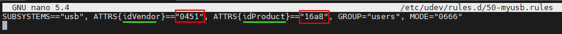

# Проксмокс

## Установка Proxmox
Виртуальная среда Proxmox (сокращенно Proxmox VE) — это платформа виртуализации на базе Debian. Технология виртуализации в Proxmox основана на QEMU/KVM.

Proxmox «упаковывает» QEMU/KVM в собственный веб-интерфейс, что значительно упрощает администрирование (а также поддерживает контейнеры Linux — LXC). Это делает Proxmox, с одной стороны, удобным для новичков, но, с другой стороны, он настолько мощный, что его можно использовать и в профессиональной среде.

В этом разделе на примере показана установка и базовая настройка Proxmox в бесплатной версии (без подписки).

Для наглядности описания изображений и дополнительную информацию можно открыть.

### Требования

Требования

- 64-битный процессор
- ЦП и материнская плата должны поддерживать Intel VT/AMD-V для виртуализации и должны быть активированы в BIOS.
- 1 ГБ ОЗУ (только для Proxmox) – в зависимости от количества виртуальных машин, здесь, конечно, потребуется больше ОЗУ. Поэтому рекомендуется минимум 8 ГБ, а еще лучше 16 ГБ оперативной памяти.

</подробнее>

### Создать ISO-образ/загрузочную флешку
Сначала вам понадобится ISO-образ, который можно скачать с [Страница загрузки Proxmox](https://www.proxmox.com/de/downloads/category/iso-images-pve).

Проксмокс Исо

</подробнее>

Для установки необходимо создать загрузочную флешку с этим ISO-образом. Здесь должно быть не менее 2 ГБ памяти. Существует несколько способов создания загрузочной флешки, см. [Подготовьте установочный носитель](https://pve.proxmox.com/wiki/Prepare_Installation_Media#_instructions_for_windows).

### Установка
Система должна быть настроена в UEFI/BIOS так, чтобы она могла загружаться с USB-устройства. После вставки USB-накопителя через некоторое время появится меню установки Proxmox (если нет, вы также можете вручную указать USB-накопитель в качестве стартового носителя (на большинстве материнских плат это можно сделать с помощью F8 или F11).

Просто выберите **Установить Proxmox VE** в меню установки.

Меню установки

</подробнее>

Следующим шагом является согласие с условиями использования (EULA).

Юла

</подробнее>

Далее следует выбор жесткого диска, на котором должен быть установлен Proxmox. Если на сервере установлено несколько жестких дисков, обязательно выберите правильный жесткий диск!

Выбор жесткого диска

</подробнее>

Вы также можете указать дополнительные параметры установочного жесткого диска с помощью кнопки **Параметры**:

Дополнительные параметры жесткого диска

</подробнее>

Proxmox использует [Менеджер логических томов](https://de.wikipedia.org/wiki/Logical_Volume_Manager) (LVM). Благодаря расширенным параметрам, среди прочего, можно детально настроить LVM.
Установщик создает Группу Томов (VG) с именем pve и дополнительные Логические Тома (LV) с именами root (здесь устанавливается сам Proxmox), data (хранилище, на котором хранятся виртуальные диски ВМ) и swap (здесь файл подкачки сохраняется).

В расширенных настройках здесь можно указать определенные параметры:

- Файловая система: Здесь вы можете выбрать файловую систему. По умолчанию здесь используется ext4, и в большинстве случаев это хороший выбор. Если в хост-системе доступно несколько жестких дисков (и много оперативной памяти), вариант zfs с соответствующим уровнем RAID имеет смысл. В этом случае вам следует принципиально разобраться с ZFS.
- hdsize: определяет общий размер жесткого диска, который следует использовать для Proxmox. Здесь вы обычно выбираете весь размер жесткого диска, если только вы не захотите добавить больше разделов позже.
- swapsize: определяет размер тома подкачки. Стандартным здесь является тот же размер, что и встроенная память, но минимум 4 ГБ и максимум 8 ГБ.
- maxroot: определяет максимальный размер корневого тома (сам Proxmox). **Здесь следует отметить, что при базовой установке здесь также сохраняются необходимые в дальнейшем шаблоны и ISO-образы.**
- minfree: пространство, которое необходимо освободить в группе томов LVM pve. Если размер диска превышает 128 ГБ, по умолчанию остается свободным 16 ГБ (LVM всегда требуется немного свободной памяти для создания моментального снимка).
- maxvz: устанавливает максимальный размер тома данных.

</подробнее>

Обычно вы можете оставить все параметры по умолчанию (т. е. здесь ничего не указано). Они уже оптимально настроены для большинства установок.

После выбора жесткого диска для Proxmox запрашиваются параметры локализации (страна, время и соответствующая раскладка клавиатуры):

Локализация

</подробнее>

Затем вводится пароль пользователя root. Здесь также запрашивается адрес электронной почты. Это используется для отправки электронного письма на указанный здесь адрес в случае важных системных сообщений. Однако это не обязательно должен быть реальный адрес электронной почты (тогда вы как администратор больше не будете получать уведомления о важных системных событиях по электронной почте).

Пароль и адрес электронной почты

</подробнее>

Следующий шаг установщика касается настроек сети. Вы можете выбрать соответствующий интерфейс. Имя хоста можно выбрать произвольно, но также необходимо указать домен DNS.
Например, для пользователей Fritzbox это будет `hostname.fritz.box`.
В качестве IP-адреса желательно указать статический IP-адрес (без DHCP). Сюда входит сам IP-адрес (в формате CIDR), IP-адрес шлюза (обычно IP-адрес маршрутизатора) и используемый DNS-сервер (в частных средах обычно также IP-адрес маршрутизатора). Proxmox обычно обнаруживает сеть автоматически.

сеть

</подробнее>

В конце отображается сводная информация об установке:

Краткое содержание

</подробнее>

Система устанавливается путем проверки настроек и нажатия кнопки «Установить».

установка

</подробнее>

После небольшого ожидания установка завершится и систему необходимо перезагрузить (для этого сначала извлеките флешку с ISO-образом).

После этого вы увидите терминал. Инструкция по доступу в систему уже отображена здесь:

консоль

</подробнее>

Теперь продолжается в браузере (например https://10.1.1.89:8006). Однако сначала отображается предупреждение. Это связано с тем, что во время установки был сгенерирован самозаверяющий сертификат, который, естественно, не известен браузеру. На этом этапе вы можете смело игнорировать это сообщение — соединение определенно зашифровано через HTTPS. Само сообщение зависит от браузера. В этом примере нажмите **Дополнительно**, а затем нажмите **Продолжить до 10.1.1.89 (небезопасно)**.

Ошибка защиты данных

</подробнее>

Затем вы входите в систему с пользователем root и паролем, выбранным во время установки. Здесь вы можете **сначала** изменить язык на немецкий, иначе интерфейс Proxmox будет отображаться на английском языке, и вам не придется вводить имя пользователя и пароль второй раз.

Регистрация

</подробнее>

Сразу после входа вас встретит сообщение о том, что у вас нет действующей подписки на этот сервер. Это сообщение сначала подтверждается нажатием кнопки ОК.

Подписка

</подробнее>

Теперь исходники пакета Proxmox необходимо адаптировать, чтобы вы могли получать обновления.

Источники пакетов

</подробнее>

Для этого в исходные коды пакетов добавляется **Репозиторий без подписки**. Это можно сделать в меню экземпляра Proxmox в разделе `Updates > Repositories`. Репозиторий без подписки можно добавить с помощью кнопки «Добавить»:

Отсутствие подписки

</подробнее>

Теперь **Корпоративный репозиторий** должен быть деактивирован. Для этого просто выберите репозиторий pve-enterprise в представлении репозитория и нажмите кнопку **Деактивировать**.

Конфигурация репозиториев выглядит следующим образом:

Корпоративный репозиторий

</подробнее>

### Обновления
После изменения исходных кодов пакетов следует провести первоначальное обновление системы. Лучше всего это сделать через веб-интерфейс:

Обновления

</подробнее>

Просто выберите нужный узел Proxmox (например, «pve») и затем нажмите **Обновить** в разделе «Обновления». Здесь открывается так называемый просмотрщик задач, который всегда отображается при выполнении каких-либо действий в системе. Теперь средство просмотра задач можно снова закрыть. Кстати, когда отображается просмотрщик задач, вам не нужно ждать завершения задачи («ЗАДАЧА ОК»); этот диалог всегда можно закрыть напрямую — задача сама продолжает выполняться в фоновом режиме.
Если обновления теперь доступны, их можно установить, нажав **Обновить**.

Затем здесь откроется веб-консоль, и вы сможете следить за ходом выполнения.

Веб-консоль

</подробнее>

Конечно, также возможно обновить сервер Proxmox через командную строку (например, через SSH):

~~~ apt update && apt dist-upgrade ~~~

Единственное, что здесь важно, это то, что вы используете **apt dist-upgrade** (на «обычных» машинах Debian/Ubuntu вы обычно используете apt-upgrade). Однако «dist-upgrade» важен для Proxmox, поскольку он лучше разрешает зависимости, необходимые для работы Proxmox.

В этом отношении Proxmox теперь готов к своей базовой конфигурации. Если вы хотите разобраться с Proxmox более подробно, стоит взглянуть на [Proxmox Wiki](https://pve.proxmox.com/wiki/Main_Page) или на [официальном форуме](https://forum.proxmox.com/).

---

## Proxmox — создание виртуальной машины Qemu/KVM (VM) + последующая установка ioBroker
В этом примере руководства показано, как создать [ВМ](https://pve.proxmox.com/wiki/Qemu/KVM_Virtual_Machines) (debian11), а затем установить в него ioBroker.

Конечно, можно использовать Ubuntu вместо Debian, но обязательно используйте версию Ubuntu Server **LTS**.

Для наглядности описания изображений и дополнительную информацию можно открыть.

### 1 — Загрузите ISO-образ
Сначала вам понадобится [ISO-образ](https://www.debian.org/distrib/) (64-битный PC Netinst ISO), который необходимо загрузить в корневой каталог (локальный) при базовой установке (если не были созданы дополнительные диски).

Для этого перейдите в раздел локальные > ISO-образы. Там есть два варианта.

- С помощью кнопки **Загрузить** ISO-образ, ранее хранившийся на компьютере, можно загрузить на хост Proxmox.
- **Загрузка с URL-адреса** можно загрузить ISO непосредственно на хост через URL-адрес. Для этого скопируйте адрес ссылки 64-битного ISO-образа Netinst для ПК (правая кнопка мыши), вставьте URL-адрес и нажмите **Запросить URL-адрес**, чтобы получить его. При последнем нажатии **Загрузить** ISO-образ будет загружен напрямую.

Скачать ИСО

</подробнее>

### 2 — Создать виртуальную машину
При нажатии на синюю кнопку **Создать ВМ** открывается окно, в котором необходимо выполнить следующие настройки.

- Общие: Назначение имени хоста и пароля, указывается идентификатор (начинается со 100), можно изменить, но не позднее.
- ОС: выбор хранилища (локального) и ISO-образа (debian-11-netinst.iso).
- Система: все остается в настройках по умолчанию, **проверьте агент Qemu**
- Диски: Storage local-lvm, размер диска 10ГБ (10-20ГБ должно быть достаточно, изменить его позже возможно, но далее здесь не описано).
- ЦП: Зависит от мощности компьютера (также можно настроить в любое время, необходимо перезапустить ВМ)
- Память: размер ОЗУ в МиБ (также можно изменить в любой момент, необходимо перезапустить ВМ)
- Сеть: vmbr0, все остальное остается как указано
- Подтвердите: здесь вы снова увидите сводку (отметьте **Начать после создания**), а затем нажмите **Готово**, чтобы создать виртуальную машину.

Серия изображений Создать виртуальную машину

</подробнее>

### 3 — Установка Debian
После запуска виртуальной машины перейдите в ее консоль и запустите **Установку**.

консоль

</подробнее>

Вам будут предоставлены инструкции по установке, и во время этого процесса вам придется выполнить некоторые настройки. Для управления им нужны клавиши табуляции, пробела и стрелок. Из-за размера в серии изображений можно найти разные кадры.

**ОПАСНОСТЬ! - Пароль root не может быть назначен.**

Уведомление:

Не выбирайте **iobroker** в качестве имени пользователя, поскольку оно уже используется внутри системы.

Серия изображений Установка Debian

</подробнее>

### 4 — Настройка виртуальной машины
Перезагрузите виртуальную машину, затем войдите в систему, используя «имя пользователя» и «пароль», назначенные при установке. Затем следует команда

~~~ IP-адрес ~~~

IP-адрес был найден. Это нужно для удаленного подключения к виртуальной машине по ssh, как на следующем шаге.

IP-адрес

</подробнее>

Доступ к виртуальной машине теперь можно получить через ssh (например, Putty). Здесь вы также снова входите в систему, используя «имя пользователя» и «пароль».
Затем сетевой адрес можно изменить с **dhcp** на **статический**. (рекомендуется для работы сервера)

~~~ sudo nano /etc/network/interfaces ~~~

сеть/интерфейсы

</подробнее>

Изменения в редакторе сохраняются комбинацией клавиш CTRL+o, затем ENTER, CTRL+x выходит из редактора.

Изменения IP-адреса вступят в силу только после перезапуска виртуальной машины. Однако перед этим проверяется, активен ли гостевой агент Qemu.

~~~ sudo systemctl status qemu-guest-agent ~~~

Гостевой агент

</подробнее>

**ОПАСНОСТЬ! - Для установки Ubuntu необходимо установить и запустить гостевой агент Qemu.**

Команды для этого:

~~~ sudo apt-get install qemu-guest-agent sudo systemctl start qemu-guest-agent ~~~

Кроме того, чтобы иметь возможность установить iobroker, необходимо переустановить **curl**.
~~~ sudo apt install curl ~~~

Переустановите локон

</подробнее>

Чтобы передать устройства (USB) через виртуальную машину, выберите VM > Оборудование > Добавить > USB-устройства > Производитель/идентификатор устройства. Здесь перечислены все подключенные устройства.

USB-устройства

</подробнее>

Чтобы ВМ запускалась автоматически даже после перезагрузки компьютера (Proxmox), это необходимо активировать в настройках ВМ.

Вариант загрузки

</подробнее>

Установка и настройка виртуальной машины завершена. Теперь виртуальную машину можно перезапустить и установить ioBroker.

---

## Proxmox — Создание контейнера Linux (LXC) + последующая установка ioBroker
В этом примере руководства показано, как создать [LXC-контейнеры](https://pve.proxmox.com/wiki/Linux_Container) (debian11), а затем установить в него ioBroker.

Для наглядности описания изображений и дополнительную информацию можно открыть.

### 1 — Скачать шаблон контейнера
Во-первых, необходим шаблон, который необходимо загрузить в корневой каталог (локальный) при базовой установке (если не были созданы дополнительные диски).

Для этого перейдите в раздел «Локальные» > «Шаблоны контейнеров». При нажатии на **Шаблоны** открывается список выбора. Здесь вы выбираете debian-11-standard(bullseye) и нажимаете «Загрузить».

Скачать шаблон

</подробнее>

### 2 — Создать LXC
При нажатии на синюю кнопку **Создать КТ** открывается окно, в котором теперь необходимо выполнить следующие настройки.

- Общие: присвоение имени хоста и пароля, указывается идентификатор (начинается со 100), но его можно изменить.
- Шаблон: выбор хранилища (локальное) и шаблон (стандарт debian-11).
- Диски: Назначение размера диска (не будьте слишком щедры, вы можете увеличить его в любой момент)
- Процессор: зависит от мощности компьютера (также можно настроить в любое время)
- Память: распределение RAM/Swap (можно регулировать в любое время, даже во время работы)
- Сеть: статическое назначение IP/CIDR, шлюз; если IPv6 не настроен, устанавливается значение SLAAC.
- DNS: обычно ничего не меняется (используйте значения с хоста)
– Подтвердите: Сводка (отметьте **Начать после создания**), затем нажмите **Готово**, чтобы создать контейнер.

Серия изображений Создать КТ

</подробнее>

###3 — Настройка LXC
Теперь, когда контейнер запущен, перейдите в консоль LXC.

консоль

</подробнее>

Здесь вы сначала входите в систему как root с ранее назначенным паролем, который был назначен при создании LXC, и обновляете его.

~~~ apt-обновление и& apt-обновление ~~~

Обновление

</подробнее>

Сразу указано, что часовой пояс еще нужно установить.

~~~ dpkg-reconfigure tzdata ~~~

Часовой пояс

</подробнее>

Теперь **sudo** и **curl** будут установлены. Sudo необходим для того, чтобы правильно создать пользователя, который будет использоваться на консоли в дальнейшем, как на следующем шаге. Curl необходим для получения сценария установки ioBroker на последнем этапе.

~~~ apt install sudo curl ~~~

Переустановить

</подробнее>

Теперь вы создаете будущего пользователя. В этом случае замените «имя пользователя». Назначение пароля пользователю. Остальное можно подтвердить нажатием ENTER.

Уведомление:

Не выбирайте **iobroker** в качестве имени пользователя, поскольку оно уже используется внутри системы.

~~~ добавить имя пользователя ~~~

Затем пользователя необходимо назначить в группу sudo.

~~~ usermod -aG имя пользователя sudo ~~~

Если пользователя необходимо создать позже, это все равно необходимо сделать через

~~~ usermod -aG adm,dialout,sudo,audio,video,plugdev,users,iobroker имя пользователя ~~~ нужно добавить в соответствующие группы.

Создать пользователя

</подробнее>

На последнем этапе, перед установкой ioBroker, выйдите из системы один раз.

~~~ выход ~~~

а затем войдите в систему под новым пользователем. iobroker теперь можно установить.

выйти из системы и войти под пользователем

</подробнее>

Чтобы LXC запускался автоматически даже после перезагрузки компьютера (Proxmox), это необходимо активировать в настройках контейнера.

Вариант загрузки

</подробнее>

---

## Установите ioBroker
Все, что вам нужно для установки ioBroker, — это одна команда.

~~~ curl -sLf https://iobroker.net/install.sh | баш - ~~~

Этапы установки разделены на 4 этапа, которые полностью автоматические.

- Установка необходимых компонентов (1/4)
- Создание пользователя и каталога ioBroker (2/4)
- Установка ioBroker (3/4)
- Завершение установки (4/4)

Установщик

</подробнее>

Установка будет завершена успешно, когда в конце появится следующее сообщение.

~~~ ioBroker успешно установлен Откройте http://10.1.1.222:8081 в браузере и приступайте к настройке! ~~~

Это также означает, что доступ к ioBroker теперь можно получить в браузере по адресу. Если все заработало без проблем, вас встретит настройка ioBroker. Теперь осталось еще несколько шагов, которые помощник проведет вас.

Серия изображений ioBroker Assistant

</подробнее>

После этого у вас появится возможность поиска устройств и услуг. Требуемые адаптеры/экземпляры могут быть созданы автоматически.

Поиск устройства/сервиса серии изображений

</подробнее>

Установка ioBroker завершена. Дополнительные адаптеры можно установить в любое время в зависимости от применения и пожеланий.

---

## Proxmox — LXC (контейнеры Linux) -> Пропустить USB-устройства через
В этой части инструкций шаг за шагом объясняется, как передать USB-устройство (сквозное USB-соединение) в Proxmox в LXC (контейнер Linux).

С помощью виртуальной машины можно передать USB-устройство напрямую через веб-интерфейс Proxmox с контейнером Linux, файл конфигурации lxc в настоящее время приходится редактировать вручную;

В инструкциях описывается, как интегрировать Zigbee-накопитель **Texas Instruments Inc. CC2531**, но те же действия можно использовать аналогично для других Zigbee-накопителей (ConBee, CC2652P и т. д.) или для других USB-устройств, за исключением сетевых USB-устройств. (Bluetooth/WiFi) можно использовать.

* Для этой части инструкций использовался Proxmox версии 7.1.

### 1.) Соберите информацию о USB-устройстве

Установление SSH-соединения с Proxmox:

~~~ ssh root@IP-адрес ~~~

**Если USB-устройство уже подключено к хосту Proxmox, отключите его на данный момент.**

Следующая команда выводит список всех подключенных в данный момент USB-устройств на хосте Proxmox:

~~~ lsusb ~~~

Теперь интегрируемое USB-устройство подключено к хосту Proxmox, и команда lsusb выполняется снова.

На снимке экрана вы можете видеть, что указано новое устройство с номером шины USB: **001** и номером устройства: **003**.

Эта информация необходима, среди прочего, для использования следующей команды: выведите **основной номер устройства** с устройства:

~~~ ls -l /dev/bus/usb/001/003 ~~~

Важно использовать в команде вывод номера вашей USB-шины и номера устройства!

***ls -l /dev/bus/usb/Номер-USB-шины/Номер-устройства***

В этом примере USB-устройство имеет основной номер устройства **189**. Запишите значение вашего устройства в текстовом файле с примечанием: #1.

Затем мы выводим уникальный идентификатор USB-устройства и отмечаем выходное значение в текстовом файле с помощью примечания: #2.

~~~ ls /dev/serial/by-id/ ~~~

На последнем этапе выводится основной номер устройства ttyACM и отмечается примечанием: #3:

~~~ ls -l /dev/ttyACM* ~~~

>*Если вывод отсутствует, проверьте с помощью «ls -l /dev/serial/by-id/», интегрировано ли USB-устройство в систему как ttyUSB, если да, замените все следующие команды, которые относятся к **ttyACM… * * получено через **ttyUSB…**. Если вывод не отображается, это не устройство класса USB CDC (последовательная связь), поэтому все пункты по интеграции ttyACM можно игнорировать.*

Итак, мы отметили **три** значения с USB-устройства, необходимые для интеграции в файл конфигурации lxc.

</подробнее>

### 2.) Отредактируйте файл конфигурации LXC.

Перейдите в каталог конфигурации LXC на хосте Proxmox с помощью:

~~~ компакт-диск /etc/pve/lxc ~~~

Файл конфигурации имеет тот же идентификационный номер, который был присвоен при создании lxc!

Перед редактированием файла конфигурации необходимо создать резервную копию:

~~~ cp 201.conf 201.conf.backup ~~~

Теперь файл конфигурации редактируется с помощью vi или nano:

~~~ нано 201.conf ~~~

В конец файла конфигурации добавляется следующее:

~~~ lxc.cgroup2.devices.allow: c 189:* rwm lxc.mount.entry: usb-Texas_Instruments_TI_CC2531_USB_CDC___0X00124B0012023529-if00 dev/serial/by-id/usb-Texas_Instruments_TI_CC2531_USB_CDC__ _ 0X00124B0012023529-if00 нет привязки, необязательно, создать = файл

lxc.cgroup2.devices.allow: c 166:* rwm lxc.mount.entry: /dev/ttyACM0 dev/ttyACM0 нет привязки, необязательно, create=file ~~~

Замените отмеченные значения отмеченными записями из вашей заметки!

* Первая строка относится к основному номеру устройства **189** Примечание: #1
* Во второй строке уникальный идентификатор (usb-Texas_Instruments_TI_CC2531_USB_CDC___0X00124B0012023529-if00) из примечания:#2 указывается индивидуально и с абсолютным путем, обратите внимание, что весь текст пишется в одну строку без переноса строки.
* В третьей строке указан основной номер устройства **166** ttyACM из примечания: #3.

Сохраните файл конфигурации (в Nano Editor с помощью комбинации клавиш: CTRL + o & CTRL + x для выхода из редактора)

 

**ОПАСНОСТЬ! – Если в вашем контейнере есть активные снимки:**

Тогда код lxc.cgroup находится не в конце файла конфигурации, а перед первой записью снимка.

</подробнее>

**ОПАСНОСТЬ! - Установка Proxmox до версии 7.0:**

Замените записи на

~~~ lxc.cgroup2 ~~~

через

~~~ lxc.cgroup ~~~

</подробнее>

  Наконец, введите следующую команду, чтобы установить необходимые права для ttyACM0:

~~~ chmod o+rw /dev/ttyACM* ~~~

Чтобы применить изменения к lxc, выполните холодную загрузку из контейнера с **pct stop id/pct start id**:

~~~ пкт стоп 201 ~~~

~~~ начало пкт 201 ~~~

 

**Совет: лучше всего хранить копию рабочего файла конфигурации снаружи, например. Б. встроенная служба резервного копирования Proxmox не создает резервную копию содержимого вашей конфигурации!**

 

</подробнее>

### 3.) Проверьте сквозную передачу USB LXC и конфигурацию экземпляра Zigbee.

Установление SSH-соединения с LXC:

~~~ ssh пользователь@IP-адрес ~~~

С помощью команд:

~~~ lsusb ~~~

&

~~~ ls -l /dev ~~~

Он проверяет, были ли изменения в файле конфигурации успешными.

* Как видно на скриншоте, контейнер теперь имеет доступ к USB-устройству.

* Важно, чтобы ttyACM0 имел те же права, что и на скриншоте, т.е. **crw-rw-rw- 1 none nogroup**

>***Если вы не проверили, все ли значения в файле конфигурации выставлены так, как описано, права все равно не должны совпадать, переходите к пункту 5.***

* На скриншоте вы также можете видеть, что номер устройства cc2531 изменился со значения 3 на 4, это связано с тем, что флешка в это время была отключена и снова подключена. Поскольку в файле конфигурации указан уникальный идентификатор, а не номер шины/устройства, сквозная передача USB продолжает работать.

Если в контейнер пропущена Zigbee флешка, как описано вначале, она должна быть в iobroker в настройках Zigbee адаптера под пунктом Имя COM-порта

~~~ /dev/ttyACM0 ~~~

необходимо указать, чтобы адаптер обращался к правильному устройству.

</подробнее>

### 4.) Правило UDEV для постоянной настройки прав ttyACM0

В конце шага 3 была команда

~~~ chmod o+rw /dev/ttyACM* ~~~

Соответствующие права для ttyACM0 установлены, но эти изменения прав сбрасываются при перезапуске хоста Proxmox. Для постоянной настройки на хосте Proxmox требуется правило udev.

С помощью lsusb мы снова перечисляем подключенные в данный момент USB-устройства:

~~~ lsusb ~~~

На этот раз записываем числовые значения по ID в данном случае **0451:16a8**

* Первое значение: ***0451*** соответствует **idVendor**, а второе значение: ***16a8*** — **idProduct**.

Теперь используйте vi или nano, чтобы создать правило udev в /etc/udev/rules.d:

~~~ nano /etc/udev/rules.d/50-myusb.rules ~~~

и добавлен следующий контент:

~~~ SUBSYSTEMS=="usb", ATTRS{idVendor}=="0451", ATTRS{idProduct}=="16a8", GROUP="users", MODE="0666" ~~~

Наконец, выполните следующую команду, чтобы активировать правило udev:

~~~ udevadm control --reload ~~~

</подробнее>

### 5.) Устранение неполадок

**Ошибка:** права ttyACM0 в lxc не подходят или теряются через некоторое время (ConBee II).

~~~ ls -l /dev/ttyACM0 c--------- 0 никто nogroup 166, 0 7 фев. 14:29 ttyACM0 ~~~

 

**Решение.** Создайте постоянную привязку для контейнера с помощью mknod.

Для этого создается папка **devices** по пути **"/var/lib/lxc/CONTAINERID"** и в этой папке создается привязка с помощью mknod:

~~~ mkdir /var/lib/lxc/201/devices ~~~

~~~ компакт-диск /var/lib/lxc/201/devices ~~~

~~~ mknod -m 666 ttyACM0 c 166 0 ~~~

+ *mknod создает в пути файл с именем ttyACM0 (пока файл существует, устройство привязано к lxc)*

***основной номер устройства и ttyACM. При необходимости откорректируйте***

Затем необходимо изменить запись в файле конфигурации lxc:

~~~ lxc.mount.entry: /dev/ttyACM0 dev/ttyACM0 нет привязки, необязательно, create=file ~~~

заменяется:

~~~ lxc.mount.entry: /var/lib/lxc/CONTAINERID/devices/ttyACM0 dev/ttyACM0 нет привязки, необязательно, create=file ~~~

</подробнее>

---

## Настройте USB-накопитель/диск для резервного копирования.
Чтобы будущие резервные копии можно было сохранять отдельно, можно интегрировать USB-устройство в виде флешки или диска в хост Proxmox.
Для этого устройство должно иметь определенный формат.
Обычными [Файловые системы](https://wiki.ubuntuusers.de/Dateisystem/) являются **vFAT** или **NTFS**. Оба могут быть прочитаны как в Linux, так и в Windows или MacOS.
Для чистого Linux обычно **EXT4**.

Если носитель данных все еще не разбит на разделы или вы хотите его переформатировать, вы можете сделать это на ПК с Windows (ntfs) или непосредственно на сервере Proxmox.
После того, как носитель данных подготовлен, его можно смонтировать в системе, а затем добавить в качестве хранилища (каталога) непосредственно через графический интерфейс Proxmox.

**ОПАСНОСТЬ! - При переформатировании все предыдущие данные на носителе данных удаляются

Следующие примеры инструкций относятся к настройке непосредственно на хосте Proxmox. Вы также можете использовать ssh/putty.

**Обратите внимание, что для следующих команд требуется root. Если на хосте используется отдельный пользователь, приведенные ниже команды должны выполняться с sudo впереди.**

### Подготовьте устройство
### 1 — Определить устройство
Сначала вы находите устройство, используя [лсблк](https://wiki.ubuntuusers.de/lsblk/). Желательно выполнить команду один раз до и после подключения. Это облегчает идентификацию устройства.

~~~ лсблк ~~~

Тогда это выглядит примерно так (буквы различаются в зависимости от того, сколько устройств интегрировано)

~~~ sdd 8:48 0 119.2G 0 disk ├─sdd1 8:49 0 119.2G 0 часть └─sdd9 8:57 0 8M 0 часть sde 8:64 0 931.5G 0 disk <-- Это диск / dev/sde └─sde1 8:65 0 931.5G 0 часть <-- Это первый раздел /dev/sde1, если он уже отформатирован sr0 11:0 1 1024M 0 rom sr1 11:1 1 1024M 0 rom ~~~

### 2 — Разделение
Диск разбит на разделы, управляемые через меню [cfdisk](https://wiki.ubuntuusers.de/fdisk/).

~~~ cfdisk /dev/sde ~~~

###3 — Создать файловую систему
Теперь созданный ранее раздел еще необходимо отформатировать. Как уже говорилось выше, существуют разные варианты в зависимости от предполагаемого использования.
Раздел форматируется командой [мкфс](https://wiki.ubuntuusers.de/Formatieren/) и соответствующими параметрами.

~~~ mkfs.vfat /dev/sde1 ~~~

###4 — Подключить диск
Чтобы иметь возможность использовать готовый носитель данных, он должен быть [установлен](https://wiki.ubuntuusers.de/mount/).

Для этого создается подходящая точка монтирования и чтобы носитель данных автоматически перемонтировался после перезагрузки, также нужна соответствующая запись в файле [/etc/fstab](https://wiki.ubuntuusers.de/fstab/).

Для этого необходимо прочитать уникальный **UUID** диска.

Создать точку монтирования ~~~ mkdir /media/ext_usb ~~~

Смонтировать диск ~~~ смонтировать /dev/sde1 /media/ext_usb ~~~

Определить UUID ~~~ blkid | grep -i sde ~~~ приводит к результату ~~~ /dev/sde1: LABEL="Export_Images" UUID="136b058d-f0c8-406d-a82b-2adcc00b72bf" UUID_SUB="951e8519-8478-4d64-b093-c3597147f989" = " 4096" TYPE="btrfs" PARTUUID="00011a10-01" ~~~

Отредактируйте запись в */etc/fstab* с помощью nano ~~~ nano /etc/fstab ~~~ теперь эта запись добавлена и затем сохранена ~~~ UUID="136b058d-f0c8-406d-a82b-2adcc00b72bf" /media/ ext_usb значения vfat по умолчанию 0 0 ~~~

### 5- Добавьте хранилище в Proxmox
Теперь каталог можно добавить в разделе «Центр обработки данных» > «Хранилище». Идентификатор можно выбрать произвольно, например *usb-backup*.

Путь указывается в столбце *Каталог*, в данном случае */media/ext_usb*.

В разделе *Содержание* вам просто нужно выбрать желаемый запрос.
