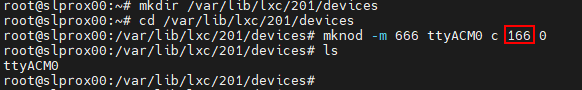

# Проксмокс

## Proxmox - установка ioBroker на ВМ (виртуальную машину)
?> ***Это заполнитель***.   Помогите ioBroker и дополните эту статью. Пожалуйста, обратите внимание на [Руководство по стилю ioBroker](https://www.iobroker.net/#de/documentation/community/styleguidedoc.md), чтобы упростить принятие изменений.

</детали>

## Proxmox - установка ioBroker в LXC (контейнер Linux)
?> ***Это заполнитель***.   Помогите ioBroker и дополните эту статью. Пожалуйста, обратите внимание на [Руководство по стилю ioBroker](https://www.iobroker.net/#de/documentation/community/styleguidedoc.md), чтобы упростить принятие изменений.

</детали>

## Proxmox - LXC (контейнеры Linux) -> Прохождение через USB-устройства
В этой части руководства шаг за шагом объясняется, как пройти через USB-устройство (переход через USB) в Proxmox в LXC (контейнер Linux).

С виртуальной машиной можно передать USB-устройство напрямую через веб-интерфейс Proxmox, а с контейнером Linux для этого в настоящее время необходимо вручную редактировать файл конфигурации lxc.

В инструкциях описывается, как интегрировать **Texas Instruments Inc. CC2531** Zigbee-модуль, но те же шаги можно использовать аналогично для других Zigbee-модулей (ConBee, CC2652P и т. д.) или для других USB-устройств, за исключением сетевых USB-устройств. (Bluetooth/Wlan).

* Для этой части инструкций использовался Proxmox версии 7.1.

### 1.) Соберите информацию об устройстве USB

Установка SSH-соединения с Proxmox:

~~~ ssh root@ip адрес ~~~

**Если USB-устройство уже подключено к хосту Proxmox, отключите его на время.**

Следующая команда выводит список всех подключенных в настоящее время USB-устройств на хосте Proxmox:

~~~ lsusb ~~~

Теперь интегрируемое USB-устройство подключается к хосту Proxmox, и снова выполняется команда lsusb.

На скриншоте видно, что новое устройство с номером шины USB: **001** и номером устройства: **003** указано.

Эта информация необходима для использования следующей команды, например. выведите **старший номер устройства** из устройства:

~~~ ls -l /dev/bus/usb/001/003 ~~~

Важно использовать вывод номера шины USB и номера устройства с помощью команды!

***ls -l /dev/bus/usb/номер-usb-шины/номер-устройства***

USB-устройство в этом примере имеет старший номер устройства **189**, запишите значение вашего устройства в текстовом файле с комментарием: #1

Затем мы выводим уникальный идентификатор USB-устройства и записываем выходное значение в текстовый файл с пометкой: #2

~~~ ls /dev/serial/by-id/ ~~~

В качестве последнего шага выводится основной номер устройства ttyACM и отмечается примечанием: #3:

~~~ ls -l /dev/ttyACM* ~~~

>*Если вывода нет, проверьте с помощью «ls -l /dev/serial/by-id/», интегрируется ли USB-устройство в систему как ttyUSB, если да, замените все следующие команды, которые ссылаются на **ttyACM. ..* * получить от **ttyUSB…** если нет вывода, это не устройство класса USB CDC (последовательная связь), поэтому все точки, которые нужно включить из ttyACM, можно игнорировать.*

Итак, мы записали **три** значения с USB-устройства, необходимые для интеграции в конфигурационный файл lxc.

</детали>

### 2.) Отредактируйте файл конфигурации LXC

Перейдите в каталог конфигурации LXC на хосте Proxmox с помощью:

~~~ cd /etc/pve/lxc ~~~

Файл конфигурации имеет тот же идентификационный номер, который был присвоен при создании lxc!

Перед редактированием конфигурационного файла необходимо создать резервную копию:

~~~ cp 201.conf 201.conf.backup ~~~

Теперь файл конфигурации редактируется с помощью vi или nano:

~~~ нано 201.conf ~~~

В конец конфигурационного файла добавляется следующее:

~~~ lxc.cgroup2.devices.allow: c 189:* rwm lxc.mount.entry: usb-Texas_Instruments_TI_CC2531_USB_CDC___0X00124B0012023529-if00 dev/serial/by-id/usb-Texas_Instruments_TI_CC2531_USB_CDC___0X00124B00

lxc.cgroup2.devices.allow: c 166:* rwm lxc.mount.entry: /dev/ttyACM0 dev/ttyACM0 нет привязки, необязательный, создать=файл ~~~

Замените отмеченные значения на отмеченные записи из вашей заметки!

* Первая строка относится к основному номеру устройства **189** Примечание: #1
* Во второй строке уникальный идентификатор (usb-Texas_Instruments_TI_CC2531_USB_CDC___0X00124B0012023529-if00) из Примечание: #2 дается индивидуально и с абсолютным путем, обратите внимание, что полный текст пишется в одну строку без переносов строк.
* В третьей строке указан основной номер устройства **166** от ttyACM из примечания №3.

Сохраните файл конфигурации (в редакторе nano комбинацией клавиш: CTRL+o & CTRL+x для выхода из редактора)

 

**ОПАСНОСТЬ! – Если в вашем контейнере есть активные моментальные снимки:**

Тогда код lxc.cgroup находится не в конце конфигурационного файла, а перед первой записью моментального снимка.

</детали>

**ОПАСНОСТЬ! - Установка Proxmox до версии 7.0:**

Замените записи на

~~~ lxc.cgroup2 ~~~

через

~~~ lxc.cgroup ~~~

</детали>

  Наконец, введите следующую команду, чтобы установить необходимые права для ttyACM0:

~~~ chmod o+rw /dev/ttyACM* ~~~

Чтобы применить корректировки к lxc, выполните холодную перезагрузку из контейнера с **pct stop id/pct start id**:

~~~ пкт стоп 201 ~~~

~~~ начало пкт 201 ~~~

 

**Совет: лучше всего хранить копию вашего рабочего файла конфигурации извне, т.к. B. встроенный сервис резервного копирования Proxmox не создает резервную копию содержимого вашей конфигурации!**

 

</детали>

### 3.) Проверьте сквозную передачу USB LXC и конфигурацию экземпляра Zigbee.

Установка SSH-подключения к LXC:

~~~ ssh user@ip адрес ~~~

С помощью команд:

~~~ lsusb ~~~

&

~~~ ls -l /dev ~~~

проверяется, были ли корректировки в файле конфигурации успешными.

* Как видно на скриншоте, контейнер теперь имеет доступ к USB-устройству.

* Важно, что ttyACM0 имеет такие же права на скриншоте, т.е. **crw-rw-rw- 1 Nobody nogroup**

>***Если вы не проверите, все ли значения в конфигурационном файле установлены, как описано, права все равно не должны совпадать, тогда переходите к пункту 5.***

* На снимке экрана также видно, что номер устройства cc2531 изменился с 3 на 4, это связано с тем, что флешка в это время была отключена и снова подключена. Однако, поскольку в конфигурационном файле указан уникальный идентификатор, а не номер шины/устройства, сквозная передача через USB продолжает работать.

Если, как описано выше, в контейнер пропущена Zigbee-флешка, ее необходимо прописать в iobroker в настройках Zigbee-адаптера под именем COM-порта.

~~~ /dev/ttyACM0 ~~~

указывается таким образом, чтобы адаптер обращался к правильному устройству.

</детали>

### 4.) Правило UDEV для постоянных прав Настройка ttyACM0

В конце шага 3 использовалась команда

~~~ chmod o+rw /dev/ttyACM* ~~~

соответствующие права установлены для ttyACM0, но изменения этих прав сбрасываются при перезапуске хоста Proxmox.На хосте Proxmox требуется правило udev для постоянной настройки.

С помощью lsusb мы снова выводим список подключенных в данный момент USB-устройств:

~~~ lsusb ~~~

На этот раз мы записываем числовые значения после ID, поэтому в данном случае **0451:16a8**

* Первое значение: ***0451*** означает **idVendor**, а второе значение: ***16a8*** — **idProduct**.

Теперь правило udev создается в /etc/udev/rules.d с помощью vi или nano:

~~~ нано /etc/udev/rules.d/50-myusb.rules ~~~

и добавил следующий контент:

~~~ ПОДСИСТЕМЫ=="usb", ATTRS{idVendor}=="0451", ATTRS{idProduct}=="16a8", GROUP="users", MODE="0666" ~~~

Наконец, выполните следующую команду, чтобы активировать правило udev:

~~~ udevadm control – перезагрузка ~~~

</детали>

### 5.) Устранение неполадок

**Ошибка:** права ttyACM0 в lxc не совпадают или теряются через короткое время (ConBee II).

~~~ ls -l /dev/ttyACM0 c--------- 0 Nobody nogroup 166, 0 7 февраля 14:29 ttyACM0 ~~~

 

**Решение.** Используйте mknod для создания постоянной привязки к контейнеру.

Для этого создается папка **devices** по пути **"/var/lib/lxc/CONTAINERID"** и создается привязка в этой папке с помощью mknod:

~~~ mkdir /var/lib/lxc/201/devices ~~~

~~~ cd /var/lib/lxc/201/devices ~~~

~~~ mknod -m 666 ttyACM0 c 166 0 ~~~

+ *mknod создает в пути файл с именем ttyACM0 (пока файл существует, устройство привязано к lxc)*

***основной номер устройства и ttyACM.. при необходимости отрегулируйте***

Затем необходимо изменить запись в файле конфигурации lxc:

~~~ lxc.mount.entry: /dev/ttyACM0 dev/ttyACM0 нет привязки, необязательный, создать=файл ~~~

будет заменен на:

~~~ lxc.mount.entry: /var/lib/lxc/CONTAINERID/devices/ttyACM0 dev/ttyACM0 нет привязки, необязательно, создать=файл ~~~

</детали>