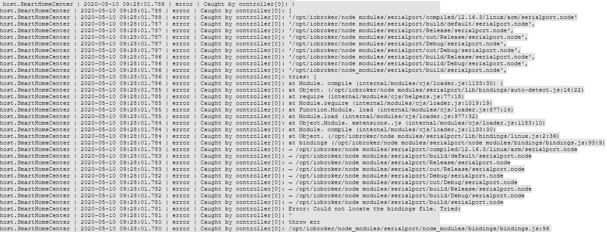

# Обновление Node.js
| js-контроллер | Node.js | НПМ |
| ------ | ----------- | ------------- |
| < 4.х | 12.х, 14.х, 16.х | 6.х |
| 4.х | 12.х, 14.х, 16.х | 6.х, 7.х, 8.х |
| 5.х | 16.х, 18.х, 20.х | 8.х, 9.х |

## Зачем вам это обновлять?
Как это часто бывает со многими технологиями с открытым исходным кодом, Node.js быстро развивается.
Обновления, повышающие **стабильность** и **безопасность** или даже добавляющие **новые функции**, появляются регулярно.

ioBroker не работает без Node.js, подробности об этом см. [архитектура](https://www.iobroker.net/#de/documentation/basics/architecture.md).
Если вы хотите узнать больше о Node.js, [Википедия Node.js](https://de.wikipedia.org/wiki/Node.js).

?> **При изменении версии Node.js необходимо заранее проверить и при необходимости исправить определенные предварительные условия.
Обратите внимание на пути, по которым расположена установка.**

### Процедура
####1 - Проверить обстоятельства
- Версия и путь
- Операционная система
- js-контроллер
- Адаптеры

<details><summary>Почему нужно проверять</summary>

- какая версия и, главное, в каком каталоге находится установка

— В среде Raspi часто используются даже более старые системы на базе «Debian jessie» или «Debian wheezy». Для них нет ничего выше Nodejs 10, при необходимости возможно обновление операционной системы.

- Проверьте, какая версия js-контроллера установлена (также видно на вкладке хоста в админке).

Для версий **до** js-controller 3.x: если возможно, сначала обновите js-контроллер. Желательно минимум 3,2! Есть, например, такой [Вклад](https://forum.iobroker.net/topic/42385/js-controller-3-2-jetzt-im-stable) на форуме.

- Чтобы убедиться в отсутствии несовместимостей или проблем после обновления, следует проверить все адаптеры в системе и при необходимости обновить их.

Лучше всего проверить файл readme адаптера через администратора, в журнале изменений или на GitHub соответствующего адаптера, чтобы узнать, поддерживают ли установленные версии адаптера запланированную версию Node.js.

</подробнее>

#### 2 — Создать резервную копию
Прежде чем вносить какие-либо изменения в систему, необходимо создать резервную копию. В зависимости от системы возможны разные варианты. Рекомендуется использовать адаптер BackitUp или команду командной строки.
Резервная копия должна быть актуальной, чтобы данные не были потеряны, если это возможно.

####3 - Обновить адаптер
Адаптеры, используемые в системе, должны быть совместимы с новой версией Node.js, возможно, их потребуется обновить;

#### 4 — Остановить ioBroker
ioBroker останавливается с помощью собственной консольной команды или через управление системными службами.

#### 5 - Проверьте, выполняются ли процессы
Обычно это завершает все процессы. На всякий случай вам следует еще раз убедиться, что никакие процессы (адаптеры, резервные копии) на самом деле не запущены. Вы также можете использовать такой инструмент, как «top», чтобы проверить, существуют ли еще процессы, начинающиеся с «io». начинать.

#### 6 — Обновление Node.js
Следующим шагом будет обновление Node.js до желаемой новой версии.
Однако обновление отличается в зависимости от установленной операционной системы, см. инструкцию

?> Менеджер пакетов Node, сокращенно `npm`, также будет обновлен; возможно, его придется сбросить до npm v6.x до версии js-controller 3, в зависимости от используемой версии Node.js. Начиная с js-контроллера версии 4, также поддерживается npm v8.x/9.x.

#### 7 - Проверьте версию и пути
После завершения обновления пути и установленные версии проверяются еще раз.

#### 8 — Запустите исправление ioBroker
Поскольку установка Node.js, как говорилось вначале, вносит в систему некоторые изменения, то после этого необходимо запустить фиксер ioBroker.
Помимо прочего, это восстанавливает настройки безопасности, необходимые для работы ioBroker, а также проверяет и исправляет все авторизации.

####9 - Запустите ioBroker
Некоторые используемые модули JavaScript содержат части, которые необходимо скомпилировать. Этот процесс происходит во время установки.
При компиляции эти модули привязываются к версии Node.js. Поэтому после обновления эти части необходимо перекомпилировать.
Начиная с версии js-контроллера 3.0, предпринимались попытки распознавать адаптеры, содержащие такие части, и автоматически пересобирать их.
Этот процесс может занять некоторое время, и затронутые адаптеры могут перезагружаться несколько раз. Это можно наблюдать в файле журнала. Самый простой способ сделать это — в терминале, используя ``iob logs --watch | uniq ``

<details><summary>Автоматическое восстановление</summary>

ioBroker автоматически пытается обнаружить адаптеры, которые не запускаются, поскольку их необходимо обновить. Это работает так: типичные сообщения об ошибках распознаются, и ioBroker пытается соответствующим образом обновить их. Сначала выполняется «пересборка» затронутого адаптера, если это не помогает, зависимости адаптера обновляются. Поэтому адаптер может перезагружаться несколько раз. Пожалуйста, будьте терпеливы здесь! Только когда адаптер постоянно горит красным и в журнале написано, что ребилд не сработал, принимайте меры!

</подробнее>

<details><summary>Ручное восстановление</summary>

Если автоматическая перестройка не сработала, ее можно провести вручную, см. Устранение неполадок.

</подробнее>

<details><summary>Особые случаи (например, последовательный порт)</summary>

К сожалению, существуют особые случаи, когда даже вышеуказанные варианты не завершают восстановление, одним из которых является последовательный порт.

Например, журнал может выглядеть так (даже после всех попыток перестроения).

<details><summary>БРЕВНО</summary>



</подробнее>

Есть и другие сообщения об ошибках, но все они означают одно и то же.
Самый простой вариант — пересобрать вручную в **правильном** каталоге.
В этом случае ищите каталог с «привязками» — выше это */opt/iobroker/node_modules/serialport/node_modules/bindings ...* в более новых версиях это также может быть что-то вроде */opt/iobroker/node_modules/ серийный порт/node_modules /@serialport/bindings*.

Затем перейдите в этот каталог и выполните `npm install --omit=dev`. Затем снова перезапустите адаптер.

Другой случай - адаптеры с канвас-модулем (возможно эчартс или Михоме-вакуум) где могут быть проблемы.

</подробнее>

## Инструкции для Debian/Ubuntu
#### 1 — Проверить версию и путь
```
sudo ln -s /usr/bin/node /usr/bin/nodejs &> /dev/null
type -p nodejs node npm npx corepack && nodejs -v && node -v && npm -v && npx -v && corepack -v

```

- Выход

```
/usr/bin/nodejs
/usr/bin/node
/usr/bin/npm
/usr/bin/npx
/usr/bin/corepack
v18.15.0
v18.15.0
9.6.0
9.6.0
0.19.0
```

Важно следующее: nodejs находится в /usr/bin node находится в /usr/bin npm находится в /usr/bin npx находится в /usr/bin corepack находится в /usr/bin, а также номера версий nodejs и node по состоянию на npm и npx оба согласны.

####2 - Резервное копирование
```
iobroker backup
```

- альтернативные [варианты](https://www.iobroker.net/#de/documentation/config/backup.md)

####3 - Обновить адаптер
- Инструкции можно найти по адресу [Управление адаптерами](https://www.iobroker.net/#de/documentation/tutorial/adapter.md).

#### 4 — Остановить ioBroker
```
iobroker stop
```

#### 5 - Проверьте процессы ioBroker
```
ps aux | grep 'io\|PID'
```

- и

```
ps aux | grep 'backup\|PID'

```

- если процессы все еще выполняются

```
sudo kill -9 <ProzessID>
```

#### 6 — Обновление Node.JS
- Подробности о [Node.Js](https://github.com/nodesource/distributions#installation-instructions)

```
curl -sL https://deb.nodesource.com/setup_18.x | sudo -E bash -
sudo apt install -y nodejs
```

- Для других версий Node.js просто замените 18 в URL-адресе другим номером версии.

!> С марта 2023 года для ioBroker рекомендуется использовать Node.js версии 18!

!> Нечетные версии Node.js использовать нельзя.

#### 7 – Проверить версию/путь
```
type -p nodejs node npm npx corepack && nodejs -v && node -v && npm -v && npx -v && corepack -v
```

#### 8 — Запустите iobroker fixer
```
iobroker fix
```

####9 - Запустите ioBroker
```
 iobroker start
 ```

## Инструкции для Windows
Node.js обновляется путем выполнения [Установщик Windows](./windows.md).

## Инструкции для Docker
- Node.js обычно выполняется путем обновления контейнера до новой версии [Docker Image](https://hub.docker.com/r/buanet/iobroker/tags).
- Подробную процедуру и дополнительную информацию о контейнере iobroker можно найти по адресу [buanet](https://smarthome.buanet.de/2020/10/iobroker-docker-container-updates-upgrades/).

## Решение проблем
### Ручное восстановление
- Есть это

```
iobroker rebuild <adaptername>
```

- если этого недостаточно

```
iobroker rebuild <adaptername> --install
```

- просто запустите его вручную в оболочке. В идеале все должно происходить автоматически.

?> Если версия js-контроллера ниже 4, [ioBroker фиксатор](https://www.iobroker.net/#de/documentation/install/linux.md) должен выполняться даже при обновлении Node.js в основной версии.
В будущем контроллере js версии 4 пересборки будут выполняться полностью автоматически.
В этом случае восстановление вручную больше не поддерживается.