# Установка ioBroker на Windows

## Проверьте предварительные требования

Перед установкой убедитесь, что система соответствует всем необходимым [требованиям](/docs/install/requirements.md) .

Проблемы с установщиком Windows можно обсудить здесь, на форуме: <https://forum.iobroker.net/topic/63610/test-iobroker-unter-windows-installieren-2023-edition>

## Установщик ioBroker для Windows

Программа установки ioBroker для Windows позволяет установить ioBroker на компьютеры с Windows всего за несколько кликов. Сама программа установки не содержит никаких дополнительных программных пакетов. Необходимое программное обеспечение загружается автоматически в процессе установки. Поэтому подключение к интернету абсолютно необходимо.

После установки ioBroker установщик можно использовать для следующих действий:

1. Обновите Node.js до рекомендуемой версии.
2. Запуск ioBroker Fixer
3. Удаление или создание правил для брандмауэра Windows, чтобы обеспечить доступ к ioBroker извне.
4. Укажите, будет ли ioBroker запускаться автоматически при запуске Windows.

Программа установки устанавливается автоматически и находится в меню «Пуск» Windows в разделе «Платформа автоматизации ioBroker» — «Настройка ioBroker».

## Использовать ioBroker под Windows: хорошая ли это идея?

В целом, ioBroker работает одинаково хорошо как на системах Windows, так и на системах Linux. Однако системы Windows могут иметь существенные недостатки при круглосуточной работе, которые каждый пользователь должен учитывать. Windows особенно хорошо подходит для быстрого тестирования ioBroker на уже имеющемся компьютере с Windows.

## Установите ioBroker

Сначала необходимо скачать установщик. Последняя версия всегда доступна на официальной странице загрузки: /installation

Затем двойным щелчком запускается программа установки. Сначала выбираем используемый язык:

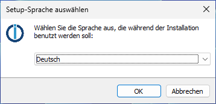

Затем появляется приветственная страница:

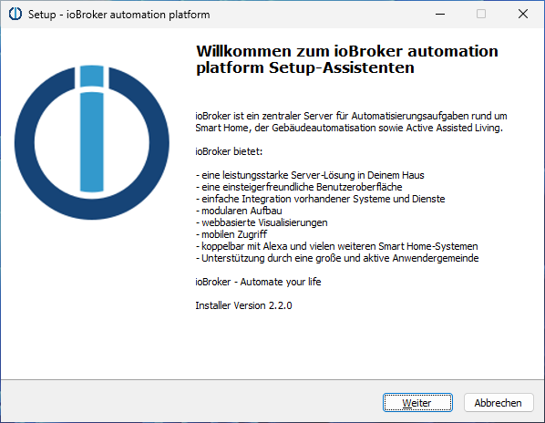

После нажатия кнопки «Далее» появится страница с информацией о лицензии:

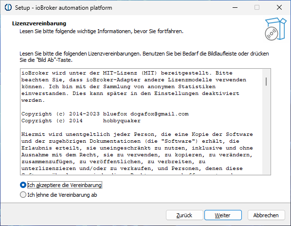

Необходимо принять лицензионное соглашение, а затем снова нажать кнопку «Далее». На следующей странице можно выбрать папку установки ioBroker:

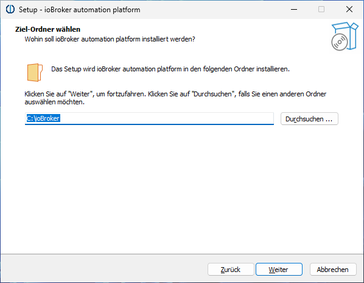

Как правило, лучше всего использовать значение по умолчанию "C:\ioBroker". После нажатия кнопки "Далее" будут выполнены некоторые проверки:

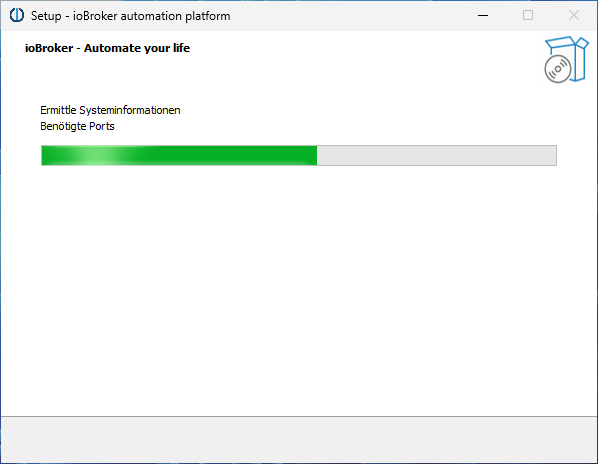

Это может занять некоторое время. Результат проверки появится автоматически:

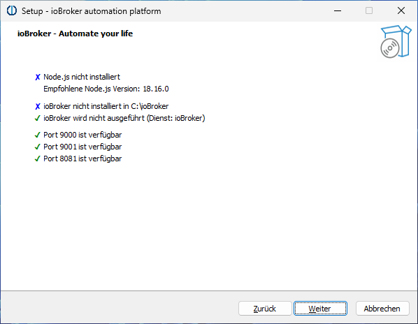

В этом примере всё в порядке, и мы можем продолжить. Если не все необходимые условия выполнены, сначала нужно определить, что делать. Часто порты, необходимые для установки и запуска ioBroker, недоступны. Если вы оказались в такой ситуации и не знаете, что делать, вы можете найти помощь на форуме ioBroker по адресу [https://forum.iobroker.net/.](https://forum.iobroker.net/) После нажатия кнопки «Далее» можно выбрать некоторые детали:

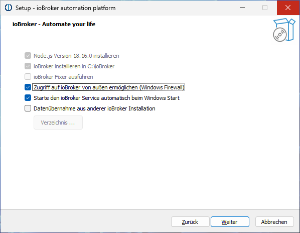

В процессе первоначальной установки ioBroker первые три параметра заданы заранее:

1. Node.js, среда выполнения для ioBroker, загружается и устанавливается в рекомендуемой версии.
2. Сам ioBroker будет установлен.
3. Выбрать ioBroker Fixer невозможно. Следующие два параметра можно изменить, но обычно рекомендуется оставить настройки по умолчанию. Наконец, установщик предлагает возможность импортировать конфигурацию существующей установки. Для этого требуется вся папка "iobroker-data", которая находится в папке ioBroker существующей установки ioBroker. Эта папка может быть из установки ioBroker на Windows или Linux. Данные копируются из этой папки во время установки; содержимое этой папки не изменяется. После нажатия кнопки "Далее" мы видим сводку запланированных действий:

   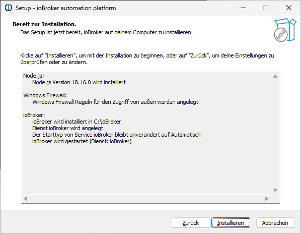

   Нажатие кнопки «Установить» запустит сам процесс установки:

   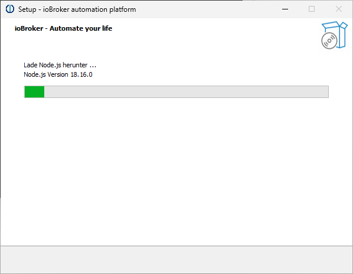

   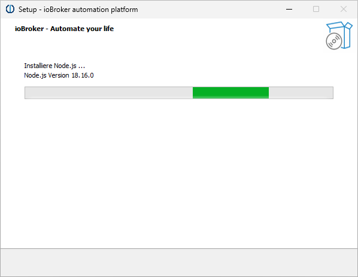

   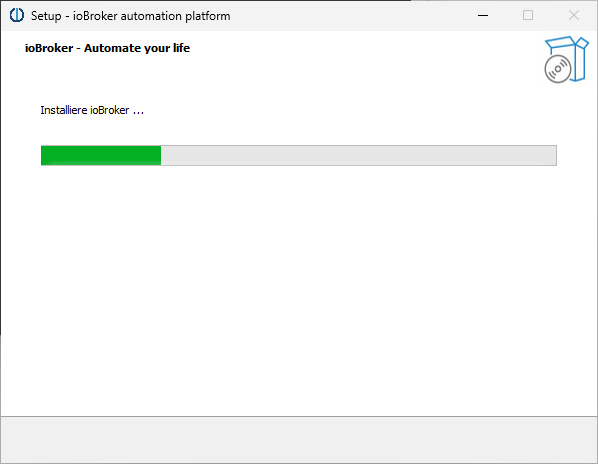

   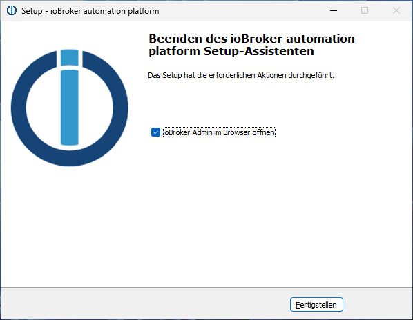

Нажатие кнопки «Готово» откроет веб-браузер, и ioBroker проведет вас через первые шаги настройки.

## Обновлять

Обновления обычно проходят гладко и безопасно. Тем не менее, перед продолжением рекомендуется сделать резервную копию данных.

- Программа установки для Windows может автоматически обновить установленную версию Node.js до рекомендуемой. Просто запустите программу установки из меню «Пуск» Windows («ioBroker Setup») и следуйте инструкциям. Любое доступное обновление Node.js будет автоматически обнаружено и предложено.
- Начиная с версии Windows Installer 3.1.0, обновление JS Controller также можно выполнить с помощью Windows Installer. Просто запустите установщик из меню «Пуск» Windows («ioBroker Setup») и следуйте инструкциям. Любое доступное обновление для JS Controller будет автоматически обнаружено и предложено.
- Также можно обновить контроллеры JavaScript вручную. Однако настоятельно рекомендуется выполнять обновления с помощью установщика Windows.

  Если вы все же хотите выполнить обновление вручную, вы можете сделать это с помощью следующих команд:

  `iob stop`

  `iob update`

  `iob upgrade self`

  `iob start`

## Экспертный режим

В установщике также есть экспертный режим, который обычно не требуется обычному пользователю ioBroker. Его можно активировать на первой странице установщика, дважды щелкнув по логотипу ioBroker и затем установив флажок «Экспертный режим».

Экспертный режим предлагает следующие дополнительные возможности:

- Установка и обслуживание нескольких серверов ioBroker одновременно на одном ПК.
- Установка альфа-версий контроллеров JavaScript

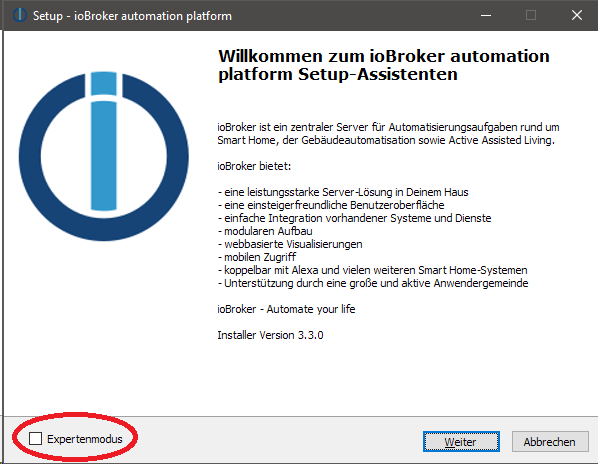

## Поиск неисправностей

**Проблема:** Установка не может быть выполнена, поскольку порт 9001 занят процессом с именем "System".

**Возможное решение:** Известно, что Intel® Graphics Command Center блокирует порт 9001. Проверьте, есть ли на вашем компьютере служба Windows с именем "Graphics Command Center" или аналогичной. Если есть, остановите и отключите эту службу. После этого установка ioBroker должна стать возможной.

**Проблема:** Git не был установлен во время установки ioBroker. В файле журнала содержится соответствующее сообщение об ошибке:`Fehler beim Durchsuchen der Quelle: winget
Unerwarteter Fehler beim Ausführen des Befehls:
0x8a15000f : Data required by the source is missing`

**Возможное решение:** В командном окне ioBroker (из меню «Пуск») введите следующую команду, затем перезапустите установщик и выберите «Восстановить».`powershell -command " Add-AppxPackage -RegisterByFamilyName -MainPackage Microsoft.Winget.Source_8wekyb3d8bbwe"`