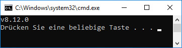

# Установите ioBroker в Windows
?> ***Эта статья в настоящее время дополняется***.<br><br> Помогите в ioBroker. Обратите внимание на [Руководство по стилю ioBroker](../community/styleguidedoc.md), чтобы упростить принятие изменений.

Следующие инструкции помогут вам выполнить установку шаг за шагом. Пожалуйста, не пропускайте ни одного шага, так как некоторые команды основаны друг на друге.

## Проверьте предварительные условия
!> Сначала проверьте, выполняет ли система все необходимые [Требования к установке](requirements.md).

Node.js требуется для запуска ioBroker. Далее предполагается, что на ПК не установлены ни Node.js, ни ioBroker. Если ioBroker уже установлен, перейдите к разделу [обновления](windows.md#update).

Чтобы узнать, установлен ли Node.js, диалоговое окно `Ausführen` открывается комбинацией клавиш <kbd>⊞ Windows</kbd> + <kbd>r</kbd> , а затем командой там

```
cmd.exe /C node -v & pause
```

вошел. После подтверждения команды появится окно.

 *Проверка Node.js*

Отображается либо сообщение об ошибке, либо установленная версия Node.js.

Если выдается номер версии Node.js, необходимо сначала проверить, соответствует ли он по-прежнему [Требования к установке](requirements.md).

Если сообщение об ошибке `Der Befehl "node" ist entweder falsch geschrieben oder konnte nicht gefunden werden.`, значит, node.js не установлен, а установка — [можно начинать сразу](#nodeinst).

## Быстрый старт
?> Это краткое изложение шагов установки предназначено для опытных пользователей ioBroker, которые устанавливали ioBroker несколько раз.

Новичкам следует следовать [подробная инструкция](#nodeinst).

* Версия Node.js 8.x LTS [скачать и установить] (nodejs.md).
* Откройте командную строку `cmd.exe` от имени администратора и выполните следующие команды по порядку.

  выполнять:

```
npm install --global windows-build-tools
md C:\iobroker
cd /d C:\iobroker
npm install iobroker
npm install --production --no-optional --logevel=error
iobroker status
```

<div id="nodeinst"></div>

## Установка Node.js и npm
Node.js устанавливается в соответствии с [это руководство](nodejs.md).

## Установка ioBroker
?> ioBroker можно установить в свободно выбираемую папку на локальном жестком диске. Если путь установки содержит пробелы, полный путь должен быть заключен в кавычки для всех команд.
Пример команды: `dir "C:\ioBroker Testsystem"`.

?> Папка установки по умолчанию для ioBroker — `C:\iobroker`.

1. Откройте окно командной строки от имени администратора. Для этого используйте комбинацию клавиш

<kbd>⊞ Windows</kbd> + <kbd>r</kbd> открыть диалоговое окно `Ausführen` и команду там

```
cmd
```

   вход.

Поскольку окно командной строки должно быть открыто от имени администратора, введите **не** `OK`, а комбинацию клавиш `Strg` + `Umschalt` + `Eingabetaste` . Далее следует запрос безопасности, который необходимо подтвердить с помощью `Ja` или путем ввода пароля администратора.

!> Строка заголовка в открывшемся черном окне командной строки должна начинаться со слова `Administrator:`.

?> Некоторые адаптеры ioBroker содержат компоненты, которые необходимо скомпилировать для Windows. Поэтому перед установкой ioBroker устанавливаются так называемые `windows-build-tools`. Дополнительную информацию о `windows-build-tools` см. в [можно найти здесь](https://github.com/felixrieseberg/windows-build-tools).

1. Windows-build-tools устанавливаются с помощью следующей команды:

```
npm install --global windows-build-tools
```

1. Затем в окне командной строки команда для создания папки установки

   выполнять:

```
md C:\iobroker
```

1. Теперь можно установить собственно инсталляционный пакет ioBroker:

```
cd /d C:\iobroker
npm install iobroker
```

   Результат должен выглядеть так:

```
[...]
╭───────────────────────────────────────────────────────╮
│ The iobroker files have been downloaded successfully. │
│ To complete the installation, you need to run         │
│                                                       │
│   npm i --production --no-optional --logevel=error    │
│                                                       │
╰───────────────────────────────────────────────────────╯

npm notice created a lockfile as package-lock.json. You should commit this file.
npm WARN enoent ENOENT: no such file or directory, open 'C:\iobroker\package.json'
npm WARN iobroker No description
npm WARN iobroker No repository field.
npm WARN iobroker No README data
npm WARN iobroker No license field.

+ iobroker@1.3.0
added 51 packages from 28 contributors and audited 83 packages in 6.937s
found 0 vulnerabilities
```

1. Установка ioBroker завершается следующими командами:

```
cd /d C:\iobroker
npm install --production --no-optional --logevel=error
```

Процесс установки может занять некоторое время. Красные сообщения об ошибках (gyp !ERR), связанные с модулем `unix-dgram`, могут появляться при запуске npm. Эти сообщения об ошибках можно игнорировать.

   Заключительные строки установки должны заканчиваться примерно так:

```
[...]
Write "iobroker start" to start the ioBroker
npm install node-windows@0.1.14 --production --no-optional --logevel=error --save --prefix "C:/iobroker"
ioBroker service installed. Write "serviceIoBroker start" to start the service and go to http://localhost:8081 to open the admin UI.
To see the outputs do not start the service, but write "node node_modules/iobroker.js-controller/controller"
npm WARN optional SKIPPING OPTIONAL DEPENDENCY: unix-dgram@0.2.3 (node_modules\unix-dgram):
npm WARN optional SKIPPING OPTIONAL DEPENDENCY: unix-dgram@0.2.3 install: `node-gyp rebuild`
npm WARN optional SKIPPING OPTIONAL DEPENDENCY: Exit status 1

added 514 packages from 300 contributors and audited 1808 packages in 61.874s
found 23 vulnerabilities (17 low, 6 high)
run `npm audit fix` to fix them, or `npm audit` for details
```

1. Затем вы можете использовать команду

```
iobroker status
```

проверьте, запускался ли ioBroker автоматически как служба Windows.
Ответ должен быть либо

```
iobroker is running
```

   или

```
iobroker is not running
```

   звенеть.

   Если ioBroker не запустился автоматически, введите следующие команды:

```
net start iobroker.exe
iobroker status
```

   Ответ должен быть сейчас

```
iobroker is running
```

   звенеть.

?> В будущем ioBroker будет автоматически запускаться в фоновом режиме при каждом перезапуске системы.

1. Наконец, окно командной строки можно открыть, выполнив команду

```
exit
```

   становится закрытым.

?> Дальнейшая настройка осуществляется с помощью адаптера `Admin`. Он вызывается с помощью веб-браузера и адреса [http://локальный:8081](http://localhost:8081). Через сеть Настройка ioBroker подробно описана в главе [Конфигурация]().

?> Теперь новичкам рекомендуется запускать [Tutorial](). Здесь пошагово представлен интерфейс администрирования и сделаны основные базовые настройки.

##Обновлять
@@@ Подлежит уточнению @@@

## Поиск неисправностей
@@@ Подлежит уточнению @@@