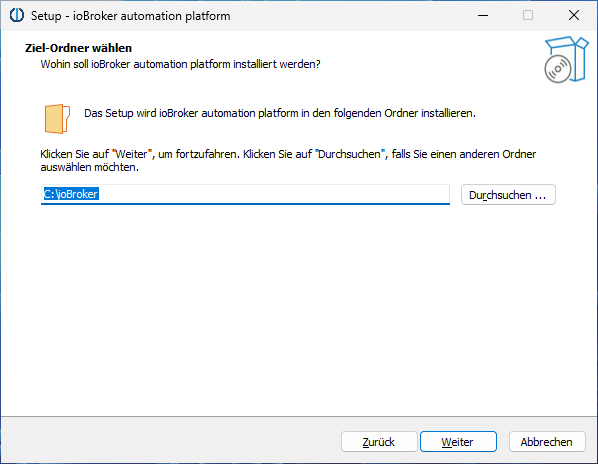

# Оглавление
- [Проверить требования](#check-requirements)
- [Установщик Windows ioBroker](#the-iobroker-windows-installer )
  - [ioBroker для Windows – имеет ли это вообще смысл?](#iobroker-on-windows---имеет ли это какой-либо смысл)
  - [install ioBroker](#iobroker-install )
- [Обновление](#update)
- [Устранение неполадок](#устранение неполадок)

# Проверьте требования
Перед установкой проверьте, соответствует ли система всем необходимым [Требования к установке](./requirements.md).

Проблемы с установщиком Windows можно обсудить здесь, на форуме: https://forum.iobroker.net/topic/63610/test-iobroker-unter-windows-installieren-2023-edition.

# Установщик Windows ioBroker
С помощью установщика Windows ioBroker ioBroker можно установить на ПК с Windows всего за несколько кликов. Сам установщик не поставляется с какими-либо программными пакетами. Необходимое программное обеспечение автоматически загружается во время установки. Поэтому подключение к Интернету является обязательным.

После установки ioBroker установщик можно использовать для следующих действий:

1. Обновите Node.js до текущей рекомендованной версии.
2. Запустите ioBroker Fixer
3. Удалите или создайте правила для брандмауэра Windows, чтобы к ioBroker можно было получить доступ извне.
4. Определите, запускается ли ioBroker автоматически при запуске Windows.

Установщик устанавливается сам, и его можно найти в меню «Пуск» Windows в разделе «Платформа автоматизации ioBroker» — «Настройка ioBroker».

## IoBroker в Windows – имеет ли это вообще смысл?
ioBroker обычно работает в системах Windows так же хорошо, как и в системах Linux. Однако системы Windows, предназначенные для круглосуточного использования, могут иметь системные недостатки, которые каждый должен взвесить самостоятельно.
Windows особенно подходит для быстрого тестирования ioBroker на существующем ПК с Windows.

## Установите ioBroker
Сначала необходимо скачать установщик. Текущая версия всегда доступна на официальной странице загрузки: https://www.iobroker.net/#de/download.

Затем установщик запускается двойным щелчком мыши. Сначала мы выбираем язык, который будем использовать:

Затем появляется страница приветствия:

После нажатия «Далее» появится страница лицензии:

Нам необходимо принять лицензию и снова нажать «Далее». На следующей странице мы теперь можем выбрать папку установки для нашей установки ioBroker:

Обычно рекомендуется просто использовать значение по умолчанию «C:\ioBroker». После нажатия «Далее» будут выполнены некоторые проверки:

Это может занять некоторое время. Результат проверки появится автоматически:

В этом примере все в порядке, и мы можем продолжить. Если все необходимые требования не соблюдены, необходимо сначала уточнить, что необходимо сделать. Порты, необходимые для установки и работы ioBroker, обычно недоступны. Если вы попали в такую ситуацию и не знаете, что делать, вы можете найти помощь на форуме ioBroker по адресу https://forum.iobroker.net/. После нажатия «Далее» мы можем выбрать некоторые детали:

При первичной установке ioBroker фиксируются первые три опции:

1. Node.js, среда выполнения для ioBroker, загружается и устанавливается в рекомендуемой версии.
2. Устанавливается сам ioBroker
3. Невозможно выбрать ioBroker Fixer.

Следующие два параметра можно изменить, но обычно рекомендуется оставить настройки по умолчанию.
И, наконец, установщик предлагает возможность принять конфигурацию существующей установки. Для этого требуется вся папка «iobroker-data», которую можно найти в папке ioBroker, если установлена установка ioBroker. Это может быть связано с установкой ioBroker под Windows или Linux. Данные берутся из этой папки при установке, содержимое этой папки не изменяется.
После нажатия «Далее» мы теперь видим сводку запланированных действий:

   

   При нажатии «Установить» начнется фактическая установка:

   

   

   

   

При нажатии «Готово» открывается веб-браузер, и ioBroker проведет вас через первые шаги настройки.

# Обновлять
@@@ подлежит уточнению @@@

# Поиск неисправностей
@@@ подлежит уточнению @@@