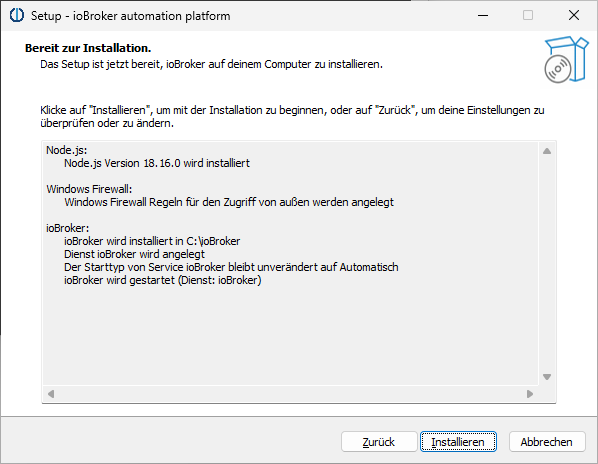

# Проверьте требования
Перед установкой проверьте, соответствует ли система всем необходимым [Требования к установке](./requirements.md).

Проблемы с установщиком Windows можно обсудить здесь на форуме: https://forum.iobroker.net/topic/63610/test-iobroker-unter-windows-installieren-2023-edition

# Установщик ioBroker для Windows
С помощью установщика Windows ioBroker ioBroker можно установить на ПК с Windows всего за несколько щелчков. Сам установщик не включает никаких пакетов программного обеспечения. Необходимое программное обеспечение загружается автоматически во время установки. Поэтому подключение к Интернету является обязательным.

После установки ioBroker установщик можно использовать для следующих действий:

1. Обновите Node.js до текущей рекомендуемой версии.
2. Запустите ioBroker Fixer
3. Удалите или создайте правила для брандмауэра Windows, чтобы к ioBroker можно было получить доступ и извне.
4. Укажите, будет ли ioBroker запускаться автоматически при запуске Windows.

Установщик устанавливается автоматически и его можно найти в меню «Пуск» Windows в разделе «Платформа автоматизации ioBroker» — «Настройка ioBroker».

## IoBroker на Windows — имеет ли это вообще смысл?
ioBroker обычно работает так же хорошо на системах Windows, как и на системах Linux. Однако системы Windows могут иметь присущие им недостатки для круглосуточного использования, которые каждый пользователь должен взвесить для себя.
Windows особенно хорошо подходит для быстрого тестирования ioBroker на существующем ПК с Windows.

## Установить ioBroker
Для начала вам необходимо скачать установщик. Последняя версия всегда доступна на официальной странице загрузки: https://www.iobroker.net/#de/download

Затем дважды щелкните, чтобы запустить установщик. Сначала выберите язык, который вы хотите использовать:

Затем появится приветственная страница:

После нажатия кнопки «Далее» появится страница лицензии:

Нам нужно принять лицензию и снова нажать «Далее». На следующей странице мы теперь можем выбрать папку для установки нашего ioBroker:

Обычно хорошей идеей является простое использование значения по умолчанию "C:\ioBroker". После нажатия "Далее" будут выполнены некоторые проверки:

Это может занять некоторое время. Результаты проверки появятся автоматически:

В этом примере все в порядке, и мы можем продолжить. Если все необходимые требования не выполнены, мы должны сначала выяснить, что нужно сделать. Порты, необходимые для установки и запуска ioBroker, обычно недоступны. Любой, кто оказался в такой ситуации и не знает, что делать, может найти помощь на форуме ioBroker по адресу https://forum.iobroker.net/. После нажатия «Далее» мы можем выбрать некоторые детали:

При первой установке ioBroker первые три параметра предопределены:

1. Node.js, среда выполнения для ioBroker, загружается и устанавливается в рекомендуемой версии.
2. Сам ioBroker установлен
3. ioBroker Fixer не может быть выбран

Следующие два параметра можно изменить, но обычно рекомендуется сохранить настройки по умолчанию.
Наконец, установщик предлагает возможность принять конфигурацию существующей установки. Для этого требуется вся папка "iobroker-data", которая находится в папке ioBroker существующей установки ioBroker. Она может быть получена из установки ioBroker в Windows или Linux. Данные будут импортированы из этой папки во время установки; ее содержимое не будет изменено.
После нажатия "Далее" мы теперь видим сводку запланированных действий:

   

Нажмите «Установить», чтобы начать установку:

   

   

   

   

При нажатии кнопки «Готово» открывается веб-браузер, и ioBroker проведет вас через первые шаги настройки.

## Обновлять
!> Обновления обычно полностью беспроблемны и безопасны. Однако в качестве меры предосторожности перед их выполнением следует сделать резервную копию данных.

- С помощью установщика Windows установленную версию Node.js можно автоматически обновить до рекомендуемого уровня.

Для этого просто запустите установщик из меню «Пуск» Windows («Установка ioBroker») и следуйте инструкциям. Любое доступное обновление для Node.js будет автоматически обнаружено и предложено позже.

- Начиная с версии установщика Windows 3.1.0 контроллер JS также можно обновить с помощью установщика Windows.

Для этого просто запустите установщик из меню «Пуск» Windows («Установка ioBroker») и следуйте инструкциям. Любые доступные обновления для контроллеров JS будут автоматически обнаружены и предложены позже.

- Также возможно обновить контроллеры JS вручную. Однако мы настоятельно рекомендуем выполнять обновления с помощью установщика Windows.

Если вы все же хотите выполнить обновление вручную, вы можете сделать это с помощью следующих команд:

`iob stop`

`iob update`

`iob upgrade self`

`iob start`

## Режим эксперта
Установщик также предлагает экспертный режим, который обычно не требуется для обычных пользователей ioBroker. Его можно активировать на первой странице установщика, дважды щелкнув логотип ioBroker и затем отметив флажок «Экспертный режим».

Режим эксперта предлагает следующие дополнительные функции:

- Установка и обслуживание нескольких серверов ioBroker параллельно на одном ПК
- Установка альфа-версий JS Controller

## Поиск неисправностей
**Проблема:** Установка не может быть завершена, так как порт 9001 занят процессом с именем «System».

**Возможное решение:** Известно, что Intel® Graphics Command Center блокирует порт 9001.
Проверьте, есть ли на вашем ПК служба Windows с именем «Graphics Command Center» или аналогичная. Если да, остановите и отключите эту службу.
Тогда вы сможете установить ioBroker.

**Проблема:** Git не был установлен во время установки ioBroker. Файл журнала содержит соответствующее сообщение об ошибке: `Ошибка просмотра источника: winget Неожиданная ошибка при выполнении команды: 0x8a15000f : Отсутствуют требуемые источником данные`

**Возможное решение:** Введите следующую команду в окне команд ioBroker (из меню «Пуск»), затем перезапустите установщик и выберите «Восстановить».
`powershell -command " Add-AppxPackage -RegisterByFamilyName -MainPackage Microsoft.Winget.Source_8wekyb3d8bbwe"`