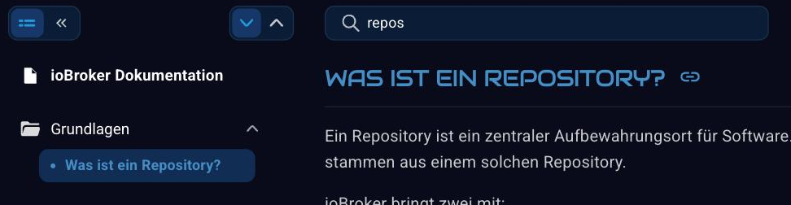
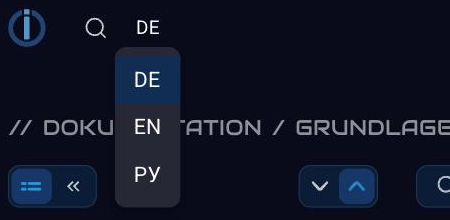

# Структура документации

Данная документация является основным ресурсом для всех пользователей ioBroker. На этой странице объясняется, как в ней ориентироваться.

Веб-сайт имеет **адаптивный** дизайн: в зависимости от ширины экрана элементы управления группируются или скрываются, чтобы освободить место для текста. Поэтому страница выглядит по-разному на телефоне и на изображениях, представленных здесь.

## Области страницы

| Нет. | Область                                                                                                                      |
| ---- | ---------------------------------------------------------------------------------------------------------------------------- |
| 1    | **Главное меню** : ведет к другим разделам сайта.                                                                            |
| 2    | **Меню документа** : дерево всех глав.                                                                                       |
| 3    | **Меню тем** : заголовки текущей открытой страницы.                                                                          |
| 4    | **Выбор языка** .                                                                                                            |
| 5    | **Поиск** : выше — для поиска по всему сайту, в разделе документации — дополнительно в качестве фильтра для дерева разделов. |

Над разделами отображается **навигационная цепочка** : она показывает, где находится текущая страница в дереве, и каждая ее часть является кликабельной.

## 1 Главное меню

Вверху перечислены наиболее важные пункты. Значок с тремя линиями в правом крайнем углу открывает полное меню:

Помимо основных разделов **— документация** , **адаптеры** , **лицензии** и **установка —** вы также найдете блог, форум, статистику, юридическую информацию и политику конфиденциальности. Значки в правом нижнем углу ведут на GitHub, Facebook, Discord и Instagram.

Символ солнца в правом верхнем углу меняет свой внешний вид, переходя из светлого в тёмный.

## 2 Меню документации

Дерево слева ведет по всем главам. Щелчок по папке разворачивает ее, две стрелки над ней разворачивают или сворачивают все дерево целиком.

Поле поиска над текстом фильтрует дерево: после ввода поискового запроса остаются только главы, соответствующие этому запросу.

Двойная стрелка в верхнем левом углу позволяет полностью скрыть дерево, если требуется больше места для текста.

## 3 Меню тем

В правом верхнем углу **этой страницы** отображаются заголовки открытой в данный момент статьи:

Для длинных страниц это самый быстрый способ найти нужный раздел.

## 4. Выбор языка

Документация многоязычная. Немецкие тексты служат образцом; тексты на других языках создаются на его основе и постепенно совершенствуются носителями языка.

## С чего начать?

- Тем, кто еще не знаком с ioBroker, следует начать с [основ](/docs/basics/README.md) .
- В [инструкциях по установке](/docs/install/README.md) описан процесс для Linux, Docker, Proxmox, Windows и macOS.
- В [административном интерфейсе](/docs/admin/README.md) объясняется, как им пользоваться.
- Как точки данных преобразуются в процессы, объясняется в разделе [«Логика и автоматизация»](/docs/logic/README.md) .
- Все адаптеры перечислены по отдельности в [справочнике адаптеров](/adapters) .
- Любой желающий написать собственный адаптер может найти отправную точку в [разделе для разработчиков](/docs/dev/adapterdev.md) .

Данная документация постоянно пополняется. Если чего-то не хватает или требуется более подробное объяснение, [мы будем рады любой помощи](https://forum.iobroker.net/) .