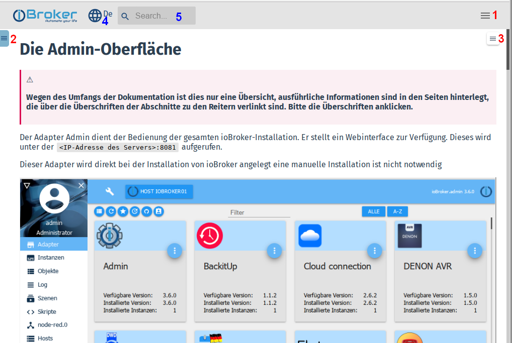

**Эта документация является основным справочником для всех пользователей ioBroker:**

## Структура страницы
Эта страница была создана в ***отзывчивом дизайне***. Это означает, что в зависимости от разрешения дисплея ридера (ПК/планшет/мобильный) он будет отображаться по-разному для обеспечения оптимальной читабельности.

В случае низких (эффективных) разрешений некоторые элементы управления также скрыты, чтобы освободить место для главного окна.

Поэтому вполне возможно, что текущий дисплей отличается от скриншотов.

### Различные меню
Чтобы получить наилучший обзор, есть три разных меню:

---

#### 1 - Главное меню
Основные пункты этого меню обычно видны на ПК в строке заголовка страницы, на низких разрешениях все меню скрыто.
Затем его нужно открыть, нажав на иконку бургера:

После нажатия на элемент меню оно автоматически закрывается, освобождая место для содержимого.

---

#### 2 - Меню документа Это меню обычно видно на ПК, но скрыто при низком разрешении. Затем его нужно открыть, нажав на иконку бургера:

В верхней строке есть поле фильтра. При вводе термина все дерево меню фильтруется в соответствии с этим термином и отображаются только подходящие пункты меню.

Меню можно снова скрыть с помощью значка со стрелкой, чтобы освободить место для содержимого.

---

#### 3 - Тематическое меню
В этом меню отображаются основные темы выбранной статьи, чтобы можно было быстрее перейти к искомому пункту.

Меню можно снова скрыть с помощью значка с **X**.

### Дополнительные элементы управления
#### 4 - Выбор языка
Сайт многоязычный. Дополнительные языки будут добавляться постепенно. Некоторые генерируются сначала автоматически, для улучшения текстов приглашаются носители языка.

Желаемый язык можно выбрать на значке земного шара.

Этот список языков будет расширяться по мере необходимости.

#### 5 - Поиск
Это поле не нуждается в пояснении. Пожалуйста, используйте широко!

---

* Для начинающих мы рекомендуем сначала прочитать некоторые основы ioBroker.

Подробнее об этом в главе [Основы][].

* На странице [Скачать][] есть готовые образы для разных систем.

Там же доступны подробные инструкции по установке для некоторых аппаратных платформ.

* Центральный [справочник по адаптерам][] предоставляет информацию обо всех адаптерах.
* Создание правил управления описано в разделе [Логика и автоматизация][].

Мы благодарны за каждую руку помощи. Если вы хотите внести свой вклад в дальнейшее развитие ioBroker, вы найдете информацию в [зоне для разработчиков][].

Эта документация постоянно расширяется. Если вы считаете, что что-то отсутствует или должно быть описано лучше, [помогите нам][] улучшить документацию!

[Grundlagen]: https://www.iobroker.net/#de/documentation/basics/README.md

[Download]: https://www.iobroker.net/#de/download

[Adapter-Referenz]: https://www.iobroker.net/#de/adapters

[Logik & Automatisierung]: https://www.iobroker.net/#de/documentation/logic/examples.md

[Developer Bereich]: https://www.iobroker.net/#de/documentation/dev/adapterdev.md

[helfen Sie uns dabei]: https://forum.iobroker.net/viewtopic.php?f=8&t=16933
