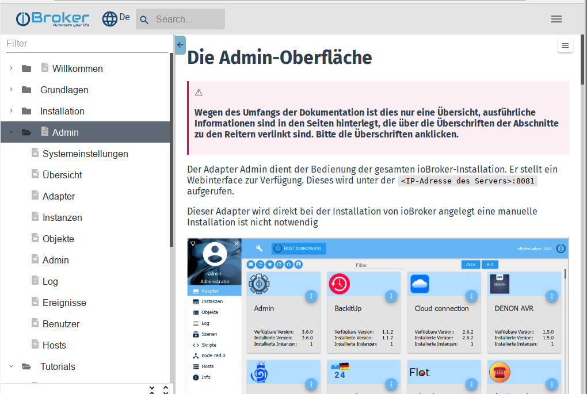

**Эта документация является основным справочником для всех пользователей ioBroker:**

## Структура страницы
Эта страница создана с ***адаптивным дизайном***. Это означает, что оно отображается по-разному в зависимости от разрешения дисплея считывателя (ПК/планшета/мобильного телефона) для оптимальной читаемости.

При низком (эффективном) разрешении некоторые элементы управления скрыты, чтобы освободить место для главных окон.

Поэтому возможно, что текущий дисплей отличается от скриншотов.

### Различные меню
Чтобы получить максимально возможный обзор, существует три различных меню:

---

#### 1 - Главное меню
Основные пункты этого меню обычно видны в заголовке страницы на ПК, при низких разрешениях все меню скрыто;
Затем его необходимо открыть, нажав на значок бургера:

После нажатия на пункт меню меню автоматически закрывается, чтобы освободить место для содержимого.

---

#### 2 — Меню «Документация» Это меню обычно видно на ПК, но скрыто при низком разрешении. Затем его необходимо открыть, нажав на значок бургера:

В верхней строке есть поле фильтра. При вводе термина все дерево меню фильтруется по этому термину и отображаются только соответствующие пункты меню.

Используя значок со стрелкой, меню можно снова скрыть, чтобы освободить больше места для содержимого.

---

#### 3 - Меню тем
В этом меню отображаются основные темы выбранной статьи, чтобы можно было быстрее перейти к искомому пункту.

Меню можно снова скрыть, используя значок **X**.

### Больше элементов управления
####4 - Выбор языка
Веб-сайт спроектирован так, чтобы быть многоязычным. Дополнительные языки будут добавляться постепенно. Некоторые изначально генерируются автоматически, для доработки текстов приглашаются носители языка.

Желаемый язык можно выбрать с помощью значка глобуса.

При необходимости этот список языков будет расширяться.

#### 5 - Поиск
Это поле не требует пояснений. Пожалуйста, используйте широко!

---

* Новичкам мы рекомендуем сначала прочитать основы ioBroker.

Подробнее об этом в главе [Основы][].

* На странице [Скачать][] имеются готовые образы для различных систем.

Там же доступны подробные инструкции по установке для некоторых аппаратных платформ.

* Информацию обо всех адаптерах можно найти в центральном [Справочнике по адаптерам][].
* Создание правил контроля описано в разделе [Логика и автоматизация][].

Мы благодарны за каждую руку помощи. Если вы хотите внести свой вклад в дальнейшее развитие ioBroker, вы можете найти информацию в [Зона разработчика][].

Эта документация постоянно расширяется. Если вы считаете, что чего-то не хватает или что-то нужно описать лучше, [помогите нам][] улучшите документацию!

[Grundlagen]: https://www.iobroker.net/#de/documentation/basics/README.md

[Download]: https://www.iobroker.net/#de/download

[Adapter-Referenz]: https://www.iobroker.net/#de/adapters

[Logik & Automatisierung]: https://www.iobroker.net/#de/documentation/logic/examples.md

[Developer Bereich]: https://www.iobroker.net/#de/documentation/dev/adapterdev.md

[helfen Sie uns dabei]: https://forum.iobroker.net/viewtopic.php?f=8&t=16933