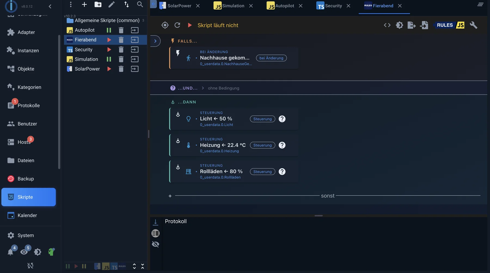

# Логика и автоматизация

ioBroker собирает данные: температуру, состояние переключателя, время. Только логика превращает это в умный дом. Он отслеживает состояния, принимает решения и устанавливает другие состояния — «если балконная дверь открыта более пяти минут и отопление включено, то выключить отопление и отправить сообщение на телефон».

Существует несколько способов записать эту логику. Они не являются взаимоисключающими: в зрелой системе графические правила и JavaScript существуют бок о бок, каждый в той позиции, которая требует наименьших усилий.

## Где работает логика

Большинство методов используют **один** адаптер — [адаптер JavaScript](/adapters/javascript) . После установки он добавляет вкладку _«Скрипты»_ в административный интерфейс и выполняет там скрипты Blockly, правила, JavaScript и TypeScript. Тем, кто хочет использовать только один из этих четырех адаптеров, достаточно установить этот единственный адаптер.

Есть еще два подхода — использование пользовательских адаптеров: [Node-RED](/adapters/node-red) включает в себя редактор потоков Node-RED Flow Editor, а [Scenes](/adapters/scenes) сохраняет сцены без необходимости программирования.

## Маршруты вкратце

| Прочь                                   | Что это такое                                                                     | адаптер      |
| --------------------------------------- | --------------------------------------------------------------------------------- | ------------ |
| [Блокли](/docs/logic/blockly.md)        | Графические строительные блоки, которые можно соединять друг с другом.            | JavaScript   |
| Регулировать                            | Форма, основанная на принципе _«если - то»_ , без каких-либо строительных блоков. | JavaScript   |
| [JavaScript](/docs/logic/javascript.md) | Полный язык программирования с API для написания скриптов ioBroker.               | JavaScript   |
| [Машинопись](/docs/logic/typescript.md) | JavaScript с проверкой типов перед запуском                                       | JavaScript   |
| [Node-RED](/docs/logic/nodered.md)      | Специализированный редактор, в котором узлы соединяются линиями.                  | узел-красный |
| сцены                                   | Список штатов и их целевых значений, а не программа.                              | сцены        |

_В редакторе есть правило: вверху — триггер, ниже — условие, ещё ниже — действия. Ничего не собирается, а просто выбирается._

## Какой путь для чего

**Сцены** — это не программа, а сохраненная ситуация: «Телевизор» устанавливает пять ламп на определенные значения. Тем, кому нужны только такие ситуации, логика не нужна, достаточно адаптера для сцен. Сцены можно впоследствии вызвать любым другим способом.

**Правила** обеспечивают самый быстрый способ начала автоматизации, когда она действительно следует принципу « _если это условие, то то действие_ ». Ничего не собирается, вместо этого выбираются элементы. Начиная с версии 10.1.0 адаптера JavaScript, мастер шаг за шагом проводит пользователя через триггеры, условия и действия, в конечном итоге отображая готовое правило. Он автоматически открывается один раз для вновь созданных правил; после этого он остается доступным на панели блоков правил.

**Blockly** — это правильный выбор, когда в дело вступают множественные условия, задержки или циклы, и никто не хочет писать код. Это не игрушечная версия: базовые компоненты охватывают большую часть API для работы со скриптами, а сгенерированный код JavaScript можно просмотреть из любого скрипта Blockly.

Использование **JavaScript** становится оправданным, когда скрипт становится сложным — множество похожих случаев, пользовательские функции, структуры данных, модули npm. Скрипт Blockly, состоящий из тридцати строительных блоков, обычно представляет собой десять строк кода на JavaScript.

**TypeScript** — это JavaScript с предварительной проверкой. Он полезен для длинных скриптов, к которым вы редко обращаетесь и поэтому не помните их.

**Node-RED** отлично подходит для случаев, когда данные из множества источников сходятся и обрабатываются — протоколы, HTTP-запросы, очереди. Для сценариев типа «если движение, то свет» это более сложный подход, поскольку он работает как отдельный процесс параллельно с ioBroker.

Один подход не исключает другой. Обычно простые автоматизации выполняются в виде правил или в Blockly, а JavaScript используется только для тех случаев, когда это было бы нецелесообразно в Blockly.

## Это относится ко всем маршрутам.

Какой бы путь ни был выбран, три вещи всегда остаются неизменными.

**Логика реагирует, а не задает вопросы.** Скрипт, который проверяет изменения каждую секунду, почти всегда ошибается. ioBroker автоматически сообщает о каждом изменении; затем логика использует этот отчет. Это не только эффективнее, но и точнее.

**Флаг подтверждения разделяет команды и обратную связь.** Каждое состояние, помимо своего значения, имеет свой флаг.`ack` .`ack: false` означает «это команда устройству».`ack: true` Это означает, что «устройство сообщает об этом». Если вы не различаете триггеры, вы создаете циклы: скрипт переключается, устройство подтверждает, подтверждение снова запускает скрипт. [Подробнее](/docs/basics/states.md) см. в разделе «Состояния».

**Состояния — это общая память.** Скрипты не используют общие переменные — даже два скрипта в одном экземпляре. Если одному скрипту нужно что-то передать другому, он делает это через состояние.

## Начинать

1. В разделе «Администрирование» в подразделе _«Адаптеры»_ установите адаптер JavaScript и создайте экземпляр.
2. Введите географические координаты в настройках экземпляра. Без них невозможно рассчитать время восхода и захода солнца, а они вам нужны быстро.
3. Откроется новая вкладка _«Скрипты»_ . Создайте там новый скрипт, используя значок листа слева, и выберите тип — правила, Blockly, JavaScript или TypeScript.
4. Скрипт будет выполнен только при активации с помощью кнопки воспроизведения.

Для первоначального тестирования рекомендуется запустить второй экземпляр JavaScript. В случае критической ошибки будет завершена работа только этого тестового экземпляра, а не того, который запускает систему управления отоплением. Более подробную информацию можно найти в разделе [«Устранение неполадок»](/docs/logic/help.md) .

## Дальше

- [Блокли](/docs/logic/blockly.md)
- [JavaScript](/docs/logic/javascript.md)
- [Машинопись](/docs/logic/typescript.md)
- [Node-RED](/docs/logic/nodered.md)
- [Поиск неисправностей](/docs/logic/help.md)
- [Передовые методы](/docs/logic/examples.md)