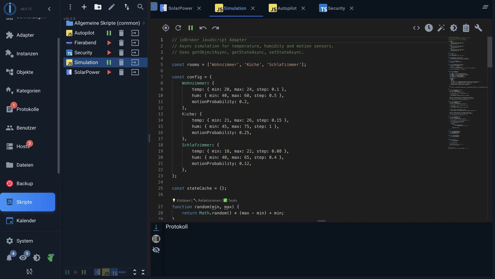

# JavaScript

[Адаптер JavaScript](/adapters/javascript) выполняет стандартный JavaScript и предоставляет ряд дополнительных функций для чтения, записи и мониторинга состояния. Эти функции составляют скриптовый API ioBroker; это единственное отличие от JavaScript, который обычно работает в Node.js.



_Редактор во вкладке «Скрипты»: скрипты слева, код справа, журнал выполнения скриптов внизу._

## Первый сценарий

```js
on({ id: 'hm-rpc.0.LEQ1234567.1.STATE', change: 'ne', ack: true }, obj => {
    if (obj.state.val) {
        setState('hm-rpc.0.LEQ7654321.1.STATE', true);
    }
});
```

Перевод: Как только датчик движения сообщит об _изменении_ (`change: 'ne'` (также _не равно_ ) и это обратная связь от устройства (`ack: true` ), лампа включена.

## Наиболее важные функции

Полную справочную информацию со всеми параметрами можно найти в [документации к скрипту адаптера](/adapters/javascript) . Для начала достаточно нескольких параметров.

**Реагирование на изменения**

| функция                  | За что                                                             |
| ------------------------ | ------------------------------------------------------------------ |
| `on(muster, callback)`   | Реагирование на изменения в одном или нескольких состояниях        |
| `once(muster, callback)` | То же самое, но только в первый раз.                               |
| `unsubscribe(handler)`   | Отменить подписку                                                  |
| `$('...')`               | Обращение к нескольким состояниям одновременно с помощью селектора |

**Чтение и письмо**

| функция                         | За что                                                                      |
| ------------------------------- | --------------------------------------------------------------------------- |
| `getState(id)`                  | Получите текущее значение                                                   |
| `setState(id, wert, ack)`       | Установка значения                                                          |
| `setStateChanged(id, wert)`     | Пишите только в том случае, если значение отличается.                       |
| `setStateDelayed(id, wert, ms)` | Устанавливается после периода ожидания без приостановки выполнения скрипта. |
| `existsState(id)`               | Проверьте, существует ли это условие вообще.                                |
| `createState(name, wert)`       | Создайте отдельное состояние ниже экземпляра.                               |

**Время**

| функция                      | За что                                                              |
| ---------------------------- | ------------------------------------------------------------------- |
| `schedule(muster, callback)` | Запускать регулярно в определенное время, также известное как CRON. |
| `getAstroDate(name)`         | Восход, закат, сумерки и подобные события                           |
| `setTimeout` /`setInterval`  | Как и в любом JavaScript                                            |

**Поговорите с другими пользователями адаптеров.**

`sendTo('telegram.0', 'send', { text: 'Fenster offen' })` Отправляет сообщение экземпляру адаптера. В документации к каждому адаптеру указано, какие команды понимает данный экземпляр.

!>`schedule` и`setInterval` Они не сохраняются после перезапуска скрипта, но и не сохраняются, если их забыть: если вы создадите интервал в скрипте, а затем измените его, интервалы будут накапливаться. Адаптер автоматически очищает свои собственные расписания при перезапуске скрипта.

## Как выполняется скрипт

Каждый скрипт представляет собой отдельную область. Два скрипта **не** используют одни и те же переменные — даже в рамках одного экземпляра. Для передачи значений создается специальное состояние.

Исключением являются скрипты в **глобальной** папке: их содержимое добавляется перед каждым другим скриптом. Это позволяет хранить собственные функции в одном месте и использовать их повсюду. Однако даже здесь каждое выполнение получает свою собственную копию переменных. Глобальный скрипт — это общий набор функций, а не общая память.

Адаптер задает состояние для каждого скрипта.`javascript.<Instanz>.scriptEnabled.<Skriptname>` Это указывает на то, запущен ли скрипт, и может быть настроено — таким образом, один скрипт может включать и выключать другой.

## Дополнительные модули

В настройках экземпляра можно указать модули npm, которые затем будут использоваться во всех скриптах этого экземпляра.`require` Доступно. Для всего, что предлагает Node.js, например:`fs` или`http` Вход свободный.

## Бревно

`console.log` ,`console.warn` и`console.error` Вывод записывается в лог под редактором и одновременно в лог ioBroker. В окне лога отображаются только сообщения из текущего открытого скрипта.

?> Сообщения о`debug` Эти записи отображаются только в том случае, если уровень протокола экземпляра установлен соответствующим образом. Это правильный уровень для скриптов, работающих непрерывно.`info` Журнал заполняется при каждом обнаружении движения.

## Искусственный интеллект-помощник в редакторе

Начиная с версии 10 адаптера JavaScript, редактор скриптов включает окно чата для помощи в написании. Оно может предлагать варианты кода, объяснять существующий код, изменять его, добавлять комментарии, исправлять ошибки и генерировать тесты; оно также предоставляет подсказки по мере ввода и предварительный просмотр, показывающий изменения рядом с текущей версией перед их применением. В Blockly тот же помощник предлагает строительные блоки; см. [Blockly](/docs/logic/blockly.md) .

### Что ему для этого нужно?

**Языковая модель не от ioBroker.** Адаптер предоставляет пользовательский интерфейс; доступ к языковой модели предоставляется пользователем: либо через учетную запись у одного из поддерживаемых провайдеров, либо через языковую модель в собственной сети. Конкретные требования к этому доступу определяются соответствующим провайдером. Пока не введен ключ, функция остается отключенной, и все остальное в адаптере работает как прежде.

Поддерживаются OpenAI, Anthropic Claude, Google Gemini и DeepSeek. Кроме того, имеется поле для пользовательской, совместимой с OpenAI конечной точки: это позволяет обращаться к модели, работающей в вашей собственной сети, или к другой службе, использующей тот же интерфейс. Ключ хранится в настройках экземпляра или извлекается из центрального менеджера учетных данных доступа. Адаптер автоматически получает доступные модели от поставщика.

### Что выходит на улицу

Помощник работает не только с содержимым редактора. Он может искать точки данных, считывать их значения и объекты, перечислять и открывать существующие скрипты, считывать содержимое редактора и выделенные фрагменты, а также выполнять код для целей тестирования. Полученная информация затем отправляется вместе с запросом поставщику модели — то есть, изнутри компании. Пользователи, которым это не нужно, должны либо использовать модель в своей сети через свою собственную конечную точку, либо вообще не вводить ключ.

Предложение — это всего лишь предложение. Его следует прочитать и протестировать, прежде чем применять к системе отопления, гаражным воротам или системе орошения. Это относится как к сгенерированному коду, так и к изменениям, предложенным помощником для работающего скрипта.

## Дальше

- [TypeScript](/docs/logic/typescript.md) — тот же API с проверкой типов.
- [Передовые методы](/docs/logic/examples.md)
- [Поиск неисправностей](/docs/logic/help.md)