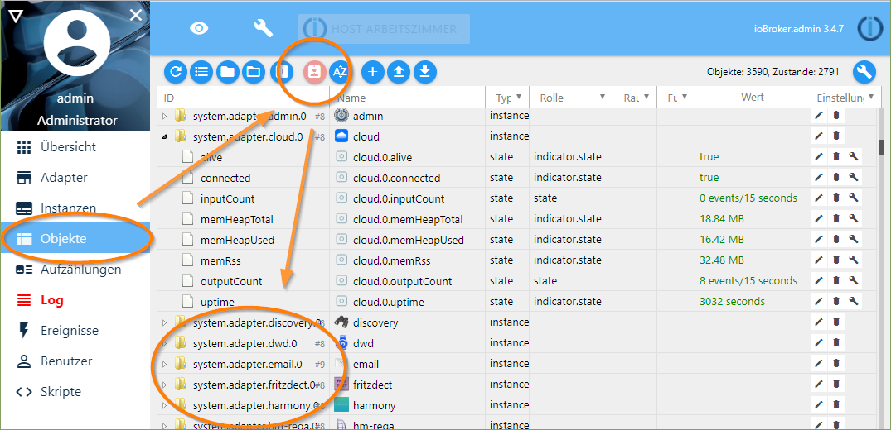
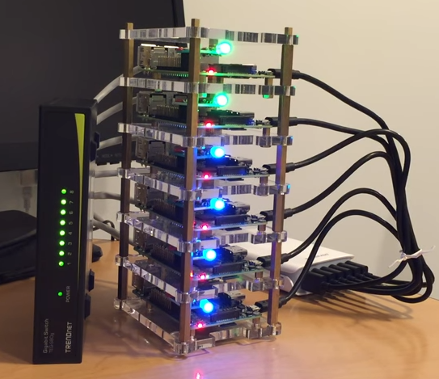
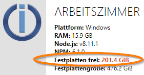
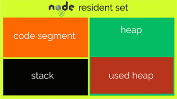
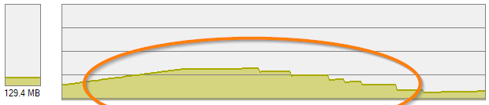
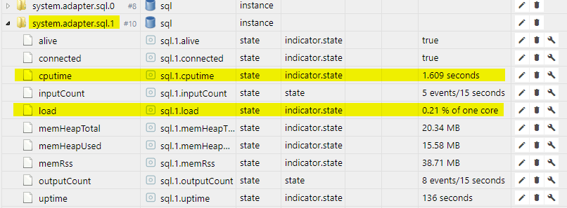
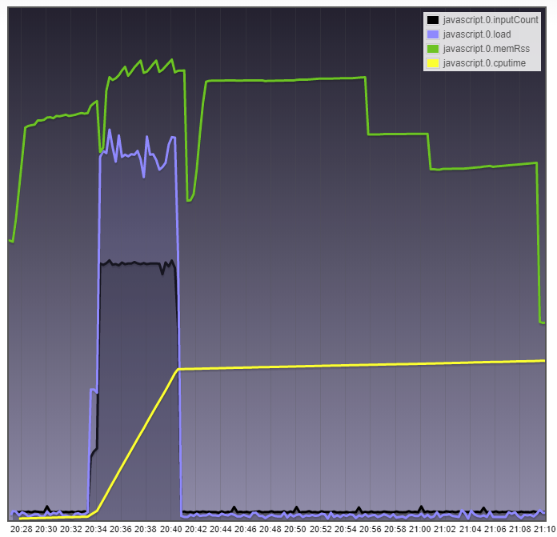
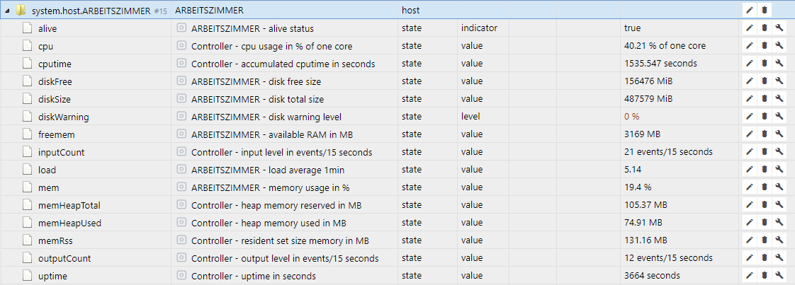

# Мониторинг производительности
Отправной точкой для анализа производительности в ioBroker является список объектов в админке.
Там предоставляется системная информация о хосте или хостах (ioBroker может работать с несколькими хостами) и об отдельных адаптерах. Вы можете получить доступ к этой информации, переключив список объектов в экспертный режим:

## Значения производительности хоста
Хост, на языке ioBroker, — это машина, на которой запущен процесс контроллера ioBroker js.
В среде с несколькими хостами это также может быть несколько компьютеров для распределения нагрузки.
Даже соответствующая используемая операционная система может отличаться.
Хорошая задача, например, для кластерных стеков Raspberry Pi, чтобы справиться с аппаратным ограничением ОЗУ в 1 ГБ.

Контроллер ioBrokers js координирует запуск и остановку адаптеров и выполняет другие задачи управления системой в фоновом режиме. В админке вы можете найти значения производительности для соответствующего хост-компьютера и для контроллера js под идентификатором `system.host.<Name_des_Hostrechners>`.

Вот список отдельных ключевых цифр и их значение:

| мера | тип данных | единица | Описание |
|----------|----------|---------|--------------|
| **живой** | логика | нет | Указывает, активен ли js-контроллер ioBroker на хосте |
| **дискБесплатно** | номер | МиБ | Свободное место на логическом диске, на котором установлен ioBroker *bi = двоичное число (1 МБ = 1 000 000 байт) < (1 МБ = 1 048 576 байт = 1 × 1024 × 1024 байт)* |
| **размер диска** | номер | МиБ | Общий размер логического диска, на котором установлен ioBroker |
| **предупреждение о диске** | номер | % | Вы можете ввести процент здесь. Предупреждение отображается в Admin, если свободное место на носителе данных падает ниже этого значения (например, 20). Это особенно полезно, когда адаптер истории активен.  |
| **свободная память** | номер | МБ | Общая доступная системная память хоста RAM |
| **inputCount** | номер | /15с | Количество изменений в значениях состояния. Входное событие может, например, инициироваться созданием или установкой значения |
| **загрузить** | номер | % | Общая системная загрузка ЦП, усредненная за одну секунду. Не удивляйтесь, под Windows это значение всегда равно 0 |
| **мем** | номер | % | использование памяти. Соотношение между свободной памятью и общей системной памятью |
| **memHeapTotal** | номер | МБ | Размер кучи памяти, зарезервированной контроллером js |
| **memHeapUsed** | номер | МБ | Размер кучи, используемой контроллером js |
| **memRss** | номер | МБ | резидентный набор, общий объем памяти, используемый контроллером js в ОЗУ |
| **outputCount** | номер | /15с | К выходным событиям относятся такие действия, как сравнение значений, запись значения в базу данных состояний, события из-за подписки или регистрация адаптера, например, для получения информации о состояниях .connected|или .alive. Таким же образом возникают 8 событий, которые обычно находятся в выходном значении события в списке экземпляров. |
| **время работы** | номер | с | Время работы ioBroker на этом хосте с момента последнего перезапуска |

На следующей диаграмме символически показано, как куча, код и стек влияют на общее использование памяти **memRss** процессом nodejs:

Если главный контроллер js сам предоставляет базу данных объектов и состояний для всей системы, вы можете использовать этот показатель для определения разницы между 300 и 3000 объектами ioBroker с точки зрения потребления памяти. Например, в моей системе Windows это значение колеблется между 75 и 128 МБ с 3500 объектами и 2700 состояниями. Привет от сборщика мусора, интегрированного в nodejs.
С другой стороны, если я использую Redis в качестве базы данных состояния, потребление памяти для контроллера js падает до 50 МБ.
(Теперь Redis снова нужны дополнительные 25 МБ = 75 МБ ;))

Если количество изменений состояния превышает возможности обработки зависимых потребителей событий (например, Javascript с триггерами on:), в базах данных в памяти создается очередь.
Это видно по потреблению памяти контроллером js. Как только нагрузка на систему снова падает и потребителям событий предоставляется достаточно времени для обработки ожидающих изменений значений, значение memRss возвращается к исходному значению:

Как это часто бывает в этой среде, невозможно сделать точные выводы о причине ошибок на основе фиксированных значений.
Однако часто помогает наблюдение за исправной системой (= эталонные значения) и последующее сравнение **той же системы** в условиях неисправности. Кроме того, очень полезно записывать ту или иную точку данных в истории, например, для записи тенденций и выбросов.

## Значения производительности адаптеров
У каждого адаптера свои показатели производительности.
Каждый из них хранится под идентификатором `system.adapter.<Name_des_Adapters>.<Instanz>` и немного отличается от идентификатора хоста.

| мера | тип данных | единица | Описание |
|----------|----------|---------|--------------|
| **живой** | логика | нет | Указывает, активен ли адаптер |
| **подключено** | логика | нет | Указывает, сообщал ли адаптер в течение последних 30 секунд |
| **inputCount** | номер | /15с | Количество изменений в значениях состояния. Входное событие может, например, инициироваться созданием или установкой значения |
| **memHeapTotal** | номер | МБ | Размер динамической памяти, зарезервированной адаптером |
| **memHeapUsed** | номер | МБ | Размер динамической памяти, используемой адаптером |
| **memRss** | номер | МБ | Резидентный набор, общий объем памяти, используемой адаптером в ОЗУ |
| **inputCount** | номер | /15с | Количество изменений в значениях состояния. Входное событие может, например, инициироваться созданием или установкой значения |
| **outputCount** | номер | /15с | К выходным событиям относятся такие действия, как сравнение значений, запись значения в базу данных состояний, события из-за подписки или регистрация адаптера, например, для получения информации о состояниях .connected или .alive. Таким же образом возникают 8 событий, которые обычно находятся в выходном значении события в списке экземпляров. |
| **время работы** | номер | с | Время работы адаптера с момента его запуска |

Если, например, JavaScript-адаптер внезапно подскакивает со 100 событий **inputCount** до нескольких тысяч после изменения скрипта, есть сильное подозрение, что в скрипт встроена триггерная петля, т. е. кольцевая ссылка.

Также имеет смысл обратить внимание на **memRss**, например, для обнаружения утечек памяти, вызванных скриптами или адаптерами. С **активным** и **подключенным** вы можете очень хорошо визуализировать состояние адаптера или отключить отображение неверных данных, если адаптер не может предоставить какие-либо новые значения.

## Внешний вид и вопрос
Я просто покажу вам картинку, чтобы заглянуть в будущее (и в мою среду разработки):

При использовании адаптеров отсутствует отображение загрузки ЦП **ЦП**, вызванной отдельным адаптером.
Ведь хочется знать, кто виноват в системе, даже без ресурсоемкой установки дополнительных адаптеров мониторинга. Поскольку nodejs является однопоточным, отображение здесь относится к одному ядру ЦП. Больше 100% здесь невозможно.

Использование процессоров с несколькими ядрами не помогает, если адаптер постоянно показывает здесь высокие значения.
В этом случае целесообразны только более быстрый процессор (обычно более высокая частота), оптимизация программного кода или распределение нагрузки на несколько адаптеров (если это возможно).

Показатель **cputime** позволяет оценить общее время процессора, использованное адаптером с момента его запуска.
Он предоставляет информацию о частоте или интенсивности (ключевое слово вычислительно интенсивной), с которой программа использует процессор.
Эта сумма практически всегда меньше, чем общее время работы адаптера **uptime**, так как адаптер почти никогда не отправляет команды процессору без перерыва, даже при интенсивном использовании.

Здесь вы можете увидеть, как взаимодействуют различные показатели и как адаптер Javascript реагирует на внезапную волну запросов во Flot:

Кстати, здесь JavaScript-адаптер был уже настолько занят, что уже не мог сразу принимать все события.
Сформирована очередь событий.

Чтобы мы тоже могли узнать немного больше о нагрузке на <u>хост</u> и там особенно о мастере всех адаптеров, js-контроллере, я также предусмотрел для этого некоторые счетчики производительности. Следующая компиляция показывает возможное будущее появление счетчиков производительности хоста.

Как я уже сказал, это подлежит проверке Bluefox и самое раннее из js-Controller 1.5.x:

Подводя итог, значение точек данных:

| мера | тип данных | единица | Источник данных | Описание |
|----------|----------|---------|-------------|--------------|
| **живой** | логика | нет | js-контроллер | Указывает, активен ли контроллер js ioBroker на хосте. Автоматически переключается на false | через 25 секунд после смерти |
| **процессор** | номер | % использования ядра | js-контроллер | Указывает использование ядра, на котором работает js-контроллер. Намного больше 100% здесь невозможно, так как nodejs однопоточный |
| **процессор** | номер | с | js-контроллер | Процессорное время (англ. CPU time) описывает измеренное время в секундах, за которое js-контроллер фактически отправлял команды процессору с момента последнего запуска программы. Эта сумма практически всегда меньше, чем общее время работы (аптайм) программы, так как она почти никогда не отправляет команды процессору без перерыва, даже при интенсивном использовании. |
| **дискБесплатно** | номер | МиБ | | Свободное место на логическом диске, на котором установлен ioBroker *bi = двоичное число (1 МБ = 1 000 000 байт) < (1 МБ = 1 048 576 байт = 1 × 1024 × 1024 байт)* |
| **размер диска** | номер | МиБ | | Общий размер логического диска, на котором установлен ioBroker |
| **предупреждение о диске** | номер | % | | Вы можете ввести процент здесь. Предупреждение отображается в Admin, если свободное место на носителе данных падает ниже этого значения (например, 20). Это особенно полезно, когда адаптер истории активен.  |
| **свободная память** | номер | МБ | | Общая доступная системная память хоста RAM |
| **inputCount** | номер | /15с | js-контроллер | Количество изменений в значениях состояния. Входное событие может, например, инициироваться созданием или установкой значения |
| **загрузить** | номер | | | Общая загрузка системы по всем ядрам ЦП, усредненная за одну секунду для каждого. Например, компьютер с 8 ядрами ЦП -> значение 7,9 = система почти перегружена, 0,1 = ничего не происходит; 4 ядра -> значение 3,9 = перегрузка - если постоянно, 0,1 = ничего не происходит |
| **мем** | номер | % | | использование памяти. Соотношение между свободной памятью и общей системной памятью |
| **memHeapTotal** | номер | МБ | js-контроллер | Размер кучи памяти, зарезервированной js-контроллером |
| **memHeapUsed** | номер | МБ | js-контроллер | Размер кучи, используемой js-контроллером |
| **memRss** | номер | МБ | js-контроллер | резидентный набор, общий объем используемой js-контроллером памяти в ОЗУ |
| **outputCount** | номер | /15с | js-контроллер | К выходным событиям относятся такие действия, как сравнение значений, запись значения в базу данных состояний, события, связанные с подпиской или ведением журнала. Вот как здесь происходят более 10 событий |
| **память доступна** | номер | МБ | js-контроллер | (Только в системах *nix) Свободная память доступна для новых запросов памяти, при этом системе не нужно начинать выгрузку использованной памяти. Рассчитывается на основе MemFree, Active(file), Inactive(file), SReclaimable и нижних пороговых значений из `/proc/zoneinfo`.  См. [https://git.kernel.org](https://git.kernel.org/pub/scm/linux/kernel/git/torvalds/linux.git/commit/?id=34e431b0ae398fc54ea69ff85ec700722c9da773) |
| **память доступна** | номер | МБ | js-контроллер | (Только в системах *nix) Свободная память доступна для новых запросов памяти, при этом системе не нужно начинать выгрузку использованной памяти. Рассчитывается на основе MemFree, Active(file), Inactive(file), SReclaimable и нижних пороговых значений из `/proc/zoneinfo`.  См. [https://git.kernel.org](https://git.kernel.org/pub/scm/linux/kernel/git/torvalds/linux.git/commit/?id=34e431b0ae398fc54ea69ff85ec700722c9da773) |
