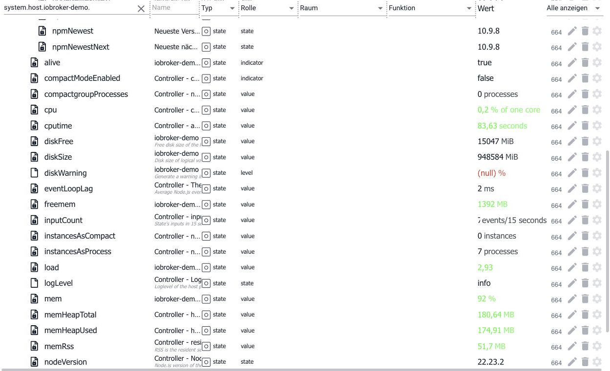
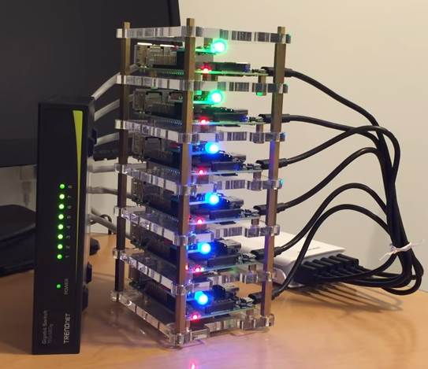
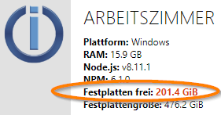
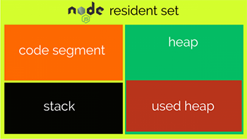
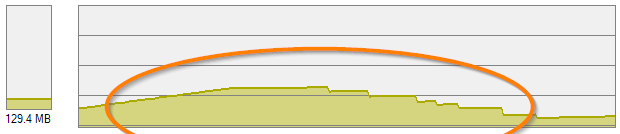
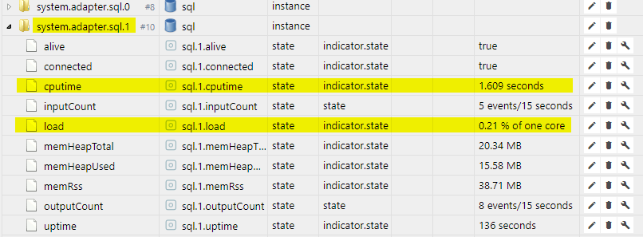
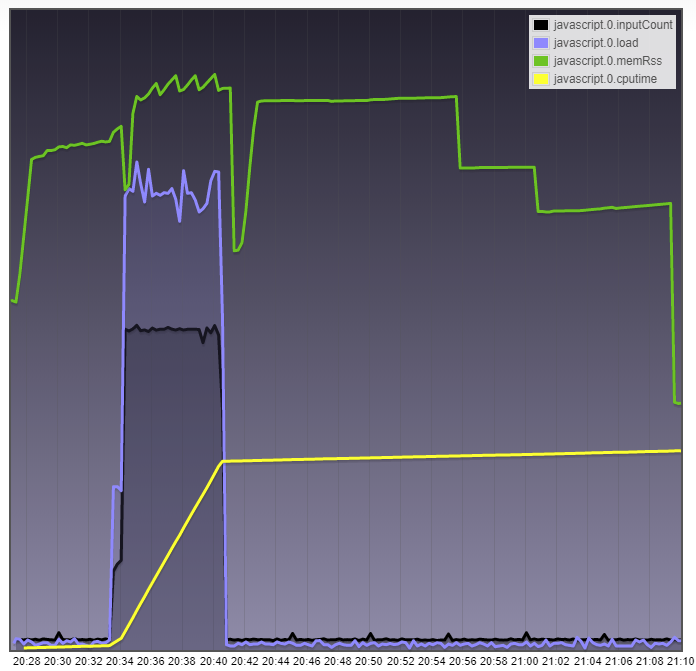
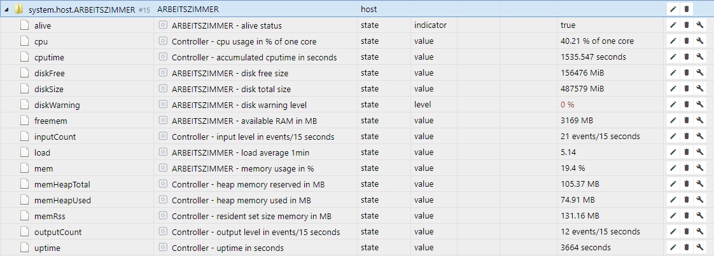

# Мониторинг производительности
Отправной точкой для анализа производительности является вкладка [объекты](/docs/admin/objects.md) в панели администратора.

Там вы найдете системную информацию о хостах (ioBroker поддерживает работу с несколькими хостами) и отдельных сетевых адаптерах.

Они отображаются только в **экспертном режиме**: переключение между режимами осуществляется с помощью значка в левом нижнем углу строки меню. Затем введите `system.host.<Name des Hosts>.` в фильтр ID:

## Показатели производительности хоста
В терминологии ioBroker хостом называется компьютер, на котором запущен процесс контроллера ioBroker.

В многохостовой среде это может легко включать в себя несколько компьютеров для распределения нагрузки.

Даже используемые операционные системы могут отличаться.

Это создает серьезную проблему, например, для кластерных стеков Raspberry Pi, связанных с управлением аппаратным ограничением в 1 ГБ оперативной памяти.

JS-контроллер ioBroker координирует запуск и остановку адаптеров, а также выполняет другие задачи управления системой в фоновом режиме. Показатели производительности для каждого хост-компьютера и JS-контроллера можно найти в панели администратора по идентификатору `system.host.<Name_des_Hostrechners>`.

Ниже приведён список отдельных ключевых фигур и их значение:

| Ключевой показатель | Тип данных | Единица измерения | Описание |
|----------|----------|---------|--------------|
| **alive** | Логика | none | Указывает, активен ли js-контроллер ioBroker на хосте |
| **diskFree** | Число | МиБ | Свободное дисковое пространство на логическом диске, где установлен ioBroker *bi = двоичное кратное (1 МБ = 1 000 000 байт) < (1 МиБ = 1 048 576 байт = 1 × 1024 × 1024 байт)* |
| **Размер диска** | Число | МиБ | Общий размер логического диска, на котором установлен ioBroker |
| **diskWarning** | Число | % | Здесь можно ввести значение в процентах. Если свободное место на диске опустится ниже этого значения (например, 20), в панели администратора отобразится предупреждение. Это особенно полезно, если активен адаптер истории.  |
| **freemem** | Число | МБ | Общий объем доступной оперативной памяти хоста |
| **inputCount** | Число | /15s | Количество изменений значений состояния. Событие ввода может быть инициировано, например, созданием или установкой значения. |
| **нагрузка** | Число | % | Общая загрузка ЦП системы, усредненная за одну секунду. Не удивляйтесь, это значение всегда равно 0 в Windows. |
| **память** | Число | % | Использование памяти. Соотношение свободной памяти к общему объему системной памяти |
| **memHeapTotal** | Число | МБ | Размер памяти кучи, зарезервированной контроллером JavaScript |
| **memHeapUsed** | Число | МБ | Размер памяти кучи, используемой контроллером JavaScript |
| **memRss** | Число | МБ | Резидентный набор, общий размер памяти, используемой контроллером JavaScript в ОЗУ |
| **outputCount** | Число | /15s | Выходные события включают такие действия, как сравнение значений, запись значения в базу данных состояний, события, связанные с подписками, или запись в журнал адаптера для получения информации о состояниях .connected или .alive, например. Таким же образом генерируются 8 событий, обычно отображаемых в списке экземпляров в поле выходного значения события. |
| **время работы** | Число | с | Время работы ioBroker на этом хосте с момента последнего перезапуска |

На следующей диаграмме символически показано, как куча, код и стек вносят вклад в общее использование памяти **memRss** процессом Node.js:

Если главный JS-контроллер сам предоставляет базу данных объектов и состояний для всей системы, этот показатель наглядно демонстрирует разницу в потреблении памяти между 300 и 3000 объектами ioBroker. Например, в моей системе Windows это значение колеблется от 75 до 128 МБ при 3500 объектах и 2700 состояниях. Это происходит благодаря встроенной сборке мусора в Node.js.

Однако, если я использую Redis в качестве базы данных состояний, потребление памяти для JS-контроллера снижается до 50 МБ.

(Теперь Redis требуется дополнительно 25 МБ = обратно к 75 МБ ;))

Если количество изменений состояния превышает вычислительную мощность зависимых потребителей событий (например, JavaScript с триггерами `on:`), в базах данных в оперативной памяти образуется очередь.

Это можно наблюдать по использованию памяти контроллером JavaScript. Как только нагрузка на систему уменьшается и потребителям событий предоставляется достаточно времени для обработки ожидающих изменений значений, значение `memRss` возвращается к своему исходному значению.

Как это часто бывает в этой области, одних лишь фиксированных значений недостаточно для получения точной информации о причинах ошибок.

Однако часто помогает наблюдение за безупречно функционирующей системой (=эталонными значениями), а затем сравнение **той же системы** с условиями возникновения ошибок. Кроме того, очень полезно записывать одну или несколько точек данных в истории, например, для выявления тенденций и выбросов.

## Характеристики адаптеров
Каждый адаптер имеет свои собственные показатели производительности.

Они хранятся под идентификатором `system.adapter.<Name_des_Adapters>.<Instanz>` и немного отличаются от показателей хоста.

| Ключевой показатель | Тип данных | Единица измерения | Описание |
|----------|----------|---------|--------------|
| **активен** | Логика | нет | Указывает, активен ли адаптер |
| **подключено** | Логика | нет | Указывает, ответил ли адаптер в течение последних 30 секунд |
| **inputCount** | Число | /15s | Количество изменений значений состояния. Событие ввода может быть инициировано, например, созданием или установкой значения. |
| **memHeapTotal** | Число | МБ | Размер памяти кучи, зарезервированной адаптером |
| **memHeapUsed** | Число | МБ | Размер памяти кучи, используемой адаптером |
| **memRss** | Число | МБ | Резидентный набор, общий размер памяти, используемой адаптером в ОЗУ |
| **inputCount** | Число | /15s | Количество изменений значений состояния. Событие ввода может быть инициировано, например, созданием или установкой значения. |
| **outputCount** | Число | /15s | Выходные события включают такие действия, как сравнение значений, запись значения в базу данных состояний, события, связанные с подписками, или запись в журнал адаптера для получения информации о состояниях .connected или .alive, например. Таким же образом генерируются 8 событий, обычно отображаемых в списке экземпляров в поле выходного значения события. |
| **время работы** | Число | с | Время работы адаптера с момента запуска адаптера |

Например, если после изменения скрипта количество событий **inputCount** в JavaScript-адаптере внезапно увеличивается со 100 до нескольких тысяч, возникает серьезное подозрение, что в скрипт встроен циклический триггер, то есть кольцевая ссылка.

Также полезно изучить **memRss** для обнаружения, например, утечек памяти, вызванных скриптами или в адаптерах. **alive** и **connected** можно использовать для наглядной визуализации состояния адаптера в vis или для подавления отображения некорректных данных, если адаптер не может предоставить новые значения.

## Перспективы и вопросы
Вот картинка, позволяющая заглянуть в будущее (и в мою среду разработки):

В адаптерах отсутствует дисплей, отображающий загрузку ЦП, вызванную каждым отдельным адаптером (**cpu**).

В конце концов, хочется знать, какая система в данный момент является виновником, не устанавливая ресурсоемкие дополнительные адаптеры мониторинга. Поскольку Node.js является однопоточным, здесь отображается загрузка одного ядра ЦП. Она не может превышать 100%.

Даже использование многоядерных процессоров не поможет, если сетевой адаптер постоянно выдает высокие значения.

В этом случае проблему можно решить только с помощью более быстрого процессора (обычно это означает более высокую тактовую частоту), оптимизированного программного кода или распределения нагрузки между несколькими адаптерами (если это возможно).

Метрика **cputime** позволяет оценить общее время работы процессора адаптера с момента запуска.

Она предоставляет информацию о частоте или интенсивности (ключевое слово: вычислительно интенсивная), с которой программа использует процессор.

Это общее время почти всегда ниже общего времени работы адаптера (**uptime**), поскольку даже при интенсивном использовании адаптер редко непрерывно отправляет инструкции процессору.

Здесь вы можете наглядно увидеть, как взаимодействуют различные ключевые показатели производительности и как выглядит реакция JavaScript-адаптера на внезапный всплеск запросов во Flot:

Кстати, адаптер JavaScript уже был настолько перегружен, что больше не мог принимать все события немедленно.

Сформировалась очередь событий.

Чтобы узнать больше о нагрузке на хост, и в частности на главный адаптер - js-контроллер, я также добавил для него несколько счетчиков производительности. В следующем списке показано возможное будущее отображение счетчиков производительности хоста.

Как уже упоминалось, это подлежит проверке со стороны Bluefox и будет применяться только начиная с версии js-Controller 1.5.x:

В итоге, значение данных сводится к следующему:

| Ключевой показатель | Тип данных | Единица измерения | Источник данных | Описание |
|----------|----------|---------|-------------|--------------|
| **alive** | Logic | none | js-controller | Указывает, активен ли js-контроллер ioBroker на хосте. Автоматически переключается в значение false через 25 секунд после прекращения его работы. |
| **cpu** | Число | % использования ядра | js-controller | Указывает загрузку ядра, на котором работает js-controller. Она не может превышать 100%, поскольку Node.js - однопоточный движок. |
| **время ЦП** | Число | с | js-контроллер | Время работы процессора (время ЦП) - это измеренное время в секундах, в течение которого js-контроллер фактически отправлял команды процессору с момента последнего запуска программы. Это общее время почти всегда меньше общего времени выполнения (времени работы) программы, поскольку даже при интенсивном использовании он редко непрерывно отправляет инструкции процессору. |
| **diskFree** | Число | МиБ | | Свободное место на логическом диске, где установлен ioBroker *bi = двоичное кратное (1 МБ = 1 000 000 байт) < (1 МиБ = 1 048 576 байт = 1 × 1024 × 1024 байт)* |
| **Размер диска** | Число | МиБ | | Общий размер логического диска, на котором установлен ioBroker |
| **diskWarning** | Число | % | | Здесь можно ввести значение в процентах. Предупреждение будет отображаться в панели администратора, если свободное место на диске опустится ниже этого значения (например, 20). Это особенно полезно, если активен адаптер истории.  |
| **freemem** | Число | МБ | | Общий объем доступной оперативной памяти хоста |
| **inputCount** | Число | /15s | js-controller | Количество изменений значений состояния. Событие ввода может быть инициировано, например, созданием или установкой значения. |
| **нагрузка** | Число | | | Общая загрузка системы на все ядра ЦП, усредненная за одну секунду. Например, компьютер с 8 ядрами ЦП -> значение 7,9 = система почти перегружена, 0,1 = ничего не происходит; 4 ядра -> значение 3,9 = перегрузка - если проблема сохраняется, 0,1 = ничего не происходит |
| **память** | Число | % | | Использование памяти. Соотношение свободной памяти к общему объему системной памяти |
| **memHeapTotal** | Число | МБ | js-controller | Размер памяти кучи, зарезервированной js-controller |
| **memHeapUsed** | Число | МБ | js-controller | Размер памяти кучи, используемой js-контроллером |
| **memRss** | Число | МБ | js-controller | Резидентный набор, общий размер памяти, используемой js-контроллером в ОЗУ |
| **outputCount** | Число | /15s | js-controller | Выходные события включают такие действия, как сравнение значений, запись значения в базу данных состояний, события, связанные с подписками, или логирование. Именно так здесь генерируются и события 10+. |
| **memAvailable** | Число | МБ | js-controller | (Только в системах *nix) Доступная свободная память для новых запросов памяти без необходимости запуска подкачки используемой памяти системой. Рассчитывается на основе MemFree, Active(file), Inactive(file), SReclaimable и нижних пороговых значений из `/proc/zoneinfo`. См. [https://git.kernel.org](https://git.kernel.org/pub/scm/linux/kernel/git/torvalds/linux.git/commit/?id=34e431b0ae398fc54ea69ff85ec700722c9da773) |
| **memAvailable** | Число | МБ | js-controller | (Только в системах *nix) Доступная свободная память для новых запросов памяти без необходимости запуска подкачки занятой памяти системой. Рассчитывается на основе MemFree, Active(file), Inactive(file), SReclaimable и нижних пороговых значений из `/proc/zoneinfo`. См. [https://git.kernel.org](https://git.kernel.org/pub/scm/linux/kernel/git/torvalds/linux.git/commit/?id=34e431b0ae398fc54ea69ff85ec700722c9da773) |