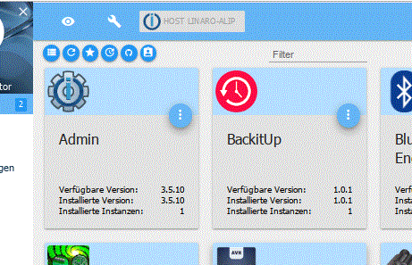
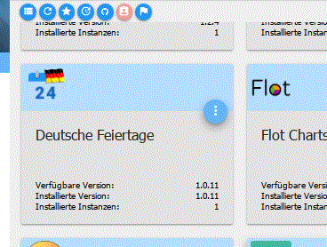
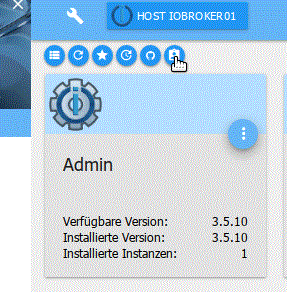

# Основы использования адаптеров
Установка адаптеров и инстансов в ioBroker происходит в несколько этапов.

Эти термины всегда путают. Цель этой страницы — пролить свет на эту тему, объяснив, как должны выполняться наиболее важные административные задачи в ioBroker и что за ними стоит.

## Административные задачи
### Установка нового адаптера
Фактическая установка загружает данные, необходимые для использования адаптера, с сервера на локальный хост. Эти данные остаются «актуальными» на момент установки до тех пор, пока они не будут обновлены.

**Об администраторе**

Эта функция недоступна через администратора; она автоматически добавляется при создании экземпляра (экземпляризации).

**О консоли**

``iobroker install AdapterName``

### Создание экземпляра адаптера
Чтобы использовать адаптер в ioBroker, вам понадобится один (или несколько) экземпляров этого адаптера. Эти экземпляры настраиваются в администраторе на вкладке «Экземпляры».

**Об администраторе**

Если вы хотите создать экземпляр адаптера, вы можете сделать это, нажав на (+) в левом нижнем углу плитки соответствующего адаптера на вкладке «Администратор».

**О консоли**

``iobroker add AdapterName``

Если необходимые файлы для адаптера еще не находятся на хосте, сначала автоматически будет выполнено имя адаптера установки iobroker. Только после этого экземпляр будет создан.

***через консоль через npm (только для экспертов!)***

``cd /opt/iobroker``

``npm install iobroker.AdapterName``

**Эту версию следует использовать только в том случае, если все остальные методы по какой-либо причине не работают.**

Опасность! В новых установках использование npm install напрямую приводит к проблемам с правами после установки или к сбою. Рекомендуется использовать команды iobroker!!

### Обновите адаптер
Если есть новая версия адаптера, ее можно обновить. Бывает и так, что для адаптеров требуется определенная версия другого адаптера. Поэтому имеет смысл всегда обновлять все адаптеры.

**Об администраторе**

Если адаптер был обновлен, строка заголовка соответствующей плитки станет зеленой. Номер новой версии отобразится зеленым цветом на плитке под надписью «Доступная версия», а слева от него появится значок обновления. Если вы хотите обновить этот адаптер, нажмите на этот значок.

Затем в фоновом режиме происходят два процесса: фактическое обновление файлов адаптера и последующая загрузка файлов в экземпляры.

**О консоли**

``iobroker upgrade AdapterName``

### Загрузить файлы адаптера
Эта функция требуется только в особых случаях. Если используется описанная выше процедура, эта функция не требуется.

Эта функция необходима только в том случае, если опытные пользователи, знающие, что делают, сами меняют файлы или если с Github загружена бета-версия.

Об администраторе. Для этого во вкладке «Администратор» необходимо активировать экспертный режим. Затем на плитке появятся дополнительные значки. Стрелка вверх (третий значок справа) выполняет загрузку.

**О консоли**

``iobroker upload AdapterName``

### Понизить версию адаптера
Если с новой версией возникли проблемы, вы можете снова понизить версию адаптера.

**Об администраторе**

Для понижения версии сначала необходимо перейти в экспертный режим, а затем вызвать список доступных версий:

В этом списке отображаются все версии, выпущенные разработчиком для этой функции.

Пожалуйста, нажмите там на нужную версию.

**О консоли**

``iobroker upgrade AdapterName@ver.si.on``

Где ***AdapterName*** — имя нужного адаптера согласно списку в обновлении iobroker, а ***ver.si.on*** — номер версии в соответствующем формате.

***через консоль через npm (только для экспертов!)***

``cd /opt/iobroker``

``npm install iobroker.AdapterName@ver.si.on``

**Эту версию следует использовать только в том случае, если все остальные методы по какой-либо причине не работают.**

Опасность! В новых установках использование npm install напрямую приводит к проблемам с правами после установки или к сбою. Рекомендуется использовать команды iobroker!!

## Дополнительная важная информация
### Список адаптеров в админке
Здесь фактически просто список адаптеров, присутствующих в выбранном репозитории (основные настройки). То, что здесь отображается, еще не находится на хосте.

Этот список обновляется на сервере ежедневно около 2:00 ночи и обновляется онлайн при вызове администратора. Если по какой-либо причине нет соединения с сервером, в этом списке будут только те адаптеры, которые уже установлены или вообще не могут быть загружены.

### Различные источники установки
Всегда возникает вопрос, почему упоминается определенная версия, но она не предлагается для обновления. Вот почему здесь следует еще раз объяснить предысторию этого:

**Существует три уровня публикации адаптеров**

* Репозиторий стабильный, все стабильно и проверено
* Репозиторий последний, еще не полностью протестирован.
* Github, версии для разработчиков, частичные бета-версии или даже незавершенные.

Версии 

Все эти этапы могут иметь одну и ту же версию, если не было особых изменений, но в разных репозиториях или Github могут быть и более крупные скачки.

**Репозиторий**, из которого вы хотите получать версии адаптеров, указан в настройках системы на подстранице [Основные настройки](../admin/settings.md#Haupteinstellungen).

Доступные репозитории перечислены на подстранице [Репозитории](../admin/settings.md#Verwahrungsorte).

**Для разработчиков или бета-версии** Github устанавливаются через [Символ октоката](../admin/adapter.md#die-icons-im-einzelnen) #5.

Либо просто в раскрывающемся меню ***Github***, либо введя адрес репозитория Github на вкладке ***любой***. Это особенно часто встречается у «внешних» разработчиков адаптеров.

**Установку GitHub следует выполнять только после консультации с разработчиком.**

### Установка Github
( только для экспертов! )

Установка Github должна выполняться только специалистами. Здесь только бета-версии или, что еще хуже, недоработанные версии. Их установка может уничтожить всю установку ioBroker!

Если обновление все равно выполняется через GitHub (значок Octocat) (или рекомендовано сопровождающим репозитория для устранения неполадок через форум), новые файлы будут сохраняться только локально, а не добавляться в экземпляры. Поэтому для версий js-контроллера ниже 1.5 загрузку необходимо выполнять вручную.

Для этого во вкладке Администратор необходимо активировать экспертный режим. Затем на плитке появятся дополнительные значки. Стрелка вверх (третий значок справа) выполняет загрузку.