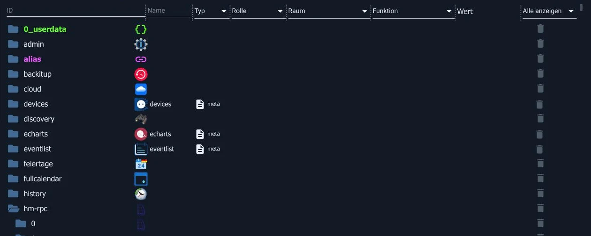
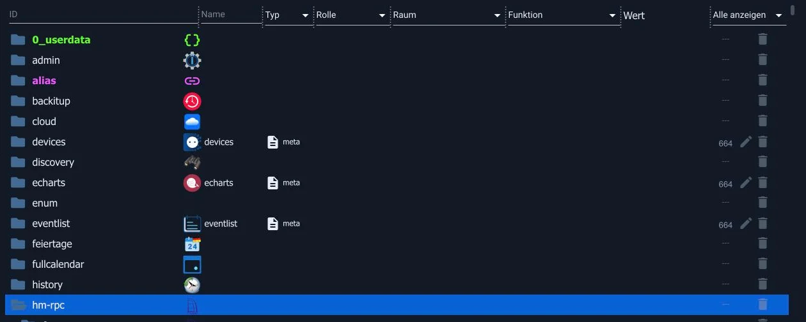

# Экскурсия по поверхности

В административной панели много вкладок, и на первый взгляд кажется, что их больше, чем на самом деле. Однако для повседневного использования вам понадобятся всего четыре из них. В этом обзоре объясняется, что это за вкладки и для чего нужны остальные. Подробное описание каждой вкладки можно найти в главе [«Административный интерфейс»](/docs/admin/README.md) .

## Структура

Страница состоит из трех областей: слева — **панель меню** с вкладками, справа от нее — **главное окно** , а над ним — панель **инструментов** , содержимое которой зависит от текущей открытой вкладки.

**Системные** настройки находятся в левом нижнем углу. Там же осуществляется настройка [параметров системы](/docs/admin/settings.md) , а рядом с ней расположен переключатель экспертного режима.

_Три области: слева — вкладки, вверху — панель инструментов открытой вкладки, посередине — главное окно, в данном случае — список экземпляров._

## Четыре вещи, которые вам нужны каждый день

| Конный спорт                       | За что                                                                            |
| ---------------------------------- | --------------------------------------------------------------------------------- |
| [адаптер](/docs/admin/adapter.md)  | Добавляйте новые подключения и обновляйте существующие.                           |
| [Пример](/docs/admin/instances.md) | Текущие соединения: настройка, запуск, остановка и проверка их работоспособности. |
| [объекты](/docs/admin/objects.md)  | Дерево всех точек данных. Здесь можно проверить, поступило ли значение.           |
| [Протоколы](/docs/admin/log.md)    | Вот что сообщает система. Пункт меню становится красным, если произошла ошибка.   |

Когда что-то не работает, порядок действий почти всегда один и тот же: экземпляры (работает ли система?), объекты (поступает ли значение?), журналы (что сообщает система?).

## Остальные

| Конный спорт                                      | За что                                                                                                                              |
| ------------------------------------------------- | ----------------------------------------------------------------------------------------------------------------------------------- |
| [Обзор и быстрый доступ](/docs/admin/overview.md) | Краткий обзор состояния системы и плитки для всех поверхностей.                                                                     |
| [Категории](/docs/admin/enums.md)                 | Пространства и функции. На первый взгляд это кажется мелочью, но на самом деле это основа для визуализации и голосового управления. |
| [пользователь](/docs/admin/users.md)              | Кто имеет право регистрироваться и что им разрешено делать.                                                                         |
| [Хозяева](/docs/admin/hosts.md)                   | Сам компьютер, обновления js-контроллера, системные сообщения.                                                                      |
| [файлы](/docs/admin/files.md)                     | Хранилище файлов, например, для изображений в визуализации.                                                                         |
| Резервная копия                                   | Эта информация поступает от адаптера BackItUp, см. [раздел «Резервное копирование данных»](/docs/config/backup.md) .                |

При установке адаптеров добавляются дополнительные вкладки, такие как _«Скрипты»_ , _«Календари»_ или _«Устройства»_ .

## Экспертный режим

В левом нижнем углу строки меню находится значок головы. Он включает и выключает **экспертный режим** , а также отображает текущее состояние: белый цвет означает выключение, зеленый — включение.

Важно понимать: это никак не меняет вашу систему и не позволяет делать ничего из того, что было ранее запрещено. Это как очки, а не дверь. В выключенном состоянии панель администратора отображает только то, что необходимо для повседневного использования; во включенном состоянии она также отображает все, что в противном случае мешало бы.

_Без экспертного режима: адаптеры со своими данными, и ничего больше._

_То же дерево с экспертным режимом. Пространство имен добавлено. `enum`, столбец с правами доступа (`664`) и значок карандаша, который открывает редактор объектов. Ниже также написано... `system.` _

Дополнительная информация добавляется в зависимости от участника:

| Конный спорт              | Что дополнительно отображает экспертный режим                                                                                                |
| ------------------------- | -------------------------------------------------------------------------------------------------------------------------------------------- |
| объекты                   | пространство имен `system.` с внутренними объектами, столбцом с правами доступа и созданием собственных объектов вне `0_userdata.0` и `alias.0` |
| Пример                    | Дополнительные столбцы и настройки: использование памяти, уровень протокола, запланированная перезагрузка, порядок загрузки.                 |
| адаптер                   | Установка из GitHub, из файла или в конкретной версии, включая удаление адаптера.                                                            |
| Протоколы, хосты, диалоги | дополнительные столбцы, фильтры и поля                                                                                                       |

Здесь два переключателя, и это часто приводит к путанице:

- **Значок головы** в левом нижнем углу применяется только к текущей сессии браузера. После закрытия окна он возвращается в состояние, заданное системными настройками.
- В [системных настройках](/docs/admin/settings.md) _экспертный режим_ определяет, как администратор запускается при открытии системы.

Администратор повторяет это еще раз при первом включении системы:

Полезное эмпирическое правило для поиска и устранения неисправностей: если в руководстве упоминается параметр, который вы нигде не можете найти, сначала активируйте экспертный режим. В девяти случаях из десяти он просто был скрыт.

Скрытый не означает защищенный. В экспертном режиме можно удалять объекты, необходимые адаптеру для работы. Администратор запросит подтверждение один раз, но отменить это можно только с [помощью резервной копии](/docs/config/backup.md) .

Поначалу это не обязательно. Информация, которую это выявляет, нужна только при исследовании проблемы или поиске подхода, не встречающегося в повседневной жизни.

## Если у вас нет места

Стрелка в верхней части строки меню уменьшает её до значков. На планшете это разница между удобным и неудобным использованием.

## Что произойдет дальше?

Далее следует вкладка, которую вы будете использовать чаще всего на начальном этапе: [Управление адаптерами](/docs/tutorial/adapter.md) .