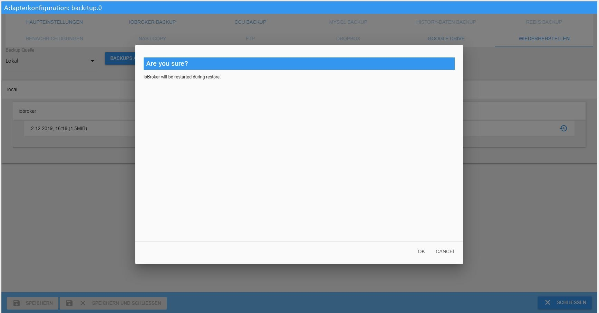

# Основы
Как правильно восстановить установку ioBroker в системе Linux?

### Предисловие:
Так как некоторым пользователям восстановление очень сложно, вот пошаговая инструкция по восстановлению после сбоя, или после смены оборудования, смены системы или чего-то еще.

В принципе, заранее можно сказать одно: если все сделано правильно, восстановление можно выполнить буквально за несколько минут и бояться этого не нужно.

В конце все данные снова доступны, и новая система настроена.

### Подготовка:
Для подготовки абсолютно необходима исполняемая установка ioBroker.

Есть 2 способа добиться этого.
Либо возьмите готовый образ из [Область загрузки](https://www.iobroker.net/#de/download), настройте свою ОС Linux и после этого установите ioBroker.

### Следующий шаг
Если старая система хранила состояния и/или объекты в Redis, новая система сначала должна быть оснащена сервером Redis.

Если вы не уверены, использовался ли Redis, и есть ли доступ к старой системе, используйте команду `iobroker status` для получения необходимой информации». При использовании Redis вывод выглядит следующим образом:

```
iobroker is running on this host.

At least one iobroker host is running.

Objects type: redis
States  type: redis
```

Если в типе «Объекты» и/или «Состояния» указано «redis», вам необходимо установить сервер Redis в новой системе.
Если в обоих типах указано «файл», сервер Redis не нужен.

Если у вас больше нет доступа к старой системе и вы не знаете, что именно было настроено ранее, то обязательно заранее установите сервер Redis.

#### Redis установлен:
Для этого зайдите в терминал с помощью Putty и выполните следующие команды:

```
sudo apt-get update
sudo apt-get install redis-server
sudo usermod -a -G redis iobroker
sudo reboot now
```

Далее следует запустить установщик исправления, если где-то все права в системе не правильные.
Этот шаг является всего лишь рекомендацией и не является абсолютно необходимым.

```
curl -sL https://iobroker.net/fix.sh | bash –
```

С помощью небольшого инструмента «htop» вы можете легко увидеть все запущенные процессы, что не только интересно для восстановления, но и вообще может быть очень полезно.
это устанавливается следующим образом:

Запустите следующую команду в консоли:

```
sudo apt-get install htop
```

После этого можно приступить к фактическому восстановлению.

### Восстановить:
Здесь также есть 2 варианта:

#### **1. Автоматическое восстановление с резервной копией**
Поскольку здесь не требуется никаких знаний Linux, и все это делается через веб-интерфейс Iobroker, вариант автоматического восстановления сначала выполняется с помощью [Резервное копирование](https://github.com/simatec/ioBroker.backitup/blob/master/README.md).

Для этого необходимо установить адаптер Backitup.
Это делается через вкладку «Адаптеры». Найдите там Backitup и установите экземпляр, используя (+).

После завершения установки сохраните «резервную копию ioBroker», ранее созданную в старой системе, в новой системе с помощью программы sftp, такой как FileZilla или WinSCP, по пути /opt/iobroker/backups.

Backitup также может восстанавливаться с NAS, Dropbox или Google Drive, но у локальной версии меньше всего шансов возникновения проблем.

Если у вас уже есть опыт монтирования с NAS, вы также можете использовать это, тем более, что тогда вы сможете напрямую получить доступ к существующему каталогу старой установки.
Однако в этом руководстве речь идет о локально хранящейся резервной копии.

Если резервная копия ioBroker была успешно сохранена, теперь откроется Backitup и откроется вкладка «Восстановить».
Установите «источник резервного копирования» на локальный, а затем сохраните его.


Если вы хотите, чтобы ВСЕ экземпляры запускались автоматически после восстановления, необходимо активировать и затем сохранить опцию «Запускать все адаптеры после восстановления».
Если резервную копию необходимо восстановить на другой хост, эту опцию не следует использовать, поскольку перед запуском отдельных экземпляров может потребоваться корректировка IP-адресов.

После сохранения существующие резервные копии можно получить по локальному пути с помощью кнопки «Получить резервные копии».

Резервная копия, которую вы только что скопировали через FTP, должна появиться в списке под «iobroker».
Теперь выберите это.


После выбора появляется надпись, что iobroker будет остановлен для восстановления, а затем снова запущен.



Здесь вы начали фактический процесс восстановления.


В вашем браузере откроется еще одна вкладка, в которой вы сможете следить за процессом восстановления в веб-интерфейсе Backitup, как и в консоли.


После успешного завершения восстановления вы также получите сообщение в веб-интерфейсе восстановления.


Восстановление может занять некоторое время в зависимости от производительности системы и размера старой установки ioBroker.
Обычно восстановление должно завершиться примерно через 10–15 минут, и ioBroker должен запуститься снова автоматически.


В очень редких случаях случается, что ioBroker не запускается автоматически после восстановления.
В этом случае вы можете запустить iobroker вручную, используя следующую команду через консоль.

```
iobroker start
```

Теперь ioBroker должен запуститься заново и на вкладке «Журнал» вы увидите, что все адаптеры, которые были установлены в старой системе, в данный момент переустанавливаются npm.

Здесь вам придется проявить немного терпения и просто позволить iobroker сделать свое дело.
В инстансах можно увидеть, какие адаптеры устанавливаются постепенно.
Все адаптеры, которые еще устанавливаются или находятся в очереди, еще не имеют значка в экземплярах.
Пожалуйста, не перезапускайте ioBroker, просто время от времени обновляйте представление с помощью F5, пока все экземпляры не будут иметь значок.

В зависимости от размера установки, скорости вашего компьютера и подключения к Интернету это может занять 2–3 часа.

Поздравляем, недавно установленная система готова со всеми настройками, скриптами, визуализациями и т. д.

С помощью Backitup теперь можно восстановить дополнительные данные, если их резервная копия ранее была сохранена в старой системе.
Вы можете восстановить базу данных Redis, базу данных Zigbee, базу данных mySql и данные истории, выполнив те же действия, которые описаны выше.

Список полученных резервных копий будет выглядеть так, как показано в этом примере.


*****************************************************************************************************************************************

#### **2. ручное восстановление с помощью команд терминала**
Во-первых, необходимо выполнить несколько команд через Putty или что-то подобное.

Сначала вам нужно создать папку резервного копирования:

```
sudo mkdir /opt/iobroker/backups
```

Здесь также резервная копия, созданная в старой системе, а также, при необходимости, резервная копия Redis, резервная копия zigbee и т. д., затем создается с помощью программы sftp, такой как FileZilla или WinSCP.
хранится в папке /opt/iobroker/backups.

Если состояния и объекты хранились в базе данных Redis, резервную копию базы данных Redis следует сначала восстановить здесь.
Если бы только состояния работали под управлением Redis, это не обязательно должно быть так заранее.

Как только это будет сделано, остановите ваш ioBroker следующим образом:

```
iobroker stop
```

Затем проверьте, все ли остановилось, с помощью следующих команд:

```
iobroker status
```

Если все выходные данные верны и iobroker остановлен, восстановление теперь можно выполнить через консоль с помощью следующих команд:

```
cd /opt/iobroker
iobroker restore <Dateiname eures Backups>
```

!> **Очень важно, что этим методом можно восстановить только резервную копию ioBroker.
Резервная копия Redis, резервная копия Zigbee, резервная копия mySql или данные истории не могут быть созданы с помощью этой команды**.

Для этого требуется Backitup, поскольку они были специально созданы с помощью Backitup.

В зависимости от вашей системы это может занять несколько минут. Прогресс будет отображаться в терминале.
Когда восстановление завершится, снова запустите ioBroker с помощью следующей команды:

```
iobroker start
```

Здесь также все адаптеры теперь переустанавливаются ioBroker по отдельности через npm.
Это может занять некоторое время в зависимости от размера вашей установки, скорости Интернета и производительности системы.
Текущий статус можно отслеживать во вкладке «Журнал».

Сейчас это сделано и система переустановлена и все настройки, скрипты, визуализации и т.д. восстановлены.

### Заключение:
По сути, оба варианта приводят к одному и тому же результату.
Если у вас мало опыта работы с командами терминала и вы не уверены, с Backitup вы в безопасности.

Однако, если вы хотите точно увидеть, что сейчас происходит в вашей системе, вам следует выбрать ручную версию через консоль. Здесь вы можете подробно увидеть каждый процесс в терминале.