#Базовый
| Виджет | Изображение | Описание

| [`HTML`](#html-frame) | 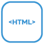|Этот виджет отображает произвольный HTML-код.|
| [`SVG-форма`](#svg-shape) | 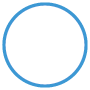|Представляет фигуру|
| [`iFrame`](#iframe) | |В этом виджете интегрирован iFrame|
| [`Изображение`](#image) | |Этот виджет отображает изображение.|
| [`Ссылка`](#link) | |Этот виджет соответствует виджету «static - HTML», но также представляет собой кликабельную ссылку по всей своей площади. Может использоваться для навигации между представлениями или для внешних ссылок.|
| [`Граница`](#border) | |Представляет фрейм, опционально с заголовком и строкой заголовка|
| [`iFrame8`](#iframe8) | |Отображает до 8 изображений в iframe|
| [`Просмотреть в виджете`](#view-in-widget) | |Этот виджет может отображать представления внутри представлений. Полезно, например, для навигации: вы создаете представление с элементами навигации, а затем интегрируете их в любое количество других представлений.|
| [`просмотреть в виджете 8`](#view-in-widget-8)] | |Отображает одно из 8 представлений в зависимости от статуса.|
| `Image 8` | |Отображает одно из 8 изображений в зависимости от состояния.|
| [`HTML-навигация`](#html-navigation) | |Этот виджет используется для настройки навигации между представлениями. Соответствует виджету «статическая ссылка», но может использоваться только для навигации между представлениями, а также предлагает возможность использования анимированных эффектов при смене представлений.|
| [`фильтр - раскрывающийся список`](#filter-dropdown) | 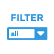||
| [`Номер`](#number) | 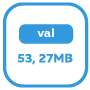|Этот виджет представляет числовое значение|
| [`Строка`](#string) | 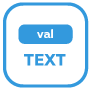|Этот виджет представляет собой точку данных строкового типа.|
| [`Строка (неэкранированная)`](#string--unescpaped-) | 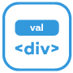|Этот виджет представляет собой точку данных типа символьной строки. В отличие от виджета «hm_val - String», специальные символы не «экранируются», т. е. переменная также может содержать HTML-код, который затем отображается. .|
| [`Источник исходного изображения`](#string-img-src) | 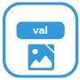|Этому виджету можно присвоить переменную типа символьной строки; URL-адрес, содержащийся в нем, будет отображаться в виде изображения|
| `Timestamp` | ||
| [`Временная метка последнего изменения`](#last-change-timestamp) | 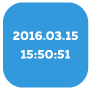||
| [`Текст списка значений`](#valuelist-text) | 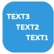|Этот виджет представляет собой переменную типа списка значений.|
| [`Список значений HTML`](#valuelist-html) | 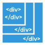|Этот виджет представляет собой переменную типа списка значений. Соответствует виджету "hm_val - ValueList Text, но не "экранируется", т. е. в список значений можно вводить HTML-код.|
| [`Стиль HTML списка значений`](#valuelist-html-8) | 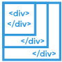|Этот виджет представляет собой переменную типа списка значений. Соответствует виджету «hm_val — ValueList HTML», но предлагает возможность использования 8 различных CSS-информаций для 8 разных значений (0-7).|
| [`Бул HTML`](#bool-html) | 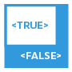|Этот виджет отображает логические значения.|
| `AckFlag HTML` | 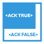||
| [`Флажок Bool`](#bool-checkbox) | 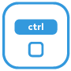|Этот виджет отображает логические значения в виде простого флажка, а также позволяет переключать значения.|
| [`Bool Select`](#bool-select) | 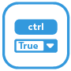|Этот виджет отображает логические значения в раскрывающемся списке, а также позволяет переключать значения.|
| [`Bool HTML Control`](#bool-html-control) | 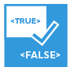|Этот виджет отображает логические значения, а также позволяет переключать значения щелчком мыши в области виджета.|
| [`Бул SVG`](#bool-svg) | |Этот виджет устанавливает значение при нажатии в области виджета.|
| [`HTMLState`](#html-state) | 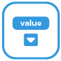|Этот виджет исчезает, если значение назначенной точки данных равно 0 или ложно. Отлично подходит для отображения служебных сообщений, например. |
| [`Красный номер`](#hide-on-0-false) | |Отображать числовое значение в стиле значков уведомлений iOS. Исчезает при значении 0.|
| [«Лампа вкл/выкл»](#bulb-on-off) | |Этот виджет отображает значение в виде выключенной или горящей лампочки на черном фоне. Может использоваться для логических и плавающих значений (диммер).|
| [`Управление включением/выключением лампы`](#bulb-on-off-control)| |Этот виджет отображает значение в виде выключенной или горящей лампочки на черном фоне. Может использоваться для логических и плавающих значений (диммер).|
| [`Бар`](#bar-horizontal) | 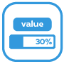|Этот виджет отображает значения от 0 до 100 в виде горизонтальной полосы.|
| `Note` | ||
| `json Table` | 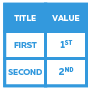||
| `HTML logout` | ||
| `Gesture indicator` | 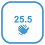||
| `Speech to text` | ||
| `Full Screen` | ||
| `Screen Resolution` | 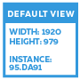||
| `Разрешение экрана` | ||

### HTML-фрейм
Этот виджет отображает произвольный HTML-код. Внутри виджета также можно использовать Javascript.

| Атрибут|Описание|
|-----|----|
| `ObjectId`|Идентификатор отображаемого объекта, содержащего HTML|
| Префикс html|HTML-код, который будет отображаться перед объектом|
| Добавьте Html|HTML-код, который будет отображаться после объекта|

**Пример:** 

### Форма SVG
Этот виджет просто представляет собой геометрическую фигуру с некоторыми предопределенными формами.

| Атрибут|Описание|
|-----|----|
| Тип|геометрическая форма|
| Цвет линии|Цвет границы формы|
| Цвет заливки|Цвет заливки|
| Ширина линии||
| Rotate|угол поворота, начиная с исходного положения в градусах|
| Масштаб ширины|Масштабирует ширину от 0 до 100%|
| Масштаб высоты|Масштабирует высоту от 0 до 100%|

**Пример:** 

### IFrame
Представляет iFrame

| Атрибут|Описание|
|-----|----|
| Источник|Путь к источнику (сайт, изображение); это можно определить локально или через URL|
| Никакой песочницы|:construction:|
| Время обновления|:строительство:|
| Обновление по поводу пробуждения|:construction:|
| Обновление при изменении вида|:construction:|
| Не добавлять в URL|:construction:|
| Прокрутите X|:строительство:|
| Прокрутите Y|:строительство:|
| Без рамки|:строительство:|

**Пример:** 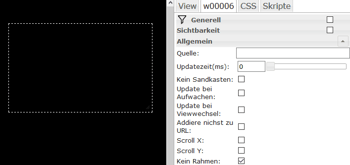

###Изображение
Этот виджет отображает изображение.

| Атрибут|Описание|
|-----|----|
| Источник|Путь к источнику в локальной файловой системе|
| Растянуть|Настроить изображение по размерам рамки|
| Время обновления|:строительство:|
| Обновление по поводу пробуждения|:construction:|
| Обновление при изменении вида|:construction:|
| Не добавлять в URL|:construction:|
| Разрешить взаимодействие с пользователем|:construction:|

**Пример:** 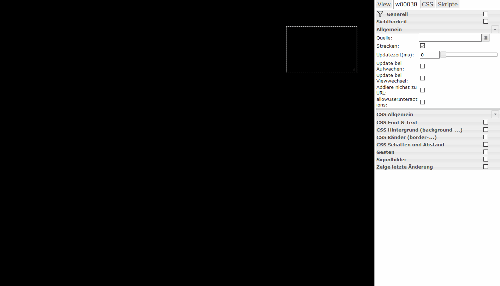

### Связь
Этот виджет соответствует виджету «HTML Frame», но также представляет собой кликабельную ссылку по всей его площади. Может использоваться для навигации между представлениями или для внешних ссылок.

| Атрибут|Описание|
|-----|----|

| `html`|Не требует пояснений ;) ...вставьте сюда HTML-код для форматированного отображения текста.
| `link`|URL-адрес ссылки. Чтобы использовать ссылку на другое представление, просто введите имя представления, которому предшествует символ решетки (#). `target`|Назначение ссылки. Оставьте поле пустым, чтобы оставаться в том же окне браузера; Если вы хотите открыть новое окно, введите _blank.  Другие варианты: _self (та же вкладка), _parent(), _top().

**Пример:** 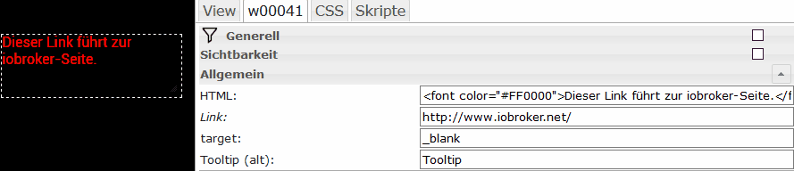

### Граница
Этот виджет просто отображает рамку — никакой другой функции, только текст и цвет. Это можно использовать для группировки виджетов.

| Атрибут|Описание|
|-----|----|

| Название|Не требует пояснений | шрифт верхнего заголовка|шрифт заголовка| Цвет верхней этикетки|Цвет заголовка| Фон заголовка|Цвет фона текста заголовка | Расстояние от заголовка до верхнего края|Расстояние заголовка от верхнего края | Расстояние между заголовком и левым краем|Расстояние заголовка от левого края | Высота головки|Высота стержня от верхнего края до | Цвет заголовка|Цвет панели

**Пример:** 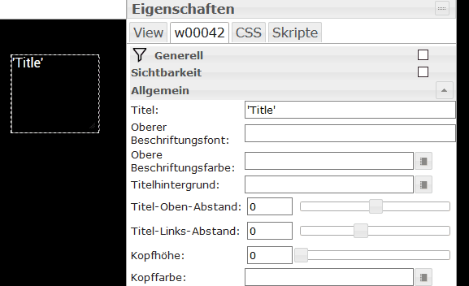

### Просмотр в виджете 8
Отображает одно из 8 представлений в зависимости от состояния.

| Атрибут|Описание|
|-----|----|

| `persistent`|Представления, которые были отображены один раз, больше не могут быть удалены из DOM.

### IFrame 8
Отображает один из 8 iframe в зависимости от состояния.

### HTML-навигация
Этот виджет используется для создания навигации между представлениями. Соответствует виджету «статическая ссылка», но может использоваться только для навигации между представлениями, а также предлагает возможность использования анимированных эффектов при смене представлений.

| Атрибут|Описание|
|-----|----|

| `html`|Само понятно ;) ...вставьте сюда HTML-код | `nav_view`|Здесь необходимо ввести имя представления, к которому вы хотите перейти | `hide_effect`|Здесь можно ввести имя эффекта jQueryUI, который используется при выходе из представления. Доступные эффекты: «Слепой», «Отскок», «Зажим», «Падение», «Взрыв», «Затухание», «Сгиб», «Выделение», «Пульсация», «Пульсация», «Масштабирование», «Встряхивание», «Размер», «Скольжение» и «Перенос».
| `hide_duration`|Длительность эффекта в мс | `show_effect`|см. выше, то же самое, но на этот раз для отображения нового вида | `show_duration`|См. выше, время в мс для отображения нового представления.

### Фильтр – раскрывающийся список
###Число
Этот виджет представляет числовое значение (можно использовать как для целых чисел, так и для чисел с плавающей запятой).

| Атрибут|Описание|
|-----|----|

| `html_prepend`|Текст или HTML-код, отображаемый перед числовым значением | `html_append`|Текст или HTML-код, отображаемый за числовым значением | `digits`|Показано количество десятичных знаков | `factor`|Коэффициент, на который умножается числовое значение

###Нить
Этот виджет представляет точку данных строкового типа.

| Атрибут|Описание|
|-----|----|

| `html_prepend`|Текст или HTML-код, отображаемый перед строкой.
| `html_append`|Текст или HTML-код, отображаемый за строкой.

### Строка (без экранирования)
Этот виджет представляет собой точку данных типа символьной строки. В отличие от виджета «hm_val - String», специальные символы не «экранируются», т. е. переменная также может содержать HTML-код, который затем отображается.

| Атрибут|Описание|
|-----|----|

| html_prepend|Текст или HTML-код, который будет отображаться перед строкой.
| html_append|Текст или HTML-код, отображаемый за строкой.

### Строка источника изображения
Этому виджету можно присвоить переменную типа символьной строки; URL-адрес, содержащийся в нем, затем отображается в виде изображения.

| Атрибут|Описание|
|-----|----|

| `html_prepend`|Текст или HTML-код, отображаемый перед изображением.
| `html_append`|Текст или HTML-код, отображаемый за изображением.

### Временная метка последнего изменения
Отображает последнюю временную метку состояния подключения.

### Текст списка значений
Этот виджет представляет собой переменную типа списка значений.

| Атрибут|Описание|
|-----|----|

| `valuelist`|Список текстов для соответствующих значений, разделенных точкой с запятой.
| `html_prepend`|Текст или HTML-код, отображаемый перед изображением.
| `html_append`|Текст или HTML-код, отображаемый за изображением.

### HTML-список значений
Этот виджет представляет собой переменную типа списка значений. Соответствует виджету «hm_val — Текст списка значений», но не «экранируется», т. е. в список значений можно вводить HTML-код.

| Атрибут|Описание|
|-----|----|

| `valuelist`|Список HTML-кода, разделенного точкой с запятой, для соответствующих значений.
| `html_prepend`|Текст или HTML-код, отображаемый перед изображением.
| `html_append`|Текст или HTML-код, отображаемый за изображением.

### Список значений HTML 8
Этот виджет представляет собой переменную типа списка значений. Соответствует виджету «ValueList HTML», но предлагает возможность использования 8 различных данных CSS для 8 разных значений (0–7).

| Атрибут|Описание|
|-----|----|

| `html_append`|Текст или HTML-код, отображаемый за изображением|

| `html_append`|Текст или HTML-код, который появляется за изображением|
| от значения от 0 до значения 7 | Текст или HTML-код для значений от 0 до 7 | от style0 до style7|Информация CSS для значений от 0 до 7 |

### Логический HTML
Этот виджет отображает логические значения.

| Атрибут|Описание|
|-----|----|

| `html_prepend`|Текст или HTML-код, отображаемый перед изображением.
| `html_append`|Текст или HTML-код, отображаемый за изображением.
| `html_true`|Текст или HTML-код, отображаемый в регистре True.
| `html_false`|Текст или HTML-код, отображаемый в случае False.

### Флажок типа Bool
Этот виджет отображает логические значения в виде простого флажка, а также позволяет переключать значения.

| Атрибут|Описание|
|-----|----|

| `html_prepend`|Текст или HTML-код, отображаемый перед флажком.
| `html_append`|Текст или HTML-код, отображаемый за флажком.

### Логический выбор
Этот виджет отображает логические значения в виде раскрывающегося списка, а также позволяет переключать значения.

| Атрибут|Описание|
|-----|----|

| `html_prepend`|Текст или HTML-код, отображаемый перед изображением.
| `html_append`|Текст или HTML-код, отображаемый за изображением.
| `text_true`|Текст для истинного случая | `text_false`|Текст для случая False

### Bool HTML-элемент управления
Этот виджет отображает логические значения, а также позволяет переключать значения щелчком мыши в области виджета.

| Атрибут|Описание|
|-----|----|

| `html_prepend`|Текст или HTML-код, отображаемый перед изображением.
| `html_append`|Текст или HTML-код, отображаемый за изображением.
| `text_true`|Текст для истинного случая | `text_false`|Текст для случая False

###Бул SVG
### HTML-состояние
Этот виджет устанавливает значение при нажатии в области виджета.

| Атрибут|Описание|
|-----|----|

| `html`|Отображаемый текст или HTML-код | `value`|Значение, которое необходимо установить

### Скрыть при 0/false
Этот виджет исчезает, если значение назначенной точки данных равно 0 или ложно. Отлично подходит для отображения служебных сообщений, например.

### Красный номер
Отображение числового значения в стиле значков уведомлений iOS. Исчезает при значении 0.

### Лампа вкл./выкл.
Этот виджет отображает значение в виде выключенной или горящей лампочки на черном фоне. Может использоваться для значений bool и float (диммер).

### Лампа вкл./выкл.
Этот виджет отображает значение в виде выключенной или горящей лампочки на черном фоне. Щелчок по виджету переключает значение.

### Поворотная ручка
Этот виджет представляет собой датчик поворотной ручки с оригинальными значками Homematic.

### ТФК
Этот виджет представляет собой контакт двери/окна с оригинальными значками Homematic.

### Горизонтальная полоса
Этот виджет отображает значение от 0 до 100 в виде горизонтальной полосы.

| Атрибут|Описание|
|-----|----|

| `factor`|Коэффициент, на который умножается значение. Пример: для диммера (который изменяется от 0,00 до 1,00) необходимо ввести 100.
| `color`|CSS-свойство background-color панели | `border`|Граница свойства CSS панели | `shadow`|CSS-свойство box-shadow of bar | `reverse`|Если здесь введено значение true, полоса будет отображаться справа налево, а не слева направо.

### Вертикальная полоса
Соответствует виджету «hm_val — Панель горизонтальная, но вертикальная, а не горизонтальная.

| Атрибут|Описание|
|-----|----|

| `factor`|Коэффициент, на который умножается значение. Пример: для диммера (который изменяется от 0,00 до 1,00) необходимо ввести 100.
| `color`|CSS-свойство background-color панели | `border`|Граница свойства CSS панели | `shadow`|CSS-свойство box-shadow of bar | `reverse`|Если здесь введено значение true, полоса будет отображаться снизу вверх, а не сверху вниз.