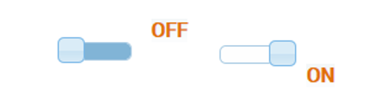
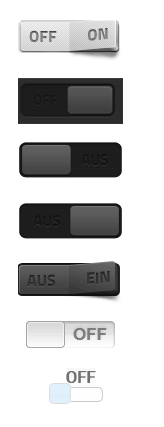

# Необычный переключатель
Этот набор представляет собой несколько переключателей, которые в основном работают одинаково.
Они представляют логические состояния и могут также переключать их.

|Виджеты | Изображения | Описание |
|------------------------|-------|--------------|
|Выключить/включить свет | |Светло-серый подрулевой переключатель |
|Ползунок затемнения вкл/выкл | |Ползунок с меткой «вкл.»/«выкл.» |
|Ползунок затемнения вкл/выкл | |Ползунок с меткой «выключено»/«включено» |
|Темная качелька вкл./выкл. |  |Темный кулисный переключатель с надписью «выкл.»/«вкл.»; опционально также в светлом стиле |
|Giva Labs iButton | | Белый ползунок с надписью «вкл./выкл.» |
|Переключатель Taitem jqui| | Белый ползунок с надписью «вкл./выкл.» снаружи ползунка |
|Переключатель Taitem jqui| | Белый ползунок с надписью «вкл./выкл.» снаружи ползунка |

## Описание свойств
|Атрибут|Описание|Тема|
|----|----|---|
|ObjectId|Идентификатор отображаемого объекта, который содержит HTML|Переключатель, ползунок, толкатель, качели |
|Инвертировать|Инвертировать состояние переключателя|Переключатель, ползунок, ползунок, качелька |
|false value|значение, соответствующее состоянию false/off/off|переключатель, ползунок, поршень, качели |
|Истинное значение|Значение, соответствующее ложному/выключенному/выключенному состоянию|Переключатель, ползунок, поршень, качели |
|Автовыключение|Представляет собой функцию кнопки: по истечении регулируемого времени переключатель возвращается в исходное состояние|Переключатель, ползунок, ползунок, качелька |
|Яркий стиль|Яркое представление переключателя|Темная качелька включения/выключения |
|Размер рычага||Giva Labs iButton |
|Размер контейнера||Giva Labs iButton |
|Перетаскивание разрешено|Переключатель можно перетаскивать (а не просто нажимать)|Giva Labs iButton |
|Анимация|Переключатель анимирован|Giva Labs iButton |
|Длительность переключения|Точка данных переключается с задержкой|Giva Labs iButton |
|Подсветка переключателя|Подвижная часть переключателя также отображается цветом|Taitem jqui Togglesswitch |
|Ширина виджета|Ширина переключателя, независимая от метки|Taitem jqui Переключатель |
|Добавить html|HTML-код для отображения перед объектом|Taitem jqui Toggleswitch |
|Добавить Html|HTML-код для отображения после объекта|Taitem jqui Toggleswitch |

**Пример:** 
