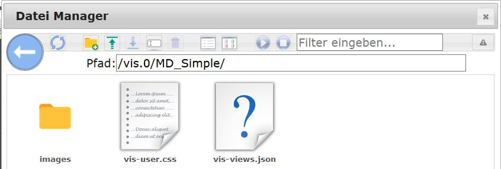
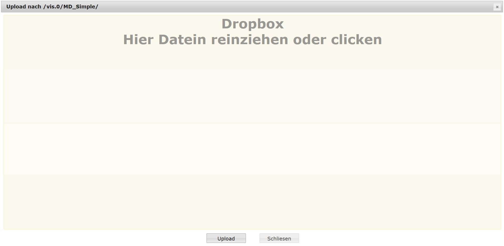

?> ***Эта страница в настоящее время редактируется.***.   Помогите ioBroker и дополните эту статью. Обратите внимание на [Руководство по стилю ioBroker](https://www.iobroker.net/#de/documentation/community/styleguidedoc.md), чтобы облегчить применение изменений.

**Визуализации с помощью VIS**

VIS — это основной инструмент визуализации ioBroker, предлагающий обширные возможности для визуализации умного дома.

## Конфигурация
Для VIS требуется WEB-адаптер, который автоматически устанавливается при установке VIS. Помимо ввода лицензии, которую можно получить на https://iobroker.net/, дальнейшая настройка не требуется. Эта лицензия бесплатна для частного использования.  Может быть только один экземпляр VIS.

## Услуга
После установки доступ к адаптеру осуществляется через `<IPdesServers>:8082/vis/index.html` или через гиперссылку на вкладке «Экземпляры» адаптера администратора, и отображается визуализация.

Когда вы открываете его в первый раз, DemoView создается автоматически.

В проекте имеется несколько представлений.
Несколько виджетов могут свободно размещаться на каждом представлении и использоваться для отображения или работы. Визуализация создается и настраивается с помощью редактора.
Редактор вызывается через `<IPdesServers>:8082/vis/edit.html`.
После закрытия редактора с помощью значка закрытия окна ( (x) в правом верхнем углу) в представлении функций отображается последний отредактированный вид.
Доступ к нему можно получить в любое время с помощью `<IPdesServers>:8082/vis/index.html#ViewName`. Редактор разделен на различные области.

* * *

## Вкладки в области заголовка (1)
### Просмотров
Если выбрана эта вкладка, вы можете выбрать представление для редактирования из существующих в раскрывающемся меню ниже.

Четыре значка справа говорят сами за себя и относятся к видам.
После нажатия на рабочую область представление на боковой панели свойств справа переключается на вкладку «Представления» и отображает настройки представления.

### Виджеты
Если вкладка «Виджеты» активирована, панель инструментов под ней изменяется .

Появятся инструменты редактирования виджета.

#### Выпадающее меню
Здесь вы можете выбрать виджет для редактирования, либо здесь отображается выбранный виджет.

#### Панель значков
Три значка удаления, копирования и информации становятся активными при выборе виджета.

#### Выравнивание виджетов

Если вы выберете несколько виджетов, удерживая кнопку мыши (или нажав клавишу Ctrl), вы сможете затем использовать эти значки для выравнивания групп (выравнивание по левому краю, по правому краю, по верхнему краю, по нижнему краю, по центру, по вертикали в середина).
Вы также можете расположить несколько виджетов на одном расстоянии (по горизонтали и вертикали) и использовать два последних значка для настройки размера нескольких виджетов.
Если вы выберете виджет, представление на боковой панели свойств справа переключится на вкладку «Виджеты» и отобразит настройки этого виджета.
Благодаря возможности множественного выбора вы можете изменить свойства нескольких виджетов одновременно через правую боковую панель.

#### Все виджеты
Два виджета упрощают редактирование представлений.
Первый гарантирует, что значения виджетов не обновляются, второй предотвращает перемещение виджетов.

#### Экспорт виджета
Если виджет активирован, вы можете использовать эту кнопку для экспорта CSS-кода виджета.

#### Импортировать виджет
И наоборот, вы можете, например, импортировать виджеты, которые не включены в vis.
После нажатия на виджет представление на боковой панели свойств справа переключается на вкладку «Виджеты» и показывает настройки выбранного виджета.

###Инструменты
Если вкладка «Инструменты» активирована, панель инструментов под ней изменяется .

#### Разрешение
Здесь отображено множество предустановленных разрешений экрана для мобильных устройств, но есть и пункт «Пользовательский», предлагающий возможность выполнить собственные настройки.
Если вы здесь что-то выберете, на рабочем пространстве будет нарисована рамка, соответствующая выбранному разрешению экрана.

#### По умолчанию
Если установлен флажок _default_, активный вид станет видом по умолчанию и будет загружен, если вид VIS загружен с разрешением, установленным выше.
**Пример:** Выбран дисплей _iPad Portrait_ и установлен флажок _Default_ в представлении _Start_. Предположим, что представление под названием _Weather_ было загружено из проекта в альбомном формате на iPad. Если теперь iPad переведен в портретный формат, автоматически будет отображаться вид _Start_, ранее установленный как стандартный (_default_) для этого разрешения (портретный формат).
Для мобильных устройств возможно управление движением (например, «возврат в главное меню» или _up_ показывает другой вид, чем _quer_).

#### Сетка
Здесь есть опции _inactive_, _Elements_ и _Raster_. Если вы выбираете элементы, виджеты привязываются к соседнему элементу при перемещении с помощью мыши. С помощью сетки вы также можете указать размер сетки (в пикселях), в котором виджеты затем фиксируются на своих местах.

#### Идентификатор экземпляра
Здесь отображается уникальный идентификатор, к которому можно обратиться с помощью скрипта, например через VIS [Команда управления](https://github.com/iobroker/ioBroker.vis/blob/master/README.md#control-interface).

#### Идентификатор браузера
Если вы нажмете на эту кнопку, в предыдущем поле будет создан новый идентификатор. Это означает, что каждый браузер может быть индивидуально идентифицирован на каждом устройстве.

#### Экспорт
Здесь вы можете экспортировать свое представление, например, чтобы использовать его в другой установке. При нажатии на кнопку открывается окно, в котором представление предлагается в текстовом виде. Эти данные можно поместить в буфер обмена с помощью Ctrl-C и загрузить в редактор, а затем сохранить.

#### Импорт
После нажатия открывается пустое окно. Здесь вы можете скопировать текстовый файл, полученный с помощью функции _export_. Затем введите имя представления в левом нижнем углу и нажмите кнопку _импорт_. С этого момента доступен новый вид. Эта функция подходит для импорта примеров с форума.

### Настраивать

#### Тема
Здесь вы можете выбрать цветовую схему для редактора.

#### Язык
Можно указать рабочий язык редактора.

#### Проекты
Проекты представляют собой коллекции [Просмотры](http://www.iobroker.net/?page_id=1193&lang=de).
По умолчанию проект _main_ создается и вызывается через `<IPdesServers>:8082/vis/index.html#ViewName`.
Файлы проекта расположены в установке ioBroker в папке `_ioBroker-Ordner_/iobroker-data/files/vis.0/main`.

#### Экспорт/импорт проекта
Проекты можно экспортировать целиком (например, для обмена с другими пользователями): создается zip-файл, содержащий используемые изображения, таблицу стилей vis-user.css и фактические определения vis-views.json.
Также есть возможность экспортировать проект анонимно. :construction: Чтобы импортировать другие проекты, просто перетащите zip-файл описанного выше экспорта в окно и введите имя нового проекта: .

#### Новый проект...
Здесь можно создать новый проект.
Откроется окно и запросит имя проекта.
После подтверждения редактор загружает новый проект по этому адресу: `<IPdesServers>:8082/vis/_projektname_/index.html#ViewName.`. Файлы нового проекта расположены в установке ioBroker в разделе `_ioBroker-Ordner_/iobroker-data/files/vis.0/projektname`.
**Совет**. Вы можете дублировать папку проекта и редактировать дубликат в редакторе VIS `<IPdesServers>:8082/vis/_projektname_duplikat_/index.html`.

#### Приложение
При загрузке проекта все [Просмотры] :construction: (http://www.iobroker.net/?page_id=1193&lang=de) этого [проекта] :construction: (http://www.iobroker.net/? page_id =188&lang=de&preview_id=188&preview_nonce=d845a20ee2&preview=true#Project).
Иногда это не имеет смысла и замедляет работу системы.
Таким образом, представления, которые принадлежат друг другу, могут быть сгруппированы в разных проектах.
Например, имеет смысл разделить устройства с разным разрешением экрана.
Вы можете создать проект _Smartphone_ и создавать в нем виды, оптимизированные для сенсорного управления и вертикальной ориентации.
Сознательно сокращая количество виджетов, проект остается небольшим по объему данных и, следовательно, быстро загружается, даже когда вы находитесь в пути (например, через VPN и мобильный телефон).
Другой проект _Wall Tablet_, который отображается только на планшете на стене, не требует загрузки каких-либо представлений из _Smartphone _project.
Основной проект _main_ для отображения всех данных обычно отображается и редактируется только с настольного ПК.
Объем данных и скорость вычислений здесь обычно не играют роли.
Если представления будут использоваться в нескольких проектах, их можно скопировать с помощью команды [экспорт](http://www.iobroker.net/?page_id=188&lang=de&preview_id=188&preview_nonce=d845a20ee2&preview=true#exportieren) :construction:/ [импортировать](http://www.iobroker.net/?page_id=188&lang=de&preview_id=188&preview_nonce=d845a20ee2&preview=true#importieren) :construction:.
Связывание одного проекта с другим через навигационные виджеты невозможно.
**Совет**. При экспериментировании с командами CSS также имеет смысл создать тестовый проект.

#### Файловый менеджер... (6)
После выбора этого пункта меню файлы можно удобно копировать в файловую систему ioBroker или из нее без необходимости использования дополнительных программ.
Откроется файловый менеджер:  [caption id="attachment_6007" align="aligncenter" width="799"] *Изображения являются лишь примерами и защищены авторскими правами соответствующих компаний.[ /подпись]

Поведение аналогично любому файловому менеджеру.
Вы можете использовать синюю кнопку «стрелка влево», чтобы перейти на уровень иерархии вверх, щелкнув папку.
Новую папку можно создать с помощью значка «Папка+».
Добравшись до нужного каталога, выберите файл и сможете загрузить его на свой компьютер с помощью синей стрелки. Если нажать на зеленую стрелку, откроется «Dropbox».
 Файлы можно просто сохранить здесь путем перетаскивания, а затем загрузить на сервер ioBroker, нажав кнопку _**Загрузить**__.
Альтернативно, вы можете щелкнуть в любом месте области, и откроется выбор файла.
Список файлов опустеет, и если вы больше не хотите загружать файлы, вы можете выйти из Dropbox с помощью кнопки **_Закрыть_**.

#### Настройки... (7)

* _**Перезагрузить, если соединение отсутствует дольше:**__ Активное представление полностью перезагружается,

если соединение между фронтендом (планшетом) и сервером было прервано дольше заданного времени.
Чтобы предотвратить это, для этого времени также можно установить значение _**никогда**__.

* __**Интервал повторного подключения:**__ Время, в течение которого внешний интерфейс пытается

чтобы добраться до сервера.

* _**Темный экран повторного подключения:**__ Обычно страница становится белой при попытке перезагрузить представление.

Чтобы это не мешало в темных помещениях, экран можно переключить в темный режим с помощью этого флажка.

* _**Удалить неактивные представления из ОЗУ:**_ Чтобы использовать ценную ОЗУ во внешнем интерфейсе,

Для экономии денег, которых обычно всего 1Гб, особенно на дешевых планшетах, из оперативной памяти можно удалить давно не нужные виды.
Однако это занимает больше времени, когда соответствующее представление загружается снова.
Эта опция устанавливает время, в течение которого неиспользуемые представления должны храниться в оперативной памяти.

#### Обозреватель объектов... (8)
 Здесь можно искать объект.
Он будет помещен в буфер обмена после нажатия кнопки _**Выбрать**__.
Поля фильтра над заголовками столбцов можно использовать для более быстрого поиска.

### Помощь (5)
Обзор основных команд находится в разделе _Ярлыки_, а краткая информация — в разделе _о проекте_.

### Кнопка отмены (6)
С помощью этой кнопки вы можете шаг за шагом отменить последнее действие(я).

* * *

## Боковая панель виджета (2)
Используется для выбора виджетов.
Виджеты отображаются в виде значков, их можно перетаскивать в рабочую область или размещать в позиции 0.0 рабочей области с помощью кнопки _Вставить_.

Поле под кнопкой _Вставить_ является полем фильтра.
Здесь вы можете ввести термин для поиска по нему значков.
Отобразятся все значки, содержащие этот термин.
Если вы удалите последний фильтр (или \*), вы получите раскрывающийся список с возможными условиями поиска.
Ниже находится поле выбора наборов виджетов.
Звездочка (*) обозначает все наборы виджетов.
При фильтрации по терминам автоматически осуществляется поиск по всем наборам виджетов.
В противном случае раскрывающееся меню также предлагает различные наборы виджетов в качестве фильтров.

* * *

## Рабочее пространство (3)
Здесь расположены виджеты для представления. Это можно сделать с помощью мыши или клавиш со стрелками.
Если вкладка «Виджеты» активна, также доступна некоторая помощь по выравниванию.

* * *

## Боковая панель настроек (4)
Все настройки видов и виджетов вводятся сюда через соответствующие вкладки.
Вкладка CSS также предлагает продвинутым пользователям возможность интегрировать собственные разработки.

* Назначение точек данных
* Размер виджета
* Размер и цвет шрифта
* Фон
* Рамка, цвет линии, стиль, толщина
* параметры CSS

Чтобы просмотреть точки данных или выполнить действия, точку данных необходимо назначить виджету.
Эту запись можно найти в разделе _General_.