# Материальные виджеты для vis-2
Набор **Material** - это универсальный комплект строительных блоков для vis-2. Он охватывает стандартные задачи системы домашней автоматизации: управление освещением, отоплением, жалюзи и измерением. Все компоненты скоординированы и имеют одинаковую форму, расстояние между ними и цвета. Они соответствуют тематике vis-2 и поэтому корректно выглядят как в светлом, так и в темном режимах.

Адаптер [`vis-2-widgets-material`](/adapters/vis-2-widgets-material) устанавливается на вкладке [адаптер](/docs/admin/adapter.md). Экземпляр не требуется; после этого перезагрузите редактор. Строительные блоки станут доступны на палитре в разделе **Материалы**.

Изображения на этой странице - это предварительные изображения из адаптера, то есть именно то, что можно увидеть в палитре редактора.

## Что общего у всех виджетов
Практически каждый виджет Material Design расположен в **карточке** с заголовком. Поэтому три параметра повторяются:

| Отношение | Смысл |
| --- | --- |
| **Без карты** | Отображает только содержимое, без фона и рамки. Полезно, когда на одной карте должно отображаться несколько виджетов. |
| **Имя** | Заголовок карты. Если поле оставить пустым, заголовок не будет выбран. |
| **Использовать как диалоговое окно** | Виджет не расположен на странице, а открывается как окно, когда другой виджет ссылается на него. Это позволяет добавлять детали, не заполняя всю страницу. |

Все виджеты запрашивают данные из своих точек через поля выбора. Для нескольких связанных точек (термостат, рольставни, RGB-лампа) обычно достаточно указать первую; остальные автоматически определяются и вводятся в зависимости от их роли в том же канале.

## Виджеты
| | Виджет | Что | Нужно |
| --- | --- | --- | --- |
| 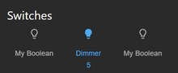 | **Переключатели** | Один или несколько рядов переключателей или кнопок, опционально с общим главным выключателем. Наиболее часто используемый элемент в наборе. | Одна переключаемая точка данных на ряд |
| 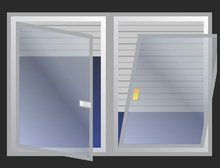 | **Жалюзи** | Задвижное окно с рольставнями, ламелями и положением ручки. Возможно использование нескольких панелей. | Положение, дополнительный ограничитель и ламели |
| 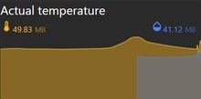 | **Фактическое значение с графиком** | Два больших измеренных значения, ниже которых тренд в виде области. | адаптер тренда (`history`, `sql`, `influxdb`) |
| 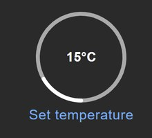 | **Простое состояние** | Значение с символом и единицей измерения, опционально отображаемое только или с переключением. Простейший строительный блок. | точка данных |
| 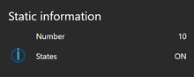 | **Статическая информация** | Несколько значений отображаются одно под другим на одной карте, взаимодействие с пользователем не требуется. | Любое количество точек данных |
|  | **RGB-подсветка** | Цветовое колесо, яркость, баланс белого и цветовая температура. Включает RGB, RGBW и отдельные каналы. | Цвет зависит от лампы или красный/зеленый/синий |
| 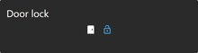 | **Дверной замок** | Закрытие, открытие, отображение датчика двери; опционально только после ввода PIN-кода. | Замок, опциональный датчик и открыватель |
| 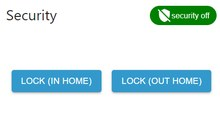 | **Безопасность** | Постановка на охрану с помощью PIN-кода и истечения срока действия, одновременное использование нескольких режимов работы. | Одна точка данных на каждый режим работы |
| 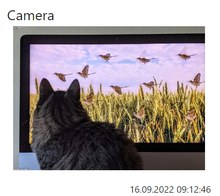 | **Камера** | Неподвижное изображение или поток данных с камеры с меткой времени и автоматическим обновлением. | адаптер `cameras` или URL |
| 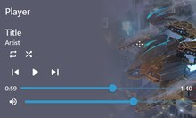 | **Игрок** | Название, исполнитель, изображение, прогресс и кнопки игрока. | Название, состояние и данные кнопок |
| 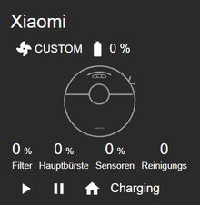 | **Пылесос** | Состояние, заряд батареи, уровень всасывания и оставшееся время работы щеток и фильтра. | Адаптер для робота-пылесоса |
| 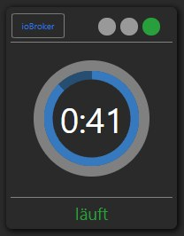 | **Стиральная машина и сушилка** | Состояние программы с указанием времени начала и окончания. | Состояние, время начала и окончания |
| 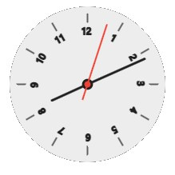 | **Часы** | Аналоговые с несколькими циферблатами или цифровые, с возможностью отображения секунд. | ничего |
| 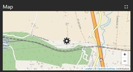 | **Карта** | Места расположения в виде маркеров, с возможностью указания радиуса. | Точки данных с координатами, например, из `radar` |
| 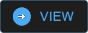 | **Навигация** | Переключается на другой вид, опционально, только после ввода PIN-кода. | название целевого вида |
| 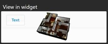 | **Показать в виджете** | Встраивает целое представление в карту. Это позволяет собирать страницы из блоков. | второе представление |
| 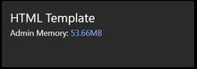 | **HTML-шаблон** | Бесплатный HTML-контент, изображение или встроенный фрейм в карточке материала. | ничего |
|  | **Переключатель тем** | Кнопка для переключения между светлой и темной темами. | ничего |
|  | **Переключатель тем** | Кнопка, переключающая между светлой и темной темами. | ничего |

Кроме того, есть **Мастер**: это не элемент отображения, а инструмент для редактора. Он анализирует обнаруженные в системе устройства и создает на их основе предварительно настроенные виджеты Material Design. Это значительно упрощает начальный этап проектирования страницы, позволяя в дальнейшем корректировать все параметры вручную.

## На что следует обратить внимание
**Исторические данные.** Виджет *Фактическое значение с графиком* остается пустым, пока для точки данных не ведется запись. Запись включается непосредственно для точки данных, см. [Запишите значения](/docs/tutorial/history.md).

**Обнаруженные устройства.** Чтобы ассистент смог найти устройство, оно должно быть привязано к комнате или функции. Это делается в соответствии с [Категории](/docs/admin/enums.md) и представляет собой то же назначение, что и в [адаптер устройства](/docs/viz/devices.md).

**Размер.** Карты изменяют свой размер в соответствии с размерами, которые вы задаете в редакторе.

Если карта становится слишком маленькой, виджет автоматически скрывает ее части: сначала заголовок, затем подписи. Если вы хотите видеть всю информацию, увеличьте пространство на карте.

**Расположение.** Установка положения виджета в `relativ` приводит к автоматическому расположению карт в столбцы, а на узких экранах - к вертикальному расположению. Это более простое решение как для планшетов, крепящихся на стену, так и для телефонов, чем использование фиксированных координат.