# Виджеты Material Design

**Material Design** — это самый полный набор виджетов, доступных в ioBroker: около пятидесяти строительных блоков, основанных на одноименных рекомендациях Google по дизайну, а также единая цветовая схема, пользовательский набор значков и диаграммы. Многие визуализации, которые вы видите в сообществе, созданы с его использованием.

## Два адаптера

Это предложение встречается дважды, и это различие важно:

| адаптер                                                | Для                                                                         | Статус                                  |
| ------------------------------------------------------ | --------------------------------------------------------------------------- | --------------------------------------- |
| [`vis-materialdesign`](/adapters/vis-materialdesign)   | vis 1; также работает в vis-2, но там выглядит так же, как и в vis 1.       | Разработка прекращена в июне 2021 года. |
| [`vis2-materialdesign`](/adapters/vis2-materialdesign) | vis-2, установленный непосредственно там и соответствующий теме оформления. | с сентября 2026 года                    |

Вторая версия, разработанная typhosj, основана на работе Scrounger. Она в значительной степени повторяет основные элементы первой версии и добавляет _расширенный режим просмотра в виджете,_ а также ползунок в качестве кнопки-символа.

**Для новых проектов в vis-2** используется`vis2-materialdesign` Правильный выбор.`vis-materialdesign` Он по-прежнему полезен для существующих проектов vis-1 и для страниц, уже созданных с его помощью. Одновременная установка обоих компонентов бессмысленна и только увеличивает время загрузки.

## Что внутри?

### кнопки

Главная особенность набора и причина его большого количества: в нем шесть типов кнопок, и каждая из них представлена в трех вариантах дизайна: с горизонтальной маркировкой, с вертикальной маркировкой и в виде чистого символа.

| Тип кнопки      | Что он делает                                                |
| --------------- | ------------------------------------------------------------ |
| **навигация**   | переключается на другой вид                                  |
| **связь**       | открывает адрес в браузере                                   |
| **Состояние**   | записывает фиксированное значение в точку данных.            |
| **Штат Много**  | циклически перебирает несколько значений по очереди          |
| **добавление**  | увеличивает или уменьшает значение на определенную величину. |
| **Переключать** | переключается между двумя значениями                         |

### Введите и отрегулируйте

|                                                                      | Виджет                              | За что                                                                  |
| -------------------------------------------------------------------- | ----------------------------------- | ----------------------------------------------------------------------- |
| 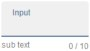                  | **Вход**                            | Текстовое поле для строк и чисел.                                       |
| 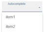 | **Автозаполнение**                  | Поле ввода со списком подсказок                                         |
| 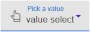       | **Выбирать**                        | Выпадающее меню для выбора значений, также доступно в формате «да/нет». |
|                                                                      | **Переключатель** , **Флажок**      | Переключатель и флажок                                                  |
|                                                                      | **Ползунок** , **Круглый ползунок** | Ползунок, прямой или кольцеобразный                                     |

### Показывать

|                                                                  | Виджет                                  | За что                                                             |
| ---------------------------------------------------------------- | --------------------------------------- | ------------------------------------------------------------------ |
|                                                                  | **Ценить**                              | значение с указанием единицы измерения, символа и цвета.           |
|                                                                  | **Прогресс** , **Циркуляр о прогрессе** | Прогресс на перекладине или кольце.                                |
| 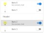             | **Список**                              | Список с символом, текстом и элементом управления в каждой строке. |
| 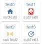 | **Список значков**                      | Сетка из плиток, составленная из символов.                         |
| 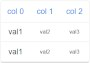              | **Стол**                                | Таблица, полученная из JSON-данных                                 |
| 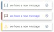       | **Оповещения**                          | цветная панель уведомлений для сообщений                           |
|                                                                  | **Календарь**                           | Ежемесячный обзор и обзор назначений                               |
|               | **Иконка Material Design**              | один символ из предоставленного набора                             |
|                                                                  | **HTML-карточка**                       | пользовательский HTML-контент на карте                             |

### Диаграммы

|                                                                                  | Виджет                                            | За что                                                           |
| -------------------------------------------------------------------------------- | ------------------------------------------------- | ---------------------------------------------------------------- |
| 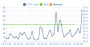 | **График истории линии**                          | Кривая тренда, построенная на основе зарегистрированных значений |
| 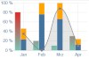               | **JSON-диаграмма**                                | Диаграмма построена на основе предоставленных данных.            |
|                                                                                  | **Столбчатая диаграмма** , **круговая диаграмма** | Столбчатая и круговая диаграмма                                  |

### Макет страницы

|                                                                                           | Виджет                          | За что                                                          |
| ----------------------------------------------------------------------------------------- | ------------------------------- | --------------------------------------------------------------- |
| 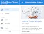 | **Верхняя панель приложений**   | Панель заголовка с расширяемым меню; обычная рамка страницы.    |
| 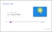                               | **Диалог** , **iFrame диалога** | открывает страницу или изображение на иностранном языке в окне. |
| 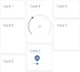               | **Виды каменной кладки**        | объединяет несколько видов в виде смещенных фрагментов.         |
| 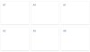                | **Сеточные представления**      | то же самое, что и равномерная сетка                            |

### СПИД

|                                                                       | Виджет                                     | За что                                     |
| --------------------------------------------------------------------- | ------------------------------------------ | ------------------------------------------ |
| 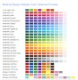 | **Предварительный просмотр цветовых схем** | Отображает заданные цвета для проверки.    |
| 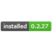               | **Установленная версия**                   | указывает установленную версию предложения |

## Цвета и шрифты

В пакет включена собственная светлая и темная цветовая схема, которая устанавливается для всех виджетов одновременно, а не по отдельности. Настройки находятся внутри экземпляра адаптера. Функция « _Предварительный просмотр цветовых схем_ виджетов» отображает результат на странице без необходимости проверки каждого элемента по отдельности.

Шрифты также выбираются там. Если необходимо использовать шрифты Google Fonts, потребуется дополнительный шаг.[`vis-google-fonts`](/adapters/vis-google-fonts) установить.

## На что следует обратить внимание

**Время загрузки.** Набор большой. Это заметно на планшете, закрепленном на стене, или на старом телефоне при первом открытии страницы. Тем, кому нужно всего несколько строительных блоков, лучше подойдет набор меньшего размера.

**Исторические данные.** _Для отображения графика истории изменений_ требуется адаптер для записи; см. [раздел «Значения записи»](/docs/tutorial/history.md) .

**Старая версия в Vis-2.**`vis-materialdesign` Его можно использовать в Vis-2, но там он всё равно будет следовать своей собственной цветовой схеме. Это заметно на странице, которая в остальном использует виджеты Material.